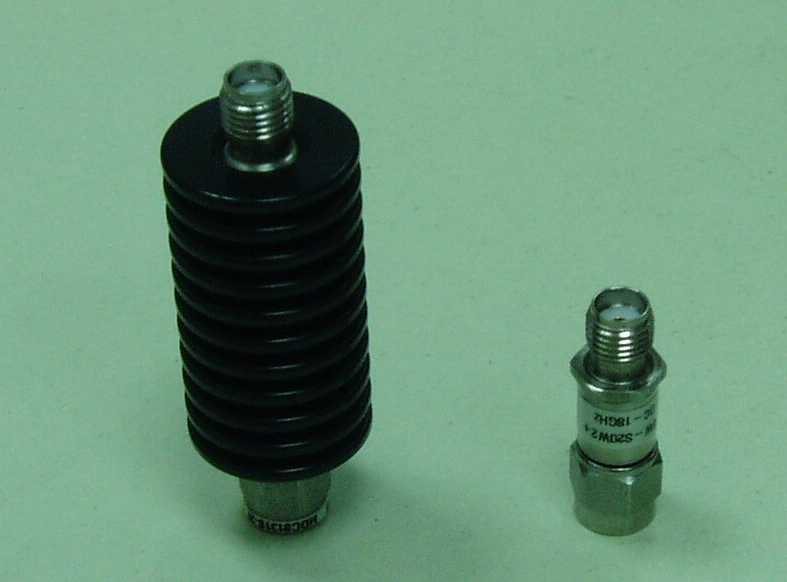

# 11-3 ノイズフロアとアッテネータ — 小さい信号をどこまで見られるか

11-2 の 1 MHz の信号を、今度は思い切り小さくして測る。**スペアナが見せられる
一番小さい信号は、計器自身が持つノイズ (ノイズフロア) に埋もれない範囲まで**。
アッテネータを入力の手前に足すと、信号だけでなくノイズフロアも動くことを
確かめる。

## 回路図

11-2 と同じ Wavegen の 1 MHz・1 V (peak) の信号に、パッド (アッテネータ) を
継ぎ足して弱くする。パッドの作り方は 0-3 と同じ 50 Ω の T 型で、値だけ 30 dB 用に置き換える。
30 dB の T 型パッドの計算値は `series` 46.9 Ω・`shunt` 3.17 Ω・`series` 46.9 Ω。
E24 に丸めると 47 Ω・3.3 Ω・47 Ω になる (0-3 の 20 dB パッドと同じ丸め方)。

```circuit
title: 図1 30 dB パッドで信号をさらに落として tinySA へ
parts:
  X1:
    type: device
    at: b1
    label: Analog Discovery
    pins: [W1, GND]
    turn: mirror
  R1: resistor b5 b7 1k
  P1: resistor b7 b9 47
  P2: resistor b9 d9 3.3
  P3: resistor b9 b11 47
  X2:
    type: device
    at: b13
    label: tinySA
    pins: [RF, GND]
  GA: ground d4
  GP: ground d9
  GM: ground d12
wires:
  - X1.W1 -| b5
  - b11 -| X2.RF
  - X1.GND -| d4
  - X2.GND -| d12
```


## 実体配線図

1 MHz なら、パッドもブレッドボードの上で組んでよい。ブレッドボードの隣の列どうしの
浮遊容量は数 pF で、1 MHz でのリアクタンスは 5 pF でも約 32 kΩ。パッドの 47 Ω・3.3 Ω
に比べて桁違いに大きく、減衰量はほとんど狂わない (100 MHz では約 320 Ω まで下がり、
効き始める。高い周波数でパッドを使うなら、SMA を付けた基板で作る 3-5 か、次の節の市販品)。

```breadboard
title: 図2 ブレッドボードに組む (1 MHz なら浮遊容量は効かない)
board: half
parts:
  R1: resistor b5 b10 1k
  P1: resistor d10 d14 47
  P2: resistor a14 -t14 3.3
  P3: resistor b14 b18 47
  AD:
    type: device
    at: top
    label: Analog Discovery
    pins: [GND, W1]
  SA:
    type: device
    at: top
    label: tinySA
    pins: [RF, GND]
wires:
  - AD.GND -- -t3 black
  - AD.W1 -- a5 yellow
  - SA.RF -- a18 orange
  - SA.GND -- -t22 black
```


- R1・P1・P3 は、**同じ列の別の行に挿すとつながる**ことを使い、ジャンパを使わずに
  直列につなぐ (R1 の右足と P1 の左足が 10 列、P1 の右足・P3 の左足・P2 が 14 列)
- P2 (3.3 Ω) は 14 列と − レールの間に立てて挿す。これがパッドの中点から GND への足
- tinySA の RF は、SMA とワニ口 (か SMA とジャンパ線) のケーブルで 18 列と − レールに
  つなぐ。**グランドを先に**つなぎ、外すときは最後に外す

## 計器の設定

| 一般の名前 | 値 | tinySA Ultra のメニュー |
| --- | --- | --- |
| 中心周波数 | 1 MHz | `FREQUENCY` → `CENTER` |
| スパン | 200 kHz | `FREQUENCY` → `SPAN` |
| RBW | 100 kHz → 3 kHz (2 通りで比べる) | `FREQUENCY` → `RBW` |
| 入力アッテネータ | 0 dB → 20 dB (2 通りで比べる) | `LEVEL` → `ATTENUATE` |
| LNA | 切 → 入 (tinySA Ultra のみ) | `LEVEL` → `LNA` |

## 見るべき値

計算値。11-2 の 1 MHz・約 −16.4 dBm に 30 dB パッドを足すと届く電力は
約 **−46.4 dBm**。E24 に丸めた自作のパッド (47 Ω・3.3 Ω・47 Ω) は 29.7 dB なので、
自作なら約 −46.1 dBm になる (0.3 dB の差は読みの誤差と同じくらい)。

| 操作 | 見え方 (計算値・理論) | 分かること |
| --- | --- | --- |
| 30 dB パッドを入れる | 信号が −16.4 dBm → −46.4 dBm に下がる (計算値) | 減衰量ぶんそのまま下がる。11-1 の「必要な減衰量」と同じ引き算 |
| ノイズフロア (実測。自分の tinySA の値を読む) | 目安として 30〜100 kHz の RBW で −90〜−110 dBm 台に収まることが多い (機種・RBW依存、**要実測**) | −46.4 dBm の信号はこの目安の範囲なら十分に見えるはず |
| `LEVEL` → `ATTENUATE` を 0 dB → 20 dB へ (回路のパッドとは別、計器の内部減衰) | ノイズフロアが**ほぼそのまま 20 dB 分**上がって見える。信号もほぼ 20 dB 分下がる (差し引きは変わらない) | **内部アッテネータは、外の強い信号から入力回路を守るためのもの。弱い信号を見たいときに増やしても得はなく、むしろノイズに埋もれやすくなる** |
| RBW 100 kHz → 3 kHz (1/約33) | ノイズフロアが 10 log₁₀(100/3) ≈ **15 dB** 下がる (計算値) | 小さい信号を見たいときは、アッテネータを足すのではなく **RBW を狭める** (または平均化する) のが筋 |
| `LEVEL` → `LNA` を入にする | ノイズフロアが最大 16 dB 下がる (仕様書の値、tinySA Ultra) | 内蔵の低雑音アンプでノイズフロアを下げる、別の手段。ただし強い信号が同時に来ているとアンプが飽和しやすくなる |

**まとめ**: アッテネータは「壊れないための道具」(11-1・0-3)。**小さい信号を
見るための道具は RBW・平均化・LNA** で、この 2 つの役割を混同しない。

## 市販のアッテネータを使う

自作のパッドの代わりに、**SMA の固定アッテネータ** (50 Ω、10 / 20 / 30 dB など) を
使ってもよい。中は同じ T 型 (か π 型) の抵抗で、筒の両端が SMA になっている。



写真1 市販のアッテネータの例。右の細い筒がこの題で使う形で、筒に DC〜18 GHz と
書いてある。左は放熱のひだを付けて大きな電力に耐えるようにした品 (送信機の出力を
直に受けるときなどに使う。この題では要らない)。
写真: Gadi Vishne, [Attenuators.jpg](https://commons.wikimedia.org/wiki/File:Attenuators.jpg)
(Wikimedia Commons), [CC BY 2.5](https://creativecommons.org/licenses/by/2.5/)。手を加えずに載せた。

```circuit
title: 図3 市販の 30 dB アッテネータ (SMA) を tinySA の入力に付ける
parts:
  X1:
    type: device
    at: b1
    label: Analog Discovery
    pins: [W1, GND]
    turn: mirror
  R1: resistor b5 b7 1k
  P1: resistor b8 b10 47
  P2: resistor b10 d10 3.3
  P3: resistor b10 b12 47
  X2:
    type: device
    at: b14
    label: tinySA
    pins: [RF, GND]
  GA: ground d4
  GP: ground d10
  GM: ground d13
wires:
  - X1.W1 -| b5
  - b7 -- b8
  - b12 -| X2.RF
  - X1.GND -| d4
  - X2.GND -| d13
notes:
  - box a8 e12
```


破線の枠の中が、市販のアッテネータの筒の中にあたる。

- **tinySA の入力に直にねじ込む**。ケーブルの先で壊れる心配が減り、入力の上限
  (絶対最大 +6 dBm、11-1) を超える信号をつないでしまっても、筒のぶん下がってから入る
- 信号源の側は、R1 の先に SMA とワニ口のケーブルをつなぐ。R1 (1 kΩ) は残す —
  アッテネータの入力も 50 Ω なので、Analog Discovery の W1 から直に 50 Ω に振ると
  電流が 20 mA (1 V ÷ 50 Ω) になり、Wavegen の保証 (10 mA) を超える
- 10 dB と 20 dB を**重ねて 30 dB** にもできる (dB は足し算)
- 自作のパッドとの違い:

| | 自作のパッド (図 1・図 2) | 市販のアッテネータ |
| --- | --- | --- |
| 周波数の上限 | 1 MHz なら十分。100 MHz を超えると部品の足と浮遊容量で狂う | DC から GHz 帯まで平らな品が多い (仕様書で確かめる) |
| 減衰量の確かさ | E24 に丸めたぶん 30 dB からずれる (計算値で 29.7 dB、約 0.3 dB 小さい) と、抵抗の誤差 | 仕様書の値 (±0.5〜1 dB ほどの品が多い。**目安、自分の品の仕様書を見る**) |
| 耐える電力 | 1/4 W の抵抗。P1 で決まる | 1〜2 W の品が多い (+30〜+33 dBm) |
| 手軽さ | 部品を挿すだけ | 買って付けるだけ。**何度も使う計器の入力の保護に向く** |

- 見えるはずの値は自作と同じで、約 **−46.4 dBm** (計算値)。自作と市販を付け替えて、
  読みが 1 dB 以内で合えば、自作のパッドも 1 MHz では十分に使えると分かる
- 基板に SMA を付けて自作のアッテネータを作るなら 3-5 (10 dB)。同じ作り方で 30 dB も作れる
- 注意: 50 Ω の系で使う。定格の電力を超えない。抵抗の型は DC も通すので、
  直流を止めたいときは DC ブロックを別に足す

## 出典

自作。tinySA Ultra の `ATTENUATE` `RBW` `LNA` の意味は公式 wiki の
[Level メニュー](https://tinysa.org/wiki/pmwiki.php?n=TinySA4.LEVEL)と
[Frequency メニュー](https://tinysa.org/wiki/pmwiki.php?n=TinySA4.FREQ) (2026-09-27 に確認)。
RBW とノイズフロアの関係 (10 log₁₀ の式) は掃引型スペアナの一般的な理論。
写真1 は Wikimedia Commons から借りた (作者・ライセンスは写真の下に書いた)。
