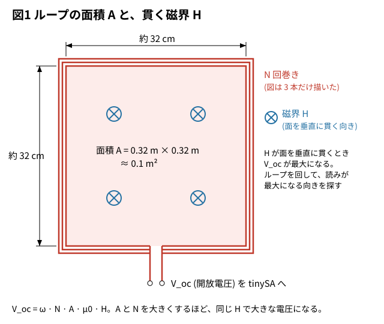
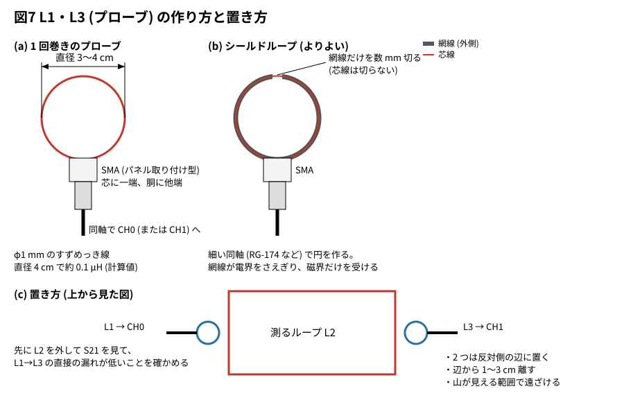
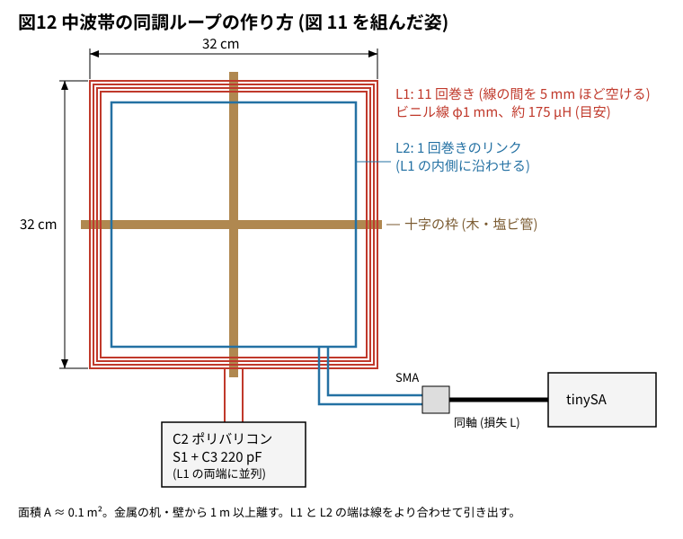

# 11-14 微弱電波の電界強度を見積もる — アンテナ係数とケーブルの損失

7 章で NanoVNA をアンテナにつなぐと、CH0 の出力はそのまま電波になる。
回路の冊の FM 送信機も同じである。免許の要らない微弱無線局として出してよいのは、
**3 m 離れた所の電界強度が 322 MHz 以下で 500 µV/m 以下、322 MHz〜10 GHz で 35 µV/m 以下**
の電波に限られる (電波法施行規則 第 6 条第 1 項第 1 号)。

この題では、tinySA で 3 m 先の電界強度を見積もり、上限に収まりそうかを判断する。
受け方は 2 つある。先に、よく使う**ループで磁界を受ける方法** (30 MHz 以下。回路の冊の AM 変調 9-7 のような中波帯を含む) を述べ、
次に**ダイポールで受ける方法** (VHF・UHF。FM 放送帯や 144・430 MHz) を述べる。
ここで出る数は**見積り**で、適合の証明にはならない (「見積りの不確かさ」の節)。

## この実験で使う式

電界強度 E は、tinySA が読んだ電圧 V に、アンテナ係数 AF とケーブルの損失 L を足して求める。

```text
E [dBµV/m] = V [dBµV] + AF [dB/m] + L [dB]
V [dBµV]   = P [dBm] + 107        (50 Ω の系)
```

- **ケーブルの損失 L** は、アンテナで受けた電圧が tinySA に届くまでに落ちる分である。
  落ちた分を足して戻す
- dBm から dBµV への 107 は、50 Ω で 0 dBm = 1 mW = 0.2236 V = 107.0 dBµV から来る

上限を dB で書くと、500 µV/m = 54.0 dBµV/m、35 µV/m = 30.9 dBµV/m である。

### ループのアンテナ係数 (磁界を受ける)

ループは磁界 H を受ける (電界でなく磁界を受ける理由は第 1 部)。何回か巻いた小さなループの開放電圧は

```text
V_oc = ω · N · A · μ0 · H        (N: 巻数、A: 面積 [m²]、μ0 = 4π × 10⁻⁷ H/m)
```

30 MHz 以下をループで測るときは、測った H に Z0 = 377 Ω を掛けた「等価の電界」E = Z0 · H で
電界の上限と比べる慣習がある (海外の規格の測り方にも同じ換算がある。
CISPR 16 のループ法は磁界 dBµA/m のまま扱う)。**近傍界では本当の電界ではない**ことを承知で、この換算を使う。
すると、ループのアンテナ係数は

```text
AF_E = E / V_oc = Z0 / (ω · N · A · μ0)    [1/m]
```

になる。

### ダイポールのアンテナ係数

**アンテナ係数 AF** は、電界 E [V/m] を受けたアンテナが 50 Ω に出す電圧 V [V] との比 AF = E / V [1/m] である。
半波長ダイポールでは AF = 9.73 / (λ √G)、G = 1.64 (2.15 dBi) である。
波長が短いほどアンテナは小さく、同じ電界でも出る電圧が小さいので、AF は周波数とともに大きくなる。

## ケーブルの損失を測る

受けのアンテナ (ループまたはダイポール) と tinySA の間の同軸を外し、NanoVNA の CH0 と CH1 の間につないで S21 を読む。
読んだ |S21| の dB の符号を反対にしたものが L である。測り方は 5-3 (ケーブルの損失) と同じで、
アンテナどうしを S21 で見る話は 7-21 にある。

- 測る周波数の点で読む (100 MHz を測るなら 100 MHz の S21)
- RG-58 の 3 m なら 100 MHz で 0.5 dB 前後、RG-174 なら 1 dB 前後になる (目安)
- 以下の例では L = 1.0 dB とする (仮定)

## 第 1 部 ループで磁界を受ける (中波帯など)

回路の冊の AM 変調 (9-7) のように、中波帯 (531〜1602 kHz) で電波を出す回路もある。
ここでは半波長ダイポールは使えない。

- **波長が長すぎる。** λ は 190〜560 m で、半波長ダイポールは全長 95〜280 m になる。作れない
- **3 m は深い近傍界の中。** 1 MHz では λ / 2π ≈ 48 m で、3 m はその 16 分の 1 しかない。
  近傍界では電界 E と磁界 H の比が遠方界の 377 Ω にならない。電界から AF で電圧を出す考え方が成り立たない
- 小さな低電力の送信機 (短い線や小さなコイルのアンテナ) が 3 m 先に作るのは、主に**磁界**の近傍界である

そこで、何回か巻いた小さなループで**磁界 H** を受け、「この実験で使う式」の AF_E で等価の電界に直す。
ループの開放電圧は、巻数 N と面積 A に比例する (図 1)。



A = 0.1 m² (1 辺 約 32 cm の正方形) で、N = 1・2・6・10 を比べた計算値を示す。
「50 Ω で読む」は、ループのインダクタンス L と tinySA の入力 50 Ω の分圧
(V ≈ V_oc · 50 / |50 + jωL|) を入れた、上限 54.0 dBµV/m ちょうどのときの読みである。
L は線の太さ 1 mm で見積もった**目安**で、L ≈ 1.4 µH × N² と置いた (N = 1 で 1.4 µH、2 で 5.6 µH、6 で 50 µH、10 で 140 µH)。

| 周波数 | 巻数 N | AF_E (計算値) | 上限での V_oc | ωL (目安) | 50 Ω で読む (目安) |
| --- | --- | --- | --- | --- | --- |
| 0.6 MHz | 1 | 58.0 dB/m | −111.0 dBm 相当 | 5.3 Ω | −111.1 dBm |
| 0.6 MHz | 2 | 52.0 dB/m | −105.0 dBm 相当 | 21 Ω | −105.7 dBm |
| 0.6 MHz | 6 | 42.5 dB/m | −95.5 dBm 相当 | 190 Ω | −107.3 dBm |
| 0.6 MHz | 10 | 38.0 dB/m | −91.0 dBm 相当 | 528 Ω | −111.5 dBm |
| 1.0 MHz | 1 | 53.6 dB/m | −106.6 dBm 相当 | 8.8 Ω | −106.7 dBm |
| 1.0 MHz | 2 | 47.6 dB/m | −100.6 dBm 相当 | 35 Ω | −102.3 dBm |
| 1.0 MHz | 6 | 38.0 dB/m | −91.0 dBm 相当 | 317 Ω | −107.2 dBm |
| 1.0 MHz | 10 | 33.6 dB/m | −86.6 dBm 相当 | 880 Ω | −111.5 dBm |
| 1.5 MHz | 1 | 50.1 dB/m | −103.1 dBm 相当 | 13 Ω | −103.3 dBm |
| 1.5 MHz | 2 | 44.0 dB/m | −97.0 dBm 相当 | 53 Ω | −100.3 dBm |
| 1.5 MHz | 6 | 34.5 dB/m | −87.5 dBm 相当 | 475 Ω | −107.1 dBm |
| 1.5 MHz | 10 | 30.1 dB/m | −83.1 dBm 相当 | 1320 Ω | −111.5 dBm |

- 巻数を増やすと V_oc は N に比例して増えるが、ωL も N² で増え、50 Ω との分圧で失う分が大きくなる。
  50 Ω に直につなぐときの読みは **ωL ≈ 50 Ω のあたりで最大**になり、中波帯では 2〜3 回巻きがそこに来る
  (後の (a))。10 回巻きを直につなぐと、1 回巻きより読みが小さい
- 6 回巻き・10 回巻きの開放電圧を生かすには、バッファを入れるか同調させる。どちらにするかは後の「ループに同調回路は要るか」で比べる
- **ループの自己共振を帯域より十分上に置く。** 10 回巻きで浮遊容量が 20 pF あれば約 3 MHz で共振し (目安)、
  1.6 MHz でも読みが持ち上がり始める。巻数が少ないほど共振は上にある
- 上限での読みは −103〜−112 dBm と小さい。tinySA Ultra のフロアは RBW 30 kHz で −102 dBm、
  LNA を入れて RBW 200 Hz なら −145 dBm (仕様)。**LNA を入れ、RBW を 1 kHz 以下にする**
- tinySA Ultra の入力は 100 kHz から (仕様) なので、中波帯は範囲に入る
- 近くの AM 放送局が強く見える。**送信機を切って消える山だけ**が測る相手である。
  放送局と同じ周波数は避けて測る
- この帯の正式な測り方も告示が決めている。ここでの数は、ダイポールの場合よりさらに粗い見積りである

### ループの自己共振を NanoVNA で確かめる

上の 20 pF は目安で、実際の浮遊容量は巻き方と線の引き回しで変わる。作ったループは、
使う前に NanoVNA の S11 (1 ポート) で自己共振を測っておく。

1. 掃引を 100 kHz〜30 MHz にし、ループをつなぐ SMA の口 (変換コネクタの先) で Open・Short・Load を校正する
2. ループの両端を、できるだけ短い線でその口につなぐ。tinySA につなぐときと同じ線・同じ取り回しにする
3. 表示はスミスチャートとリアクタンス X (または |Z|) にする

| 読む所 | 見え方 | 求まるもの |
| --- | --- | --- |
| 低い周波数 (中波帯より下) | X が正で、周波数にほぼ比例して増える | L = X / (2πf) |
| 自己共振 f<sub>SRF</sub> | \|Z\| が山になり、X の符号が + から − に変わる。スミスチャートでは右端の近くで実軸を横切る | f<sub>SRF</sub> |
| 上の 2 つから | — | 浮遊容量 C<sub>s</sub> = 1 / ((2π f<sub>SRF</sub>)² L) |

自己共振の所はインピーダンスが高く |Γ| がほぼ 1 になるので、|Z| の値そのものは粗い。
周波数を読むだけなら十分である。ループはアンテナでもあるので、測るあいだに近くの放送局を
拾って線が揺れることがある。平均を増やすか、揺れの少ない時間に測る。

6 回巻きのループ (図 10) を、浮遊容量 20 pF (仮定)・巻き線の抵抗 2 Ω (目安) の模型で計算すると、
NanoVNA の画面は図 2 のようになる (計算値)。

```vna
device: h4
sweep: 100k-10M 401
title: 図2 6 回巻きのループ — 500 kHz の X で L、5.03 MHz で X が + から −
dut:
  - series L 50u esr 2 cp 20p
  - short
traces:
  - S11 smith
  - S11 x
markers:
  - 500k
  - 5.03M
```


| 読み (図 2、計算値) | 値 | 求まるもの |
| --- | --- | --- |
| 印 1: 500 kHz の X | +j158.6 Ω | L = 158.6 / (2π × 500 kHz) ≈ 50.5 µH |
| 印 2: X が符号を変える所 | 約 5.03 MHz | f<sub>SRF</sub> |
| 上の 2 つから | — | C<sub>s</sub> = 1 / ((2π × 5.03 MHz)² × 50.5 µH) ≈ 19.8 pF (仮定の 20 pF に戻る) |

L は f<sub>SRF</sub> より十分低い所で読む。1 MHz で読むと X は 327 Ω で、L は 52 µH と 4 % 大きく出る
(C<sub>s</sub> の分だけ持ち上がる)。f<sub>SRF</sub> の近くで X は ±10 kΩ の枠を超えて切れるが、
読むのは符号の変わる周波数だけである。

**スミスチャートの読み方。** スミスチャートは、インピーダンス Z を 50 Ω で割った値 z を円の中に描く。
左端が短絡 (z = 0)、中央が 50 Ω、右端が開放 (z = ∞)、上半分が誘導性 (X > 0)、下半分が容量性 (X < 0) である。
外周に近いほど損失が小さい (反射がほぼ 1)。図 2 の線は次のように読む。

| 周波数 | 線のいる所 | 意味 |
| --- | --- | --- |
| 100 kHz (始点) | 上半分の左寄り、外周の近く。z ≈ 0.04 + j0.63 (計算値) | ほぼ純粋なコイル。抵抗 2 Ω は 50 Ω に比べて小さい |
| 100 kHz → 5 MHz | 外周に沿って時計回りに上から右へ進む | 周波数とともに X が増え、z が ∞ に近づく |
| 印 1 (500 kHz) | 上半分、j2 と j5 の間。z ≈ 0.04 + j3.17 | X = +158.6 Ω。ここで L を読む |
| 印 2 (5.03 MHz) | 右端の開放の点 (∞) のすぐそば | 自己共振。L と浮遊容量の並列共振で、Z がとても大きくなる |
| 5 MHz → 10 MHz | 右端を越えて下半分へ回り、外周に沿って進む | 自己共振より上では容量性。ループはもうコイルとして働かない |

- **線が外周から離れない**のは、巻き線の抵抗 (2 Ω) が小さいからである。実物で線が内側へ寄っていれば、
  損失が大きい (Q が低い)。巻き線を太くするか、近くの金属から離す
- **線が右端の ∞ を通る所が自己共振**である。リアクタンス X のグラフで符号が変わる所と同じ周波数になる。
  X のグラフは共振の近くで枠の外に出るが、スミスチャートでは無限大も右端の 1 点に収まるので、
  共振の前後のふるまいを 1 枚で見渡せる
- 中波帯 (0.53〜1.6 MHz) では、線は上半分の外周の近く (531 kHz で j3.4、1 MHz で j6.5、1.6 MHz で j11。計算値) にいる。
  ここが右端に近いほど、自己共振が帯域に近く、読みが持ち上がっている

#### S11 の位相で読む

スミスチャートや X が表示しにくいときは、S11 の位相 (PHASE) で読む。表示を `S11` の `PHASE` にすると、
自己共振の周波数で位相が 0° を横切る (図 3、計算値)。

```vna
device: h4
sweep: 300k-10M 401
title: 図3 S11 の位相 — 5.03 MHz で 0° を横切る (開放の点)
dut:
  - series L 50u esr 2 cp 20p
  - short
traces:
  - S11 phase
markers:
  - 1M
  - 5.03M
```


| 読み (図 3、計算値) | 値 | 意味 |
| --- | --- | --- |
| 印 1: 1 MHz の位相 | 17.38° | 正。コイルとして働いている (上半分) |
| 印 2: 位相が 0° を横切る所 | 5.030 MHz | f<sub>SRF</sub>。スミスチャートの右端 (開放の点) と同じ |

- **位相 0° は開放の点である。** 反射係数の位相は、短絡で ±180°、開放で 0° になる。
  コイルは周波数とともに短絡の側 (+180° の近く) から上半分を回って開放 (0°) に近づき、
  自己共振を越えると下半分 (負の位相) へ回る。0° を横切る周波数が f<sub>SRF</sub> である
- **LOGMAG (|S11| の dB) はこの用途に向かない。** 損失の小さいループは、短絡に近い低い周波数でも、
  開放に近い自己共振でも、ほとんど全部を反射する。|S11| は 1 MHz で −0.017 dB、5.03 MHz で −0.0007 dB (計算値) で、
  10 dB/目盛の枠ではどちらも上端の 0 dB に張り付き、自己共振の印が見えない。見るのは大きさではなく位相である
- **0° の近くの傾きはゆるい** (3〜7 MHz で約 6° しか動かない、計算値)。位相が 0.1° ぶれるだけで、
  読む周波数は約 70 kHz ずれる。Z がとても大きくなる並列共振では、位相は共振の手前からほぼ 0° に張り付くためである。
  **位相は「どのあたりで共振するか」をつかむのに使い、周波数を詰めるのは X の符号の変わり目か、
  次の S21 で行う**。印を 0° の所へ動かして周波数を読む。
  掃引を 300 kHz から始めたのは、それより低いと位相が左端で急に立ち上がり、0° の付近が平らに潰れるからである

#### S21 で直列に挟む

2 ポートで測るなら、ループを CH0 と CH1 の間に直列に入れる (図 4)。3-1 の直列治具と同じつなぎ方である。

```circuit
title: 図4 ループを CH0 と CH1 の間に直列に挟む
parts:
  X1:
    type: device
    at: b1
    label: NanoVNA
    pins: [CH0, GND]
    turn: mirror
  L1: inductor b5 b8 50u
  C1: capacitor d5 d8 20p
  X2:
    type: device
    at: b12
    label: NanoVNA
    pins: [CH1, GND]
  G1: ground e4
  G2: ground e11
wires:
  - X1.CH0 -| b5
  - b5 -- d5
  - b8 -- d8
  - b8 -| X2.CH1
  - X1.GND -| e4
  - X2.GND -| e11
notes:
  - text a6f5: ループ (6 回巻き)
  - text e6f5: C1 は浮遊容量 (仮定)
```


- L1 と C1 はループそのもの (C1 は巻き線の浮遊容量で、部品として付けるわけではない。20 pF は仮定)
- 校正は、CH0 と CH1 のケーブルの先で SOLT (Open・Short・Load と Through) を行う。
  ループはケーブルの先に、できるだけ短い線でつなぐ

自己共振では L と浮遊容量の並列共振で Z がとても大きくなり、CH0 から CH1 へほとんど通らない。
50 Ω の 2 ポートに直列の Z を入れた通過は |S21| = 2 · 50 / |100 + Z| で、図 5 のように深い谷になる (計算値)。

```vna
device: h4
sweep: 100k-10M 401
title: 図5 ループを直列に挟んだ S21 — 5.03 MHz で深い谷
dut:
  - series L 50u esr 2 cp 20p
traces:
  - S21 logmag
markers:
  - 1M
  - 5.03M
```


| 読み (図 5、計算値) | 値 | 式で確かめる |
| --- | --- | --- |
| 印 1: 1 MHz | −10.70 dB | Z ≈ 327 Ω (ほぼ +jX) で 2 · 50 / \|100 + Z\| |
| 印 2: 5.03 MHz | −79.28 dB | Z ≈ 0.92 MΩ で 100 / 0.92 MΩ ≈ 1.1 × 10⁻⁴ |

- **谷の底が f<sub>SRF</sub> である。** 底の周波数を印で読む。谷の深さは巻き線の損失で決まり、
  実物では NanoVNA の雑音 (−80 dB 前後、目安) に埋もれて底が平らに見えることがある。周波数は谷の両側の形の真ん中で読む
- S11 より谷がはっきり見えるので、読み違えにくい
- **つなぐ線の容量の分だけ低く出る。** 線と治具の容量はループの浮遊容量に並列に足される。
  2 pF 足されると 22 pF になり、f<sub>SRF</sub> は約 4.80 MHz (計算値) まで下がる。線は短くし、
  tinySA につなぐときと同じ取り回しで測る

#### S21 でゆるく結合する (ディップメーターと同じ考え)

ループに線をつながずに測ることもできる。CH0 と CH1 の先に 1 回巻きの小さなループ
(直径 3〜4 cm) を 1 つずつ付け、測るループの近くに置く (図 6)。ディップメーターがコイルを
近づけて共振を探すのと同じ考えである。

```circuit
title: 図6 小さなループ 2 つで、ゆるく結合する
parts:
  X1:
    type: device
    at: b1
    label: NanoVNA
    pins: [CH0, GND]
    turn: mirror
  L1: inductor b5 d5 0.1u
  L2: inductor b8 d8 50u
  C1: capacitor b10 d10 20p
  L3: inductor b13 d13 0.1u
  X2:
    type: device
    at: b16
    label: NanoVNA
    pins: [CH1, GND]
  G1: ground e4
  G2: ground e5
  G3: ground e13
  G4: ground e15
wires:
  - X1.CH0 -| b5
  - X1.GND -| e4
  - d5 -- e5
  - b8 -- b10
  - d8 -- d10
  - b13 -| X2.CH1
  - d13 -- e13
  - X2.GND -| e15
notes:
  - text a9: 測るループ (線でつながない)
  - text e6f5: 磁気結合
  - text e11f5: 磁気結合
```


- L1 と L3 が小さなループ、L2 と C1 が測るループ (C1 は浮遊容量、仮定)。L1 と L2、L2 と L3 は
  磁界で結合する。回路図には相互インダクタンスを描けないので、注記で示した
- L1 と L3 を直接近づけると、ループを通らずに CH0 から CH1 へ漏れる。2 つは測るループの向かい側に離して置く

##### L1・L3 (プローブ) の作り方

L1 と L3 は同じ物を 2 つ作る。L の値はきっちり合わせなくてよい。プローブの仕事は磁界でゆるく結合する
ことだけなので、直径 2〜4 cm の円なら同じように使える (図 7)。



| 項目 | おすすめ | 理由 |
| --- | --- | --- |
| 形 | 直径 3〜4 cm の 1 回巻きの円 | 1 回巻きの近似式 L ≈ μ0 r (ln(8r/a) − 2) で、直径 4 cm なら約 0.1 µH (計算値) |
| 線 | φ1 mm 前後のすずめっき線 | 手で曲げられて、形が崩れない |
| 端 | SMA (パネル取り付け型) の芯に一端、胴に他端をはんだ付け | NanoVNA に同軸で直につなげる。引き出しが短いので余計な L が乗らない |
| 校正 | Thru は CH0・CH1 のケーブルの先で行う | プローブはケーブルの先に付ける部品として扱う |

| 直径 (φ1 mm 線) | L (計算値) |
| --- | --- |
| 2.5 cm | 約 52 nH |
| 3 cm | 約 66 nH |
| 4 cm | 約 95 nH (≈ 0.1 µH) |

- **シールドループにすると、なおよい。** 素の 1 回巻きは磁界のほかに電界も少し拾う。細い同軸 (RG-174 など) で
  円を作り、円の頂上で外側の網線だけを数 mm 切り離す (芯線は切らない)。網線が電界をさえぎり、磁界だけを
  受けやすくなる。EMC の近傍磁界プローブと同じ作りである
- **置き方。** 2 つのプローブを測るループの反対側の辺に置き、辺から 1〜3 cm 離す。プローブの面は測るループの
  面とそろえる。山が見える範囲でできるだけ遠ざけるほど、共振の引き込み (図 8 の 5.008 MHz と 5.03 MHz の差) が小さい
- **先に床を見る。** 測るループを外して S21 を見て、L1 から L3 へ直接漏れる量が、山より十分低いことを確かめる

測るループが共振する周波数でだけ、CH0 → L2 → CH1 と通るので、S21 は山になる (図 8)。
vna フェンスの模型は結合したコイルを書けないので、図 8 は 0.1 pF の小さな結合で置き換えた**目安の模型**である。
山の高さは結合の強さで決まり、実物では置き方で数十 dB 変わる。

```vna
device: h4
sweep: 4.9M-5.15M 401
title: 図8 ゆるく結合した S21 — 5.01 MHz で山 (目安の模型)
dut:
  - series C 0.1p
  - shunt L 50u esr 2 cp 20p
  - series C 0.1p
traces:
  - S21 logmag
markers:
  - 5.008M
```


| 読み (図 8、目安の模型の計算値) | 値 | 意味 |
| --- | --- | --- |
| 印 1: 山の頂 | 5.008 MHz、−58.25 dB | f<sub>SRF</sub> (結合で 5.03 MHz から 0.4 % 引き込まれた) |

- **結合を弱くするほど、引き込みが小さい。** 同じ模型で結合を 0.5 pF に強めると、山は −31 dB と高くなるが、
  周波数は 4.91 MHz (計算値) まで下がる。小さなループを離していき、**山が雑音からはっきり見える範囲で
  いちばん遠い所**で読む
- 山の外の線は −80 dB の下端に張り付いている。実機では、ここが NanoVNA の雑音の高さになる
- 線をつながないので、つなぐ線の容量が足されない。**使うときのループ (アンテナ) そのものの f<sub>SRF</sub> に
  いちばん近い値**が読める

#### どの表示・つなぎ方で読むか

| 表示 / 方法 | 見え方 | 向き不向き |
| --- | --- | --- |
| S11 の LOGMAG | 低い周波数でも自己共振でも 0 dB 近くで平ら | 向かない。印が見えない |
| S11 の X・スミスチャート (図 2) | X の符号が変わる、右端を通る | 向く。1 ポートで手軽 |
| S11 の位相 (図 3) | 位相が 0° を横切る | おおよその位置をつかむのに向く。0° の近くの傾きがゆるく、周波数を詰めるには粗い |
| S21 で直列に挟む (図 4・図 5) | 深い谷 | 谷がはっきりして正確。線の容量の分だけ低く出る |
| S21 でゆるく結合する (図 6〜図 8) | 小さな山 | 線をつながないので、使うときに最も近い。結合は弱く保つ |

まず S11 の位相かスミスチャートで当たりを付け、アンテナとして使う値は、ゆるく結合した S21 で確かめる。

#### 巻数ごとの自己共振の目安

計算値 (浮遊容量は仮定) で、自己共振がどこに来るかの目安を示す。

| ループ | L | 浮遊容量 (仮定) | f<sub>SRF</sub> (計算値) | 中波帯の上端 1.6 MHz での読みの持ち上がり |
| --- | --- | --- | --- | --- |
| 1 回巻き | 1.4 µH | 10 pF | 約 43 MHz | ほぼ 0 dB |
| 6 回巻き (図 10) | 50 µH | 20 pF | 約 5.0 MHz | 約 +0.9 dB |
| 10 回巻き | 140 µH | 20 pF | 約 3.0 MHz | 約 +3 dB (1 / (1 − (f/f<sub>SRF</sub>)²)) |
| 15 回巻き | 324 µH | 20 pF | 約 2.0 MHz | 帯域の中で効きすぎて、非同調では使えない |

- **非同調で使うループ ((a)・(b))** は、f<sub>SRF</sub> を中波帯の上端の 3 倍 (5 MHz) 以上に置きたい。
  10 回巻きでは届かず、6 回巻きでちょうど届く (浮遊容量 20 pF の仮定で)。浮遊容量は巻き方で変わるので、
  測って届かなければ巻数を減らすか、巻き線の間を空けて容量を減らす。持ち上がりを残すなら、
  上の式で補正する
- **同調ループ ((c))** では、浮遊容量はポリバリコンに並列に足される。15 回巻きで浮遊容量が 20 pF あると、
  バリコンを最小の 30 pF にしても合計 50 pF で、上端は約 1.25 MHz (計算値) までしか届かない。
  測った C<sub>s</sub> を足して、帯域の両端に届くかを先に計算する。届かなければ、巻数を減らして
  固定のコンデンサを切り替え、帯域を 2 つに分けて合わせる (図 12 の 11 回巻き + 220 pF)
- コイルの自己共振の測り方そのものは 4-4 と同じである

### ループに同調回路は要るか — 3 つの受け方

**同調は必須ではない。** 非同調のループは AF が上の式で決まるので、見積りに向く。
同調させると感度と選択度は上がるが、AF が Q と合わせ方で変わるので、校正しないと数にならない。
勧める順は、**まず (a)、フロアに埋もれて届かなければ (b)、近くの放送局に埋もれるなら (c) を校正して使う**。

巻数は、つなぎ方で決まる。

| つなぎ方 | おすすめの巻数 | 理由 |
| --- | --- | --- |
| (a) tinySA に直結 | 2〜3 回 (図 9 は 2 回) | 読みは ωL ≈ 50 Ω で最大になる。巻きすぎると分圧で失う |
| (b) JFET バッファ | 5〜8 回 (図 10 は 6 回) | 開放電圧は N に比例するが、自己共振を帯域の上端の 3 倍 (約 5 MHz) 以上に置く必要がある |
| (c) 同調ループ | 11 回 (図 12) | 単連のポリバリコンと 220 pF の切り替えで中波帯の両端に届く |

L ∝ N² は目安なので、実際の最適は ±1 回ほどずれることがある。作ったら L と f<sub>SRF</sub> を NanoVNA で測る
(上の「ループの自己共振を NanoVNA で確かめる」)。

| | (a) 非同調 2 回巻き・直結 | (b) 非同調 6 回巻き + JFET バッファ | (c) 同調ループ + リンク |
| --- | --- | --- | --- |
| AF | 式で決まる (分圧の補正は小さい) | 式 + バッファの利得 (S21 で測る) | Q と合わせ方で変わる。校正が要る |
| 上限での読み (1 MHz) | −102.3 dBm (目安) | 開放電圧 −91.0 dBm 相当 − バッファの損失 | Q 倍 (Q = 50 なら +34 dB、目安) から結合の損失を引いた分 |
| 選択度 | 無い | 無い | 帯域 f / Q (1 MHz・Q = 50 で 20 kHz、目安) |
| 部品 | ループだけ | JFET・抵抗・コンデンサ・5 V | ポリバリコン・リンク |

#### (a) 非同調の 2 回巻きを直結

```circuit
title: 図9 (a) 非同調の 2 回巻きを tinySA に直結
parts:
  L1: inductor b3 d3 5.6u
  X1:
    type: device
    at: b5
    label: tinySA
    pins: [RF, GND]
  G1: ground e3
  G2: ground e4
wires:
  - b3 -| X1.RF
  - d3 -- e3
  - X1.GND -| e4
notes:
  - text c1: 2 回巻きのループ
```


- L1 はループそのもの (1 辺 32 cm の正方形 2 回巻き、約 5.6 µH、目安)。部品として買う物ではない
- 上の表の N = 2 の行がそのまま使える。1 MHz で上限の読みは −102.3 dBm。
  LNA を入れて RBW 1 kHz にすれば、フロアはおよそ −117 dBm 以下になり、15 dB ほど上に見える
- 巻数ごとの読みを 1 回巻きと比べると次のようになる (計算値。L = 1.4 µH × N² の目安で、各行の最大を太字にした)。
  中波帯の大半では 2 回巻きが最もよく、約 0.8 MHz より下では 3 回巻きのほうがよい

| 周波数 | 2 回 | 3 回 | 4 回 | 5 回 | 10 回 |
| --- | --- | --- | --- | --- | --- |
| 0.6 MHz | +5.4 dB | **+6.8 dB** | +6.2 dB | +5.0 dB | −0.5 dB |
| 1.0 MHz | **+4.4 dB** | +4.2 dB | +2.7 dB | +1.0 dB | −4.8 dB |
| 1.5 MHz | **+3.1 dB** | +1.6 dB | −0.4 dB | −2.2 dB | −8.1 dB |

#### (b) 非同調の 6 回巻きを JFET のソースフォロワで受ける

```circuit
title: 図10 (b) 非同調の 6 回巻きを JFET のソースフォロワで受ける
parts:
  VCC: vcc a7 5V
  L1: inductor c2 e2 50u
  RG: resistor c4 e4 1M
  J1: njfet c7
  RS: resistor d7 f7 1k
  C1: capacitor d7 d9 100n
  R1: resistor d9 d11 51
  CB: capacitor a8 b8 100n
  X1:
    type: device
    at: d13
    label: tinySA
    pins: [RF, GND]
  G1: ground f2
  G2: ground f4
  G3: ground f7
  G4: ground f12
  G5: ground b8
wires:
  - c2 -- c4
  - c4 -| J1.G
  - a7 -- J1.D
  - a7 -- a8
  - J1.S -- d7
  - e2 -- f2
  - e4 -- f4
  - d11 -| X1.RF
  - X1.GND -| f12
notes:
  - text b1: 6 回巻きのループ (非同調)
```


| 部品 | 値 | 役目 |
| --- | --- | --- |
| L1 | 6 回巻きのループ (約 50 µH、目安) | 磁界を受ける |
| RG | 1 MΩ | ゲートを 0 V に置く。ループを 50 Ω で押さえつけない |
| J1 | J310 (2SK208 などの N チャネル JFET でもよい) | ソースフォロワ。入力は高く、出力は低い |
| RS | 1 kΩ | セルフバイアス。ソースが数 V 上がり、ドレイン電流は数 mA |
| C1 | 100 nF (104) | 直流を切る |
| R1 | 51 Ω | tinySA の 50 Ω と直列。出力の向きを決め、発振を抑える |
| CB | 100 nF (104) | +5 V のパスコン |

- ソースフォロワの利得は 1 より小さく、tinySA の 50 Ω をつなぐとさらに下がる (目安で −10 dB 前後)。
  **利得は計算せず測る。** NanoVNA の CH0 を 50 Ω の抵抗を通してゲートに入れ、出力を CH1 で受けて S21 を読む
  (AD3 なら Network で同じことができる)。測る周波数の S21 の dB を、読みから引く
- ループの開放電圧は −91.0 dBm 相当 (1 MHz、上限ちょうど)。1 回巻きより 15.6 dB (20 log 6) 高く、
  (a) の 2 回巻きの読み −102.3 dBm より約 11 dB 高い電圧を、利得を測ったバッファで取り出せる
- 巻数を 5〜8 回にするのは自己共振のためである。浮遊容量 20 pF の仮定で、6 回巻きの f<sub>SRF</sub> は約 5.0 MHz、
  10 回巻きでは約 3.0 MHz まで下がる。浮遊容量は巻き方で変わるので、作ったら NanoVNA で測る

**組む回路は (b) だけ**。中波帯 (3 MHz 以下) なのでブレッドボードに組める。ループの 2 本の線を、そのまま J1 のゲートと GND に付ける。

```breadboard
title: 図11 (b) の JFET バッファを組む (下の赤 = +5V、青 = GND)
board: half
parts:
  PS:
    type: device
    at: bottom
    label: 5 V (USB アダプタ)
    pins: [+, GND]
  LP:
    type: device
    at: bottom
    label: 6 回巻きのループ
    pins: [A, B]
  SA:
    type: device
    at: bottom
    label: tinySA
    pins: [RF, GND]
  J1: transistor f8(S) f9(G) f10(D) J310
  RS: resistor j8 -b8 1k
  RG: resistor g9 g4 1M
  CB: capacitor +b17 -b18 100n
  C1: capacitor i8 i12 100n
  R1: resistor j12 j16 51
wires:
  - PS.+ -- +b1 red
  - PS.GND -- -b1 black
  - LP.A -- j9 orange
  - LP.B -- -b6 black
  - j4 -- -b4 black
  - +b10 -- j10 red
  - SA.RF -- j16 orange
  - SA.GND -- -b21 black
```


- J1 は左から S・G・D の順に挿す (図の向き)。J310 の足の並びは品とメーカーで違うので、データシートで確かめてから挿す
- RS (1 kΩ) は S の列から GND のレールへ、RG (1 MΩ) は G の列から GND のレールへ、立てて挿す。C1 は S の列から R1 (51 Ω) へ、R1 の先を tinySA の RF に付ける
- 電源の 5 V は USB アダプタなどから取る。ドレイン電流は数 mA で、ブレッドボードの範囲 (1 穴 200 mA) に収まる
- (a) の 2 回巻き、(c) のポリバリコンつきのループ、第 2 部のダイポールは、アンテナそのものを受ける物で板に載せる回路が無いので、実体配線図を付けない。計器は tinySA Ultra。AD3 は Wavegen (校正と S21 の測定) にだけ使い、オシロは使わない (周波数領域を見る題)

#### (c) 同調ループをポリバリコンで合わせ、リンクで取り出す

```circuit
title: 図12 (c) 同調ループをポリバリコンで合わせ、リンクで取り出す
parts:
  L1: inductor b3 d3 175u
  C2: capacitor-var b5 d5 30p-280p
  S1: switch b5 b7
  C3: capacitor b7 d7 220p
  L2: inductor b10 d10 1.4u
  X1:
    type: device
    at: b13
    label: tinySA
    pins: [RF, GND]
  G1: ground e3
  G2: ground e10
  G3: ground e12
wires:
  - b3 -- b5
  - d3 -- d5
  - d5 -- d7
  - d3 -- e3
  - b10 -| X1.RF
  - d10 -- e10
  - X1.GND -| e12
notes:
  - text a1: 11 回巻きのループ
  - text a6: S1 を入れると 220 pF が足される (低い側)
  - text f9: 1 回巻きのリンク (L1 に重ねて巻く)
```


図 12 を組んだ姿を図 13 に示す。L1 は 32 cm 角の十字の枠に 11 回巻き、リンク L2 はその内側に 1 回巻く。
同調の箱 (C2・S1・C3) は L1 の両端に、SMA と同軸は L2 の両端につなぐ。



同調に要る容量は C = 1 / (ω² L)。L を上の目安で置いた計算値:

| ループ | L (目安) | 531 kHz | 1602 kHz |
| --- | --- | --- | --- |
| 10 回巻き | 140 µH | 642 pF | 70.5 pF |
| 11 回巻き (図 12) | 175 µH | 513 pF | 56.4 pF |
| 15 回巻き | 324 µH | 277 pF | 30.5 pF |

- AM ラジオ用の単連のポリバリコン (最大 約 260〜280 pF、目安) では、10 回巻きは約 800 kHz より下に届かない。
  15 回巻きなら低い側には届くが、浮遊容量 (20 pF なら) が足されて上端が約 1.25 MHz までになる
  (上の「ループの自己共振を NanoVNA で確かめる」)。**図 12 は 11 回巻き (約 175 µH、目安) にし、220 pF (E12) を S1 で
  切り替えて帯域を 2 つに分ける。** 浮遊容量 20 pF を足した計算値で、S1 を切ると約 0.70〜1.70 MHz、
  入れると約 0.53〜0.73 MHz に合い、2 つの範囲が重なる。10 回巻きに 330 pF だと 0.68〜0.77 MHz に
  合わせられない隙間が残る
- 同調すると、ループの両端の電圧は開放電圧の約 Q 倍になる。Q = 50 なら +34 dB (目安)。
  帯域は f / Q で、1 MHz なら 20 kHz。離れた周波数の放送局は弱まる
- 取り出しは 1 回巻きのリンク (L2) で、11:1 の巻数比で電圧を下げて 50 Ω に合わせる。
  ここでの損失と、50 Ω が Q を下げる分は計算では決めにくい。(b) のバッファを L1 に直接つないでもよい
- **校正が要る。** 2 つのやり方がある
  1. NanoVNA でリンクの S11 を見て、−3 dB の帯域から Q を出す (Q = f / 帯域)。
     ただし結合の損失は分からないので、これだけでは粗い
  2. **大きさの分かる磁界を作って当てる。** 小さな送信ループ (1 辺 10 cm、A = 0.01 m²、1 回巻き) に
     AD3 の Wavegen から 51 Ω を通して電流 I を流す。I は 51 Ω の両端の電圧をオシロで読んで出す。
     ループの軸の上、距離 r (ループの大きさより十分遠く、λ / 2π より十分近い) の磁界は
     H = N I A / (2π r³)。I = 10 mA のときの計算値:

| 距離 r | H (計算値) | E = Z0 · H (計算値) |
| --- | --- | --- |
| 0.5 m | 1.27 × 10⁻⁴ A/m | 48 mV/m (93.6 dBµV/m) |
| 1 m | 1.59 × 10⁻⁵ A/m | 6.0 mV/m (75.6 dBµV/m) |

- 受けのループを送信ループと同じ軸に、面を向かい合わせて置く。読み P と、この表の E の差が、
  その周波数・その合わせ方での AF になる。r³ で効くので、距離が 10 % ずれると 2.5 dB 変わる。巻尺で 30 cm〜1 m の間で測る
- 合わせ直すたびに AF は変わる。校正した周波数とポリバリコンの位置を記録しておく

## 第 2 部 ダイポールで受ける (VHF・UHF)

### 回路図

送信機とアンテナを 3 m 離して置き、受けのダイポールから同軸で tinySA へつなぐ。

```circuit
title: 図14 3 m 離して受け、同軸で tinySA へ
parts:
  X1:
    type: device
    at: b1
    label: TX
    pins: [ANT, GND]
    turn: mirror
  ANT1: antenna a4
  ANT2: antenna a10
  X2:
    type: device
    at: b13
    label: tinySA
    pins: [RF, GND]
  G1: ground c4
  G2: ground c11
wires:
  - X1.ANT -| a4
  - X1.GND -| c4
  - a10 -| X2.RF
  - X2.GND -| c11
notes:
  - arrow b5 b9
  - text c6: 3 m
  - text b10 small: 同軸 (損失 L)
```


- X1 (TX) は測られる送信機。7 章の NanoVNA + アンテナでも、回路の冊の FM 送信機でもよい
- ANT2 は受けの半波長ダイポール。7-2 と同じ作り方で、測る周波数に合わせて長さを決める
  (全長 l ≈ 143 / f[MHz] m)
- 同軸の損失 L は、先に NanoVNA の S21 で測っておく (「ケーブルの損失を測る」の節)

### アンテナ係数と、上限に当たる tinySA の読み

AF は「この実験で使う式」のダイポールの式による**計算値** (校正したアンテナの値ではない)。
「上限の読み」は、ケーブルの損失を 0 dB としたとき、電界が上限ちょうどなら tinySA が示す値である。
実際の判定には、ここからさらにケーブルの損失 L を引いた値を使う。

| 周波数 | 波長 λ | AF (計算値) | 上限 | 上限の読み (L = 0 dB、計算値) |
| --- | --- | --- | --- | --- |
| 50 MHz | 6.00 m | 2.1 dB/m | 54.0 dBµV/m | −55.1 dBm |
| 80 MHz | 3.75 m | 6.1 dB/m | 54.0 dBµV/m | −59.2 dBm |
| 100 MHz | 3.00 m | 8.1 dB/m | 54.0 dBµV/m | −61.1 dBm |
| 144 MHz | 2.08 m | 11.2 dB/m | 54.0 dBµV/m | −64.3 dBm |
| 300 MHz | 1.00 m | 17.6 dB/m | 54.0 dBµV/m | −70.6 dBm |
| 430 MHz | 0.70 m | 20.7 dB/m | 30.9 dBµV/m | −96.9 dBm |

- 322 MHz を境に上限が 23 dB 下がるので、430 MHz の読みは −97 dBm 近くまで落ちる。
  tinySA Ultra のフロアは RBW 30 kHz で約 −102 dBm なので、430 MHz では RBW を 10 kHz 以下に絞らないと上限が見えない
- ケーブルの損失 L が 1 dB なら、どの行も読みを 1 dB 下げる (100 MHz なら −62.1 dBm)

### 測り方

1. 送信機とアンテナを、まわりに金属の無い所に置く。受けのダイポールを 3 m 離し、
   地面から 1〜4 m の高さに置く
2. tinySA を中心 = 送信の周波数、スパン 2 MHz、RBW 100 kHz にする。基準レベルは上の表の
   「上限の読み」の 1〜2 目盛上 (100 MHz なら −50 dBm)
3. 受けのダイポールの**向き** (水平・垂直) と**高さ**を変え、一番大きい読みを探す。
   地面の反射で、高さによって数 dB〜10 dB 以上変わる
4. 一番大きい読み P [dBm] を記録し、E = P + 107 + AF + L で電界強度にする

### 計器の設定

| 一般の名前 | 値 | tinySA Ultra のメニュー |
| --- | --- | --- |
| 中心・スパン | 100 MHz・2 MHz | `FREQUENCY` → `CENTER` / `SPAN` |
| 点数 | 101 (1 点 20 kHz で、100 MHz がちょうど点に乗る) | `SWEEP` → `POINTS` |
| RBW | 100 kHz | `FREQUENCY` → `RBW` |
| 基準レベル | −50 dBm | `LEVEL` → `REF LEVEL` |
| マーカー | 100 MHz | `MARKER` |

上限に近い読みの例 (100 MHz で −65.0 dBm) の、**見えるはずの画面**。

```spectrum
title: 図15 100 MHz で −65.0 dBm — 上限の読み −62.1 dBm まで 2.9 dB
device: tinysa-ultra
center: 100MHz
span: 2MHz
points: 101
rbw: 100kHz
ref: -50dBm
signal: sine 100MHz -65dBm
markers: [100M]
```


### 見るべき値

図 15 の読みを電界強度に直す。

| 項目 | 値 |
| --- | --- |
| tinySA の読み P (マーカー 1、100 MHz) | −65.0 dBm |
| V = P + 107 | 42.0 dBµV |
| AF (100 MHz、計算値) | 8.1 dB/m |
| ケーブルの損失 L (仮定) | 1.0 dB |
| E = V + AF + L | 51.1 dBµV/m (約 360 µV/m) |
| 上限 (322 MHz 以下) | 54.0 dBµV/m (500 µV/m) |
| 余裕 | 2.9 dB |

余裕の読み方は「余裕の読み方」の節による。

### 例: 1 mW をダイポールから出したら

NanoVNA の出力より大きい 1 mW (0 dBm) を、半波長ダイポール (G = 1.64) から 100 MHz で出したとする。
遠方界の式 E = √(30 · P · G) / r に P = 1 mW、r = 3 m を入れると、

| 項目 | 値 (計算値) |
| --- | --- |
| E (3 m) | 0.074 V/m = 74 mV/m |
| E (dB) | 97.4 dBµV/m |
| 上限 (500 µV/m = 54.0 dBµV/m) との差 | 43.4 dB 超える |

1 mW でも上限の**約 150 倍** (43 dB) になる。上限に収めるには、アンテナに入る電力を
1 mW から 43 dB 以上 (2 万分の 1 以下) 下げる必要がある。7 章で「つないだまま掃引を続けない」
とした理由がこれである。

## 余裕の読み方

余裕 (上限 − E) の大きさで、次のように読む。ループでもダイポールでも同じである。

| 余裕 (上限 − E) | 読み方 |
| --- | --- |
| 10 dB 以上 | まず収まる。下の不確かさを全部悪い向きに足しても上限を超えにくい |
| 0〜10 dB | 不確か。第 2 部の図 15 の例 (2.9 dB) はここに入る。収まるとは言えない |
| 0 dB 未満 (上限を超える) | 超えている。出力を下げる (アッテネータを入れる) か、アンテナを短く・効率の悪いものにする |

## 見積りの不確かさ

「当てはまる」の列は、ループ・ダイポール・両方のどれに効くかを示す。

| 原因 | 大きさの目安 | 向き | 当てはまる |
| --- | --- | --- | --- |
| tinySA の電力の確かさ | ±2 dB (電力の校正をしたあと。tinySA Ultra の仕様) | どちらも | 両方 |
| AF を計算で出している | 数 dB (ダイポールの長さ・給電の整合・バランの有無で動く。校正したアンテナではない) | どちらも | ダイポール |
| 地面と周りの物の反射 | 高さで数 dB〜10 dB 以上 | 高さを動かして最大を取れば、低く見積もる側は減る | ダイポール |
| 低い周波数の近傍界 | 27 MHz では λ ≈ 11 m で、3 m は λ / 2π ≈ 1.8 m の境に近い。遠方界の式と AF が成り立たない | どちらも | ダイポール |
| 検波と RBW | 告示の測り方は検波・帯域を決めている。tinySA の既定の検波と RBW 100 kHz は同じではない。変調で広がった信号は RBW で読みが変わる | どちらも | 両方 |
| ケーブルの損失 | 0.1〜0.3 dB (S21 の読みの揺れ・つなぎ直し) | どちらも | 両方 |

ループの見積りには、さらに巻数・面積・インダクタンスの目安と、同調ループなら校正のずれが効く (第 1 部)。

足し合わせると ±5 dB を超えることもある。**余裕が 10 dB に満たないときは「収まる」と言わない**のは、このためである。

正式に微弱無線局の基準に適合していると言うには、登録された試験所で、告示の方法
(電波暗室やオープンサイト、校正したアンテナ、決められた検波器) で測ってもらう必要がある。
この題の見積りは、それに出す前の目安、あるいは「明らかに超えている」ことを知るためのものである。

## 出典

自作。微弱無線局の電界強度の上限 (距離 3 m で 322 MHz 以下は 500 µV/m、322 MHz〜10 GHz は 35 µV/m) は
[電波法施行規則 第 6 条第 1 項第 1 号](https://laws.e-gov.go.jp/law/325M50080000014) による。
tinySA Ultra の電力の確かさ (電力の校正後 ±2 dB) は
[tinySA Wiki の TinySA4.Specification](https://tinysa.org/wiki/pmwiki.php?n=TinySA4.Specification) による。
半波長ダイポールのアンテナ係数 AF = 9.73 / (λ √G) と遠方界の電界 E = √(30 P G) / r は、
アンテナ工学・EMC 測定の教科書に載る標準的な式である。
ループの開放電圧 V_oc = ω N A μ0 H (ファラデーの法則) と、正方形のループのインダクタンスの近似式も、
電磁気学・アンテナ工学の教科書に載る標準的な結果である。
小さなループの軸上の近傍の磁界 H = N I A / (2π r³) (磁気双極子の近似) と、同調回路の帯域 f / Q も同じく標準的な結果である。
tinySA Ultra の周波数範囲 (100 kHz から) とフロア (RBW 30 kHz で −102 dBm、LNA と RBW 200 Hz で −145 dBm) も
同じ tinySA Wiki の仕様による。
