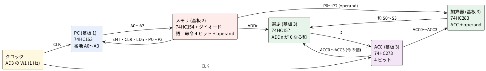

# 1-4 CPU もどき — PC と ROM に ACC と加算器を足して足し算する

[1-1](01-cpu-like.md) の CPU もどきは、番地が動くだけで計算をしなかった。
この題では、1-1 のプログラムカウンタ (PC、74HC163) とダイオードの ROM (74HC154) に、
[1-3](03-register.md) のレジスタを **ACC (アキュムレータ、計算の答えを置くレジスタ)** として、
[1-2](02-alu-like.md) の加算器 (74HC283) を ACC の前に足す。
命令表に **ADD (ACC に operand を足す)** を 1 つ加えると、プログラム `73 72 B1` で

- 番地 0 で ACC に 3 を足し、
- 番地 1 で 2 を足し、
- 番地 2 で番地 1 へ飛ぶ

を 1 Hz のクロックで繰り返す。LED の ACC が 0 → 3 → 5 → 5 → 7 → 7 → 9 … と 2 クロックごとに 2 ずつ増え、
15 の次は 17 − 16 = 1 に戻るのを目で追う。

**命令を取り出す (フェッチ)・解読する (デコード)・実行する** の 3 つが、1 クロックの中でそろう。
CPU の最小の形だ。引き算 (1-2 の SUB) と、ACC の値で飛ぶかを決める条件の飛び越しは、この題では作らない。

## 全体の構成

図1 が全体のブロック図だ。ブレッドボードは 3 枚になる。

- **基板 1**: PC (74HC163)・クロック (AD3 の W1)・番地の LED。**1-1 の図1・図3・図4 のまま**で、配線を 1 本も変えない
- **基板 2**: メモリ (74HC154 とダイオード)。1-1 の図2・図4 (基板 2) を、新しいプログラムと ADDn の列に組み直す (図2・図6)
- **基板 3**: ACC (74HC273)・加算器 (74HC283)・74HC157 と ACC の LED。新しく組む (図3・図4・図7)




1. クロックの立ち上がりで、PC が番地を進め (または飛び)、同時に ACC が D の値を取り込む
2. メモリが番地の語を出す。語の上位 4 ビットが命令、下位 4 ビットが operand だ
3. 命令の 4 本 (ENT・CLR・LDn・ADDn) のうち 3 本は PC に、ADDn は 74HC157 に行く。operand の P0〜P2 は PC と加算器の両方に行く
4. 加算器が ACC + operand を計算し、74HC157 が ADDn に従って「和」か「今の ACC」を選んで ACC の D に入れる
5. **次の立ち上がりで、PC と ACC が同時に**新しい値になる

## 命令の表

1-1 の命令の符号は「1 本だけ 0 にする」形で、命令の上位ビット Op3 は使っていなかった。
**この Op3 を ADDn (0 で足す) にする**。0 の bit がそのまま制御線になるので、今度も解読のゲート IC は要らない。

| 命令 | 符号 (上位 4 bit) | ADDn (Op3) | LDn (Op2) | CLR (Op1) | ENT (Op0) | 次のクロックで PC は | ACC は |
| --- | --- | --- | --- | --- | --- | --- | --- |
| NEXT | F = 1111 | 1 | 1 | 1 | 1 | 1 増える | そのまま |
| HALT | E = 1110 | 1 | 1 | 1 | **0** | 止まる | そのまま |
| CLR | D = 1101 | 1 | 1 | **0** | 1 | 0 になる | そのまま |
| JUMP | B = 1011 | 1 | **0** | 1 | 1 | operand になる | そのまま |
| **ADD (新)** | **7 = 0111** | **0** | 1 | 1 | 1 | 1 増える | **ACC + operand** |

- PC の動きは 1-1 の解読表と同じで、Op0〜Op2 だけで決まる。ACC の動きは Op3 (ADDn) だけで決まる
- そのため、0 の bit が 2 本の符号は 2 つの命令を同時にする。たとえば 3 = 0011 は「足してから operand の番地へ飛ぶ」、
  6 = 0110 は「PC を止めたまま毎クロック足す」になる。この題のプログラムでは使わない
- **operand は 3 ビット (0〜7)**。1-1 と同じく 74HC163 の D (PIN 6) を GND につないであり、加算器の B3 も GND にした。
  ADD で足せるのは 0〜7、JUMP で飛べるのは番地 0〜7 だ

## プログラム (ROM の中身)

| 番地 | 語 | 命令 | operand | ダイオード (0 の所) |
| --- | --- | --- | --- | --- |
| 0 | `73` | ADD 3 | 3 = 011 | D14 (ADDn)、D11 (P2) |
| 1 | `72` | ADD 2 | 2 = 010 | D15 (ADDn)、D16 (P0)、D12 (P2) |
| 2 | `B1` | JUMP 1 | 1 = 001 | D17 (LDn)、D18 (P1)、D13 (P2) |
| 3〜15 | `FF` | NEXT | 使わない | 無し (この番地には来ない) |

- ダイオードは全部で 8 個。**1-1 の番地 5 の D5・D6 は外す** (番地 5 には来ないが、残すと番地 5 の語が `B3` のままになる)
- `73` = 0111 0011。0 の bit は Op3 (ADDn) と operand の bit 2 (P2) だ。operand の bit 3 はいつも 0 (GND) なので、ダイオードは要らない
- `B1` = 1011 0001。0 の bit は Op2 (LDn) と、operand の bit 1 (P1)・bit 2 (P2) だ

## 設計の判断

1. **基板 1 はそのまま。** PC・クロック・番地の LED は 1-1 の図4 と同じ配線で、基板 2 への線も同じ名前で渡る。
   基板 3 へ渡すクロックだけ、基板 1 の 9 列 (W1 の列) の上の空いた穴 `c9` から 1 本足す
2. **ACC は 1-3 のレジスタ (74HC273 + 74HC157)。** 1-3 では LOAD がスイッチだった。ここでは ROM の ADDn が LOAD の代わりになる。
   ただし向きが逆で、**ADDn が 0 のとき和を選ぶ**。74HC157 は A/B が L のとき A を選ぶので、A に和、B に今の ACC をつなぐと、
   インバータ無しで済む
3. **加算器は 1-2 の 74HC283 だけ。** 引き算の XOR (74HC86) とあふれ V は外した。命令が ADD しか無いからだ。
   CIN と B3 は GND に固定し、COUT は使わない (15 を超えると、はみ出した 16 は捨てられる)
4. **PC と ACC は同じクロック。** 1-3 で書いたとおり、書き込み許可を D に戻す形で作ったので、クロックを止めるゲートが要らない。
   PC と ACC が同じ瞬間に動く
5. **ACC を 0 にするスイッチ S2 は基板 3 に分ける。** 74HC273 の CLR は非同期 (押した瞬間に 0) で、74HC163 の CLR は同期 (次の立ち上がり) だ。
   ROM の CLR の列を 74HC273 につなぐと、番地が変わる瞬間に 74HC154 の出力がごく短く乱れたとき (CLR 命令のある行が一瞬選ばれたとき)、
   ACC が 0 になってしまうことがある。同期の 74HC163 には効かない乱れでも、非同期の CLR には効く
6. **計器は AD3 1 台。** DIO0〜DIO4 は 1-1 と同じ (番地と CLK)、DIO5〜DIO8 を基板 3 の ACC に当てる

## 回路図

PC とクロックの回路図は **1-1 の図1**、番地の LED は **1-1 の図3** のままだ。この題の回路図は 3 枚で、図2 がメモリ、図3 が ACC と加算器、図4 が ACC の表示だ。
**同じ名前の端子 (A0〜A3・ENT・CLR・LDn・P0〜P2・ADDn・ACC0〜ACC3・CLK) は、図をまたいで同じ線**になる。1-1 の図1 の同じ名前の端子ともつながる。

```circuit
title: 図2 メモリ (74HC154 とダイオード 8 個) と命令の線
parts:
  U2: ic h6 74HC154
  A0: port g2f0
  A1: port h3
  A2: port h2f0
  A3: port i3
  VCC: vcc c6 5V
  GU: ground n6
  VCC: vcc b14 5V
  R10: resistor b14 d14 10k
  D11: diode h15 f15
  D12: diode k15 i15
  D13: diode n15 l15
  P2: port n14
  VCC: vcc b18 5V
  R11: resistor b18 d18 10k
  D14: diode h19 f19
  D15: diode k19 i19
  ADDn: port k18
  VCC: vcc b22 5V
  R8: resistor b22 d22 10k
  D16: diode k23 i23
  P0: port k22
  VCC: vcc b26 5V
  R7: resistor b26 d26 10k
  D17: diode n27 l27
  LDn: port n26
  VCC: vcc b30 5V
  R9: resistor b30 d30 10k
  D18: diode n31 l31
  P1: port n30
  VCC: vcc b34 5V
  R5: resistor b34 d34 10k
  ENT: port f34
  VCC: vcc b38 5V
  R6: resistor b38 d38 10k
  S1: button f40 h40
  GS: ground h40
  CLR: port h38
wires:
  - U2.A0 -| g2f0
  - U2.A1 -| h3
  - U2.A2 -| h2f0
  - U2.A3 -| i3
  - U2.VCC |- c6
  - U2.GND |- n6
  - U2.E1 |- n6
  - U2.E2 |- n6
  - U2.Y0 -| f11
  - U2.Y1 -| i10
  - U2.Y2 -| l9
  - h14 -- h15
  - k14 -- k15
  - n14 -- n15
  - d14 -- h14 -- k14 -- n14
  - h18 -- h19
  - k18 -- k19
  - d18 -- h18 -- k18
  - k22 -- k23
  - d22 -- k22
  - n26 -- n27
  - d26 -- n26
  - n30 -- n31
  - d30 -- n30
  - d34 -- f34
  - f38 -- f40
  - d38 -- f38 -- h38
  - f11 -- f15 -- f19
  - i10 -- i15 -- i19 -- i23
  - l9 -- l15 -- l27 -- l31
notes:
  - text p2 small: "E1 と E2 (PIN 18 と 19) は GND につなぐと常に有効"
style:
  grid: on
  pitch: 1.2
```


- U2 (74HC154) は 1-1 の図2 と同じ。番地 0〜2 で、Y0〜Y2 (PIN 1・2・3) の 1 本だけが L になる
- 横の 3 本が行 (Y0・Y1・Y2)、縦の 7 本が列 (P2・ADDn・P0・LDn・P1・ENT・CLR)。**列はどれも 10 kΩ で +5V へ引き**、
  ダイオードのある所だけ、その行が L のときに L (0) になる。行と列が交わる所に点の無いものは、つながっていない
- ダイオードの向きは 1-1 と同じで、カソード (線の入った側) が行、アノードが列だ
- 新しい列は ADDn (R11) だけ。R5〜R10 は 1-1 の図2 と同じ抵抗で、列の名前も同じ
- ENT と CLR の列には、このプログラムではダイオードが無い。S1 は 1-1 と同じく PC を 0 にするスイッチだ

```circuit
title: 図3 ACC (74HC273) と加算器 (74HC283) と、選ぶ 74HC157
parts:
  U3: ic h8 CD74HC283
  VCC: vcc d8 5V
  GU3: ground l8
  ACC0: port f4
  P0: port f2f0
  ACC1: port g4
  P1: port g2f0
  ACC2: port h4
  P2: port h2f0
  ACC3: port i4
  GB3: ground i5f0 r90
  GCI: ground j5 r90
  U4: ic h20 74HC157
  VCC: vcc d20 5V
  GU4: ground m20
  ADDn: port f15
  ACC0: port g16
  ACC1: port h16
  ACC2: port i16
  ACC3: port j16
  U5: ic i30f0 74HC273
  VCC: vcc e30 5V
  GU5: ground m30
  GD5: ground i26f0 r90
  GD6: ground j26 r90
  GD7: ground j26f0 r90
  GD8: ground k26 r90
  CLK: port k26f0
  VCC: vcc d34 5V
  R12: resistor d34 f34 10k
  S2: button f34 f37
  GS2: ground f37
  ACC0: port h34
  ACC1: port h36f0
  ACC2: port i34
  ACC3: port i36f0
wires:
  - U3.VCC |- d8
  - U3.GND |- l8
  - U3.A0 -| f4
  - U3.B0 -| f2f0
  - U3.A1 -| g4
  - U3.B1 -| g2f0
  - U3.A2 -| h4
  - U3.B2 -| h2f0
  - U3.A3 -| i4
  - U3.B3 -| i5f0
  - U3.CIN -| j5
  - U3.S0 -| f12f0
  - f12f0 -| U4.1A
  - U3.S1 -- U4.2A
  - U3.S2 -| h13f0
  - h13f0 -| U4.3A
  - U3.S3 -| i11f0
  - i11f0 -| U4.4A
  - U4.VCC |- d20
  - U4.GND |- m20
  - U4.G |- m20
  - U4.A/B -| f15
  - U4.1B -| g16
  - U4.2B -| h16
  - U4.3B -| i16
  - U4.4B -| j16
  - U4.1Y -- U5.1D
  - U4.2Y -- U5.2D
  - U4.3Y -- U5.3D
  - U4.4Y -- U5.4D
  - U5.5D -| i26f0
  - U5.6D -| j26
  - U5.7D -| j26f0
  - U5.8D -| k26
  - U5.CLK -| k26f0
  - U5.VCC |- e30
  - U5.GND |- m30
  - U5.CLR |- f34
  - U5.1Q -| h34
  - U5.2Q -| h36f0
  - U5.3Q -| i34
  - U5.4Q -| i36f0
notes:
  - text n2 small: "U3 の B3 と CIN は GND。operand は P0 から P2 の 3 ビット"
  - text o2 small: "U4 は ADDn が 0 なら A (和)、1 なら B (今の ACC) を選ぶ"
style:
  grid: on
  pitch: 1.2
```


- U3 (74HC283) の A に ACC、B に operand (P0〜P2、B3 は GND) が入り、S0〜S3 に和が出る。CIN は GND
- U4 (74HC157) は A に和、B に今の ACC が入る。**ADDn = 0 なら A (和)、1 なら B (今の ACC)** を選ぶ
- U5 (74HC273) は 1-3 の図2 と同じつなぎ方で、Q が ACC0〜ACC3 になる。CLK は基板 1 の W1 と同じ線
- S2 を押すと、U5 の CLR が L になり、クロックを待たずに ACC が 0 になる。R12 (10 kΩ) は CLR を +5V に引く
- U3 の和の 4 本 (S0〜S3) は 0.5 マスおき、U4 の A は 1 マスおきに並ぶので、線を段にして渡した

```circuit
title: 図4 ACC の表示 (LED 4 つ)
parts:
  ACC0: port b2
  R21: resistor b3 b6 820
  D21: led b6 b9 red
  GA1: ground b9
  ACC1: port d2
  R22: resistor d3 d6 820
  D22: led d6 d9 red
  GA2: ground d9
  ACC2: port f2
  R23: resistor f3 f6 820
  D23: led f6 f9 red
  GA3: ground f9
  ACC3: port h2
  R24: resistor h3 h6 820
  D24: led h6 h9 red
  GA4: ground h9
wires:
  - b2 -- b3
  - d2 -- d3
  - f2 -- f3
  - h2 -- h3
style:
  grid: on
  pitch: 1.2
```


- ACC0〜ACC3 に、820 Ω と赤の LED を 1 つずつつなぐ。1 が点灯。電流は (5 − 1.9) ÷ 820 ≒ 3.8 mA (順方向電圧 1.9 V は仮定)

## 実体配線図

**ブレッドボードは 3 枚** (half 1 枚・full 2 枚)。基板 1 は 1-1 の図4 (基板 1) の half、基板 2 と基板 3 が full だ。
基板 3 の IC 3 個 (26 列) と LED 4 つ (12 列) は基板 2 の空きには収まらず、full をもう 1 枚足した。

**基板 1** は [1-1 の図4](01-cpu-like.md) のまま組む。足すのは、W1 の列の空いた穴 `c9` から基板 3 の CLK への線 1 本だけだ。

```breadboard
title: 図6 基板 2 — メモリ (74HC154 とダイオード 8 個) と命令の線
board: full
parts:
  UP:
    type: device
    at: top
    label: 基板 1 から
    pins: [A0, A1, A2, A3, P0, P2, LDn, P1, ENT, CLR, +5V, GND]
  DN:
    type: device
    at: top
    label: 基板 3 へ
    pins: [P0, ADDn, P2, P1, +5V, GND]
  U2: dip24 @ e3 74HC154
  R8: resistor a16 +t16 10k
  R11: resistor a22 +t22 10k
  R10: resistor a28 +t28 10k
  R7: resistor a35 +t35 10k
  R9: resistor a38 +t38 10k
  R5: resistor a41 +t41 10k
  R6: resistor a44 +t44 10k
  D16: diode b16(A) b19(K)
  D15: diode c22(A) c19(K)
  D14: diode b22(A) b25(K)
  D11: diode c28(A) c25(K)
  D12: diode d28(A) d19(K)
  D13: diode c29(A) c32(K)
  D17: diode b35(A) b32(K)
  D18: diode d38(A) d32(K)
  S1: button @ e46
wires:
  - UP.+5V -- +t61 red
  - UP.GND -- -t60 black
  - DN.+5V -- +t58 red
  - DN.GND -- -t57 black
  - +t62 -- +b62 red
  - -t1 -- -b1 black
  - a3 -- +t3 red
  - a8 -- -t8 black
  - a9 -- -t9 black
  - j14 -- -b14 black
  - j46 -- -b46 black
  - UP.A0 -- a4 blue
  - UP.A1 -- a5 blue
  - UP.A2 -- a6 blue
  - UP.A3 -- a7 blue
  - h3 -- h25 orange
  - e25 -- f25 orange
  - i4 -- i19 orange
  - e19 -- f19 orange
  - g5 -- g32 orange
  - e32 -- f32 orange
  - b28 -- b29 yellow
  - UP.P0 -- d16 white
  - UP.P2 -- e28 yellow
  - UP.LDn -- c35 purple
  - UP.P1 -- c38 green
  - UP.ENT -- c41 purple
  - UP.CLR -- d44 brown
  - c44 -- c46 brown
  - DN.P0 -- c16 white
  - DN.ADDn -- d22 pink
  - DN.P2 -- d29 yellow
  - DN.P1 -- b38 green
```


- 電源は 1-1 と同じく基板 1 から入れ、基板 3 へ渡す (右上の箱の +5V・GND)。**赤は +5V の線だけ、黒は GND の線だけ**に使った
- U2 (74HC154、幅 0.3 インチ) は 1-1 の図4 の基板 2 と同じ 3〜14 列。Y0・Y1・Y2 は PIN 1・2・3 (3・4・5 列の下)
- **行**: Y0 は `h3` → `h25`、Y1 は `i4` → `i19`、Y2 は `g5` → `g32` の橙の線で右へ渡し、溝をまたぐ短い線 (`e25 -- f25` など) で上の組へ上げる。
  25 列が Y0、19 列が Y1、32 列が Y2 の行だ
- **列**: 16 列 = P0、22 列 = ADDn、28・29 列 = P2 (2 列を `b28 -- b29` でつなぐ)、35 列 = LDn、38 列 = P1、41 列 = ENT、44 列 = CLR。
  列の 10 kΩ は a 行から上の + レールへ挿す
- **ダイオード** (1N4148) は、アノードを列、カソード (線の入った側) を行の列に向けて、b・c・d 行に寝かせて挿す。
  D12 (28 列 → 19 列) と D18 (38 列 → 32 列) は長く、間の列の d 行の穴をまたぐ。またいだ穴には何も挿さない
- S1 は 46〜48 列で、上の組を CLR の列 (44 列) と茶の線でつなぎ、下の組を下の − レールへ落とす
- 線の色: 白 = P0、緑 = P1、黄 = P2、紫 = LDn・ENT、茶 = CLR、桃 = ADDn、青 = 番地、橙 = 行

```breadboard
title: 図7 基板 3 — ACC (74HC273)・加算器 (74HC283)・74HC157 と ACC の LED
board: full
parts:
  IN:
    type: device
    at: top
    label: 基板 1・基板 2 から
    pins: [+5V, GND, P1, P2, P0, ADDn, CLK]
  AD:
    type: device
    at: bottom
    label: Analog Discovery 3 (DIO5〜8)
    pins: [GND, DIO8, DIO7, DIO6, DIO5]
  U3: dip16 @ e3 74HC283
  U4: dip16 @ e14 74HC157
  U5: dip20 @ e26 74HC273
  S2: button @ e38
  R12: resistor j38 +b38 10k
  R24: resistor e43 g43 820
  D24: led c43(A) c44(K) red
  R23: resistor e46 g46 820
  D23: led c46(A) c47(K) red
  R22: resistor e49 g49 820
  D22: led c49(A) c50(K) red
  R21: resistor e52 g52 820
  D21: led c52(A) c53(K) red
wires:
  - IN.+5V -- +t1 red
  - IN.GND -- -t2 black
  - AD.GND -- -b2 black
  - +t63 -- +b63 red
  - -t63 -- -b63 black
  - a3 -- +t3 red
  - j10 -- -b10 black
  - a8 -- -t8 black
  - j9 -- -b9 black
  - a14 -- +t14 red
  - a15 -- -t15 black
  - j21 -- -b21 black
  - a26 -- +t26 red
  - j35 -- -b35 black
  - a28 -- -t28 black
  - a29 -- -t29 black
  - a32 -- -t32 black
  - a33 -- -t33 black
  - a38 -- -t38 black
  - a44 -- -t44 black
  - a47 -- -t47 black
  - a50 -- -t50 black
  - a53 -- -t53 black
  - IN.CLK -- a35 purple
  - IN.ADDn -- h14 pink
  - IN.P0 -- h8 white
  - IN.P1 -- h4 green
  - IN.P2 -- c4 yellow
  - g6 -- g15 orange
  - i3 -- i18 orange
  - c6 -- c19 orange
  - b9 -- b16 orange
  - g27 -- g7 blue
  - h27 -- h16 blue
  - i27 -- i52 blue
  - g30 -- g5 blue
  - h30 -- h19 blue
  - i30 -- i49 blue
  - g31 -- g22 blue
  - e22 -- f22 blue
  - c22 -- c5 blue
  - d22 -- d20 blue
  - h31 -- h46 blue
  - g34 -- g23 blue
  - e23 -- f23 blue
  - d23 -- d7 blue
  - c23 -- c17 blue
  - h34 -- h43 blue
  - i17 -- i28 green
  - i20 -- i29 green
  - b21 -- b24 green
  - e24 -- f24 green
  - h24 -- h32 green
  - c18 -- c25 green
  - e25 -- f25 green
  - i25 -- i33 green
  - i26 -- i38 brown
  - AD.DIO5 -- j52 orange
  - AD.DIO6 -- j49 orange
  - AD.DIO7 -- j46 orange
  - AD.DIO8 -- j43 orange
```


- 電源は上の箱 (基板 2 から) の +5V・GND を上のレールの 1・2 列に入れ、右の端 (63 列) で上下のレールをつなぐ
- **IC の向き**: 3 個とも切り欠きが左。U3 (74HC283) は 3〜10 列、U4 (74HC157) は 14〜21 列、U5 (74HC273) は 26〜35 列
- U3 の B3 (8 列の上) は上の − レール、CIN (9 列の下) は下の − レールへ。U4 の G (15 列の上) は上の − レールへ。U5 の 5D〜8D (28・29・32・33 列の上) は上の − レールへ
- **列をまたぐ線**: ACC2・ACC3・3Y・4Y は、上と下の両方の組に行き先がある。22〜25 列を中継に使い、溝をまたぐ短い線でつなぐ
  (22 列 = ACC2、23 列 = ACC3、24 列 = 3Y → 3D、25 列 = 4Y → 4D)
- S2 は 38〜40 列。下の組を U5 の CLR (26 列の下) と R12 (10 kΩ、下の + レールへ) に、上の組を上の − レールにつなぐ
- **LED**: 43 列から 3 列おきに ACC3・ACC2・ACC1・ACC0 (左が上の桁)。ACC の線は下の組に来るので、抵抗 (820 Ω) を下から上へ渡し、
  LED は c 行に挿してカソードを上の − レールへ落とす
- AD3 の DIO5〜DIO8 は、下の箱から LED の列の j 行 (`j52`・`j49`・`j46`・`j43`) に当てる
- 下の組 (g〜j 行) の線は、行き先の間の穴がふさがっているので、図ではブレッドボードの下の縁に沿って回してある。
  実物では、下の表の穴どうしを 1 本ずつつなげばよい
- 線の色: 青 = ACC0〜ACC3、橙 = 和 (S0〜S3)、緑 = Y → D、白 = P0、緑 = P1 (上の箱から)、黄 = P2、桃 = ADDn、紫 = CLK、茶 = CLR

### ブレッドボードどうしの線

| 線 | 基板 1 | 基板 2 | 基板 3 |
| --- | --- | --- | --- |
| A0〜A3 | 上の箱 (1-1 の図4) | `a4`〜`a7` (U2 の A0〜A3) | — |
| ENT・LDn・CLR | 上の箱・下の箱 | `c41`・`c35`・`d44` | — |
| P0 | 下の箱 | `d16` (基板 1 から)、`c16` (基板 3 へ) | 上の箱 → `h8` (U3 の B0) |
| P1 | 下の箱 | `c38`、`b38` | 上の箱 → `h4` (U3 の B1) |
| P2 | 下の箱 | `e28`、`d29` | 上の箱 → `c4` (U3 の B2) |
| ADDn | — | `d22` | 上の箱 → `h14` (U4 の A/B) |
| CLK | `c9` (W1 の列) | — | 上の箱 → `a35` (U5 の CLK) |
| +5V・GND | 上の箱 | `+t61`・`-t60` (基板 1 から)、`+t58`・`-t57` (基板 3 へ) | `+t1`・`-t2` |

### 基板 3 の線と、回路図との対応

| 線の名前 | 回路図 (図3) | 基板 3 (始め → 終わり) |
| --- | --- | --- |
| S0 / S1 | U3 PIN 4 / 1 → U4 1A / 2A (PIN 2・5) | `g6` → `g15`、`i3` → `i18` |
| S2 / S3 | U3 PIN 13 / 10 → U4 3A / 4A (PIN 11・14) | `c6` → `c19`、`b9` → `b16` |
| ACC0 | U5 1Q (PIN 2) → U3 A0 (PIN 5)、U4 1B (PIN 3)、R21 | `g27` → `g7`、`h27` → `h16`、`i27` → `i52` |
| ACC1 | U5 2Q (PIN 5) → U3 A1 (PIN 3)、U4 2B (PIN 6)、R22 | `g30` → `g5`、`h30` → `h19`、`i30` → `i49` |
| ACC2 | U5 3Q (PIN 6) → U3 A2 (PIN 14)、U4 3B (PIN 10)、R23 | `g31` → `g22`、`e22` → `f22`、`c22` → `c5`、`d22` → `d20`、`h31` → `h46` |
| ACC3 | U5 4Q (PIN 9) → U3 A3 (PIN 12)、U4 4B (PIN 13)、R24 | `g34` → `g23`、`e23` → `f23`、`d23` → `d7`、`c23` → `c17`、`h34` → `h43` |
| 1Y → 1D / 2Y → 2D | U4 PIN 4 / 7 → U5 PIN 3 / 4 | `i17` → `i28`、`i20` → `i29` |
| 3Y → 3D | U4 PIN 9 → U5 PIN 7 | `b21` → `b24`、`e24` → `f24`、`h24` → `h32` |
| 4Y → 4D | U4 PIN 12 → U5 PIN 8 | `c18` → `c25`、`e25` → `f25`、`i25` → `i33` |
| CLR (ACC) | U5 PIN 1、R12、S2 | `i26` → `i38` |

3 枚の `breadboard-fence check` のネットリストは、これらの表のとおりだった (たとえば基板 2 の Y1 の行は
`U2.Y1, D16.K, D15.K, D12.K`、基板 3 の ACC2 の線は `AD.DIO7, U3.A2, U4.3B, U5.3Q, R23.2`)。
**3 枚のネットリストを、箱のピンの名前で 1 つにつなぎ**、Python で 74HC163・74HC154・ダイオード・74HC283・74HC157・74HC273 の働きを当てて
20 クロック進めた。PC と ACC の並びは、下の「1 クロックごとの動き」の表と一致した (実機では測っていない)。

### ブレッドボードの限度の確認

電圧は 5V (12V 以下)。電流は、基板 1 が 1-1 のとおり最大約 20 mA (このプログラムでは A2・A3 の LED は消えたまま)、
基板 2 の列のプルアップが同時に L になるのは最大 3 本で 0.43 mA × 3 ≒ 1.3 mA、基板 3 の LED 4 つが全部点いて 3.8 mA × 4 ≒ 15 mA、
IC の静止電流は数 µA で、**3 枚の合計は最大でも約 37 mA**。1 穴 200 mA・ブレッドボード 1 枚 500 mA の限度より十分に小さい。
周波数はクロックの **1 Hz** で、3 MHz の限度に十分収まる。

この回路の上限は、立ち上がりから ACC の D が決まるまでの時間で決まる。U1 の CLK → Q (41 ns) + U2 の A → Y (35 ns) +
列が H に戻る時間 (10 kΩ × ブレッドボードの浮遊容量 30 pF ≒ 0.3 µs) + U3 の B → S (53 ns) + U4 の A → Y (25 ns) + U5 の準備時間 (20 ns) ≒ 0.47 µs、
つまり **約 2 MHz が上限の見積もり**で、1-1 とほぼ同じだ (データシートの 25 ℃・4.5 V の最大値による計算で、実測していない)。

## 計器の設定

**計器は Analog Discovery 3 (AD3) 1 台**。電源・クロック・番地の観測は 1-1 と同じで、Logic に ACC の 4 本を足す。

| 計器 | 設定 |
| --- | --- |
| Supplies | V+ を 5 V にして Master Enable を入れる (基板 1 から基板 2・基板 3 へ渡す) |
| Wavegen | W1: **Square**、Frequency **1 Hz**、Amplitude **2.5 V**、Offset **2.5 V** (0〜5 V)、Symmetry 50 % (1-1 と同じ) |
| Logic | **DIO0〜DIO3 = A0〜A3 (PC)、DIO4 = CLK** (基板 1)、**DIO5〜DIO8 = ACC0〜ACC3** (基板 3)。DIO0〜DIO3 をバス「PC」、DIO5〜DIO8 をバス「ACC」に束ね、どちらも 10 進で表示する。Time base **2 s/div** (窓 20 s)、Mode は Record、Sample rate 1 kHz。Trigger は **DIO4 (CLK) の立ち上がり**。WaveForms の項目の名前は確認していない |
| 接続 | AD3 の GND は基板 1 の − レール (1-1 と同じ)。基板 3 の下の箱の GND も同じ AD3 の GND だ |

始め方:

1. Supplies を入れる。W1 は 1 Hz のまま
2. **S1 (基板 2) と S2 (基板 3) を一緒に押したまま**、クロックの立ち上がりを 1 回待つ。番地の LED と ACC の LED が全部消える (PC = 0、ACC = 0)
3. **次の立ち上がりの前 (1 秒以内) に S2、S1 の順に離す**。次の立ち上がりで PC が 1、ACC が 3 になる
4. 離すのが遅れて立ち上がりをまたぐと、ACC に 3 が余分に足される (S1 を押している間も、番地 0 の ADD 3 は毎クロック効く)。そのときは 2 からやり直す

図8 の t = 0 は、2 で PC が 0 になった立ち上がりに合わせてある。

## 計器の画面

図8 は Logic の見えるはずの画面だ (計算で作った理想の形で、実測ではない)。
番地 (PC) は 0 → 1 → 2 → 1 → 2 … と回り、ACC は**番地 1 の ADD 2 を実行した次の立ち上がりで**増える。
カーソルは **X1 = 12.5 s** (ACC = 15) と **X2 = 14.5 s** (15 + 2 = 17 が 4 ビットに入らず 1 に戻った) に置いた。どちらも PC = 2 で、CLK は L だ。

```logic
title: 図8 PC は 0 1 2 1 2 と回り、ACC は 2 クロックごとに 2 ずつ増える (計算)
device: ad3
time: 2s/div
sample: 1kHz
signals:
  CLK: dio4 clock 1Hz
  A: dio0..dio3 counter on CLK rising sequence 0 1 2 1 2 1 2 1 2 1 2 1 2 1 2 1 2 1 2 1
  ACC: dio5..dio8 counter on CLK rising sequence 0 3 5 5 7 7 9 9 11 11 13 13 15 15 1 1 3 3 5 5
buses:
  PC: A3..A0 dec
  ACCbus: ACC3..ACC0 dec
cursors: [12.5s, 14.5s]
trigger: CLK rising at 0s
```


## 見るべき値 (目安)

### 1 クロックごとの動き

下の表は、図2・図3 の結線どおりに Python で 1 クロックずつ計算した値だ (下の「動かして確かめる」のコードの出力)。実機では測っていない。
**ある行の「PC」「ACC」は、その 1 秒の間に LED に出ている値**で、「次の PC」「次の ACC」がその次の立ち上がりで入る。

| クロック | 図8 の時刻 | PC | 読んだ語 | 命令 | ACC | 加算器の和 | 次の PC | 次の ACC |
| --- | --- | --- | --- | --- | --- | --- | --- | --- |
| 0 | 0〜1 s | 0 | `73` | ADD 3 | 0 | 3 | 1 | **3** |
| 1 | 1〜2 s | 1 | `72` | ADD 2 | 3 | 5 | 2 | **5** |
| 2 | 2〜3 s | 2 | `B1` | JUMP 1 | 5 | 6 | **1** | 5 (そのまま) |
| 3 | 3〜4 s | 1 | `72` | ADD 2 | 5 | 7 | 2 | **7** |
| 4 | 4〜5 s | 2 | `B1` | JUMP 1 | 7 | 8 | **1** | 7 (そのまま) |
| 5 | 5〜6 s | 1 | `72` | ADD 2 | 7 | 9 | 2 | **9** |
| 6 | 6〜7 s | 2 | `B1` | JUMP 1 | 9 | 10 | **1** | 9 (そのまま) |
| 7 | 7〜8 s | 1 | `72` | ADD 2 | 9 | 11 | 2 | **11** |
| 8 | 8〜9 s | 2 | `B1` | JUMP 1 | 11 | 12 | **1** | 11 (そのまま) |
| 9 | 9〜10 s | 1 | `72` | ADD 2 | 11 | 13 | 2 | **13** |
| 10 | 10〜11 s | 2 | `B1` | JUMP 1 | 13 | 14 | **1** | 13 (そのまま) |
| 11 | 11〜12 s | 1 | `72` | ADD 2 | 13 | 15 | 2 | **15** |
| 12 | 12〜13 s | 2 | `B1` | JUMP 1 | 15 | 0 (桁上がり 1) | **1** | 15 (そのまま) |
| 13 | 13〜14 s | 1 | `72` | ADD 2 | 15 | 1 (桁上がり 1) | 2 | **1** |
| 14 | 14〜15 s | 2 | `B1` | JUMP 1 | 1 | 2 | **1** | 1 (そのまま) |
| 15 | 15〜16 s | 1 | `72` | ADD 2 | 1 | 3 | 2 | **3** |

- JUMP の間も加算器は和を出している (ACC + 1)。74HC157 が「今の ACC」を選ぶので、ACC には入らない
- ACC は 3 → 5 → 7 → 9 → 11 → 13 → 15 → 1 → 3 … と、**2 クロックに 1 回、2 ずつ**増える。16 クロック (16 秒) で同じ並びに戻る
- 13 → 14 の立ち上がりで 15 + 2 = 17 になるが、4 ビットには 1 しか残らない。74HC283 の COUT は 1 になるが、つないでいないので捨てられる
- 図8 の**カーソル**: X1 (12.5 s) は PC = 2・ACC = 15、X2 (14.5 s) は PC = 2・ACC = 1。ΔX = 2.000 s
- 図8 の ACC の並びは `0@0 s 3@1 s 5@2 s 7@4 s 9@6 s 11@8 s 13@10 s 15@12 s 1@14 s 3@16 s 5@18 s`、
  PC は `0@0 s 1@1 s 2@2 s 1@3 s 2@4 s …` (`logic-fence check` の読み値)
- 番地の LED (基板 1) は 0000 → 0001 → 0010 → 0001 → 0010 … と、A0 と A1 だけが動く

| 電圧・電流・時間 (計算値) | 値 |
| --- | --- |
| LED 1 つの電流 | (5 − 1.9) ÷ 820 ≒ 3.8 mA (順方向電圧は仮定) |
| 3 枚の合計の電流 | 最大でも約 37 mA |
| 立ち上がりから ACC の D が決まるまで | 約 0.47 µs (クロックの上限の見積もりは約 2 MHz) |

### 動かして確かめる

上の表は、次の Python で作った。ROM・PC (74HC163 の優先順位)・加算器・74HC157・74HC273 を、図の結線どおりに 1 クロックずつ進める。

```python
rom = [0xFF] * 16
rom[0], rom[1], rom[2] = 0x73, 0x72, 0xB1   # ADD 3, ADD 2, JUMP 1

pc, acc = 0, 0                               # S1・S2 で 0 にしたところ
for clock in range(16):
    word = rom[pc]
    op, p = word >> 4, word & 0b0111         # operand は 3 ビット (P3 と B3 は GND)
    ent, clr, ldn, addn = (op >> 0) & 1, (op >> 1) & 1, (op >> 2) & 1, (op >> 3) & 1
    total = (acc + p) & 0xF                  # 74HC283 (CIN = 0、COUT は捨てる)
    next_acc = acc if addn else total        # 74HC157: ADDn = 0 で和、1 で今の ACC
    if not clr:                              # 74HC163: CLR > LOAD > 数える
        next_pc = 0
    elif not ldn:
        next_pc = p
    elif ent:
        next_pc = (pc + 1) & 0xF
    else:
        next_pc = pc
    print(clock, pc, f"{word:02X}", acc, next_pc, next_acc)
    pc, acc = next_pc, next_acc
```

### プログラムを書き換える

ダイオードを差し替えると、別の計算になる。どれも同じ Python で計算した並びだ (実機では測っていない)。

| 書き換え | 語 | ACC の並び (クロックごと) |
| --- | --- | --- |
| 元 | `73 72 B1` | 0 3 5 5 7 7 9 9 11 … (2 クロックで 2 増える) |
| 番地 1 を ADD 1 にする (D16 のアノードを P0 の列から P1 の列へ差し替える) | `73 71 B1` | 0 3 4 4 5 5 6 6 7 … (2 クロックで 1 増える) |
| 番地 2 を JUMP 0 にする (P0 の列と Y2 の行の間にダイオードを 1 個足す) | `73 72 B0` | 0 3 5 5 8 10 10 13 15 … (3 クロックで 5 増える) |
| 番地 2 を HALT にする (D17 のアノードを LDn の列から ENT の列へ差し替える) | `73 72 E1` | 0 3 5 5 5 5 … (5 で止まる) |

## 部品

電源は AD3 の V+ (5 V)。基板 1 の部品は 1-1 の部品の表のとおり (U1 74HC163・LED 4 つ・820 Ω 4 本)。

**基板 2** (1-1 の基板 2 から変える所)

| 記号 | 部品 | 値・型番 | 数 |
| --- | --- | --- | --- |
| U2 | 4 → 16 デコーダ (DIP-24、幅 0.3 インチ) | 74HC154 (1-1 と同じ) | 1 |
| D11〜D18 | 小信号ダイオード | 1N4148 (1-1 の D5・D6 を含めて 8 個) | 8 |
| R5〜R10 | 抵抗 (1/4 W) | 10 kΩ (1-1 と同じ) | 6 |
| R11 | 抵抗 (1/4 W) | 10 kΩ (ADDn の列。新しく足す) | 1 |
| S1 | タクトスイッチ | 6 mm (1-1 と同じ) | 1 |

**基板 3** (新しく組む)

| 記号 | 部品 | 値・型番 | 数 |
| --- | --- | --- | --- |
| U3 | 4 ビット 全加算器 (DIP-16) | 74HC283 | 1 |
| U4 | 2 → 1 セレクタ × 4 (DIP-16) | 74HC157 | 1 |
| U5 | 8 ビット D フリップフロップ、クリア付き (DIP-20) | 74HC273 | 1 |
| R12 | 抵抗 (1/4 W) | 10 kΩ | 1 |
| R21〜R24 | 抵抗 (1/4 W) | 820 Ω | 4 |
| D21〜D24 | LED 5 mm | 赤 | 4 |
| S2 | タクトスイッチ | 6 mm | 1 |
| — | ブレッドボード | full 1 枚 (基板 1 の half、基板 2 の full と合わせて 3 枚) | 1 |
| — | ジャンパ線 | 赤・黒・各色 | 適宜 |

- 型番の入手性は確認していない

## 出典

自作。1-1 の命令表を拡張した。74HC163・74HC154 の働きとピンの並び・伝搬遅延は [1-1](01-cpu-like.md) の出典のとおり。
74HC283 の伝搬遅延 (An, Bn → Sn が最大 53 ns) は TI の CD74HC283 データシート (SCHS176E)、
74HC157 の真理値表と伝搬遅延 (最大 25 ns) は TI の SN74HC157 データシート (SCLS113F)、
74HC273 の非同期クリア・準備時間 (20 ns) は TI の SN74HC273 データシート (SCLS136F) による (どれも 25 ℃・VCC = 4.5 V)。

- [https://www.ti.com/lit/ds/symlink/cd74hc283.pdf](https://www.ti.com/lit/ds/symlink/cd74hc283.pdf)
- [https://www.ti.com/lit/ds/symlink/sn74hc157.pdf](https://www.ti.com/lit/ds/symlink/sn74hc157.pdf)
- [https://www.ti.com/lit/ds/symlink/sn74hc273.pdf](https://www.ti.com/lit/ds/symlink/sn74hc273.pdf)
- 74HC154 の出力が番地の変わり目にごく短く乱れうること (設計の判断 5) は、デコーダ一般の性質としての注意で、データシートの数値では確かめていない
- 型番の入手性、WaveForms の Logic の項目の名前は確認していない
- クロックの上限 (約 2 MHz) は、データシートの値と浮遊容量の仮定 (30 pF) から計算した見積もりで、実測していない
