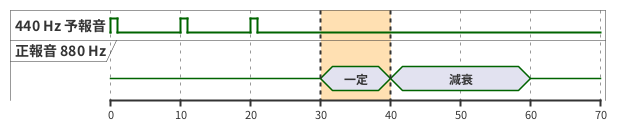
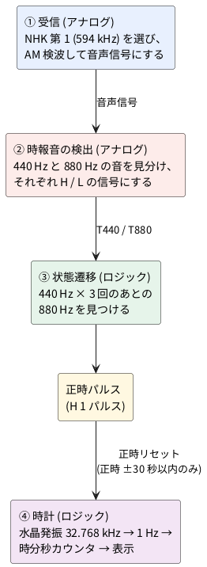

# 2-1 中波ラジオの時報を検出するブロック図

## この工作の意図

アナログ回路とロジック回路を**1 つの回路にまとめる練習**をする。受信と検波と音の検出は
アナログ回路、時報の並びを見分ける状態遷移と時計はロジック回路で、両者は T440・T880・正時パルスという
H / L の信号で渡す。

特に、**時報のタイミング (440 Hz が 1 秒おきに 3 回、そのあと 880 Hz) を状態遷移回路で作る**ことで、
「時間」を回路で扱えるようになるのがねらいだ。窓タイマで 1 秒を測り、状態で「何回目か」を覚え、
カウンタで時刻を数える。時間の流れを、状態と数に置き換える練習になる。

実用では、ラジオの受信部 (① 受信と ② 時報音の検出) より後は、Raspberry Pi Pico などの
マイコンにプログラムを書くほうがずっと簡単だ。時間の判定も時計も数行で書け、直すのも楽になる。
同じ時報をマイコンで作る例は [06-mcu.md](06-mcu.md) にある。
それでもロジックで組むのは、仕組みを部品の動きとして目で追うためで、実用の近道ではない。

NHK ラジオ第 1 放送 (東京は 594 kHz) の**時報**を、中波ラジオで受けて回路で検出し、
正時 (ちょうどの時刻) に 1 パルスを出すまでの流れを、ブロックで示す。
各ブロックの回路は後の題で組む。ここでは**何が何に渡るか**だけを決める。

## 時報の形

時報は 440 Hz の予報音が 3 回鳴り、その後の正時に 880 Hz の正報音が鳴る。

| 時刻 | 音 | 長さ |
| --- | --- | --- |
| 正時の 3 秒前 | 440 Hz | 約 0.1 秒の短音 |
| 正時の 2 秒前 | 440 Hz | 約 0.1 秒の短音 |
| 正時の 1 秒前 | 440 Hz | 約 0.1 秒の短音 |
| 正時 | 880 Hz | 正報音。約 1 秒一定、その後減衰 |

検出の決め手は、**440 Hz の短音が 1 秒おきに 3 回続いたあとに 880 Hz が来る**ことだ。
440 Hz だけ、または 880 Hz だけでは、放送中の音楽や声と取り違える。

## 実際の時報のタイミング

横軸は 1 目盛 = 0.1 秒で、**30 が正時**にあたる (0 は正時の 3 秒前、60 は正時の 3 秒後)。
440 Hz の予報音は短い (約 0.1 秒) ので細い縦棒になる。880 Hz の正報音は正時から約 1 秒
一定の大きさで鳴り、そのあと約 2 秒かけて減衰する。T440 は 440 Hz の音があるあいだ H になる信号で、
ブロック図の T440 と同じものだ。

## ブロック図 (概要)

## 4 つの部分

詳細は次の題で扱う。ここでは、何が何に渡るかだけを決める。

1. **受信** ([02-radio.md](02-radio.md)): 同調して増幅し、AM 検波で音声信号を取り出す。
2. **時報音の検出** ([03-detect.md](03-detect.md)): 音声信号から 440 Hz と 880 Hz の音を見分け、
   「その音があるあいだ H」の 2 本の信号 (T440、T880) にする。
3. **状態遷移** ([04-state-machine.md](04-state-machine.md)): T440 が 1 秒おきに 3 回来たあとの
   T880 を見つけて、正時パルスを出す。順序が崩れたら待機へ戻る。
4. **時計**: 水晶発振の 32.768 kHz を分周した 1 Hz で時・分・秒を数えて表示する。
   正時パルスが、時計の正時の前後 30 秒以内に来たら、**分と秒を 0 に戻し、分周器も 0 に戻す** (下の「正時リセットの受け付け範囲」)。水晶の誤差で進んだり
   遅れたりした分が、毎正時に消える。受信できない (パルスが来ない) あいだは水晶だけで動く。

## 正時リセットの受け付け範囲

簡単にするため、正時パルスを受け付けるのは**時計の正時の前後 30 秒以内**だけにする。
判定は分と、秒の十の位だけで作る (秒の一の位は見ない)。
範囲の外のパルスは、放送中の音楽や雑音の取り違えかもしれないので捨てる。

| パルスを受けたときの時計 | 時計の状態 | 動作 |
| --- | --- | --- |
| 59 分 30 秒 〜 59 分 59 秒 | 進んでいる | 時を +1 し、0 分 0 秒にする |
| 00 分 00 秒 〜 00 分 29 秒 | 遅れている (または合っている) | 0 分 0 秒にする (時はそのまま) |
| 上の外 | 30 秒より大きくずれている | 受け付けない (何もしない) |

この窓は**同期済みのとき**だけ使う。電源を入れた直後や、DIP スイッチで時・分を合わせた直後 (未同期) は、
最初の正時パルスを窓なしで受け付ける ([05-clock.md](05-clock.md))。
水晶の誤差は 1 日で数秒なので、±30 秒の窓で足りる。窓の判定と時の +1 は
[05-clock.md](05-clock.md) で作る。雑音への強さは、窓より状態遷移 (440 Hz を 3 回数えて
880 Hz) のほうがずっと効く。窓はその外側の保険にとどめ、判定を簡単にしておく。
