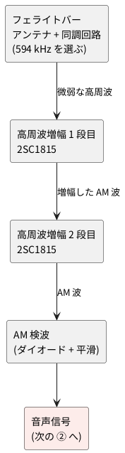

# 2-2 中波ラジオの受信と AM 検波 — 2SC1815 の高周波増幅 2 段

全体の中の位置は [01-block.md](01-block.md) の ① 受信。NHK ラジオ第 1 放送 (東京は 594 kHz) を
トランジスタ回路で受け、AM 検波して音声信号にするまでを扱う。

## ブロック図




## 回路図

```circuit
title: 図1 中波 AM 受信機 (同調、高周波増幅 2 段、AM 検波)
parts:
  VC1: capacitor-var e3 g3 l=$\mathrm{VC}_1$
  La: inductor e5 g5 l=$L_{1a}$
  Lb: inductor g5 i5 l=$L_{1b}$
  GL: ground i5
  C1: capacitor e7 e9 0.01u
  R1: resistor a11 c11 82k
  VCC1: vcc a11 5V
  R2: resistor g11 i11 22k
  GR2: ground i11
  Q1: npn f14
  Rc1: resistor a14 c14 2.2k l=$R_{C1}$ i=$I_C$
  VCC2: vcc a14 5V
  RE1: resistor h14 j14 470 l=$R_{E1}$ i=$I_E$
  CE1: ecap h16 j16 100u l=$C_{E1}$
  GE1: ground j15
  C2: capacitor d16 d18 0.01u
  R3: resistor a21 c21 82k
  VCC3: vcc a21 5V
  R4: resistor g21 i21 22k
  GR4: ground i21
  Q2: npn f24
  Rc2: resistor a24 c24 2.2k l=$R_{C2}$ i=$I_C$
  VCC4: vcc a24 5V
  RE2: resistor h24 j24 470 l=$R_{E2}$ i=$I_E$
  CE2: ecap h26 j26 100u l=$C_{E2}$
  GE2: ground j25
  D1: diode d26 d28 1N60
  C4: capacitor d30 f30 0.01u
  GC4: ground f30
  R5: resistor d32 f32 100k i=$I$
  GR5: ground f32
  OUT: port d34
wires:
  - e3 -- e5
  - g3 -- i3 -- i5
  - g5 -| e7
  - e9 -- e11
  - c11 -- g11
  - f11 -- Q1.B
  - c14 -- d14
  - d14 -- Q1.C
  - Q1.E -- h14
  - j14 -- j15 -- j16
  - h14 -- h16
  - d14 -- d16
  - d18 -- d21
  - c21 -- g21
  - f21 -- Q2.B
  - c24 -- d24
  - d24 -- Q2.C
  - Q2.E -- h24
  - j24 -- j25 -- j26
  - h24 -- h26
  - d24 -- d26
  - d28 -- d34
notes:
  - text c5 small center: フェライトバー
  - text e11a8 small blue left: 約 1.0 V
  - arrow e11a7 e11a1 blue
  - text e14a8 small blue left: 約 3.4 V
  - arrow e14a7 e14a1 blue
  - text g13a2 small blue right: 約 0.34 V
  - arrow g13a3 g14 blue
  - text h14d6 small blue left: 0.73 mA
  - text a14f6 small blue left: 0.73 mA
  - text e21a8 small blue left: 約 1.0 V
  - arrow e21a7 e21a1 blue
  - text e24a8 small blue left: 約 3.4 V
  - arrow e24a7 e24a1 blue
  - text g23a2 small blue right: 約 0.34 V
  - arrow g23a3 g24 blue
  - text h24d6 small blue left: 0.73 mA
  - text a24f6 small blue left: 0.73 mA
  - text c30 small blue center: 約 3 V (直流)
  - arrow c30f0 d30 blue
  - text d32d6 small blue left: 30 µA
  - text j26f0 small blue left: 青い数字は計算値 (hFE 200、無信号のとき)。電圧は GND から
style:
  grid: off
  pitch: 1.2
```


左から、同調回路、高周波増幅 1 段目 (Q1)、2 段目 (Q2)、AM 検波 (D1) の順に並べた。
電源は 5 V の単電源で、電源の記号は 4 か所に分けて置いた。

## 動作

1. **同調**: フェライトバーに巻いたコイル L1 (La + Lb) と可変コンデンサ VC1 が並列共振する。
   VC1 を回して NHK 第 1 (東京は 594 kHz) の周波数に合わせる。信号はコイルのタップ (La と Lb の境) から取り出す。
   タップにすると、次段の入力抵抗が共振回路に与える負荷が軽くなり、同調がなまりにくい。
2. **高周波増幅**: Q1、Q2 は共通エミッタの増幅で、ベースは R1 と R2 (R3 と R4) の分圧でバイアスする。
   RE と CE (100 µF) でエミッタを高周波的に接地して利得を稼ぐ。段間は C2 (0.01 µF) で結ぶ。
3. **AM 検波**: Q2 のコレクタの信号を D1 (1N60) で半波整流し、C4 と R5 で平滑して包絡線 (音声) を取り出す。
   出力には直流の約 3 V が乗るので、次の ([03-detect.md](03-detect.md)) では AC 結合で受ける。

## 部品表

| 部品 | 値 | 備考 |
| --- | --- | --- |
| Q1, Q2 | 2SC1815 (GR) | NPN。足は平らな面を手前にして左から E・C・B |
| D1 | 1N60 | ゲルマニウムの検波ダイオード。順方向の電圧降下が小さく、小さな信号に向く |
| R1, R3 | 82 kΩ | ベースの上側の抵抗 |
| R2, R4 | 22 kΩ | ベースの下側の抵抗 |
| RC1, RC2 | 2.2 kΩ | コレクタの負荷 |
| RE1, RE2 | 470 Ω | エミッタの抵抗 |
| R5 | 100 kΩ | 検波の負荷 |
| C1, C2 | 0.01 µF | 結合 (セラミック) |
| C4 | 0.01 µF | 検波の平滑 (セラミック) |
| CE1, CE2 | 100 µF 16 V | 電解。+ をエミッタ側にする |
| VC1 | 365 pF のバリコン (AM 用) | 同調 |
| L1 (La + Lb) | 手巻きのコイル | フェライトバーに巻く。全体で約 260 µH を目安に巻数で合わせる。タップは接地側から巻数の 6 分の 1 ほど |

参考にした回路図 (R1 22 kΩ、RC 4.7 kΩ、RE 1 kΩ) は、5 V で動かすとトランジスタが飽和するので、
バイアスを計算し直して上の値にした。

## 動作点の見積り (計算値)

hFE を 200、ベースとエミッタの間を 0.65 V と仮定した計算値で、実機では測っていない。

| 項目 | 値 |
| --- | --- |
| ベースの分圧 (無負荷) | 5 V × 22 / (82 + 22) = 約 1.06 V |
| コレクタ電流 | 約 0.73 mA |
| エミッタの電圧 | 約 0.34 V |
| コレクタの電圧 | 5 V − 0.73 mA × 2.2 kΩ = 約 3.4 V |
| コレクタとエミッタの間 | 約 3.1 V (飽和していない) |
| 検波の出力の直流 | 約 3 V (コレクタの電圧から 1N60 の降下を引いた値) |

同調の計算値 (L1 を 260 µH としたとき): 540 kHz で VC1 約 330 pF、594 kHz で約 270 pF、
1600 kHz で約 38 pF。実際は配線とトランジスタの容量が加わるので、巻数で合わせる。

## 調整と注意

- 2 段で利得が大きいので、発振して笛のような音がするときは、電源に 100 µF と 0.1 µF を
  並べて足し、2 段を離して組む。
- 近くの強い局に引かれるときは、タップの位置を接地側へ寄せる。
- 巻数とバリコンの値は、手元のフェライトバーで合わせる (見積りは目安)。

(実体配線図はこれから書く)
