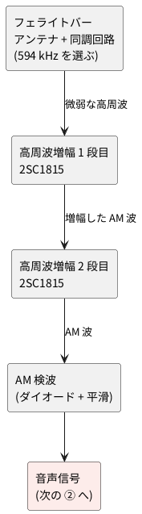

# 2-2 中波ラジオの受信と AM 検波 — 2SC1815 の高周波増幅 2 段

全体の中の位置は [01-block.md](01-block.md) の ① 受信。NHK ラジオ第 1 放送 (東京は 594 kHz) を
トランジスタ回路で受け、AM 検波して音声信号にするまでを扱う。

## ブロック図




## 回路図

```circuit
title: 図1 中波 AM 受信機 (同調、高周波増幅 2 段、AM 検波)
parts:
  VC1: capacitor-var 3,5 3,7 l=$\mathrm{VC}_1$
  La: inductor 5,5 5,7 l=$L_{1a}$
  Lb: inductor 5,7 5,9 l=$L_{1b}$
  GL: ground 5,9
  C1: capacitor 7,5 9,5 0.01u
  R1: resistor 11,1 11,3 82k
  VCC1: vcc 11,1 5V
  R2: resistor 11,7 11,9 22k
  GR2: ground 11,9
  Q1: npn 14,6
  Rc1: resistor 14,1 14,3 2.2k l=$R_{C1}$ i=$I_C$
  VCC2: vcc 14,1 5V
  RE1: resistor 14,8 14,10 470 l=$R_{E1}$ i=$I_E$
  CE1: ecap 16,8 16,10 100u l=$C_{E1}$
  GE1: ground 15,10
  C2: capacitor 16,4 18,4 0.01u
  R3: resistor 21,1 21,3 82k
  VCC3: vcc 21,1 5V
  R4: resistor 21,7 21,9 22k
  GR4: ground 21,9
  Q2: npn 24,6
  Rc2: resistor 24,1 24,3 2.2k l=$R_{C2}$ i=$I_C$
  VCC4: vcc 24,1 5V
  RE2: resistor 24,8 24,10 470 l=$R_{E2}$ i=$I_E$
  CE2: ecap 26,8 26,10 100u l=$C_{E2}$
  GE2: ground 25,10
  D1: diode 26,4 28,4 1N60
  C4: capacitor 30,4 30,6 0.01u
  GC4: ground 30,6
  R5: resistor 32,4 32,6 100k i=$I$
  GR5: ground 32,6
  OUT: port 34,4
wires:
  - 3,5 -- 5,5
  - 3,7 -- 3,9 -- 5,9
  - 5,7 -| 7,5
  - 9,5 -- 11,5
  - 11,3 -- 11,7
  - 11,6 -- Q1.B
  - 14,3 -- 14,4
  - 14,4 -- Q1.C
  - Q1.E -- 14,8
  - 14,10 -- 15,10 -- 16,10
  - 14,8 -- 16,8
  - 14,4 -- 16,4
  - 18,4 -- 21,4
  - 21,3 -- 21,7
  - 21,6 -- Q2.B
  - 24,3 -- 24,4
  - 24,4 -- Q2.C
  - Q2.E -- 24,8
  - 24,10 -- 25,10 -- 26,10
  - 24,8 -- 26,8
  - 24,4 -- 26,4
  - 28,4 -- 34,4
notes:
  - text 5,3 small center: フェライトバー
  - text 11.8,5 small blue left: 約 1.0 V
  - arrow 11.7,5 11.1,5 blue
  - text 14.8,5 small blue left: 約 3.4 V
  - arrow 14.7,5 14.1,5 blue
  - text 13.2,7 small blue right: 約 0.34 V
  - arrow 13.3,7 14,7 blue
  - text 14.6,8.3 small blue left: 0.73 mA
  - text 14.6,1.5 small blue left: 0.73 mA
  - text 21.8,5 small blue left: 約 1.0 V
  - arrow 21.7,5 21.1,5 blue
  - text 24.8,5 small blue left: 約 3.4 V
  - arrow 24.7,5 24.1,5 blue
  - text 23.2,7 small blue right: 約 0.34 V
  - arrow 23.3,7 24,7 blue
  - text 24.6,8.3 small blue left: 0.73 mA
  - text 24.6,1.5 small blue left: 0.73 mA
  - text 30,3 small blue center: 約 3 V (直流)
  - arrow 30,3.5 30,4 blue
  - text 32.6,4.3 small blue left: 30 µA
  - text 26,10.5 small blue left: 青い数字は計算値 (hFE 200、無信号のとき)。電圧は GND から
style:
  grid: off
  pitch: 1.2
```


左から、同調回路、高周波増幅 1 段目 (Q1)、2 段目 (Q2)、AM 検波 (D1) の順に並べた。
電源は 5 V の単電源で、電源の記号は 4 か所に分けて置いた。

## 実体配線図

```bread
title: 図2 中波 AM 受信機のブレッドボード
board: half
parts:
  PS:
    type: device
    at: top
    label: 電源 5V
    pins: [+5V, GND]
  BAR:
    type: device
    at: top
    label: フェライトバー
    pins: [TOP, TAP, GND]
  VC1:
    type: device
    at: top
    label: バリコン 365pF
    pins: [B, A]
  OUT:
    type: device
    at: top
    label: 検波出力 OUT
    pins: [OUT, GND]
  C1: capacitor/ceramic d5 d7 0.01u
  R2: resistor a6 -t6 22k
  R1: resistor a7 +t7 82k
  Q1: transistor e7(B) e10(C) e13(E) 2SC1815
  Rc1: resistor a10 +t10 2.2k
  RE1: resistor a13 -t13 470
  CE1: capacitor/electrolytic a14 -t14 100u
  C2: capacitor/ceramic d10 d19 0.01u
  R4: resistor a17 -t17 22k
  R3: resistor a19 +t19 82k
  Q2: transistor e19(B) e21(C) e23(E) 2SC1815
  Rc2: resistor a21 +t21 2.2k
  RE2: resistor a23 -t23 470
  CE2: capacitor/electrolytic a24 -t24 100u
  D1: diode d21(A) d27(K) 1N60
  C4: capacitor/ceramic a27 -t27 0.01u
  R5: resistor a29 -t29 100k
wires:
  - PS.+5V -- +t1 red
  - PS.GND -- -t1 black
  - VC1.B -- -t2 black
  - VC1.A -- a3 yellow
  - c3 -- c4 yellow
  - BAR.TOP -- a4 yellow
  - BAR.TAP -- a5 purple
  - BAR.GND -- -t8 black
  - c6 -- c7 blue
  - b13 -- b14 green
  - c17 -- c19 blue
  - c23 -- c24 green
  - c27 -- c28 white
  - d28 -- d29 white
  - OUT.OUT -- b28 white
  - OUT.GND -- -t30 black
notes:
  - arrow f7 e7 blue
  - text f7 tiny blue bold right: 約 1.0 V
  - arrow f10 e10 blue
  - text f10 tiny blue bold right: 約 3.4 V
  - arrow f13 e13 blue
  - text f13 tiny blue bold right: 約 0.34 V
  - arrow f19 e19 blue
  - text f19 tiny blue bold right: 約 1.0 V
  - arrow f21 e21 blue
  - text f21 tiny blue bold right: 約 3.4 V
  - arrow f23 e23 blue
  - text f23 tiny blue bold left: 約 0.34 V
  - arrow f27 e27 blue
  - text f27 tiny blue bold right: 約 3 V
  - circle c10 green
  - text c11 small green left: CH2
  - circle e27 orange
  - text e28 small orange left: CH1
  - circle -t15 ink
  - text tiny blue: "青い数字は計算値 (hFE 200、無信号のとき)。電圧は GND から"
  - text tiny ink: "オシロ (AD3): 橙の丸は CH1 (検波出力)、緑の丸は CH2 (Q1 のコレクタ)、黒い丸は GND"
```


```perf
title: 図2b 中波 AM 受信機のユニバーサル基板
board:
  size: 7x5cm
  silk: board
  h: 1.6mm
  material: FR-4
  slots: on
parts:
  BAR:
    type: device
    at: a0
    label: フェライトバー
    pins: TAP GND TOP
  VC1:
    type: device
    at: f0
    label: バリコン 365pF
    pins: A B
  PS:
    type: device
    at: w0
    label: 電源 5V
    pins: GND +5V
  OUT:
    type: device
    at: s0
    label: 検波出力 OUT
    pins: GND OUT
  C1: capacitor/ceramic a11 d11 0.01u
  R1: resistor e17 e12 82k
  R2: resistor e11 e2 22k
  Q1: transistor g10 g11 g12 2SC1815
  Rc1: resistor g17 g13 2.2k
  RE1: resistor g9 g2 470
  CE1: capacitor/electrolytic i9 i2 100u
  C2: capacitor/ceramic i12 l12 0.01u
  R3: resistor m17 m13 82k
  R4: resistor m12 m2 22k
  Q2: transistor o11 o12 o13 2SC1815
  Rc2: resistor o17 o14 2.2k
  RE2: resistor o10 o2 470
  CE2: capacitor/electrolytic q10 q2 100u
  D1: diode s13 s9 1N60
  C4: capacitor/ceramic u9 u2 0.01u
  R5: resistor w9 w2 100k
wires:
  - BAR.TAP -- a11
  - BAR.GND -- b2
  - VC1.B -- g2
  - PS.+5V -- x17 red
  - x17 -- o17 red
  - PS.GND -- w2 black
  - OUT.GND -- s2 black
  - OUT.OUT -- t9
  - BAR.TOP -- VC1.A
  - d11 -- e11
  - e12 -- e11
  - e11 -- g11
  - g13 -- g12
  - g10 -- g9
  - g9 -- i9
  - g12 -- i12
  - e17 -- g17 red
  - g17 -- m17 red
  - m17 -- o17 red
  - b2 -- e2 black
  - e2 -- g2 black
  - g2 -- i2 black
  - i2 -- k2 black
  - k2 -- m2 black
  - m2 -- o2 black
  - o2 -- q2 black
  - q2 -- s2 black
  - s2 -- u2 black
  - u2 -- w2 black
  - l12 -- m12
  - m13 -- m12
  - m12 -- o12
  - o14 -- o13
  - o11 -- o10
  - o10 -- q10
  - o13 -- s13
  - s9 -- t9
  - t9 -- u9
  - u9 -- w9
notes:
  - mark t9 orange
  - text v8 orange: CH1
  - mark g12 green
  - text i13 green: CH2
  - mark k2 black
```


図2 はブレッドボード、図2b は同じ回路をユニバーサル基板に組む図。次の説明は図2 のもので、図2b は「ユニバーサル基板に組むとき」に書く。

半分の大きさ (30 列) のブレッドボード 1 枚に収まる。電源の 5 V は左上から、上の赤いレール (+) と青いレール (−) の
左端へ入れる。部品の電源側と GND 側のピンは、それぞれのレールまで縦に 1 本で届く。

| 場所 | 挿すもの |
| --- | --- |
| 1 列 (上のレール) | 電源の + (赤) と GND (黒) |
| 2 列 (上のレール) | VC1 の B 端子 (黒)。− レール |
| 3・4 列 | 同調回路の上端。バリコンの A (黄) を `a3` に、フェライトバーの TOP (黄) を `a4` に挿し、3 列と 4 列を黄の線 (`c3`〜`c4`) でつなぐ |
| 5 列 | フェライトバーのタップ (紫) を `a5` に、C1 の左リードを `d5` に |
| 6・7 列 | R2 (`a6` から − レール)、R1 (`a7` から + レール)、C1 の右リード (`d7`)、Q1 のベース (`e7`)。6 列と 7 列は青い線 (`c6`〜`c7`) でつなぐ |
| 8 列 (上のレール) | フェライトバーの GND (黒)。− レール |
| 10 列 | Q1 のコレクタ (`e10`)、Rc1 (`a10` から + レール)、C2 の左リード (`d10`) |
| 13・14 列 | Q1 のエミッタ (`e13`)、RE1 (`a13` から − レール)、CE1 (`a14` から − レール)。緑の線 (`b13`〜`b14`) でつなぐ |
| 17〜19 列 | R4 (`a17` から − レール)、R3 (`a19` から + レール)、C2 の右リード (`d19`)、Q2 のベース (`e19`)。17 列と 19 列は青い線 (`c17`〜`c19`) |
| 21 列 | Q2 のコレクタ (`e21`)、Rc2 (`a21` から + レール)、D1 のアノード (`d21`) |
| 23・24 列 | Q2 のエミッタ (`e23`)、RE2 (`a23` から − レール)、CE2 (`a24` から − レール)。緑の線 (`c23`〜`c24`) |
| 27〜30 列 | D1 のカソード (`d27`)、C4 (`a27` から − レール)。27 列から 28 列へ白い線 (`c27`〜`c28`)、28 列から 29 列へ白い線 (`d28`〜`d29`) で渡し、R5 (`a29` から − レール) をつなぐ。**検波出力は 28 列の `b28` から、ブレッドボードの外の OUT へ白い線で出す。OUT の GND は黒い線で `-t30` へ** |

- 線の色は、赤が + の電源、黒が GND だけ。黄は同調回路の上端 (バリコンの A とフェライトバーの TOP)、紫はフェライトバーのタップ、青はベース、緑はエミッタ、白は検波出力
- 青い矢印と数字は、各節点の電圧の計算値 (回路図の値と同じ)。トランジスタのピン (B・C・E) と、検波の出力 (27 列) を指す。組んだら、テスターで GND との間を測って見比べる
- 電解コンデンサ (CE1、CE2) は + をエミッタ側 (`a` 行側) に、− をレール側にする
- 2SC1815 のピンは、平らな面を手前にして左から E・C・B。図の B・C・E の並びは、平らな面を向こう側にしたときの順
- フェライトバーのタップは、接地側から巻数の 6 分の 1 ほどの所から出す。コイルの両端 (TOP と GND) は、バリコンの A と B に並べてつなぐ。バリコンの A とフェライトバーの TOP は、同じ列の別の穴に挿して線を重ねない
- ユニバーサル基板に載せる回路の周波数は 540 kHz〜1.6 MHz で、ユニバーサル基板の目安の 3 MHz 以下に収まる。電源から出る電流は、計算で 2 つの Q の電流とバイアスの電流を合わせて約 1.6 mA (見積り)
- 高周波の部分 (4〜29 列) の線は、できるだけ短く。長いと出力が入力へ回り込んで発振しやすい

### ユニバーサル基板に組むとき

図2b は図2 と同じ回路で、ネットリストも同じ (check で突き合わせて、全部の節点が一致した)。ブレッドボードは接触が揺れやすく、
高周波の 2 段は回り込みで発振しやすいので、組み上げて残したいときは半田付けで固定する。

- ユニバーサル基板は 5×7 cm (24 列 × 18 行を横に置く)。部品と線が収まる一番小さい在庫のユニバーサル基板で、外周の 1 穴と電源の筋の行が残る。
  厚みと基材は書いていないので 1.6 mm の FR-4 (両面スルーホール)
- 図は部品面から見たもの。部品は表に挿し、線は裏で半田付けする。部品のピンを線のつもりで曲げて届かせ、ピンで届かない所は被覆線で渡す
- 電源の + は上の行 (`17` 行、赤) に E 列から X 列まで 1 本の筋で通し、GND は下の行 (`2` 行、黒) に B 列から W 列まで通す。各部品は、電源側のピンを上、GND 側のピンを下にして縦に立てる
- ユニバーサル基板の外の電源は右下。+5 V は右端の X 列を真上へ上げて筋につなぎ、GND は W 列で下の筋につなぐ
- フェライトバーの TAP は A 列を上へ上げて C1 の左リード (`a11`) に、GND は下の筋の左端 (`b2`) につなぐ。バリコンの B は `g2`。バリコンの A とフェライトバーの TOP はユニバーサル基板に載せず、ユニバーサル基板の外で直接つなぐ (図2 と同じ)
- 検波出力は T 列を上へ上げて `t9` につなぐ。この線は下の GND の筋 (2 行) を渡るので、被覆線にする。OUT の GND は `s2` につなぐ
- 線の交差は、このほかに無い。ベースの 4 つのピン (C1・R1・R2・Q) は `e11` に集め、短い線で隣の穴へつなぐ
- 2SC1815 はピンを曲げて、上から C・B・E の順に 3 つの穴 (12・11・10 行) へ挿す。向きは図2 の 2SC1815 と同じ (平らな面を手前にして左から E・C・B)
- 電解コンデンサ (CE1、CE2) の + は上側 (エミッタ側)、− は下の GND の筋の側
- 橙の丸 (`t9`) はオシロの CH1、緑の丸 (`g12`) は CH2、黒い丸 (`k2`) は GND のクリップ

| 場所 | 挿すもの |
| --- | --- |
| 17 行 | + の筋。R1 (`e17`)、Rc1 (`g17`)、R3 (`m17`)、Rc2 (`o17`) の上のピン。電源は `x17` |
| 2 行 | GND の筋。R2 (`e2`)、RE1 (`g2`)、CE1 (`i2`)、R4 (`m2`)、RE2 (`o2`)、CE2 (`q2`)、C4 (`u2`)、R5 (`w2`) の下のピン |
| A〜D 列 | C1 (`a11`〜`d11`)。左の `a11` に TAP の線が来る |
| E 列 | R1 (`e17`〜`e12`)、R2 (`e11`〜`e2`)。`e12` と `e11` を短い線でつなぐ |
| G 列 | Rc1 (`g17`〜`g13`)、Q1 (`g12` が C、`g11` が B、`g10` が E)、RE1 (`g9`〜`g2`) |
| I〜L 列 | CE1 (`i9`〜`i2`)、C2 (`i12`〜`l12`) |
| M 列 | R3 (`m17`〜`m13`)、R4 (`m12`〜`m2`) |
| O 列 | Rc2 (`o17`〜`o14`)、Q2 (`o13` が C、`o12` が B、`o11` が E)、RE2 (`o10`〜`o2`) |
| Q 列 | CE2 (`q10`〜`q2`) |
| S〜W 列 | D1 (`s13` が A、`s9` が K)、C4 (`u9`〜`u2`)、R5 (`w9`〜`w2`)。`s9`〜`w9` を線でつなぎ、検波出力を `t9` から出す |

この図は、組んで確かめていない。電圧 5 V、電流は約 1.6 mA、周波数は 540 kHz〜1.6 MHz なので、ユニバーサル基板の範囲 (12 V 以下、500 mA 以下、10 MHz 以下) に収まる。

### オシロスコープで調べる場所

**計器は Analog Discovery 3 (AD3) に決める。** 見たいのは 440 Hz の音声と 594 kHz の搬送波で、どちらも AD3 の範囲 (30 MHz まで) に入る。入力は 1 MΩ で、Q1 のコレクタ (2.2 kΩ) に当てても負荷がほとんど増えず、FFT の分解能 (最小 23 Hz) で 440 Hz 離れた側波も分けられる。tinySA Ultra は使わない。入力が 50 Ω で、高インピーダンスの節点に直接つなげない。通常モードが 100 kHz からなので、440 Hz の音声が見えない。分解能 (RBW) の最小も 200 Hz で、側波を分けにくい。

Analog Discovery 3 のオシロスコープを、BNC アダプタを付けて使う。プローブの先を次の場所に当て、GND のクリップを黒い丸の − レール (15 列) につなぐ。

| チャンネル | 場所 (図の丸) | 見えるもの |
| --- | --- | --- |
| CH1 (橙) | 27 列の `e27` (検波出力) | 約 3 V の直流に、放送の音声 (包絡線) が乗る |
| CH2 (緑) | 10 列の `c10` (Q1 のコレクタ) | 約 3.4 V の直流に、594 kHz の AM 波が乗る。同調を合わせると振幅が大きくなる |
| GND クリップ | 15 列の − レール | 基準 (0 V) |

- 値は計算値の動作点 (図の青い数字) で、**波の大きさは受信した電波の強さで変わる** (測っていない)
- CH2 のプローブは、高周波の部分に容量 (数 pF〜十数 pF) を足すので、同調が少しずれる。測るときだけ当て、離したら合わせ直す
- 音声の周波数 (数 100 Hz〜数 kHz) と搬送波 (594 kHz) は大きく違うので、時間軸を変えて見る。CH1 は 1 ms/div、CH2 は 2 µs/div

見えるはずの画面 (推測) を、scope フェンスで描いた。**波の大きさは仮の値で、実測ではない**。波を見やすくするため、BNC アダプタのジャンパで CH1・CH2 を AC 結合にする (約 1.6 Hz より低い成分を切る)。図もその画面で、直流分は除いてある。AD3 本体のピンの入力は DC 結合だけで、直流を打ち消す Offset も 0.5 V/div 以下の細かい目盛では ±2.5 V までしか動かせないので、約 3 V の直流は打ち消せない。直流分 (CH1 は約 3 V、CH2 は約 3.4 V) は、テスターか、ジャンパを DC に戻して Avg で読む。

```scope
title: 図3 CH1 検波出力 (AC 結合。時報の 440 Hz が出ているとき、推測)
time: 1ms/div
trigger: ch1 rising 0V
ch1: sine 440Hz 50mV
measure: [vpp, freq]
```


- 時報の 440 Hz が出ているあいだ、検波出力に 440 Hz の正弦波 (周期 約 2.3 ms) が乗る。振幅は仮に 50 mV (100 mVpp)
- 放送の音声は一定の高さではないので、普段の番組では、この形にはならない

```scope
title: 図4 CH2 Q1 のコレクタ (AC 結合。594 kHz の搬送波、推測)
time: 2us/div
trigger: ch2 rising 0V
ch2: sine 594kHz 100mV
measure: [vpp, freq]
```


- 搬送波の周期は 約 1.68 µs なので、画面 (20 µs) に約 12 周期が入る。振幅は仮に 100 mV (200 mVpp)
- 振幅は、音声の強さに合わせて、ゆっくり (数 ms の周期で) 大きくなったり小さくなったりする (AM 変調)。2 µs/div の画面では、この変化は見えない。時間軸を 1 ms/div にすると、搬送波が密に並んだ帯になり、帯の太さが音声に合わせて変わる

### Analog Discovery 3 の FFT (スペクトル) で見る

同じ 2 つの場所を、WaveForms の Spectrum (FFT) でも見られる。波形では見えない**搬送波と側波の高さ**が分かる。見えるはずの画面 (推測) を、spectrum フェンスで描いた。**振幅は仮の値 (CH1 は 50 mV、CH2 は 100 mV、変調度は 0.3) で、実測ではない。** 実測したら WaveForms の CSV を題のファイルの隣に置き、`data:` で重ねる。

```spectrum
title: 図5 CH1 検波出力のスペクトル (440 Hz の音声、推測)
device: ad3
sweep: 0-1kHz
samples: 8192
window: hann
unit: dBV
ref: -10dBV
signal: sine 440Hz 50mV
markers: [440Hz]
```


- 440 Hz に山が 1 本立つ。50 mV (peak) の正弦波は −29.03 dBV (読み値)。1 V (peak) の正弦波が −3.01 dBV にあたる
- 検波出力の直流分 (約 3 V) は 0 Hz に大きな線として出る。見やすくするため、CH1 を AC 結合 (BNC アダプタのジャンパ) にして測る

```spectrum
title: 図6 CH2 Q1 のコレクタのスペクトル (搬送波と AM の側波、推測)
device: ad3
center: 594kHz
span: 4kHz
samples: 65536
window: hann
unit: dBV
ref: -10dBV
signal:
  - sine 594kHz 100mV
  - sine 593.56kHz 15mV
  - sine 594.44kHz 15mV
markers: [594kHz, 593.56kHz, 594.44kHz]
```


| マーカー | 周波数 | レベル (読み値) | 意味 |
| --- | --- | --- | --- |
| 1 | 約 594 kHz | −23.06 dBV | 搬送波 (100 mV) |
| 2 | 約 593.56 kHz | −39.70 dBV | 下側の側波 (594 kHz − 440 Hz) |
| 3 | 約 594.44 kHz | −39.49 dBV | 上側の側波 (594 kHz + 440 Hz) |

- 側波は、搬送波から**音声の周波数 (440 Hz) だけ離れて**両側に出る。高さは、変調度 m = 0.3 のとき搬送波の m ÷ 2 = 0.15 倍で、**搬送波より約 16.5 dB 低い**
- 音声が強いほど (変調度が大きいほど) 側波が高くなる。同調が合っていると、側波も同じように増幅される
- FFT の分解能は、掃引の幅と標本数で決まる (図 5 は 0.3125 Hz、図 6 は 23.28 Hz)。440 Hz 離れた側波を分けるには、分解能が側波の間隔より十分細かいことが要る

## 動作

1. **同調**: フェライトバーに巻いたコイル L1 (La + Lb) と可変コンデンサ VC1 が並列共振する。
   VC1 を回して NHK 第 1 (東京は 594 kHz) の周波数に合わせる。信号はコイルのタップ (La と Lb の境) から取り出す。
   タップにすると、次段の入力抵抗が共振回路に与える負荷が軽くなり、同調がなまりにくい。
2. **高周波増幅**: Q1、Q2 は共通エミッタの増幅で、ベースは R1 と R2 (R3 と R4) の分圧でバイアスする。
   RE と CE (100 µF) でエミッタを高周波的に接地して利得を稼ぐ。段間は C2 (0.01 µF) で結ぶ。
3. **AM 検波**: Q2 のコレクタの信号を D1 (1N60) で半波整流し、C4 と R5 で平滑して包絡線 (音声) を取り出す。
   出力には直流の約 3 V が乗るので、次の ([03-detect.md](03-detect.md)) では AC 結合で受ける。

## 部品表

| 部品 | 値 | 備考 |
| --- | --- | --- |
| Q1, Q2 | 2SC1815 (GR) | NPN。ピンは平らな面を手前にして左から E・C・B |
| D1 | 1N60 | ゲルマニウムの検波ダイオード。順方向の電圧降下が小さく、小さな信号に向く |
| R1, R3 | 82 kΩ | ベースの上側の抵抗 |
| R2, R4 | 22 kΩ | ベースの下側の抵抗 |
| RC1, RC2 | 2.2 kΩ | コレクタの負荷 |
| RE1, RE2 | 470 Ω | エミッタの抵抗 |
| R5 | 100 kΩ | 検波の負荷 |
| C1, C2 | 0.01 µF | 結合 (セラミック) |
| C4 | 0.01 µF | 検波の平滑 (セラミック) |
| CE1, CE2 | 100 µF 16 V | 電解。+ をエミッタ側にする |
| VC1 | 365 pF のバリコン (AM 用) | 同調 |
| L1 (La + Lb) | 手巻きのコイル | フェライトバーに巻く。全体で約 260 µH を目安に巻数で合わせる。タップは接地側から巻数の 6 分の 1 ほど |

参考にした回路図 (R1 22 kΩ、RC 4.7 kΩ、RE 1 kΩ) は、5 V で動かすとトランジスタが飽和するので、
バイアスを計算し直して上の値にした。

## 動作点の見積り (計算値)

hFE を 200、ベースとエミッタの間を 0.65 V と仮定した計算値で、実機では測っていない。

| 項目 | 値 |
| --- | --- |
| ベースの分圧 (無負荷) | 5 V × 22 / (82 + 22) = 約 1.06 V |
| コレクタ電流 | 約 0.73 mA |
| エミッタの電圧 | 約 0.34 V |
| コレクタの電圧 | 5 V − 0.73 mA × 2.2 kΩ = 約 3.4 V |
| コレクタとエミッタの間 | 約 3.1 V (飽和していない) |
| 検波の出力の直流 | 約 3 V (コレクタの電圧から 1N60 の降下を引いた値) |

同調の計算値 (L1 を 260 µH としたとき): 540 kHz で VC1 約 330 pF、594 kHz で約 270 pF、
1600 kHz で約 38 pF。実際は配線とトランジスタの容量が加わるので、巻数で合わせる。

## 調整と注意

- 2 段で利得が大きいので、発振して笛のような音がするときは、電源に 100 µF と 0.1 µF を
  並べて足し、2 段を離して組む。
- 近くの強い局に引かれるときは、タップの位置を接地側へ寄せる。
- 巻数とバリコンの値は、手元のフェライトバーで合わせる (見積りは目安)。
