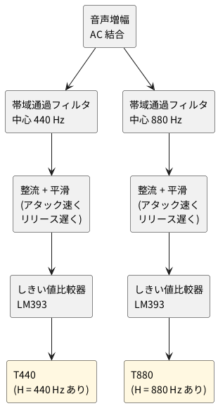

# 2-3 時報音の検出 — 440 Hz と 880 Hz の帯域通過フィルタとしきい値比較

全体の中の位置は [01-block.md](01-block.md) の ② 時報音の検出。音声信号から 440 Hz と 880 Hz の
音を別々に取り出し、「その音があるあいだ H」の T440 と T880 にする。時報の形は 01-block.md を見る。

## ブロック図

440 Hz の予報音は約 0.1 秒と短いので、平滑はアタックを速くする。しきい値は可変抵抗で調整する。

(回路図と部品表はこれから書く)
