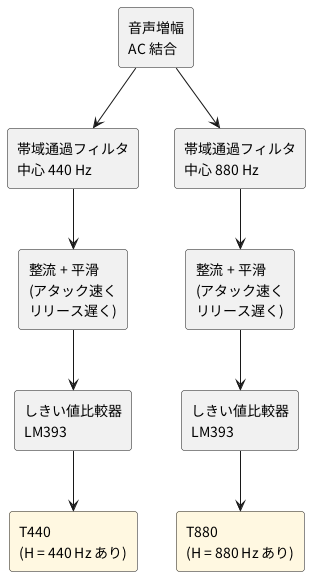

# 2-3 時報音の検出 — 440 Hz と 880 Hz の帯域通過フィルタとしきい値比較

全体の中の位置は [01-block.md](01-block.md) の ② 時報音の検出。音声信号から 440 Hz と 880 Hz の
音を別々に取り出し、「その音があるあいだ H」の T440 と T880 にする。時報の形は 01-block.md を見る。

## ブロック図




440 Hz の予報音は約 0.1 秒と短いので、平滑はアタックを速くする。しきい値は可変抵抗で調整する。

## 回路図

信号は 3 つの図に分けて描く。図の間は、同じ名前の端子 (AFO と AFI、VB と VBI、TH と THI) でつなぐ。

### 入力増幅、基準電圧、しきい値

```circuit
title: 図1 入力増幅、基準電圧、しきい値
parts:
  IN: port b1
  Cin: capacitor b2 b4 1u
  Rin: resistor b5 b7 10k
  Rf: resistor a9 a13 100k
  U1: opamp d11 +down
  AFO: port d17
  VCCa: vcc f2 5V
  Ra: resistor f2 h2 10k
  Rb: resistor h2 j2 10k
  GRb: ground j2
  Cb: ecap h4 j4 10u
  GCb: ground j4
  U2: opamp h7 +up
  VB: port j13
  VCCt: vcc f20 5V
  R6: resistor f20 h20 6.2k
  VR1: potentiometer h20 j20
  R7: resistor j20 l20 5.6k
  GR7: ground l20
  TH: port i24
wires:
  - b1 -- b2
  - b4 -- b5
  - b7 -- b8
  - b8 -- a8 -- a9
  - b8 |- U1.-
  - a13 -- a14
  - a14 -- d14
  - U1.out -- d14 -- d17
  - h2 -- h4
  - h4 -| U2.+
  - U2.out -- h9
  - h9 |- U1.+
  - h9 -- j9
  - j9 -- j6
  - j6 |- U2.-
  - j9 -- j13
  - VR1.w -- i24
notes:
  - text c9e5 tiny right: PIN 2
  - text e9a1 tiny left: PIN 3
  - text d12e6 tiny left: PIN 1
  - text g5f9 tiny right: PIN 5
  - text h5f9 tiny right: PIN 6
  - text h9a2 tiny left: PIN 7
  - text l3 small left: U1 と U2 は LM358 の 1 個 (PIN 8 は +5V、PIN 4 は GND)
  - text i19a2 small right: 2 kΩ
style:
  pitch: 1.2
```


- **入力増幅 (U1)**: [02-radio.md](02-radio.md) の検波出力 (直流が約 3 V 乗っている) を C<sub>in</sub> で交流にして、反転増幅 (R<sub>f</sub> ÷ R<sub>in</sub> = 10 倍) する。出力 AFO が音声信号
- **基準電圧 (U2)**: 5 V を R<sub>a</sub> と R<sub>b</sub> で割った 2.5 V をボルテージフォロワで受け、VB にする。単電源の OP アンプが交流を扱う中心の電圧で、U1 の + 入力と、2 つのフィルタが使う
- **しきい値 (R6、VR1、R7)**: 5 V を分圧し、VR1 で TH を約 2.0 V〜2.8 V の範囲で変える。2 つの比較器が共有する

### 440 Hz の検出

```circuit
title: 図2 440 Hz の検出 (帯域通過、整流と平滑、比較器)
parts:
  AFI: port d1
  R1: resistor d3 d6 75k
  C1: capacitor d8 d11 22n
  C2: capacitor a8 a13 22n
  R2a: resistor e7 g7 470
  R2b: resistor-var g7 i7 1k
  R3: resistor b12 b17 300k
  U3A: opamp d14 +down
  VBI: port j3
  D1: diode d20 d23 1N4148
  Cp: capacitor d25 f25 1u
  GCp: ground f25
  Rp: resistor d27 f27 100k
  GRp: ground f27
  U4A: opamp e31 +up
  THI: port h29
  VCC4: vcc b35 5V
  Rpu: resistor b35 e35 10k
  T440: port e38
wires:
  - d1 -- d3
  - d6 -- d7
  - d7 -- d8
  - d7 -- a7 -- a8
  - d7 -- e7
  - i7 -- j7
  - j3 -- j7
  - j7 -- j12
  - j12 |- U3A.+
  - d11 -- b11
  - b11 -- b12
  - d11 |- U3A.-
  - U3A.out -- d17
  - d17 -- b17
  - a13 -- a17
  - a17 -- b17
  - d17 -- d20
  - d23 -- d25
  - d25 -- d27
  - d27 -| U4A.+
  - h29 |- U4A.-
  - U4A.out -- e35 -- e38
notes:
  - text c12e5 tiny right: PIN 2
  - text d13g4 tiny right: PIN 3
  - text c16g0 tiny right: PIN 1
  - text d30f0 tiny right: PIN 3
  - text e30g0 tiny right: PIN 2
  - text d34g0 tiny right: PIN 1
  - text g14 small left: U3 は LM358 (PIN 8 は +5V、PIN 4 は GND)
  - text g31 small left: U4 は LM393 (PIN 8 は +5V、PIN 4 は GND)
style:
  pitch: 1.2
```


1. **帯域通過フィルタ (U3A)**: 多重帰還形 (MFB) の帯域通過フィルタ。中心 440 Hz、Q 約 9、利得 約 2 倍
2. **整流と平滑 (D1、C<sub>p</sub>、R<sub>p</sub>)**: ダイオードが山を拾って C<sub>p</sub> に溜める。**溜まるのは速く (アタック)、抜けるのは遅い (R<sub>p</sub> × C<sub>p</sub> = 100 ms、リリース)**。約 0.1 秒の短い音でも、比較器が判定できる長さに引き延ばせる
3. **比較器 (U4A)**: 平滑した電圧が TH を超えると、出力 T440 が H になる (LM393 は出力がオープンコレクタなので、10 kΩ で 5 V へ引き上げる)

### 880 Hz の検出

```circuit
title: 図3 880 Hz の検出 (図2 と同じ形で、値だけ違う)
parts:
  AFI: port d1
  R1: resistor d3 d6 91k
  C1: capacitor d8 d11 10n
  C2: capacitor a8 a13 10n
  R2a: resistor e7 g7 470
  R2b: resistor-var g7 i7 1k
  R3: resistor b12 b17 330k
  U3B: opamp d14 +down
  VBI: port j3
  D1: diode d20 d23 1N4148
  Cp: capacitor d25 f25 1u
  GCp: ground f25
  Rp: resistor d27 f27 100k
  GRp: ground f27
  U4B: opamp e31 +up
  THI: port h29
  VCC4: vcc b35 5V
  Rpu: resistor b35 e35 10k
  T880: port e38
wires:
  - d1 -- d3
  - d6 -- d7
  - d7 -- d8
  - d7 -- a7 -- a8
  - d7 -- e7
  - i7 -- j7
  - j3 -- j7
  - j7 -- j12
  - j12 |- U3B.+
  - d11 -- b11
  - b11 -- b12
  - d11 |- U3B.-
  - U3B.out -- d17
  - d17 -- b17
  - a13 -- a17
  - a17 -- b17
  - d17 -- d20
  - d23 -- d25
  - d25 -- d27
  - d27 -| U4B.+
  - h29 |- U4B.-
  - U4B.out -- e35 -- e38
notes:
  - text c12e5 tiny right: PIN 6
  - text d13g4 tiny right: PIN 5
  - text c16g0 tiny right: PIN 7
  - text d30f0 tiny right: PIN 5
  - text e30g0 tiny right: PIN 6
  - text d34g0 tiny right: PIN 7
  - text g14 small left: U3 は LM358 (PIN 8 は +5V、PIN 4 は GND)
  - text g31 small left: U4 は LM393 (PIN 8 は +5V、PIN 4 は GND)
style:
  pitch: 1.2
```


図 2 と同じ形で、フィルタの値だけが違う。中心は 880 Hz、Q は約 9、利得は約 1.8 倍。TH と VB は図 2 と共通にする。

## 帯域通過フィルタの値 (計算値)

MFB 帯域通過フィルタの式 (C1 = C2 = C) で決めて、抵抗を E24 に丸めた。LM358 の利得帯域幅 (約 1 MHz) を入れて計算し直しても、中心周波数のずれは 1 % 未満だった。実機では測っていない。

| 項目 | 440 Hz 側 | 880 Hz 側 |
| --- | --- | --- |
| C (C1、C2) | 22 nF | 10 nF |
| R1 | 75 kΩ | 91 kΩ |
| R2 (R2a + R2b) | 470 Ω + 1 kΩ のトリマ (約 910 Ω に合わせる) | 同じ (約 1 kΩ に合わせる) |
| R3 | 300 kΩ | 330 kΩ |
| 中心周波数 | 約 440 Hz | 約 880 Hz |
| Q (帯域は約 f<sub>0</sub> ÷ Q) | 約 9.1 (約 48 Hz) | 約 9.1 (約 97 Hz) |
| 中心での利得 | 2.0 倍 | 1.8 倍 |
| 反対の音での利得 (相対) | 880 Hz で 0.15 倍 (約 −17 dB) | 440 Hz で 0.13 倍 (約 −18 dB) |
| 立ち上がりの時定数 | 約 7 ms | 約 3 ms |

- 時報の 440 Hz と 880 Hz は 1 オクターブ離れているので、Q 約 9 で、反対の音は約 7 分の 1 に落ちる。しきい値は、この漏れ (0.13〜0.15 倍) より上に置く
- **R2 は固定抵抗とトリマの直列にした。** 抵抗の誤差 (5 %) とコンデンサの誤差 (10 %) だけで、中心周波数が 390〜510 Hz (440 Hz 側) ほど動く計算になる。帯域は ±24 Hz ほどなので、そのままでは外れる。R2 を回して中心を合わせる

## 部品表

| 部品 | 値 | 備考 |
| --- | --- | --- |
| U1・U2、U3 | LM358 (2 回路入り) × 2 個 | U1 と U2 が 1 個目、U3A と U3B が 2 個目。単電源 5 V |
| U4 | LM393 (2 回路入り) × 1 個 | U4A が 440 Hz、U4B が 880 Hz。出力はオープンコレクタ |
| D1 (2 つ) | 1N4148 | 440 Hz 側と 880 Hz 側に 1 つずつ |
| R<sub>in</sub>、R<sub>a</sub>、R<sub>b</sub>、R<sub>pu</sub> (2 つ) | 10 kΩ | 入力、基準電圧の分圧、比較器の引き上げ |
| R<sub>f</sub>、R<sub>p</sub> (2 つ) | 100 kΩ | 帰還、平滑の放電 |
| R6、R7 | 6.2 kΩ、5.6 kΩ | しきい値の分圧 |
| VR1 | 2 kΩ の半固定抵抗 | しきい値 |
| R2a (2 つ)、R2b (2 つ) | 470 Ω、1 kΩ の半固定抵抗 | 中心周波数の調整 |
| R1、R3 | 図 2、図 3 の値 | 1 % の金属皮膜が望ましい |
| C<sub>in</sub>、C<sub>p</sub> (2 つ) | 1 µF | セラミックかフィルム |
| C<sub>b</sub> | 10 µF 16 V | 電解。+ を VB 側に |
| C1、C2 | 図 2、図 3 の値 | フィルムかセラミック (誤差の小さいもの) |

## 調整と注意

1. **電源を入れて、VB が 2.5 V 前後か** (U2 の出力、PIN 7) をテスターで見る
2. **中心周波数を合わせる**: AD3 の波形発生器から、440 Hz の正弦波 (50 mV 程度) を AFI に入れ、BPF の出力 (U3A の PIN 1) をオシロスコープで見て、R2b を回して振幅が最大になる点に合わせる。880 Hz 側も同じ
3. **しきい値を合わせる**: ラジオを NHK 第 1 に合わせ、時報の音がしないときに T440 と T880 が L のままで、時報の音のときに H になるよう、VR1 を回す。しきい値は、平滑した電圧の「音がないときの値」の少し上に置く
4. 平滑した電圧の「音がないときの値」は、ダイオードの電圧降下のぶん、VB (2.5 V) より約 0.4〜0.5 V 低い (見積り)。しきい値の可変範囲 (約 2.0〜2.8 V) は、この値より上に収まるように決めた
5. T440 が H になる長さは、約 0.1 秒の音で約 0.2 秒、T880 は音の長さ (約 1 秒) より長くなる (見積り)。次の [04-state-machine.md](04-state-machine.md) は、この 2 本の H / L を入力にする

(実体配線図はこれから書く)
