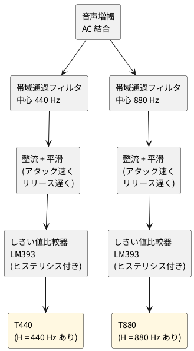

# 2-3 時報音の検出 — 440 Hz と 880 Hz の帯域通過フィルタとしきい値比較

> [!WARNING]
> **この工作 (2 章 radio-clock) は、まだ実際の回路で検証していない。** 回路図・実体配線図 (ブレッドボードとユニバーサル基板)・数値 (動作点、フィルタの値、波形、スペクトルなど) は、計算と見積りで作ったもので、正しく動くかどうかは確実ではない。組むときは、自分で確かめながら進めてほしい。

全体の中の位置は [01-block.md](01-block.md) の ② 時報音の検出。音声信号から 440 Hz と 880 Hz の
音を別々に取り出し、「その音があるあいだ H」の T440 と T880 にする。時報の形は 01-block.md を見る。

## ブロック図




440 Hz の予報音は約 0.1 秒と短いので、平滑はアタックを速くする。しきい値は可変抵抗で調整する。比較器には正帰還のヒステリシス (約 0.1 V) を付け、しきい値の近くでの出力のばたつきを防ぐ。

## 回路図

信号は 3 つの図に分けて描く。図の間は、同じ名前の端子 (AFO と AFI、VB と VBI、TH と THI) でつなぐ。

### 入力増幅、基準電圧、しきい値

```circuit
title: 図1 入力増幅、基準電圧、しきい値
parts:
  IN: port b1
  Cin: capacitor b2 b4 1u
  Rin: resistor b5 b7 10k
  Rf: resistor a9 a13 100k
  U1: opamp d11 +down
  AFO: port d17
  VCCa: vcc f2 5V
  Ra: resistor f2 h2 10k
  Rb: resistor h2 j2 10k
  GRb: ground j2
  Cb: ecap h4 j4 10u
  GCb: ground j4
  U2: opamp h7 +up
  VB: port j13
  VCCt: vcc f20 5V
  R6: resistor f20 h20 6.2k
  VR1: potentiometer h20 j20
  R7: resistor j20 l20 5.6k
  GR7: ground l20
  TH: port i24
wires:
  - b1 -- b2
  - b4 -- b5
  - b7 -- b8
  - b8 -- a8 -- a9
  - b8 |- U1.-
  - a13 -- a14
  - a14 -- d14
  - U1.out -- d14 -- d17
  - h2 -- h4
  - h4 -| U2.+
  - U2.out -- h9
  - h9 |- U1.+
  - h9 -- j9
  - j9 -- j6
  - j6 |- U2.-
  - j9 -- j13
  - VR1.w -- i24
notes:
  - text c9e5 tiny right: PIN 2
  - text e9a1 tiny left: PIN 3
  - text d12e6 tiny left: PIN 1
  - text g5f9 tiny right: PIN 5
  - text h5f9 tiny right: PIN 6
  - text h9a2 tiny left: PIN 7
  - text l3 small left: U1 と U2 は LM358 の 1 個 (PIN 8 は +5V、PIN 4 は GND)
  - text i19a2 small right: 2 kΩ
style:
  pitch: 1.2
```


- **入力増幅 (U1)**: [02-radio.md](02-radio.md) の検波出力 (直流が約 3 V 乗っている) を C<sub>in</sub> で交流にして、反転増幅 (R<sub>f</sub> ÷ R<sub>in</sub> = 10 倍) する。出力 AFO が音声信号
- **基準電圧 (U2)**: 5 V を R<sub>a</sub> と R<sub>b</sub> で割った 2.5 V をボルテージフォロワで受け、VB にする。単電源の OP アンプが交流を扱う中心の電圧で、U1 の + 入力と、2 つのフィルタが使う
- **しきい値 (R6、VR1、R7)**: 5 V を分圧し、VR1 で TH を約 2.0 V〜2.8 V の範囲で変える。2 つの比較器が共有する

### 440 Hz の検出

```circuit
title: 図2 440 Hz の検出 (帯域通過、整流と平滑、比較器)
parts:
  AFI: port d1
  R1: resistor d3 d6 75k
  C1: capacitor d8 d11 22n
  C2: capacitor a8 a13 22n
  R2: resistor-var e7 i7 2k
  R3: resistor b12 b17 300k
  U3A: opamp d14 +down
  VBI: port j3
  D1: diode d20 d23 1N4148
  Cp: capacitor d25 f25 1u
  GCp: ground f25
  Rp: resistor d27 f27 100k
  GRp: ground f27
  Rs: resistor d28 d30 47k
  Rh: resistor b30 b33 2.2M
  U4A: opamp e31 +up
  THI: port h29
  VCC4: vcc b35 5V
  Rpu: resistor b35 e35 10k
  T440: port e38
wires:
  - d1 -- d3
  - d6 -- d7
  - d7 -- d8
  - d7 -- a7 -- a8
  - d7 -- e7
  - i7 -- j7
  - j3 -- j7
  - j7 -- j12
  - j12 |- U3A.+
  - d11 -- b11
  - b11 -- b12
  - d11 |- U3A.-
  - U3A.out -- d17
  - d17 -- b17
  - a13 -- a17
  - a17 -- b17
  - d17 -- d20
  - d23 -- d25
  - d25 -- d27
  - d27 -- d28
  - d30 -| U4A.+
  - b30 -- d30
  - b33 -- e33
  - h29 |- U4A.-
  - U4A.out -- e33 -- e35 -- e38
notes:
  - text c12e5 tiny right: PIN 2
  - text d13g4 tiny right: PIN 3
  - text c16g0 tiny right: PIN 1
  - text d30f0 tiny right: PIN 3
  - text e30g0 tiny right: PIN 2
  - text d34g0 tiny right: PIN 1
  - text g14 small left: U3 は LM358 (PIN 8 は +5V、PIN 4 は GND)
  - text g31 small left: U4 は LM393 (PIN 8 は +5V、PIN 4 は GND)
style:
  pitch: 1.2
```


1. **帯域通過フィルタ (U3A)**: 多重帰還形 (MFB) の帯域通過フィルタ。中心 440 Hz、Q 約 9、利得 約 2 倍
2. **整流と平滑 (D1、C<sub>p</sub>、R<sub>p</sub>)**: ダイオードが山を拾って C<sub>p</sub> に溜める。**溜まるのは速く (アタック)、抜けるのは遅い (R<sub>p</sub> × C<sub>p</sub> = 100 ms、リリース)**。約 0.1 秒の短い音でも、比較器が判定できる長さに引き延ばせる
3. **比較器とヒステリシス (U4A、R<sub>s</sub>、R<sub>h</sub>)**: 平滑した電圧が TH を超えると、出力 T440 が H になる (LM393 は出力がオープンコレクタなので、10 kΩ で 5 V へ引き上げる)。出力から + 入力へ R<sub>h</sub> (2.2 MΩ) を戻す正帰還で、H のときは入力が少し上がり、L のときは少し下がる。**R<sub>s</sub> (47 kΩ) は必須**で、C<sub>p</sub> (1 µF) の電圧と + 入力のあいだに入れ、帰還の電流が作る電圧の段差を + 入力に出す。R<sub>s</sub> が無いと、段差は C<sub>p</sub> に吸われて出ない

ヒステリシスの大きさは、R<sub>s</sub> と R<sub>h</sub> で 5 V を分けた値になる。

- 幅 ΔV ≒ 5 V × R<sub>s</sub> ÷ (R<sub>h</sub> + R<sub>s</sub>) = 5 V × 47 kΩ ÷ 2247 kΩ ≒ 0.105 V
- 平滑した電圧 (C<sub>p</sub> の電圧) が、L から H へ変わる値は TH × (1 + R<sub>s</sub> ÷ R<sub>h</sub>) ≒ TH + 0.05 V、H から L へ戻る値は TH − (5 V − TH) × R<sub>s</sub> ÷ R<sub>h</sub> ≒ TH − 0.055 V。TH = 2.4 V なら、上りは 2.45 V、下りは 2.34 V
- TH を 2.0〜2.8 V のどこに回しても、幅は 0.105 V ± 0.003 V ほど
- 幅は、平滑のさざ波より大きく取る。440 Hz の山の間に C<sub>p</sub> は R<sub>p</sub> で放電して、さざ波は 2.4 V × 2.27 ms ÷ 100 ms ≒ 55 mV (880 Hz 側は約 27 mV)。幅 105 mV はこれを上回る
- LM393 の入力バイアス電流は最大 250 nA で、R<sub>s</sub> (47 kΩ) に流れても約 12 mV のずれで、幅の約 1 割に収まる

### 880 Hz の検出

```circuit
title: 図3 880 Hz の検出 (図2 と同じ形で、値だけ違う)
parts:
  AFI: port d1
  R1: resistor d3 d6 91k
  C1: capacitor d8 d11 10n
  C2: capacitor a8 a13 10n
  R2: resistor-var e7 i7 2k
  R3: resistor b12 b17 330k
  U3B: opamp d14 +down
  VBI: port j3
  D1: diode d20 d23 1N4148
  Cp: capacitor d25 f25 1u
  GCp: ground f25
  Rp: resistor d27 f27 100k
  GRp: ground f27
  Rs: resistor d28 d30 47k
  Rh: resistor b30 b33 2.2M
  U4B: opamp e31 +up
  THI: port h29
  VCC4: vcc b35 5V
  Rpu: resistor b35 e35 10k
  T880: port e38
wires:
  - d1 -- d3
  - d6 -- d7
  - d7 -- d8
  - d7 -- a7 -- a8
  - d7 -- e7
  - i7 -- j7
  - j3 -- j7
  - j7 -- j12
  - j12 |- U3B.+
  - d11 -- b11
  - b11 -- b12
  - d11 |- U3B.-
  - U3B.out -- d17
  - d17 -- b17
  - a13 -- a17
  - a17 -- b17
  - d17 -- d20
  - d23 -- d25
  - d25 -- d27
  - d27 -- d28
  - d30 -| U4B.+
  - b30 -- d30
  - b33 -- e33
  - h29 |- U4B.-
  - U4B.out -- e33 -- e35 -- e38
notes:
  - text c12e5 tiny right: PIN 6
  - text d13g4 tiny right: PIN 5
  - text c16g0 tiny right: PIN 7
  - text d30f0 tiny right: PIN 5
  - text e30g0 tiny right: PIN 6
  - text d34g0 tiny right: PIN 7
  - text g14 small left: U3 は LM358 (PIN 8 は +5V、PIN 4 は GND)
  - text g31 small left: U4 は LM393 (PIN 8 は +5V、PIN 4 は GND)
style:
  pitch: 1.2
```


図 2 と同じ形で、フィルタの値だけが違う。中心は 880 Hz、Q は約 9、利得は約 1.8 倍。TH と VB は図 2 と共通にする。ヒステリシスの R<sub>s</sub> (47 kΩ) と R<sub>h</sub> (2.2 MΩ) も図 2 と同じ値で、U4B の出力 T880 から + 入力へ戻す。

## 実体配線図

ブレッドボード (半分の大きさ) 3 枚に分ける。基板の間は、同じ名前の端子どうしを線でつなぐ。端子は AF、VB、TH、P440、P880、T440、T880 の 7 つ。**5 V と GND は 3 枚で共通**にする。ほかの基板への線は、図に機器の箱を置いて示した。

同じ 3 枚をユニバーサル基板にも組める。各図の a がブレッドボード、b が同じ回路のユニバーサル基板で、部品の名前と端子は同じにした (check のネットリストで a と b を突き合わせた)。ブレッドボードで調整を済ませたあと、半田付けで残す形になる。電圧は 5 V、電流は 3 mA ほど、周波数は最大 880 Hz で、ユニバーサル基板の範囲 (12 V 以下、500 mA 以下、10 MHz 以下) に収まる。

ユニバーサル基板は、在庫の順位の先頭の 5×7 cm を横置き (24 列 × 18 行、厚み 1.6 mm の FR-4) にした。3 枚とも、この基板に収まった。図は部品面から見たもので、下に半田面 (左右が逆) の図を付けた。LM358 と LM393 は 90 度回して挿す (左の列が 1〜4 番、右の列が 8〜5 番)。3 枚を 1 枚にまとめる案は試していない。他の基板へつなぐ端子は、図 4b では基板の外の機器の箱で、図 5b と図 6b では基板の縁の穴に名前の字を添えて示した。

### 図 4: 入力増幅、基準電圧、しきい値の基板

```bread
title: 図4a 入力増幅・基準電圧・しきい値のブレッドボード (LM358 1 個)
board: half
parts:
  PS:
    type: device
    at: top
    label: 電源 5V
    pins: [+5V, GND]
  IN:
    type: device
    at: bottom
    label: 02 の検波出力 OUT
    pins: [GND, IN]
  LINK:
    type: device
    at: bottom
    label: 図5 の基板へ
    pins: [AF, VB, TH, GND]
  U1: dip8 @ e12 LM358
  Cin: capacitor/ceramic i2 i4 1u
  Rin: resistor j4 j8 10k
  Rf: resistor i8 i12 100k
  Ra: resistor a15 +t15 10k
  Rb: resistor b15 b18 10k
  Cb: capacitor/electrolytic d15 d20 10u
  R6: resistor j20 +b20 6.2k
  VR1: potentiometer g20(A) g22(W) g24(B) 2k
  R7: resistor j24 -b24 5.6k
wires:
  - PS.+5V -- +t1 red
  - PS.GND -- -t1 black
  - a12 -- +t12 red
  - j15 -- -b15 black
  - a18 -- -t18 black
  - a20 -- -t20 black
  - d13 -- d14 green
  - c13 -- c11 green
  - d11 -- f11 green
  - g11 -- g14 green
  - h8 -- h13 orange
  - IN.IN -- j2 white
  - IN.GND -- -b1 black
  - LINK.AF -- j12 white
  - LINK.VB -- i14 green
  - LINK.TH -- i22 purple
  - LINK.GND -- -b27 black
  - +t30 -- +b30 red
  - -t30 -- -b30 black
```


```perf
title: 図4b 入力増幅・基準電圧・しきい値の基板 (ユニバーサル基板)
board:
  size: 7x5cm
  h: 1.6mm
  material: FR-4
parts:
  PS:
    type: device
    at: -c22
    label: 電源 5V
    pins: +5V GND
  IN:
    type: device
    at: -c3
    label: 検波出力
    pins: IN GND
  LINK:
    type: device
    at: -c7
    label: 図5 の基板へ
    pins: GND AF VB TH
  U1: dip8 e11 LM358
  Cin: capacitor/ceramic m10 m13 1u
  Rin: resistor j14 m14 10k
  Rf: resistor k8 k12 100k
  Ra: resistor b16 d16 10k
  Rb: resistor f16 o16 10k
  Cb: capacitor/electrolytic f18 o18 10u
  R6: resistor b19 e19 6.2k
  VR1: potentiometer/trimmer g19 g20 g21 2k
  R7: resistor i21 o21 5.6k
wires:
  - PS.+5V -- b22 red
  - b22 -- b19 red
  - b19 -- b16 red
  - b16 -- b11 red
  - e11 -- b11 red
  - PS.GND -- o23 black
  - o23 -- o21 black
  - o21 -- o18 black
  - o18 -- o16 black
  - o16 -- o15 black
  - o15 -- o4 black
  - IN.GND -- a4 black
  - a4 -- o4 black
  - LINK.GND -- a7 black
  - a7 -- a4 black
  - LINK.VB -- a9 green
  - a9 -- d9 green
  - d9 -- d12 green
  - d12 -- e12 green
  - e12 -- e13 green
  - e13 -- h13 green
  - LINK.AF -- a8 white
  - a8 -- i8 white
  - i8 -- i11 white
  - i11 -- h11 white
  - i8 -- k8 white
  - h12 -- j12 orange
  - j12 -- k12 orange
  - j12 -- j14 orange
  - h14 -- h15 black
  - h15 -- o15 black
  - IN.IN -- m3 yellow
  - m3 -- m10 yellow
  - m13 -- m14 orange
  - e14 -- e16 orange
  - d16 -- e16 orange
  - e16 -- f16 orange
  - f16 -- f18 orange
  - e19 -- g19 orange
  - g21 -- i21 orange
  - LINK.TH -- a10 purple
  - a10 -- a20 purple
  - a20 -- g20 purple
style:
  back: on
```


ブレッドボードで組む手順は次のとおり。

- LM358 (U1) を溝をまたいで `e12` に挿す。PIN 8 は `a12` から + レール (赤) へ、PIN 4 は `j15` から下の − レール (黒) へ。上下のレールは、右端の線 (赤と黒) でつなぐ
- 入力: 02 の検波出力 (OUT) を、C<sub>in</sub> (`i2`) → R<sub>in</sub> (`j4`〜`j8`) の順に入れる。R<sub>f</sub> は `i8` から PIN 1 の列 (`i12`) へ。PIN 2 の列へは、`h8` から `h13` へ橙の線
- 基準電圧: R<sub>a</sub> (`a15` から + レール)、R<sub>b</sub> (`b15`〜`b18`)、C<sub>b</sub> (`d15`〜`d20`、+ は `d15` 側) が PIN 5 の列に集まる。PIN 6 と PIN 7 は緑の短い線 (`d13`〜`d14`) でつなぎ、VB の列は `c13` から左 (`c11`) へ、溝を渡して (`d11`〜`f11`)、`g11` から PIN 3 の列 (`g14`) へ引く
- しきい値: R6 (`j20` から下の + レール)、半固定抵抗 VR1 (`g20`〜`g24`)、R7 (`j24` から − レール)。VR1 の中央のピン (`i22`) が TH
- 図 5 の基板へ: AF (`j12`)、VB (`i14`)、TH (`i22`) と GND

ユニバーサル基板で組む手順は次のとおり。

- ユニバーサル基板は 7×5 cm の横置き (24 列 × 18 行)。U1 (LM358) は `e11` から挿し、8 番が `e11`、1 番が `h11`。上の B 行が + の筋 (赤)、下の O 行が GND の筋 (黒)。PS の + は `b22`、GND は `o23` から入り、U1 の 8 番は `e11` から `b11` へ、4 番は `h14` から `o15` へ落とす
- 入力: 検波出力の IN は上から 3 列へ下ろして `m3` に着ける。C<sub>in</sub> (`m10`〜`m13`) → R<sub>in</sub> (`j14`〜`m14`) の順につなぎ、R<sub>in</sub> の上端 `j14` から `j12` を経て 2 番 (`h12`) へ入れる
- R<sub>f</sub> は `k8`〜`k12`。`k12` は `j12` の列から、`k8` は `i8` から。1 番 (`h11`) は `i11` から `i8` へ白い線で渡し、`i8` を上へ引いて AF (`a8`) にする
- VB: 7 番 (`e12`) と 6 番 (`e13`) を緑の短い線でつなぎ、3 番 (`h13`) へは DIP の下 (半田面) を `e13` から `h13` へ通す。VB は `d12` から `d9` へ渡し、9 列を上げて `a9` にする (半田面の図で DIP の下の線が見える)
- 基準電圧: R<sub>a</sub> (`b16`〜`d16`)、R<sub>b</sub> (`f16`〜`o16`)、C<sub>b</sub> (`f18`〜`o18`、+ は `f18`) が 5 番 (`e14`) の列の `e16` に集まる
- しきい値: R6 (`b19`〜`e19`) → VR1 (`g19` が A、`g20` が W、`g21` が B) → R7 (`i21`〜`o21`)。中央の `g20` が TH で、紫の線が `a20` へ上がり、A 行を左へ `a10` に着ける
- 跨ぎは 3 か所。VB (緑、D 行) が + の線 (11 列) を、TH (紫、20 列) が + の筋 (B 行) を、IN (黄、M 行) が GND の線 (4 列) を渡る
- 外から来る線を半田付けする穴: IN は `m3`、AF は `a8`、VB は `a9`、TH は `a10`、+5 V は `b22`、GND は `a4` (検波側)・`a7` (LINK 側)・`o23` (電源側)

### 図 5: 帯域通過フィルタのユニバーサル基板

```bread
title: 図5a 帯域通過フィルタのブレッドボード (LM358 1 個、上が 880 Hz・下が 440 Hz)
board: half
parts:
  PS:
    type: device
    at: top
    label: 電源 5V
    pins: [+5V, GND]
  FROM:
    type: device
    at: top
    label: 図4 の基板から (AF は 2 本に分ける)
    pins: [AF880, AF440, VB, GND]
  TO8:
    type: device
    at: top
    label: 880 Hz の P (図6 の基板へ)
    pins: [P880, GND]
  TO4:
    type: device
    at: bottom
    label: 440 Hz の P (図6 の基板へ)
    pins: [P440, GND]
  U3: dip8 @ e16 LM358
  R1H: resistor a3 a7 91k
  C2H: capacitor/ceramic b7 b17 10n
  C1H: capacitor/ceramic d7 d18 10n
  R2H: resistor c7 c10 2k
  R3H: resistor c17 c22 330k
  R1L: resistor j2 j6 75k
  C2L: capacitor/ceramic i6 i16 22n
  C1L: capacitor/ceramic g6 g17 22n
  R2L: resistor h6 h9 2k
  R3L: resistor h16 h21 300k
wires:
  - PS.+5V -- a16 red
  - PS.GND -- -t1 black
  - FROM.AF880 -- c3 white
  - FROM.VB -- +t2 green
  - FROM.GND -- -t3 black
  - b18 -- b22 green
  - a10 -- +t10 green
  - a19 -- +t19 green
  - TO8.P880 -- a17 orange
  - TO8.GND -- -t25 black
  - i17 -- i21 green
  - j9 -- +b9 green
  - j18 -- +b18 green
  - j19 -- -b19 black
  - TO4.P440 -- j16 orange
  - TO4.GND -- -b25 black
  - FROM.AF440 -- h2 white
  - +t30 -- +b30 green
  - -t30 -- -b30 black
```


```perf
title: 図5b 帯域通過フィルタの基板 (ユニバーサル基板)
board:
  size: 7x5cm
  h: 1.6mm
  material: FR-4
points:
  P_440: a9
  V_5V: a13
  P_880: a16
  AF_440: r3
  VB: r8
  GND: r10
  AF_880: r20
parts:
  U3: dip8 e13 r90 LM358
  R1L: resistor j3 m3 75k
  C2L: capacitor/ceramic c6 c3 22n
  C1L: capacitor/ceramic f6 f3 22n
  R2L: resistor i8 i3 2k
  R3L: resistor c7 f7 300k
  R1H: resistor j20 m20 91k
  C2H: capacitor/ceramic c17 c20 10n
  C1H: capacitor/ceramic g17 g20 10n
  R2H: resistor i17 i20 2k
  R3H: resistor c16 g16 330k
wires:
  - V_5V -- e13 red
  - GND -- h10 black
  - VB -- i8 green
  - i9 -- i8 green
  - g9 -- i9 green
  - g10 -- g9 green
  - g10 -- g12 green
  - g12 -- h12 green
  - h12 -- h13 green
  - h13 -- h14 green
  - h14 -- i14 green
  - i14 -- i17 green
  - e10 -- e9 orange
  - e9 -- c9 orange
  - c9 -- c7 orange
  - c7 -- c6 orange
  - P_440 -- c9 orange
  - f10 -- f7 orange
  - f7 -- f6 orange
  - c3 -- f3 white
  - f3 -- i3 white
  - i3 -- j3 white
  - AF_440 -- m3 white
  - f13 -- f14 orange
  - f14 -- c14 orange
  - c14 -- c16 orange
  - c16 -- c17 orange
  - P_880 -- c16 orange
  - g13 -- g16 orange
  - g16 -- g17 orange
  - c20 -- g20 white
  - g20 -- i20 white
  - i20 -- j20 white
  - AF_880 -- m20 white
notes:
  - text b10: P440
  - text b14: 5V
  - text b17: P880
  - text s4: AF440
  - text s9: VB
  - text s11: GND
  - text s21: AF880
style:
  back: on
```


ブレッドボードで組む手順は次のとおり。

- LM358 (U3) を `e16` に挿す。**溝の上側の PIN 5〜7 が 880 Hz、下側の PIN 1〜3 が 440 Hz** のフィルタになる。同じ形の配線を、上下で左右が 1 列ずれた位置に組む
- **このユニバーサル基板の上下の + レールは、5 V ではなく VB (約 2.5 V) につなぐ。** R2 の電源側と PIN 3・PIN 5 (+ 入力) が VB で、図 4 の基板の VB を `+t2` に入れて、上下のレールを右端の線でつなぐ。5 V は PIN 8 だけに、1 本の線 (`a16`) で直接入れる
- 図 4 の基板の AF は、**2 本の線に分けて**入れる。880 Hz 側は `c3` (R1H の入口)、440 Hz 側は `h2` (R1L の入口) で、2 本の線はユニバーサル基板の上で重ならない
- R2 は 2 kΩ の半固定抵抗。図では抵抗の絵で描いたが、実物は半固定抵抗の中央のピンと片方のピンを使う
- 440 Hz 側の P は `j16`、880 Hz 側の P は `a17` から図 6 の基板へ

ユニバーサル基板で組む手順は次のとおり。

- ユニバーサル基板は 7×5 cm の横置き。U3 (LM358) は `e13` から 90 度回して挿す。左の列 (`e10`〜`h10`) が 1〜4 番、右の列 (`e13`〜`h13`) が 8〜5 番。**左の 1〜3 番が 440 Hz、右の 7〜5 番が 880 Hz** のフィルタで、どちらも出力・反転入力・VB の順に上から並ぶ
- 440 Hz 側 (左): R<sub>3</sub> は `c7`〜`f7` (出力と反転入力の間)。出力は `e10` → `e9` → `c9` と上げて C<sub>2</sub> (`c6`〜`c3`) へ、反転入力は `f10` → `f7` → `f6` と渡して C<sub>1</sub> (`f6`〜`f3`) へ。VB は `g10` → `g9` → `i9` と下げ、R<sub>2</sub> (`i8`〜`i3`) へ。3 列の縦の線 (`c3`〜`j3`) が C<sub>1</sub>・C<sub>2</sub>・R<sub>2</sub> の共通の節で、R<sub>1</sub> (`j3`〜`m3`) へ続く
- 880 Hz 側 (右) は左右を逆にして組む。出力は `f13` → `f14` → `c14` と上げて R<sub>3</sub> (`c16`〜`g16`)・C<sub>2</sub> (`c17`〜`c20`) へ、反転入力は `g13` → `g16` と渡して C<sub>1</sub> (`g17`〜`g20`) へ、VB は `h13` → `h14` → `i14` → `i17` と渡して R<sub>2</sub> (`i17`〜`i20`) へ。20 列の縦の線 (`c20`〜`j20`) が共通の節で、R<sub>1</sub> (`j20`〜`m20`) へ続く
- VB: 3 番 (`g10`) と 5 番 (`h13`) は、DIP の下 (半田面) を `g10` → `g12` → `h12` → `h13` とつなぐ。半田面の図で、DIP の下の緑の線が見える
- R<sub>2</sub> は 2 kΩ の半固定抵抗。図は、ブレッドボードの図と同じく抵抗の絵で描いた
- 外から来る線を半田付けする穴: AF440 は `r3`、VB は `r8`、GND は `r10`、AF880 は `r20`、P440 は `a9`、+5 V は `a13`、P880 は `a16`。+5 V は 8 番だけ、GND は 4 番だけに付く。線は交差しない

### 図 6: 整流と平滑、比較器のユニバーサル基板

```bread
title: 図6a 整流と平滑、比較器のブレッドボード (LM393 1 個、上が 880 Hz・下が 440 Hz)
board: half
parts:
  PS:
    type: device
    at: top
    label: 電源 5V
    pins: [+5V, GND]
  T8:
    type: device
    at: top
    label: T880 (04 の状態遷移へ)
    pins: [T880]
  FROM8:
    type: device
    at: top
    label: 図5 の基板から (880 Hz の P と TH)
    pins: [TH, GND, P880]
  T4:
    type: device
    at: bottom
    label: T440 (04 の状態遷移へ)
    pins: [T440]
  FROM4:
    type: device
    at: bottom
    label: 図5 と 図4 の基板から (440 Hz の P と TH)
    pins: [TH, GND, P440]
  U4: dip8 @ e16 LM393
  D1H: diode d27(A) d23(K)
  CpH: capacitor/ceramic a23 -t23 1u
  RpH: resistor a25 -t25 100k
  RpuH: resistor a15 +t15 10k
  RsH: resistor c19 c23 47k
  RhH: resistor d17 d19 2.2M
  D1L: diode g26(A) g22(K)
  CpL: capacitor/ceramic j22 -b22 1u
  RpL: resistor j24 -b24 100k
  RpuL: resistor j14 +b14 10k
  RsL: resistor h18 h22 47k
  RhL: resistor g16 g18 2.2M
wires:
  - PS.+5V -- +t1 red
  - a16 -- +t16 red
  - PS.GND -- -t1 black
  - FROM8.P880 -- e27 orange
  - FROM8.TH -- b18 purple
  - FROM8.GND -- -t21 black
  - FROM4.P440 -- h26 orange
  - FROM4.TH -- i17 purple
  - FROM4.GND -- -b21 black
  - T8.T880 -- b17 white
  - T4.T440 -- i16 white
  - b23 -- b25 green
  - c17 -- c15 white
  - h16 -- h14 white
  - i22 -- i24 green
  - j19 -- -b19 black
  - -t30 -- -b30 black
  - +t30 -- +b30 red
```


```perf
title: 図6b 整流と平滑、比較器の基板 (ユニバーサル基板)
board:
  size: 7x5cm
  h: 1.6mm
  material: FR-4
points:
  P_440: a2
  T_440: a8
  V_5V: a10
  TH: a12
  T_880: a15
  P_880: a22
  GND: r11
parts:
  U4: dip8 e13 r90 LM393
  D1L: diode g2 g5
  RsL: resistor g6 g9 47k
  RhL: resistor f4 f7 2.2M
  CpL: capacitor/ceramic h5 l5 1u
  RpL: resistor h7 l7 100k
  RpuL: resistor b9 e9 10k
  D1H: diode h22 h18
  RsH: resistor h14 h17 47k
  RhH: resistor g19 g16 2.2M
  CpH: capacitor/ceramic i18 m18 1u
  RpH: resistor i16 m16 100k
  RpuH: resistor b14 f14 10k
wires:
  - V_5V -- b10 red
  - b9 -- b10 red
  - b10 -- b13 red
  - b13 -- b14 red
  - e13 -- b13 red
  - GND -- l11 black
  - l5 -- l7 black
  - l7 -- l11 black
  - l11 -- m11 black
  - m11 -- m16 black
  - m16 -- m18 black
  - h10 -- h11 black
  - h11 -- l11 black
  - e10 -- e9 orange
  - e9 -- e8 orange
  - T_440 -- e8 orange
  - e8 -- e4 orange
  - e4 -- f4 orange
  - P_440 -- g2 white
  - g10 -- g9 white
  - g9 -- f9 white
  - f9 -- f7 white
  - g5 -- g6 white
  - g5 -- h5 white
  - h5 -- h7 white
  - f10 -- f12 purple
  - f12 -- g12 purple
  - g12 -- g13 purple
  - TH -- f12 purple
  - f13 -- f14 orange
  - f14 -- f15 orange
  - T_880 -- f15 orange
  - f15 -- f19 orange
  - f19 -- g19 orange
  - h13 -- h14 white
  - h14 -- g14 white
  - g14 -- g16 white
  - h18 -- h17 white
  - h18 -- i18 white
  - i18 -- i16 white
  - P_880 -- h22 white
notes:
  - text b3: P440
  - text b9: T440
  - text b11: 5V
  - text b13: TH
  - text b16: T880
  - text b23: P880
  - text s12: GND
style:
  back: on
```


ブレッドボードで組む手順は次のとおり。

- LM393 (U4) を `e16` に挿す。**上の PIN 5〜7 が 880 Hz、下の PIN 1〜3 が 440 Hz** の比較器になる。LM393 のピンの名前は、図では番号で出る (図の道具が型番のピンの名前の表に持たないため)
- 440 Hz 側: P を D1 (`g26` のアノードから `g22` のカソード) へ入れる。D1 のカソードの 22 列に、C<sub>p</sub> (`j22` から − レール)、R<sub>p</sub> (`i22` から `i24` へ緑の線で渡し、`j24` から − レール)、R<sub>s</sub> (`h22`〜`h18`) をつなぐ。R<sub>s</sub> の左端 (`h18`) が PIN 3 (+ 入力) の列。ヒステリシスの R<sub>h</sub> (2.2 MΩ) は `g16`〜`g18` で、PIN 1 の列 (出力) と PIN 3 の列をつなぐ。TH は PIN 2 (`i17`)。T440 は PIN 1 の列の `i16` から出す。引き上げの 10 kΩ は、別の列に置く (`h16` から `h14` へ白い線で渡し、`j14` から + レールへ)。T440 の線と 10 kΩ が、穴も経路も重ならない
- 880 Hz 側は上下を逆にして組む。P は `d27` のアノードから `d23` のカソードへ。23 列に、C<sub>p</sub> (`a23` から − レール)、R<sub>p</sub> (`b23` から `b25` へ緑の線で渡し、`a25` から − レール)、R<sub>s</sub> (`c23`〜`c19`) をつなぐ。R<sub>s</sub> の左端 (`c19`) が PIN 5 (+ 入力) の列。R<sub>h</sub> は `d17`〜`d19` で、PIN 7 の列 (出力) と PIN 5 の列をつなぐ。TH は PIN 6 (`b18`)、T880 は PIN 7 の列の `b17`。引き上げの 10 kΩ は、`c17` から `c15` へ白い線で渡した 15 列 (`a15`) に置く。PIN 8 は `a16` から + レールへ
- P を R<sub>s</sub> と R<sub>h</sub> の置き場の反対側 (右) から入れるため、図5 の基板からの箱は右に置いた (線が交差しない)。T440 と T880 の箱は左
- ユニバーサル基板の電源は、上下の + レールが 5 V、− レールが GND (図 5 の基板とは違う)

ユニバーサル基板で組む手順は次のとおり。

- ユニバーサル基板は 7×5 cm の横置き。U4 (LM393) は `e13` から 90 度回して挿す。左の列 (`e10`〜`h10`) が 1〜4 番、右の列 (`e13`〜`h13`) が 8〜5 番。**左の 1〜3 番が 440 Hz、右の 7〜5 番が 880 Hz** の比較器。LM393 のピンの名前は、図では番号で出る (check も同じお知らせを出す。ブレッドボードの図と同じ)
- 筋: 上の B 行 (`b9`〜`b14`) が + (赤)、L 行 (`l5`〜`l11`) と M 行 (`m11`〜`m18`) が GND (黒)。8 番は `e13` から `b13` へ、4 番は `h10` から DIP の下を `h11` へ渡し、`l11` へ落とす。+5 V は `a10`、GND は `r11` から入れる
- 440 Hz 側 (左): P440 は `a2` から下へ引き、D1 (`g2` がアノード、`g5` がカソード) へ。カソードの穴 `g5` から白い線で、R<sub>s</sub> (`g6`〜`g9`) の左端と、C<sub>p</sub> (`h5`〜`l5`) と R<sub>p</sub> (`h7`〜`l7`) の上端へ分ける。R<sub>s</sub> の右端 `g9` は 3 番の穴 (`g10`) へ白い線でつなぐ。C<sub>p</sub> と R<sub>p</sub> の下端は L 行の GND へ。ヒステリシスの R<sub>h</sub> (`f4`〜`f7`) は、`f7` から白い線で `g9` (3 番の列) へ、`f4` から橙の線で `e4`〜`e8` (出力の列) へ。T440 は 1 番 (`e10`) から `e8` へ渡し、R<sub>pu</sub> (`b9`〜`e9`) の下端と一緒に `a8` へ上げる
- 880 Hz 側 (右): P880 は `a22` から下へ引き、D1 (`h22` がアノード、`h18` がカソード) へ。カソードの穴 `h18` から白い線で、R<sub>s</sub> (`h14`〜`h17`) の右端と、C<sub>p</sub> (`i18`〜`m18`) と R<sub>p</sub> (`i16`〜`m16`) の上端へ分ける。R<sub>s</sub> の左端 `h14` は 5 番の穴 (`h13`) へ白い線でつなぐ。C<sub>p</sub> と R<sub>p</sub> の下端は M 行の GND へ (黒い線で `l11` から `m11` を通す)。ヒステリシスの R<sub>h</sub> (`g16`〜`g19`) は、`g16` から白い線で `h14` (5 番の列) へ、`g19` から橙の線で `f19`〜`f15` (出力の列) へ。T880 は 7 番 (`f13`) から `f14` (R<sub>pu</sub> の下端) を経て `f15` へ渡し、`a15` へ上げる
- R<sub>h</sub> のピンの穴は、隣の穴に別の線が来る (`f7` の隣に TH の `f10`、`g19` の隣に `h18` など)。半田が隣の穴へ橋渡しにならないように付ける
- TH は 2 番 (`f10`) と 6 番 (`g13`) の両方へ、DIP の下を `f10` → `f12` → `g12` → `g13` と通し、`f12` から `a12` へ上げる。A 行へ出る途中で + の筋 (B 行) を紫の線で跨ぐ
- ダイオードは帯のある側がカソードで、比較器の + 入力の側に向ける
- 外から来る線を半田付けする穴: P440 は `a2`、T440 は `a8`、+5 V は `a10`、TH は `a12`、T880 は `a15`、P880 は `a22`、GND は `r11`

### 実体配線図のまとめ

- 図 4a〜6a がブレッドボード、図 4b〜6b が同じ回路のユニバーサル基板。部品の名前は同じで、ネットリストも一致する
- 3 枚で LM358 2 個 (U1 と U2、U3)、LM393 1 個を使う。**図 4 は LM358 の 1 個目 (U1・U2)、図 5 は LM358 の 2 個目 (U3A・U3B)**
- 5 V と GND は 3 枚で共通にする。電源から出る電流は、LM358 2 個、LM393 1 個、分圧の抵抗の分で、合計 約 3 mA (見積り)
- ユニバーサル基板に載せる回路の周波数は、最も高い 880 Hz のフィルタでもユニバーサル基板の目安 (3 MHz 以下) の範囲に収まる
- 分割レールのユニバーサル基板を使うときは、図の右端の線のほかに、中央をジャンパでまたぐ (この図ではレールを 1 本の通しとして描いている)

## 帯域通過フィルタの値 (計算値)

MFB 帯域通過フィルタの式 (C1 = C2 = C) で決めて、抵抗を E24 に丸めた。LM358 の利得帯域幅 (約 1 MHz) を入れて計算し直しても、中心周波数のずれは 1 % 未満だった。実機では測っていない。

| 項目 | 440 Hz 側 | 880 Hz 側 |
| --- | --- | --- |
| C (C1、C2) | 22 nF | 10 nF |
| R1 | 75 kΩ | 91 kΩ |
| R2 | 2 kΩ の半固定抵抗 (約 910 Ω に合わせる) | 2 kΩ の半固定抵抗 (約 1 kΩ に合わせる) |
| R3 | 300 kΩ | 330 kΩ |
| 中心周波数 | 約 440 Hz | 約 880 Hz |
| Q (帯域は約 f<sub>0</sub> ÷ Q) | 約 9.1 (約 48 Hz) | 約 9.1 (約 97 Hz) |
| 中心での利得 | 2.0 倍 | 1.8 倍 |
| 反対の音での利得 (相対) | 880 Hz で 0.15 倍 (約 −17 dB) | 440 Hz で 0.13 倍 (約 −18 dB) |
| 立ち上がりの時定数 | 約 7 ms | 約 3 ms |

- 時報の 440 Hz と 880 Hz は 1 オクターブ離れているので、Q 約 9 で、反対の音は約 7 分の 1 に落ちる。しきい値は、この漏れ (0.13〜0.15 倍) より上に置く
- **R2 は半固定抵抗にした。** 抵抗の誤差 (5 %) とコンデンサの誤差 (10 %) だけで、中心周波数が 390〜510 Hz (440 Hz 側) ほど動く計算になる。帯域は ±24 Hz ほどなので、そのままでは外れる。R2 を回して中心を合わせる。計算では、R2 を 500 Ω〜2 kΩ に回すと、440 Hz 側の中心は約 593 Hz〜299 Hz、880 Hz 側は約 1242 Hz〜626 Hz と動き、目的の中心は半固定抵抗の真ん中あたりにくる

## 周波数応答と波形 (計算)

上の表の値を図にする。**実機で測った図ではなく、式で計算した理想の図**だ。計器で確かめるときは、
周波数応答は AD3 の波形発生器とオシロスコープ (Network)、波形は AD3 のオシロスコープで見る。

### 帯域通過フィルタの周波数応答

```graph
title: 図7 440 Hz 側と 880 Hz 側の帯域通過フィルタの利得 (計算)
x: 周波数 Hz log 200..2k
y: 利得 dB -40..10
lines:
  440 Hz 側 dB: 20*log10(2.0/sqrt(1+(9.1*(x/440-440/x))^2))
  880 Hz 側 dB: 20*log10(1.8/sqrt(1+(9.1*(x/880-880/x))^2))
notes:
  - mark 440
  - mark 880
  - level 0dB
```


図 7 の見るべき値は、次のとおり。上の表と同じ数になる。

| 周波数 | 440 Hz 側 | 880 Hz 側 | 本文の表 |
| --- | --- | --- | --- |
| 440 Hz | 6.02 dB (2.0 倍) | −17.6 dB (0.13 倍) | 中心の利得 2.0 倍、反対の音 0.13 倍 |
| 880 Hz | −16.7 dB (0.15 倍) | 5.11 dB (1.8 倍) | 反対の音 0.15 倍、中心の利得 1.8 倍 |

2 本の曲線は 600 Hz 付近で交わり、そこは中心から 10 dB 以上下がっている。
時報の 2 つの音は、互いに相手の山の裾にしか乗らない。

### 約 0.1 秒の 440 Hz の音を通したときの波形

BPF の出力の振幅は 0.8 V (ピーク) と仮定した。この値は、AF の入力が約 0.4 V のときの値で、実際の受信の強さで変わる。
BPF の応答は時定数 7 ms の立ち上がりとし、しきい値 TH は 2.4 V に置いた。比較器のヒステリシス (R<sub>s</sub> = 47 kΩ、R<sub>h</sub> = 2.2 MΩ) は、C<sub>p</sub> の電圧 (CH2) が 2.45 V を超えたとき H になり、2.34 V を下回ったとき L に戻る、として計算した。CH3 は、CH2 が最初に 2.45 V に届く時刻 (7.23 ms) 以後、2.34 V を下回るまで H とした。H のあいだ帰還の電流が C<sub>p</sub> を持ち上げる分 (約 0.2 V の目標のずれ) は、図では省いた (含めると立ち下がりが約 0.5 ms 遅くなる計算)。

```scope
title: 図8 約 0.1 秒の 440 Hz の音で、BPF の出力・平滑・T440 がどう動くか (ヒステリシスあり、計算)
time: 20ms/div
trigger: ch3 rising 2.5V at -3div
ch1: {wave: "= 2.5V + 0.8V * sin(2 * pi * 440Hz * t) * (step(t) * (1 - exp(-t / 7ms)) - step(t - 100ms) * (1 - exp(-(t - 100ms) / 7ms)))", range: 500mV/div, position: -5div}
ch2: {wave: ch1 | offset -0.5V | peak 100ms, range: 500mV/div, position: -5div}
ch3: {wave: "= 5V * step(t - 7.23ms) * step(ch2 - 2.34V)", range: 1V/div, position: -3div}
cursors: [50ms, 120ms]
measure: [vmax, vmin]
```


図 8 の見るべき値は、次のとおり。

| 見る所 | 読み値 | 意味 |
| --- | --- | --- |
| CH1 (BPF の出力) | 1.70〜3.30 V (1.6 Vpp) | 中心 VB = 2.5 V、振幅 0.8 V |
| CH2 の音がないとき | 約 2.0 V | VB (2.5 V) から D1 の電圧降下 約 0.5 V を引いた値 |
| CH2 の最大 | 2.80 V | 山 3.3 V から D1 の 0.5 V を引いた値 |
| カーソル X1 (50 ms) | CH2 2.74 V、CH3 5.00 V | 音のあいだ。2.45 V を超えて T440 が H |
| カーソル X2 (120 ms) | CH2 2.10 V、CH3 0 V | 音が終わって平滑が下がり、2.34 V を下回って T440 が L に戻った |
| CH3 (T440) の立ち上がり | 画面の 0 ms (トリガ)。CH2 が 2.45 V に届く時刻 | ヒステリシスなしの 2.4 V より約 2.2 ms 遅い |
| CH3 (T440) の立ち下がり | 約 109.1 ms | CH2 が 2.34 V を下回る時刻。なしの 2.4 V より約 2.5 ms 遅い |
| CH3 (T440) の H の長さ | 約 0.109 秒 | 音の 0.1 秒に、立ち上がりの遅れと平滑の抜けるぶんが加わる |

ヒステリシスなし (しきい値 2.4 V だけ) の計算では、立ち上がりで CH2 のさざ波 (約 55 mV) が TH をまたぎ、T440 が 5.05 ms で H になった後、0.7 ms 足らずで L に落ち、7.15 ms で H に戻っていた (図 8 の最初の細い山)。ヒステリシスありでは、さざ波 (約 55 mV) が幅 (約 0.105 V) の中に収まるので、T440 は 1 回だけ H になる。H の長さは、なしの約 0.1087 秒 (5.05 ms〜113.8 ms) から約 0.1091 秒 (7.23 ms〜116.3 ms) とほとんど変わらず、0.4 ms 延びただけだった。立ち上がりと立ち下がりが、どちらも 2 ms 余り遅れるためだ。

**注意:** T440 が H の長さ (約 0.109 秒) は、04 の標本化の周期 (8 Hz = 0.125 秒) より短い。
標本化の瞬間がこの H の外に当たると、1 回の予報音を取りこぼす。ヒステリシスで H は 0.4 ms しか延びないので、この懸念は残る。R<sub>p</sub> を大きくするか TH を下げて、
H を 0.125 秒より十分長くする必要がある。次の [04-state-machine.md](04-state-machine.md) の計算は、H を約 0.2 秒と置いている。
立ち上がりのばたつきは、ヒステリシスで解消した。標本化で吸収する必要はなくなった。

## 部品表

| 部品 | 値 | 備考 |
| --- | --- | --- |
| U1・U2、U3 | LM358 (2 回路入り) × 2 個 | U1 と U2 が 1 個目、U3A と U3B が 2 個目。単電源 5 V |
| U4 | LM393 (2 回路入り) × 1 個 | U4A が 440 Hz、U4B が 880 Hz。出力はオープンコレクタ。R<sub>s</sub> と R<sub>h</sub> でヒステリシス (約 0.105 V) を付ける |
| D1 (2 つ) | 1N4148 | 440 Hz 側と 880 Hz 側に 1 つずつ |
| R<sub>in</sub>、R<sub>a</sub>、R<sub>b</sub>、R<sub>pu</sub> (2 つ) | 10 kΩ | 入力、基準電圧の分圧、比較器の引き上げ |
| R<sub>f</sub>、R<sub>p</sub> (2 つ) | 100 kΩ | 帰還、平滑の放電 |
| R<sub>s</sub> (2 つ) | 47 kΩ | 比較器の + 入力の直列抵抗 (ヒステリシス用) |
| R<sub>h</sub> (2 つ) | 2.2 MΩ | 比較器の出力から + 入力へ戻す正帰還 (ヒステリシス用) |
| R6、R7 | 6.2 kΩ、5.6 kΩ | しきい値の分圧 |
| VR1 | 2 kΩ の半固定抵抗 | しきい値 |
| R2 (2 つ) | 2 kΩ の半固定抵抗 | 中心周波数の調整 |
| R1、R3 | 図 2、図 3 の値 | 1 % の金属皮膜が望ましい |
| C<sub>in</sub>、C<sub>p</sub> (2 つ) | 1 µF | セラミックかフィルム |
| C<sub>b</sub> | 10 µF 16 V | 電解。+ を VB 側に |
| C1、C2 | 図 2、図 3 の値 | フィルムかセラミック (誤差の小さいもの) |

## 調整と注意

1. **電源を入れて、VB が 2.5 V 前後か** (U2 の出力、PIN 7) をテスターで見る
2. **中心周波数を合わせる**: AD3 の波形発生器から、440 Hz の正弦波 (50 mV 程度) を AFI に入れ、BPF の出力 (U3A の PIN 1) をオシロスコープで見て、R2 を回して振幅が最大になる点に合わせる。880 Hz 側も同じ
3. **しきい値を合わせる**: ラジオを NHK 第 1 に合わせ、時報の音がしないときに T440 と T880 が L のままで、時報の音のときに H になるよう、VR1 を回す。しきい値は、平滑した電圧の「音がないときの値」の少し上に置く
4. 平滑した電圧の「音がないときの値」は、ダイオードの電圧降下のぶん、VB (2.5 V) より約 0.4〜0.5 V 低い (見積り)。しきい値の可変範囲 (約 2.0〜2.8 V) は、この値より上に収まるように決めた
5. ヒステリシス (約 0.105 V) の幅は、R<sub>s</sub> ÷ R<sub>h</sub> の比で決まる。さざ波 (440 Hz 側で約 55 mV) より大きければよく、TH を回しても幅はほぼ変わらない。しきい値を合わせるとき (3) は、L から H へ変わる値 (TH + 約 0.05 V) が「音がないときの値」より上にくるようにする
6. T440 が H になる長さは、約 0.1 秒の音で約 0.109 秒 (計算。図 8。ヒステリシスなしとほぼ同じ)、T880 は音の長さ (約 1 秒) より長くなる (見積り)。次の [04-state-machine.md](04-state-machine.md) は、この 2 本の H / L を入力にする
