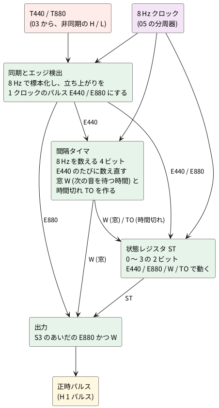
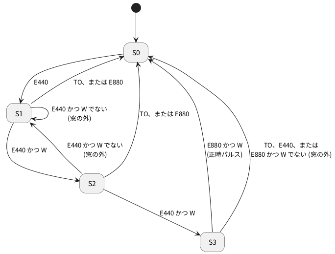

# 2-4 時報の状態遷移 — 440 Hz を 3 回数えて 880 Hz で正時パルス

> [!WARNING]
> **この題の実体配線図 (ブレッドボードとユニバーサル基板) は、まだ実際の回路で検証していない。** 配線は回路図のつながりを写し、check のネットリストで突き合わせたもので、組んで確かめてはいない。数値 (タイミング) も計算とシミュレーションで作ったもので、正しく動くかどうかは確実ではない。

全体の中の位置は [01-block.md](01-block.md) の ③ 状態遷移。T440 が 1 秒おきに 3 回来たあとに
T880 が来たら、正時パルスを 1 つ出す。

## ブロック図




入力は [03-detect.md](03-detect.md) の T440 と T880。出力は [05-clock.md](05-clock.md) の正時パルス。

図の信号の意味は、次のとおり。

| 信号 | 意味 |
| --- | --- |
| E440 | 440 Hz の音が**始まった**ことを知らせる、1 クロック (0.125 秒) のパルス |
| E880 | 880 Hz の音が**始まった**ことを知らせる、1 クロックのパルス |
| **W (窓)** | **「次の音が来てよい時間」のあいだだけ H になる信号。** 時報の予報音は 1 秒おきなので、前の E440 から約 1 秒 (0.875〜1.125 秒) のあいだだけ H になる。この時間の外に来た音は、時報の順番ではないとみなす |
| TO (時間切れ) | 前の E440 から 1.25 秒ほど待っても次の音が来なかったときに H になる。状態を待機 (S0) に戻す |
| ST (状態) | 0〜3 の数。予報音をここまで何回聞いたか (S0〜S3) を覚えている |

W は、「雑音や別の音を、時報と取り違えない」ための仕組みで、**1 秒の間隔を測る物差し**にあたる。W を H にするのは間隔タイマで、E440 が来るたびに数え直し、数が一定の範囲のときだけ H にする。

## 設計の方針

この回路は、**時間を状態と数に置き換える**。1 秒を測るのに、1 秒の単安定回路を使わず、一定の周期のクロックを数える。

- **クロックは 8 Hz**。05 の時計の分周器 (32.768 kHz ÷ 4096) の途中から取る (CD4040 の Q12)。1 クロックは 0.125 秒
- **T440 と T880 は、クロックと関係なく変わる**。D フリップフロップで 8 Hz に合わせて標本化し、もう 1 段遅らせて、立ち上がりだけを 1 クロックのパルス (E440、E880) にする
- **間隔タイマ**は、8 Hz を数える 4 ビットのカウンタ。E440 が来るたびに**値 2 を読み込む**。次の E440 までの数 (0.125 秒の何個ぶんか) を見る
- **窓 W**: 時報の予報音の間隔は 1 秒 (8 クロック)。標本化で ±1 クロックずれるので、間隔が 7〜9 クロック (0.875〜1.125 秒) のときだけ、順番どおりと認める。タイマの値で言えば 8、9、10 のとき (2 から数え始めるので、判定のゲートが少なくて済む)
- **時間切れ TO**: 数が 11 に達したら (間隔が 10 クロック以上)、順番が崩れたとして、状態を S0 に戻す
- **状態 ST**は、0〜3 の 2 ビット (S0〜S3)

## 状態の動き

| 状態 | 意味 |
| --- | --- |
| S0 | 待機 |
| S1 | 予報音 (440 Hz) を 1 回聞いた |
| S2 | 2 回聞いた |
| S3 | 3 回聞いた。880 Hz を待つ |

| イベント | 条件 | 動作 |
| --- | --- | --- |
| E440 | 状態が S1 か S2 で、**W が H** (窓のうち) | 状態を 1 つ進める。タイマを 2 から数え直す |
| E440 | 状態が S3 | **状態を S0 に戻す** (4 回目の 440 Hz は、時報の順番ではない) |
| E440 | 上以外。つまり、状態が S0、または S1 か S2 で **W が L** (窓の外) | 状態を S1 にする (数え直す)。タイマを 2 から数え直す |
| E880 | 状態が S3 で、**W が H** (窓のうち) | **正時パルスを出す。状態を S0 に戻す** |
| E880 | 上以外。つまり、状態が S3 でない、または **W が L** (窓の外) | 状態を S0 に戻す |
| 時間切れ TO | タイマの数が 11 | 状態を S0 に戻す |
| 電源投入 | — | 状態を S0 にする |

**「窓の外」とは、「W でない」(W の否定、W が L のとき) のことだ。** 状態遷移図では「W でない」と書き、日本語では「窓の外」と呼ぶ。W が H のあいだが「窓のうち」で、それ以外が「窓の外」になる。

| 言い方 | 意味 | W の値 |
| --- | --- | --- |
| 窓のうち (W) | 前の音から約 1 秒 (0.875〜1.125 秒) 後 | H |
| 窓の外 (W でない) | 早すぎる (0.875 秒より前) か、遅すぎる (1.125 秒より後) | L |

窓の外の E440 は、S0 ではなく **S1 (数え直し)** にする。雑音の音が先に来たあとに、本物の時報が続いても拾えるようにするためだ。ただし、S3 に来た E440 は、順番にない音なので S0 に戻す。




## タイミング (設計の計算値)

ふつうの時報を入れたときの様子を、設計から**計算で出した**。440 Hz が 0.04 秒、1.04 秒、2.04 秒に立ち上がり、880 Hz が 3.04 秒に立ち上がる。実機の波形ではない。TM は間隔タイマの数、ST は状態。

```logic
title: 図1 440 Hz を 3 回数えて 880 Hz で正時パルスが出る (計算)
device: ad3
window: 4s
sample: 1kHz
signals:
  CLK: dio0 clock 8Hz
  T440: dio1 edges 0s=0 40ms=1 240ms=0 1.04s=1 1.24s=0 2.04s=1 2.24s=0
  T880: dio2 edges 0s=0 3.04s=1
  TM: dio3..dio6 counter on CLK rising sequence 1 2 2 3 4 5 6 7 8 9 2 3 4 5 6 7 8 9 2 3 4 5 6 7 8 9 10 11 12 13 14 15 0
  ST: dio7..dio8 counter on CLK rising sequence 0 0 1 1 1 1 1 1 1 1 2 2 2 2 2 2 2 2 3 3 3 3 3 3 3 3 0 0 0 0 0 0 0
  OUT: dio9 edges 0s=0 3.125s=1 3.25s=0
buses:
  Timer: TM3..TM0 dec
  State: ST1..ST0 dec
cursors: [1.09375s, 3.21875s]
```


- 1 回目の E440 (0.125〜0.25 秒) で ST が 1 になり、タイマが 2 から数え始める。2 回目、3 回目も同じ間隔 (タイマは 9 まで数えて次の E440) で進み、**ST が 3 になる (2.25 秒)**
- カーソル X1 (1.094 秒) は、1 回目と 2 回目の E440 のあいだ (Timer 8、State 1)。X2 (3.219 秒) は、E880 のあいだ (Timer 9、State 3、OUT が H)
- 880 Hz の E880 (3.125〜3.25 秒) が、ST = 3 のあいだ、窓の中 (タイマ 9) で来るので、**OUT に 1 クロック (0.125 秒) のパルスが出て、ST が 0 に戻る (3.25 秒)**

### 順番が崩れたときの動き

正しい時報のほかに、**パルスを出してはいけない場合**の動きも見る。いずれも計算で、実機の波形ではない。

```logic
title: 図2 440 Hz が 4 回続くと、4 回目で待機に戻り、正時パルスは出ない (計算)
device: ad3
window: 5s
sample: 1kHz
signals:
  CLK: dio0 clock 8Hz
  T440: dio1 edges 0s=0 40ms=1 240ms=0 1.04s=1 1.24s=0 2.04s=1 2.24s=0 3.04s=1 3.24s=0
  T880: dio2 edges 0s=0 4.04s=1
  TM: dio3..dio6 counter on CLK rising sequence 1 2 2 3 4 5 6 7 8 9 2 3 4 5 6 7 8 9 2 3 4 5 6 7 8 9 2 3 4 5 6 7 8 9 10 11 12 13 14 15 0
  ST: dio7..dio8 counter on CLK rising sequence 0 0 1 1 1 1 1 1 1 1 2 2 2 2 2 2 2 2 3 3 3 3 3 3 3 3 0 0 0 0 0 0 0 0 0 0 0 0 0 0 0
  OUT: dio9 low
buses:
  Timer: TM3..TM0 dec
  State: ST1..ST0 dec
cursors: [3.1875s, 4.1875s]
```


| 見る所 | 読み値 | 意味 |
| --- | --- | --- |
| カーソル X1 (3.1875 秒) | Timer 9、State 3、T440 が H | 4 回目の 440 Hz が来ている。まだ S3 のまま |
| State の変わり目 | 0 → 1 (0.25 秒)、2 (1.25 秒)、3 (2.25 秒)、0 (3.25 秒) | 4 回目の E440 の次のクロックで S0 に戻る |
| カーソル X2 (4.1875 秒) | Timer 9、State 0、T880 が H、OUT 0 | 880 Hz が来たときは S0 なので、パルスは出ない |
| OUT の変わり目 | 0 | 正時パルスは出ない |

```logic
title: 図3 2 回目の音が 1.5 秒後に遅れると、時間切れで戻り、数え直しになる (計算)
device: ad3
window: 4.5s
sample: 1kHz
signals:
  CLK: dio0 clock 8Hz
  T440: dio1 edges 0s=0 40ms=1 240ms=0 1.54s=1 1.74s=0 2.54s=1 2.74s=0
  T880: dio2 edges 0s=0 3.54s=1 3.74s=0
  TM: dio3..dio6 counter on CLK rising sequence 1 2 2 3 4 5 6 7 8 9 10 11 12 13 2 3 4 5 6 7 8 9 2 3 4 5 6 7 8 9 10 11 12 13 14 15 0
  ST: dio7..dio8 counter on CLK rising sequence 0 0 1 1 1 1 1 1 1 1 1 1 0 0 1 1 1 1 1 1 1 1 2 2 2 2 2 2 2 2 0 0 0 0 0 0 0
  OUT: dio9 low
buses:
  Timer: TM3..TM0 dec
  State: ST1..ST0 dec
cursors: [1.4375s, 3.6875s]
```


| 見る所 | 読み値 | 意味 |
| --- | --- | --- |
| カーソル X1 (1.4375 秒) | Timer 11、State 1 | 1 回目の音から 11 クロック待った。時間切れ (TO) の瞬間 |
| State の変わり目 | 1 (0.25 秒)、0 (1.5 秒)、1 (1.75 秒)、2 (2.75 秒)、0 (3.75 秒) | 時間切れで S0 に戻り、遅れた音から S1 で数え直す |
| カーソル X2 (3.6875 秒) | Timer 9、State 2、T880 が H、OUT 0 | 数え直しの途中 (S2) で 880 Hz が来たので、パルスは出ない |
| OUT の変わり目 | 0 | 正時パルスは出ない |

この 2 つの動きは、次の「数値シミュレーション」の 4 回の 440 Hz と間隔の長い音の行に対応する。

**注意:** この計算は、T440 が約 0.2 秒 H になると置いている。[03-detect.md](03-detect.md) の計算では、
約 0.1 秒の音で T440 が H になるのは約 0.11 秒で、8 Hz の標本化の周期 (0.125 秒) より短い。
標本化の瞬間が H の外に当たると、音を取りこぼす。03 の R<sub>p</sub> や TH を見直して、H を 0.125 秒より十分長くしてから使う。

## 数値シミュレーション

この設計を、プログラム (Python) で、フリップフロップとカウンタの動きとして模して確かめた。**回路を作って測ったものではない。**

| 確かめたこと | 結果 |
| --- | --- |
| 時報が入る位相をずらして 25 通り (0〜0.125 秒) | すべて、正時パルスが 1 つだけ出る |
| 4 つの立ち上がりが、1 秒の位置から ±30 ms ずれる (4000 回) | 失敗 0 回 |
| 同じ、±100 ms ずれる (4000 回) | 失敗 270 回 (約 6.8 %) |
| 間隔が 0.5、0.6、0.7、1.3、1.5、2 秒の 440 Hz が 3 回、そのあと 880 Hz (各 500 回) | 正時パルスを出さなかった (500 回すべて) |
| 440 Hz が 1 秒おきに **4 回**、そのあと 880 Hz (500 回) | 正時パルスを出さなかった (500 回すべて) |

- 窓は ±1 クロック (±125 ms) までしか許さないので、立ち上がりが ±100 ms 以上ずれると、標本化のずれと合わさって外れることがある
- 放送の時報の間隔は正確に 1 秒なので、通常は受信側の検出の遅れのばらつき (数十 ms) が問題になる

## 回路図

回路は **4 つのユニット**に分ける。1 つのユニットは IC が 4 個以内で、フルサイズのブレッドボード 1 枚に載る大きさにした (ユニバーサル基板の大きさは「実体配線図」に書く)。ユニットの間は、同じ名前の端子どうしを線でつなぐ。

| ユニット | 役目 | IC | 入力 | 出力 |
| --- | --- | --- | --- | --- |
| 1 同期とエッジ検出 | T440・T880 を 8 Hz で標本化し、立ち上がりを 1 クロックのパルスにする | U5・U6 (74HC74)、U7 (74HC04)、U8 (74HC08) | T440、T880、CLK | E440、NE440 (E440 の反転)、E880 |
| 2 間隔タイマと窓 | E440 から次の E440 までを 8 Hz で数え、窓 W と時間切れ TO を作る | U9 (74HC163)、U10 (74HC08)、U11 (74HC02) | NE440、CLK | W、TO |
| 3 状態を動かす条件 | イベントと窓から、状態レジスタへの命令を作る | U12 (74HC86)、U13 (74HC08)、U14 (74HC32)、U15 (74HC02) | QA、QB、S3、W、TO、NE440、E440、E880、PON | LOADN、EN、CLRN |
| 4 状態レジスタと出力 | 状態 ST (QA・QB) を持ち、正時パルス OUT を出す | U16 (74HC163)、U17 (74HC08) | LOADN、EN、CLRN、CLK、E880、W | QA、QB、S3、OUT |

- CLK は 8 Hz のクロック、PON は電源投入のとき H になる信号 ([05-clock.md](05-clock.md) の電源投入のリセット)
- NE440 と LOADN、CLRN は、**L のとき働く**信号 (N は反転の印)
- すべての IC の電源は 5 V。IC の電源の足 (74HC74、74HC08 などの PIN 14、74HC163 の PIN 16) は +5V、GND の足 (PIN 7、74HC163 の PIN 8) は GND
- ゲートの足の番号は、74HC74、74HC04、74HC08、74HC86、74HC32、74HC02 の使うゲートの番号を図に書いた (使わないゲートの入力は GND につなぐ)

### ユニット 1: 同期とエッジ検出

```circuit
title: 図4 同期とエッジ検出 (ユニット 1)
parts:
  T440: port d2
  T880: port j2
  CLK: port f2
  U5A:
    type: ic3
    at: d7
    label: 74HC74
    pins: [D, CLK, Q]
  U5B:
    type: ic3
    at: d15
    label: 74HC74
    pins: [D, CLK, Q]
  U6A:
    type: ic3
    at: j7
    label: 74HC74
    pins: [D, CLK, Q]
  U6B:
    type: ic3
    at: j15
    label: 74HC74
    pins: [D, CLK, Q]
  U7A: not d20
  U8A: and d25
  U7C: not d30
  U7B: not j20
  U8B: and j25
  E440: port b33
  NE440: port d37
  E880: port j33
wires:
  - d2 -- U5A.D
  - U5A.Q -- d11 -- U5B.D
  - d11 -- b11 -- b23
  - b23 |- U8A.a
  - U5B.Q -- U7A.in
  - U7A.out -| U8A.b
  - U8A.out -- d28 -- U7C.in
  - d28 -- b28 -- b33
  - U7C.out -- d37
  - j2 -- U6A.D
  - U6A.Q -- j11 -- U6B.D
  - j11 -- h11 -- h23
  - h23 |- U8B.a
  - U6B.Q -- U7B.in
  - U7B.out -| U8B.b
  - U8B.out -- j33
  - f2 -- f4 -- f7 -- f15
  - U5A.CLK -- f7
  - U5B.CLK -- f15
  - f4 -- l4 -- l7 -- l15
  - U6A.CLK -- l7
  - U6B.CLK -- l15
notes:
  - text c19g4 tiny center: "1"
  - text c20g6 tiny center: "2"
  - text c24f1 tiny center: "1"
  - text d24g1 tiny center: "2"
  - text c25g7 tiny center: "3"
  - text c29g4 tiny center: "5"
  - text c30g6 tiny center: "6"
  - text i19g4 tiny center: "3"
  - text i20g6 tiny center: "4"
  - text i24e1 tiny center: "4"
  - text j24g1 tiny center: "5"
  - text i25g7 tiny center: "6"
  - text c5g7 tiny center: "2"
  - text c8g3 tiny center: "5"
  - text d7j3 tiny center: "3"
  - text c13g7 tiny center: "12"
  - text c16g3 tiny center: "9"
  - text d15j3 tiny center: "11"
  - text i5g7 tiny center: "2"
  - text i8g3 tiny center: "5"
  - text j7j3 tiny center: "3"
  - text i13g7 tiny center: "12"
  - text i16g3 tiny center: "9"
  - text j15j3 tiny center: "11"
  - text a2 small left: 74HC74 は 2 個。PIN 14 は +5V、PIN 7 は GND、PIN 1・4・10・13 は +5V
style:
  pitch: 1
```


- T440 と T880 は、クロックと関係なく変わる。D フリップフロップ 2 段 (U5A→U5B、U6A→U6B) で 8 Hz に合わせ、1 段目の出力 (T4s) と 2 段目の出力 (T4d) の**差**で立ち上がりを見つける
- E440 は T4s かつ「T4d の反転」で、1 クロックの H パルス。NE440 はその反転で、ユニット 2 とユニット 3 が使う

### ユニット 2: 間隔タイマと窓

```circuit
title: 図5 間隔タイマと窓 (ユニット 2)
parts:
  NE440: port a3
  CLK: port f3f0
  U9: ic e10 74HC163
  VCC1: vcc b10 5V
  GND1: ground h10
  U10A: and d20
  U11A: nor e26
  U10C: and c32
  U10B: and g32
  W: port g38
  TO: port c38
wires:
  - a3 -| U9.LOAD
  - f3f0 |- U9.CLK
  - U9.VCC |- b10
  - U9.CLR |- b10
  - U9.GND |- h10
  - U9.A |- c5f0
  - U9.B |- d5
  - U9.C |- d5f0
  - U9.D |- e5
  - U9.ENP |- e5f0
  - U9.ENT |- f5
  - U9.QA |- U10A.a
  - U9.QB -| U10A.b
  - U10A.out -- d23
  - d23 -| U11A.a
  - U9.QC |- e24 -| U11A.b
  - d23 -- d28 -- c28
  - c28 |- U10C.a
  - U9.QD |- e30f0
  - e30f0 |- U10C.b
  - e30f0 |- U10B.a
  - U11A.out -- e28 |- U10B.b
  - U10C.out -- c38
  - U10B.out -- g38
notes:
  - text c4f0 tiny right: GND
  - text d4 tiny right: +5V
  - text d4f0 tiny right: GND
  - text e4 tiny right: GND
  - text e4f0 tiny right: +5V
  - text f4 tiny right: +5V
  - text b3 small left: B だけ +5V で、E440 のたびに値 2 を読み込む
  - text c18f9 tiny center: "1"
  - text d18g9 tiny center: "2"
  - text c20g7 tiny center: "3"
  - text b30e9 tiny center: "9"
  - text c30g9 tiny center: "10"
  - text b32g7 tiny center: "8"
  - text f30f9 tiny center: "4"
  - text g30g9 tiny center: "5"
  - text f32g7 tiny center: "6"
  - text d24f9 tiny center: "2"
  - text e24g9 tiny center: "3"
  - text d26g7 tiny center: "1"
style:
  grid: on
  pitch: 1
```


- 74HC163 (U9) は 4 ビットのカウンタ。LOAD は L のとき働く (NE440 を入れる)。**E440 のクロックの立ち上がりで、データ入力 (B = 1、A・C・D = 0、つまり値 2) を読み込む**。ほかのときは 8 Hz を数える
- m = QA かつ QB (U10A)。k = QC も m も 0 (U11A)。**W = QD かつ k** (U10B)。数が 8、9、10 のとき W が H になる
- **TO = m かつ QD** (U10C)。数が 11 になると H になる

### ユニット 3: 状態を動かす条件

```circuit
title: 図6 状態を動かす条件 (ユニット 3)
parts:
  W: port a2
  QA: port b2
  QB: port d2
  NE440: port e2
  E440: port g2
  E880: port j2
  TO: port l2
  S3: port n2
  PON: port q2
  U12A: xor c9
  U13A: and c18
  U14A: or f26
  U13B: and h26
  U14B: or k9
  U13C: and o14
  U14C: or m21
  U15A: nor q27
  LOADN: port f31
  EN: port h31
  CLRN: port q31
wires:
  - b2 |- U12A.a
  - d2 |- U12A.b
  - U12A.out -- c12 -| U13A.b
  - a2 -- a15 |- U13A.a
  - U13A.out -- c21
  - c21 |- U14A.b
  - c21 |- U13B.b
  - e2 |- U14A.a
  - g2 -- g6
  - g6 |- U13B.a
  - g6 |- U13C.b
  - j2 |- U14B.a
  - l2 |- U14B.b
  - U14B.out -| U14C.a
  - n2 |- U13C.a
  - U13C.out -- o18 |- U14C.b
  - U14C.out -| U15A.a
  - q2 |- U15A.b
  - U14A.out -- f31
  - U13B.out -- h31
  - U15A.out -- q31
notes:
  - text b7e8 tiny center: "1"
  - text c7g8 tiny center: "2"
  - text b9g7 tiny center: "3"
  - text b16e9 tiny center: "1"
  - text c16g9 tiny center: "2"
  - text b18g7 tiny center: "3"
  - text e24f9 tiny center: "1"
  - text f24g9 tiny center: "2"
  - text e26g7 tiny center: "3"
  - text g24f9 tiny center: "4"
  - text h24g9 tiny center: "5"
  - text g26g7 tiny center: "6"
  - text j7e8 tiny center: "4"
  - text k7g8 tiny center: "5"
  - text j9g7 tiny center: "6"
  - text n12e8 tiny center: "9"
  - text o12g8 tiny center: "10"
  - text n14g7 tiny center: "8"
  - text l19e9 tiny center: "9"
  - text m19g9 tiny center: "10"
  - text l21g7 tiny center: "8"
  - text p25e9 tiny center: "2"
  - text q25g9 tiny center: "3"
  - text p27g7 tiny center: "1"
  - text s9 small left: 74HC86、74HC08、74HC32、74HC02 は PIN 14 が +5V、PIN 7 が GND
style:
  pitch: 1
```


- x = QA と QB が違う (U12A) は、状態が S1 か S2 であること。ADV = W かつ x (U13A) は、「窓のうちで、状態を 1 つ進めてよい」
- LOADN = NE440 または ADV (U14A)。L のとき、状態レジスタに値 1 (S1) を読み込む。E440 で、ADV でないときだけ L になる
- EN = E440 かつ ADV (U13B)。H のとき、状態レジスタを 1 つ進める
- CLRN = NOT (E880 または TO または (S3 かつ E440) または PON)。U14B (E880 または TO)、U13C (S3 かつ E440)、U14C (OR)、U15A (NOR) で作る。L のとき、状態を 0 に戻す。**S3 かつ E440** は、状態が S3 のあいだに来た E440 (4 回目の 440 Hz) で、順番にない音として S0 に戻す

### ユニット 4: 状態レジスタと出力

```circuit
title: 図7 状態レジスタと出力 (ユニット 4)
parts:
  LOADN: port a3
  CLRN: port b3
  EN: port e3f0
  CLK: port f3f0
  U16: ic e12 74HC163
  GND1: ground h12
  U17A: and d22
  U17B: and g22
  U17C: and e32
  E880: port g18
  W: port h18
  OUT: port e38
  QA: port b38
  QB: port i38f0
  S3: port c38
wires:
  - a3 -| U16.LOAD
  - b3 -| U16.CLR
  - U16.VCC |- c5
  - U16.GND |- h12
  - f3f0 -| U16.CLK
  - e3f0 -- e7f0
  - e7f0 |- U16.ENP
  - e7f0 |- U16.ENT
  - U16.A |- c5f0
  - U16.B |- d5
  - U16.C |- d5f0
  - U16.D |- e5
  - U16.QA |- d16
  - d16 |- U17A.a
  - d16 -- b16 -- b38
  - U16.QB |- d16f0
  - d16f0 -| U17A.b
  - d16f0 -- i16f0 -- i38f0
  - g18 |- U17B.a
  - h18 |- U17B.b
  - U17A.out -- d24
  - d24 -- d28 |- U17C.a
  - d24 -- c24 -- c38
  - U17B.out -- g28 |- U17C.b
  - U17C.out -- e38
notes:
  - text c4f0 tiny right: +5V
  - text d4 tiny right: GND
  - text d4f0 tiny right: GND
  - text e4 tiny right: GND
  - text c4 tiny right: +5V
  - text k3 small left: 74HC163 は E440 のたびに値 1 (A だけ +5V) を読み込む
  - text c20f9 tiny center: "1"
  - text d20g9 tiny center: "2"
  - text c22g7 tiny center: "3"
  - text f20f9 tiny center: "4"
  - text g20g9 tiny center: "5"
  - text f22g7 tiny center: "6"
  - text d30f9 tiny center: "9"
  - text e30g9 tiny center: "10"
  - text d32g7 tiny center: "8"
  - text j9 small left: 74HC08 は PIN 14 が +5V、PIN 7 が GND
style:
  grid: on
  pitch: 1
```


- 74HC163 (U16) は状態 ST の 2 ビット (QA、QB)。CLRN (L で 0 に戻す)、LOADN (L で値 1 を読み込む)、EN (H で 1 つ進める) の順に優先される
- n1 = QA かつ QB (U17A) は「状態が S3」で、S3 としてユニット 3 にも出す。n2 = E880 かつ W (U17B)。**OUT = n1 かつ n2 (U17C)** が、正時パルス (1 クロックの H)
- QA と QB も、ユニット 3 に戻す

## 部品表

| 部品 | 個数 | 備考 |
| --- | --- | --- |
| 74HC74 | 2 | U5、U6 (D フリップフロップ 2 回路入り) |
| 74HC04 | 1 | U7 (インバータ 6 回路入りのうち 3 つを使う) |
| 74HC08 | 4 | U8、U10、U13、U17 (2 入力 AND、4 回路入り) |
| 74HC163 | 2 | U9 (間隔タイマ)、U16 (状態) |
| 74HC02 | 2 | U11、U15 (2 入力 NOR、4 回路入り) |
| 74HC86 | 1 | U12 (2 入力 XOR) |
| 74HC32 | 1 | U14 (2 入力 OR) |
| 0.1 µF のセラミックコンデンサ | 13 | IC ごとの電源のそば |

IC は全部で 13 個。ユニットごとに 4 個以内なので、フルサイズのブレッドボード 1 枚に 1 ユニットを載せる。ユニバーサル基板には、ユニットごとに板の大きさを変えて載せる (「実体配線図」)。

## 実体配線図

4 つのユニットを、フルサイズ (63 列) のブレッドボード 4 枚に 1 つずつ組む。**配線は、回路図 (図 4〜7) の足のつながりをそのまま板に写したもの**で、check のネットリストを回路図と突き合わせて確かめた。
板の間は、同じ名前の端子どうしを線でつなぐ。電源 (5 V) と GND は 4 枚で共通にする。

- 線の色は、赤が + だけ、黒が GND だけ、黄が CLK、橙が板の外とやりとりする信号、緑が板の中の信号。
- 各 IC のそばに 0.1 µF を 1 個ずつ、上の + レールと − レールのあいだに入れる。
- 使わないゲートの入力は、GND に落とす。74HC74 の使わない PRE と CLR (PIN 1、4、10、13) は +5V に上げる。どちらも、レールからの線で描いてある。
- フルサイズの板は、レールが中央で切れていることがある。図の中央にあるレールの渡しの線 (赤と黒) は、そのためだ。
- 74HC74、74HC86、74HC02 は、図の道具が足の名前の表を持たないので、足は番号だけで出る。足の名前は、各ユニットの回路図の PIN の番号と合わせて読む。
- 配線は多い。読めない所は、check のネットリスト (`breadboard-fence check`) で、足ごとのつながりを確かめる。

板の外とやりとりする端子は、次のとおり。上下の箱は、線の出る側を表す。

| ユニット | 板 | 入力 | 出力 |
| --- | --- | --- | --- |
| 1 | 図 8、8b | T440、T880、CLK | E440、NE440、E880 |
| 2 | 図 9、9b | NE440、CLK | W、TO |
| 3 | 図 10、10b | W、QA、QB、NE440、E440、E880、TO、S3、PON | LOADN、EN、CLRN |
| 4 | 図 11、11b | LOADN、CLRN、EN、CLK、E880、W | QA、QB、S3、OUT |

同じ 4 つのユニットを、ユニバーサル基板にも組めるようにした。ブレッドボードの図 (図 8〜11) のすぐあとに、同じ回路の図 8b〜11b を置いた。

### ユニバーサル基板の図 (図 8b〜11b) の見方

- 図は部品面から見たもの。配線は半田面で行う。厚みと基材は書いていないので 1.6 mm の FR-4
- 板は在庫の順 (5×7 → 7×9 → 9×15 cm) に、配置と配線が収まる最初の板を選んだ。ユニット 4 は 5×7 cm (横置きの `7x5cm`)、ユニット 2 は 7×9 cm、ユニット 1 と 3 は 9×15 cm (横置きの `15x9cm`)。ユニット 2 は 5×7 cm に IC が載るが、電源とほかの線を通すと詰まって配線が収まらなかった。ユニット 1 と 3 は IC が 4 個で、7×9 cm でも線が絡み合って追えなくなったので、9×15 cm にした。無理に詰めず板を大きくした
- 線の色は、赤が + だけ、黒が GND だけ、黄が CLK。ほかの信号線は、たどりやすいように色を変えただけで、色に意味はない
- 線どうしが交わる所は、図の半円のところで被覆線を渡す。裸の線を重ねない。交わる所は多いので、半田付けの前に、1 本ずつ check のネットリストと照らして進める
- 各 IC のそばに 0.1 µF を 1 個ずつ、電源 (+) と GND の線のあいだに入れる。使わないゲートの入力は GND、74HC74 の使わない PRE と CLR は +5V につなぐ (ブレッドボードと同じ)
- 板の外の電源 5V と、ほかのユニットとやりとりする信号は、箱の足から板の穴まで線を引いた。ここに半田付けのリード線をつなぐ
- 使わない出力 (74HC74 の /Q、74HC163 の QC・QD・RCO、74HC04 と 74HC08 の使わないゲートの出力) と、同じ IC の中だけで閉じる接続 (74HC08 の 2Y と 3B) は、ERC が「つながっていない」と言う。承知のうえなので、`points:` で `NC_` から始まる名前を付けた (この名前は図には出ない)
- 範囲の確認: 電圧は 5 V、クロックは 8 Hz、音の信号は 440 Hz と 880 Hz で、ユニバーサル基板の範囲 (12 V 以下、10 MHz 以下) に収まる
- ブレッドボードでなくユニバーサル基板にも組む理由は、時計として長く通電する作品なので、接触の揺れのない半田付けにも組めるようにするため

### 図 8・8b: ユニット 1 (同期とエッジ検出)

```bread
title: 図8 同期とエッジ検出の板 (ユニット 1)
board: full
parts:
  PS:
    type: device
    at: top
    label: 電源 5V
    pins: [+5V, GND]
  LINKT:
    type: device
    at: top
    label: 他のユニットへ (上)
    pins: [CLK, T440, E440, NE440, E880]
  LINKB:
    type: device
    at: bottom
    label: 他のユニットへ (下)
    pins: [CLK, T880]
  U6: dip14 @ e3 l=74HC74
  U7: dip14 @ e13 r180 74HC04
  U8: dip14 @ e23 r180 74HC08
  U5: dip14 @ e33 r180 l=74HC74
  C1: capacitor/ceramic +t10 -t10 100n
  C2: capacitor/ceramic +t20 -t20 100n
  C3: capacitor/ceramic +t30 -t30 100n
  C4: capacitor/ceramic +t40 -t40 100n
wires:
  - PS.+5V -- +t1 red
  - PS.GND -- -t1 black
  - +t44 -- +b44 red
  - -t44 -- -b44 black
  - +t31 -- +t33 red
  - -t31 -- -t33 black
  - +b31 -- +b33 red
  - -b31 -- -b33 black
  - d32 -- g32 green
  - d22 -- g22 green
  - d12 -- g12 orange
  - d30 -- g30 orange
  - d11 -- g11 green
  - d10 -- g10 green
  - d31 -- g31 green
  - a29 -- a32 green
  - c32 -- c35 green
  - i32 -- i37 green
  - b19 -- b22 green
  - h22 -- h34 green
  - a18 -- a28 green
  - a12 -- a15 orange
  - j12 -- j30 orange
  - b27 -- b30 orange
  - c5 -- c11 green
  - a10 -- a11 green
  - i10 -- i31 green
  - c26 -- c31 green
  - j7 -- j11 green
  - b8 -- b17 green
  - c16 -- c25 green
  - +t3 -- a3 red
  - -b9 -- i9 black
  - +b3 -- j3 red
  - +b6 -- j6 red
  - +t7 -- a7 red
  - +t4 -- a4 red
  - +b19 -- h19 red
  - -t13 -- c13 black
  - -b14 -- h14 black
  - -b16 -- h16 black
  - -b18 -- h18 black
  - +b29 -- g29 red
  - -t23 -- b23 black
  - -b24 -- g24 black
  - -b25 -- g25 black
  - -b27 -- g27 black
  - -b28 -- g28 black
  - +b39 -- j39 red
  - -t33 -- a33 black
  - +t39 -- a39 red
  - +t36 -- a36 red
  - +b35 -- j35 red
  - +b38 -- j38 red
  - d41 -- g41 green
  - d21 -- g21 green
  - d20 -- g20 green
  - d40 -- g40 green
  - LINKT.CLK -- a37 yellow
  - LINKB.CLK -- j36 yellow
  - LINKB.CLK -- j5 yellow
  - LINKT.CLK -- a6 yellow
  - LINKT.T440 -- a38 orange
  - LINKB.T880 -- j4 orange
  - LINKT.E440 -- c15 orange
  - LINKT.NE440 -- c14 orange
  - LINKT.E880 -- b24 orange
```


```perf
title: 図8b 同期とエッジ検出のユニバーサル基板 (ユニット 1)
board: 15x9cm
points:
  NC_U6_6: u30
  NC_U6_8: x29
  NC_U7_8: x18
  NC_U7_10: x20
  NC_U7_12: x22
  NC_U8_8: g26
  NC_U8_11: g23
  NC_U5_8: j31
  NC_U5_6: g32
parts:
  PS:
    type: device
    at: ai22
    label: 電源 5V
    pins: [GND, +5V]
  LINKT:
    type: device
    at: -b24
    label: 他ユニット
    pins: [NE440, E440, E880, CLK, T440]
  LINKB:
    type: device
    at: ai31
    label: 他ユニット
    pins: [CLK, T880]
  U8: dip14 g20 74HC08
  U5: dip14 j37 r180 74HC74
  U7: dip14 x24 r180 74HC04
  U6: dip14 x35 r180 74HC74
  C1: capacitor/ceramic z40 x40 100n
  C2: capacitor/ceramic ad30 ab30 100n
  C3: capacitor/ceramic g19 i19 100n
  C4: capacitor/ceramic m35 o35 100n
wires:
  - PS.GND -- ag22 black
  - PS.+5V -- ag23 red
  - LINKT.NE440 -- a24 purple
  - LINKT.E440 -- a25 blue
  - LINKT.E880 -- a26 brown
  - LINKT.CLK -- a27 yellow
  - LINKT.T440 -- a28 blue
  - LINKB.CLK -- ag31 yellow
  - LINKB.T880 -- ag32 green
  - k38 -- e38 green
  - k38 -- k35 green
  - g33 -- e33 green
  - e33 -- e38 green
  - e33 -- e18 green
  - j35 -- k35 green
  - j18 -- j20 green
  - j18 -- e18 green
  - r21 -- j21 purple
  - r21 -- r23 purple
  - u23 -- r23 purple
  - q17 -- c17 blue
  - q17 -- q20 blue
  - c25 -- a25 blue
  - c25 -- c17 blue
  - q22 -- j22 blue
  - q22 -- q20 blue
  - u20 -- q20 blue
  - s31 -- u31 orange
  - s31 -- q31 orange
  - s31 -- s36 orange
  - j23 -- q23 orange
  - s36 -- y36 orange
  - q23 -- q31 orange
  - y36 -- y33 orange
  - x33 -- y33 orange
  - u21 -- s21 white
  - j24 -- s24 white
  - s21 -- s24 white
  - k28 -- c28 brown
  - k28 -- k25 brown
  - k25 -- j25 brown
  - a26 -- c26 brown
  - c28 -- c26 brown
  - ab28 -- aa28 black
  - ab28 -- ab30 black
  - aa39 -- aa28 black
  - aa39 -- x39 black
  - g29 -- g31 black
  - g29 -- o29 black
  - g29 -- g27 black
  - aa23 -- y23 black
  - aa23 -- aa22 black
  - aa23 -- aa28 black
  - f27 -- f25 black
  - f27 -- g27 black
  - x19 -- y19 black
  - y19 -- y21 black
  - y19 -- y17 black
  - u18 -- u17 black
  - u18 -- k18 black
  - k18 -- k19 black
  - k19 -- i19 black
  - f25 -- g25 black
  - f25 -- f22 black
  - ag22 -- aa22 black
  - u17 -- y17 black
  - o29 -- o35 black
  - o29 -- u29 black
  - g24 -- g25 black
  - x39 -- x40 black
  - u29 -- u28 black
  - aa28 -- u28 black
  - j27 -- g27 black
  - j27 -- j26 black
  - y21 -- y23 black
  - y21 -- x21 black
  - f22 -- g22 black
  - g22 -- g21 black
  - y23 -- x23 black
  - ae23 -- ag23 red
  - ae23 -- ae24 red
  - d39 -- l39 red
  - d39 -- d37 red
  - l36 -- l38 red
  - l36 -- j36 red
  - l36 -- l35 red
  - j36 -- j37 red
  - l35 -- m35 red
  - l35 -- l33 red
  - l38 -- l39 red
  - l38 -- r38 red
  - g20 -- g19 red
  - g20 -- d20 red
  - d37 -- d34 red
  - d37 -- g37 red
  - ae30 -- ae40 red
  - ae30 -- ad30 red
  - ae30 -- ae24 red
  - d34 -- g34 red
  - d34 -- d20 red
  - j33 -- l33 red
  - z31 -- x31 red
  - z31 -- z37 red
  - u38 -- r38 red
  - u38 -- u37 red
  - z40 -- ae40 red
  - z40 -- z37 red
  - z37 -- x37 red
  - r38 -- r32 red
  - x37 -- u37 red
  - x37 -- x35 red
  - r32 -- u32 red
  - x34 -- x35 red
  - u35 -- u37 red
  - ae24 -- x24 red
  - a28 -- a36 blue
  - a36 -- g36 blue
  - g35 -- c35 yellow
  - b35 -- c35 yellow
  - b35 -- b27 yellow
  - c35 -- c43 yellow
  - ab43 -- c43 yellow
  - ab43 -- ab32 yellow
  - x32 -- ab32 yellow
  - a27 -- b27 yellow
  - n32 -- n25 pink
  - n32 -- j32 pink
  - n25 -- u25 pink
  - u24 -- u25 pink
  - q45 -- q34 yellow
  - q45 -- af45 yellow
  - u33 -- q33 yellow
  - j34 -- q34 yellow
  - q33 -- q34 yellow
  - af45 -- af31 yellow
  - af31 -- ag31 yellow
  - z27 -- t27 orange
  - z27 -- z30 orange
  - z30 -- x30 orange
  - t27 -- t22 orange
  - t22 -- u22 orange
  - r16 -- r19 purple
  - r16 -- a16 purple
  - r19 -- u19 purple
  - a16 -- a24 purple
  - ag44 -- ag32 green
  - ag44 -- t44 green
  - t44 -- t34 green
  - t34 -- u34 green
```


- 図 8b: 9×15 cm の板を横に置く (54 列 × 33 行)。IC は U8 が `g20`、U5 が `j37`、U7 が `x24`、U6 が `x35` (U5・U7・U6 は 180 度回した)。交差は 42 か所と多い。check のネットリストは図 8 と同じ

- IC は 74HC74 が 2 個 (U5、U6)、74HC04 (U7)、74HC08 (U8)。CLK は 4 つのフリップフロップの CLK 足 (PIN 3、11) へ、箱の CLK から 1 本ずつ引く。

### 図 9・9b: ユニット 2 (間隔タイマと窓)

```bread
title: 図9 間隔タイマと窓の板 (ユニット 2)
board: full
parts:
  PS:
    type: device
    at: top
    label: 電源 5V
    pins: [+5V, GND]
  LINKT:
    type: device
    at: top
    label: 他のユニットへ (上)
    pins: [NE440, W]
  LINKB:
    type: device
    at: bottom
    label: 他のユニットへ (下)
    pins: [CLK, TO]
  U11: dip14 @ e3 l=74HC02
  U10: dip14 @ e16 r180 74HC08
  U9: dip16 @ e29 74HC163
  C1: capacitor/ceramic +t10 -t10 100n
  C2: capacitor/ceramic +t23 -t23 100n
  C3: capacitor/ceramic +t37 -t37 100n
wires:
  - PS.+5V -- +t1 red
  - PS.GND -- -t1 black
  - +t44 -- +b44 red
  - -t44 -- -b44 black
  - +t31 -- +t33 red
  - -t31 -- -t33 black
  - +b31 -- +b33 red
  - -b31 -- -b33 black
  - d23 -- g23 green
  - d28 -- g28 green
  - d15 -- g15 green
  - d14 -- g14 green
  - d13 -- g13 green
  - d37 -- g37 green
  - d25 -- g25 green
  - d12 -- g12 green
  - c22 -- c31 green
  - a21 -- a23 green
  - i23 -- i28 green
  - b28 -- b32 green
  - a15 -- a20 green
  - j4 -- j15 green
  - i15 -- i17 green
  - b13 -- b14 green
  - h13 -- h37 green
  - c33 -- c37 green
  - i5 -- i14 green
  - b19 -- b25 green
  - a25 -- a34 green
  - j18 -- j25 green
  - c12 -- c18 green
  - h3 -- h12 green
  - +t3 -- a3 red
  - -b9 -- g9 black
  - -b7 -- g7 black
  - -b8 -- g8 black
  - -t9 -- a9 black
  - -t8 -- a8 black
  - -t6 -- a6 black
  - -t5 -- a5 black
  - +b22 -- i22 red
  - -t16 -- b16 black
  - -b20 -- i20 black
  - -b21 -- i21 black
  - +t29 -- d29 red
  - -b36 -- j36 black
  - +b29 -- j29 red
  - -b31 -- j31 black
  - +b32 -- j32 red
  - -b33 -- j33 black
  - -b34 -- j34 black
  - +b35 -- j35 red
  - +t35 -- a35 red
  - d11 -- g11 green
  - d24 -- g24 green
  - d10 -- g10 green
  - d27 -- g27 green
  - d26 -- g26 green
  - d39 -- g39 green
  - d38 -- g38 green
  - d40 -- g40 green
  - LINKB.CLK -- j30 yellow
  - LINKT.NE440 -- a36 orange
  - LINKB.TO -- j16 orange
  - LINKT.W -- b17 orange
```


```perf
title: 図9b 間隔タイマと窓のユニバーサル基板 (ユニット 2)
board: 7x9cm
points:
  NC_U11_4: i9
  NC_U11_10: f10
  NC_U11_13: f7
  NC_U10_11: r13
  NC_U9_15: h23
parts:
  PS:
    type: device
    at: -b17
    label: 電源 5V
    pins: [GND, +5V]
  LINKT:
    type: device
    at: -b5
    label: 他ユニット
    pins: [W, NE440]
  LINKB:
    type: device
    at: -b25
    label: 他ユニット
    pins: [CLK, TO]
  U11: dip14 f6 74HC02
  U9: dip16 h24 r180 74HC163
  U10: dip14 r16 r180 74HC08
  C1: capacitor/ceramic g15 g13 100n
  C2: capacitor/ceramic t18 t16 100n
  C3: capacitor/ceramic e15 e13 100n
wires:
  - PS.GND -- a17 black
  - PS.+5V -- a18 red
  - LINKT.W -- a5 purple
  - LINKT.NE440 -- a6 orange
  - LINKB.CLK -- a25 yellow
  - LINKB.TO -- a26 brown
  - m6 -- m12 pink
  - m6 -- i6 pink
  - o12 -- m12 pink
  - i7 -- l7 orange
  - l9 -- l7 orange
  - l9 -- l14 orange
  - l9 -- s9 orange
  - r11 -- s11 orange
  - s11 -- s9 orange
  - l14 -- o14 orange
  - h20 -- j20 blue
  - j20 -- j8 blue
  - j8 -- i8 blue
  - f11 -- e11 black
  - f11 -- f12 black
  - e13 -- d13 black
  - e13 -- e11 black
  - e13 -- g13 black
  - t16 -- t14 black
  - o8 -- o4 black
  - o8 -- o10 black
  - o8 -- t8 black
  - g13 -- i13 black
  - d19 -- d22 black
  - d19 -- e19 black
  - d19 -- d17 black
  - e19 -- e20 black
  - t8 -- t14 black
  - i10 -- i11 black
  - i11 -- i12 black
  - o4 -- e4 black
  - t14 -- r14 black
  - e9 -- e11 black
  - e9 -- e4 black
  - e9 -- f9 black
  - i12 -- i13 black
  - f8 -- f9 black
  - r14 -- r15 black
  - d17 -- e17 black
  - d17 -- a17 black
  - d17 -- d13 black
  - d22 -- e22 black
  - g15 -- e15 red
  - g15 -- i15 red
  - c21 -- c24 red
  - c21 -- e21 red
  - c21 -- c18 red
  - t18 -- t24 red
  - t18 -- r18 red
  - e18 -- c18 red
  - i15 -- i18 red
  - e25 -- e24 red
  - e25 -- h25 red
  - f6 -- c6 red
  - h18 -- i18 red
  - c15 -- c18 red
  - c15 -- e15 red
  - c15 -- c6 red
  - h25 -- h24 red
  - r16 -- r18 red
  - h24 -- t24 red
  - c18 -- a18 red
  - c24 -- e24 red
  - e23 -- a23 yellow
  - a25 -- a23 yellow
  - h16 -- h17 orange
  - h16 -- a16 orange
  - a6 -- a16 orange
  - k19 -- k17 green
  - k19 -- h19 green
  - k13 -- o13 green
  - k13 -- k17 green
  - k17 -- s17 green
  - r12 -- s12 green
  - s12 -- s17 green
  - o15 -- m15 white
  - m15 -- m21 white
  - h21 -- m21 white
  - o16 -- o22 blue
  - o22 -- h22 blue
  - n11 -- n5 purple
  - n11 -- o11 purple
  - a5 -- n5 purple
  - v26 -- a26 brown
  - v26 -- v10 brown
  - v10 -- r10 brown
```


- 図 9b: 7×9 cm の板 (26 列 × 31 行)。IC は U11 が `f6`、U9 が `h24`、U10 が `r16` (U9・U10 は 180 度回した)。交差は 20 か所。check のネットリストは図 9 と同じ

- 74HC163 (U9) のデータ入力は、B (PIN 4) だけ +5V、A・C・D (PIN 3、5、6) は GND で、値 2 を読み込む。CLR (PIN 1)、ENP (PIN 7)、ENT (PIN 10) は +5V。

### 図 10・10b: ユニット 3 (状態を動かす条件)

```bread
title: 図10 状態を動かす条件の板 (ユニット 3)
board: full
parts:
  PS:
    type: device
    at: top
    label: 電源 5V
    pins: [+5V, GND]
  LINKT:
    type: device
    at: top
    label: 他のユニットへ (上)
    pins: [W, QA, QB, NE440, E440, E880, TO, PON, LOADN, EN, CLRN]
  LINKB:
    type: device
    at: bottom
    label: 他のユニットへ (下)
    pins: [S3]
  U15: dip14 @ e3 r180 l=74HC02
  U14: dip14 @ e13 r180 74HC32
  U12: dip14 @ e23 r180 l=74HC86
  U13: dip14 @ e33 r180 74HC08
  C1: capacitor/ceramic +t10 -t10 100n
  C2: capacitor/ceramic +t20 -t20 100n
  C3: capacitor/ceramic +t30 -t30 100n
  C4: capacitor/ceramic +t40 -t40 100n
wires:
  - PS.+5V -- +t1 red
  - PS.GND -- -t1 black
  - +t44 -- +b44 red
  - -t44 -- -b44 black
  - +t31 -- +t33 red
  - -t31 -- -t33 black
  - +b31 -- +b33 red
  - -b31 -- -b33 black
  - d40 -- g40 orange
  - d12 -- g12 green
  - d10 -- g10 green
  - b36 -- b40 orange
  - j35 -- j40 orange
  - a27 -- a38 green
  - c18 -- c35 green
  - d35 -- d37 green
  - b12 -- b14 green
  - h12 -- h14 green
  - j15 -- j33 green
  - a8 -- a10 green
  - i10 -- i13 green
  - +b9 -- j9 red
  - -t3 -- a3 black
  - -t5 -- a5 black
  - -t4 -- a4 black
  - -b3 -- j3 black
  - -b4 -- j4 black
  - -b6 -- j6 black
  - -b7 -- j7 black
  - +b19 -- i19 red
  - -t13 -- a13 black
  - -b17 -- i17 black
  - -b18 -- i18 black
  - +b29 -- i29 red
  - -t23 -- a23 black
  - -t26 -- a26 black
  - -t25 -- a25 black
  - -b24 -- i24 black
  - -b25 -- i25 black
  - -b27 -- i27 black
  - -b28 -- i28 black
  - +b39 -- i39 red
  - -t33 -- b33 black
  - -b37 -- i37 black
  - -b38 -- i38 black
  - d30 -- g30 orange
  - d11 -- g11 green
  - d20 -- g20 green
  - LINKT.W -- a39 orange
  - LINKT.QA -- b29 orange
  - LINKT.QB -- b28 orange
  - LINKT.NE440 -- a19 orange
  - LINKT.E440 -- c36 orange
  - LINKT.E880 -- a16 orange
  - LINKT.TO -- a15 orange
  - LINKB.S3 -- j34 orange
  - LINKT.PON -- a7 orange
  - LINKT.LOADN -- a17 orange
  - LINKT.EN -- b34 orange
  - LINKT.CLRN -- b9 orange
```


```perf
title: 図10b 状態を動かす条件のユニバーサル基板 (ユニット 3)
board: 15x9cm
points:
  NC_U15_10: n13
  NC_U15_13: n10
  NC_U15_4: q12
  U14_9_6: n23
  NC_U14_11: n21
  NC_U12_8: n33
  NC_U12_11: n30
  NC_U12_6: q32
  NC_U13_11: n39
parts:
  PS:
    type: device
    at: -b23
    label: 電源 5V
    pins: [+5V, GND]
  LINKT:
    type: device
    at: ai20
    label: 他ユニット
    pins: [CLRN, PON, NE440, LOADN, E880, TO, QA, QB, W, E440, EN]
  LINKB:
    type: device
    at: -b37
    label: 他ユニット
    pins: [S3]
  U15: dip14 n9 74HC02
  U14: dip14 n18 74HC32
  U12: dip14 n27 74HC86
  U13: dip14 n36 74HC08
  C1: capacitor/ceramic k9 i9 100n
  C2: capacitor/ceramic l22 l24 100n
  C3: capacitor/ceramic i33 i31 100n
  C4: capacitor/ceramic i41 i39 100n
wires:
  - PS.+5V -- a23 red
  - PS.GND -- a24 black
  - LINKT.CLRN -- ag20 blue
  - LINKT.PON -- ag21 orange
  - LINKT.NE440 -- ag22 blue
  - LINKT.LOADN -- ag23 purple
  - LINKT.E880 -- ag24 brown
  - LINKT.TO -- ag25 white
  - LINKT.QA -- ag26 pink
  - LINKT.QB -- ag27 green
  - LINKT.W -- ag28 pink
  - LINKT.E440 -- ag29 blue
  - LINKT.EN -- ag30 green
  - LINKB.S3 -- a37 orange
  - ag20 -- ag9 blue
  - q9 -- ag9 blue
  - n24 -- n26 green
  - q10 -- s10 green
  - s26 -- n26 green
  - s26 -- s10 green
  - af21 -- ag21 orange
  - af21 -- af11 orange
  - q11 -- af11 orange
  - m37 -- n37 black
  - m37 -- m34 black
  - n37 -- n38 black
  - m34 -- q34 black
  - m34 -- m31 black
  - q30 -- q31 black
  - q30 -- t30 black
  - n28 -- m28 black
  - n28 -- n29 black
  - n19 -- n20 black
  - n19 -- h19 black
  - n16 -- n15 black
  - n16 -- q16 black
  - q31 -- r31 black
  - r31 -- r33 black
  - i28 -- l28 black
  - i28 -- i24 black
  - i28 -- i31 black
  - n14 -- n15 black
  - n14 -- m14 black
  - q24 -- t24 black
  - q15 -- q14 black
  - q15 -- q16 black
  - t24 -- t30 black
  - h12 -- h9 black
  - h12 -- h19 black
  - h12 -- m12 black
  - i31 -- h31 black
  - h9 -- i9 black
  - m28 -- m31 black
  - m28 -- l28 black
  - i24 -- h24 black
  - h19 -- h24 black
  - l28 -- l24 black
  - m12 -- m14 black
  - m12 -- n12 black
  - q14 -- q13 black
  - m31 -- n31 black
  - n31 -- n32 black
  - n12 -- n11 black
  - q34 -- q33 black
  - r33 -- q33 black
  - h43 -- q43 black
  - h43 -- h39 black
  - h24 -- a24 black
  - q42 -- q43 black
  - h39 -- h31 black
  - h39 -- i39 black
  - l18 -- l22 red
  - l18 -- n18 red
  - g41 -- i41 red
  - g41 -- g33 red
  - i33 -- g33 red
  - i33 -- i35 red
  - g33 -- g27 red
  - j22 -- j27 red
  - j22 -- a22 red
  - j22 -- l22 red
  - k9 -- n9 red
  - k9 -- k8 red
  - j27 -- n27 red
  - j27 -- g27 red
  - i35 -- n35 red
  - a8 -- k8 red
  - a8 -- a22 red
  - a22 -- a23 red
  - n35 -- n36 red
  - ag22 -- ad22 blue
  - ad22 -- ad18 blue
  - ad18 -- q18 blue
  - s38 -- s40 orange
  - s38 -- u38 orange
  - s38 -- q38 orange
  - q40 -- s40 orange
  - q19 -- u19 orange
  - u19 -- u38 orange
  - ae23 -- ag23 purple
  - ae23 -- ae20 purple
  - ae20 -- q20 purple
  - ag24 -- ab24 brown
  - ab21 -- ab24 brown
  - ab21 -- q21 brown
  - aa25 -- aa22 white
  - aa25 -- ag25 white
  - q22 -- aa22 white
  - q23 -- r23 purple
  - r23 -- r25 purple
  - m25 -- m23 purple
  - m25 -- r25 purple
  - m23 -- n23 purple
  - m17 -- m22 brown
  - m17 -- k17 brown
  - l36 -- l42 brown
  - l36 -- k36 brown
  - m22 -- n22 brown
  - k17 -- k36 brown
  - l42 -- n42 brown
  - ac27 -- q27 pink
  - ac27 -- ac26 pink
  - ac26 -- ag26 pink
  - q28 -- ad28 green
  - ad27 -- ad28 green
  - ad27 -- ag27 green
  - s29 -- q29 white
  - s29 -- s37 white
  - s37 -- q37 white
  - ag28 -- ae28 pink
  - ae28 -- ae36 pink
  - ae36 -- q36 pink
  - t39 -- q39 blue
  - t39 -- t44 blue
  - t39 -- af39 blue
  - j40 -- n40 blue
  - j40 -- j44 blue
  - t44 -- j44 blue
  - af29 -- af39 blue
  - af29 -- ag29 blue
  - ag41 -- q41 green
  - ag41 -- ag30 green
  - k41 -- n41 orange
  - k41 -- k37 orange
  - k37 -- a37 orange
```


- 図 10b: 9×15 cm の板を横に置く (54 列 × 33 行)。IC は U15 が `n9`、U14 が `n18`、U12 が `n27`、U13 が `n36` で、横一列に並べた。交差は 43 か所と多い。check のネットリストは図 10 と同じ

- IC は 74HC86 (U12)、74HC08 (U13)、74HC32 (U14)、74HC02 (U15)。入力が 9 本と出力が 3 本ある。入力は上の箱、S3 だけ下の箱から入れる。

### 図 11・11b: ユニット 4 (状態レジスタと出力)

```bread
title: 図11 状態レジスタと出力の板 (ユニット 4)
board: full
parts:
  PS:
    type: device
    at: top
    label: 電源 5V
    pins: [+5V, GND]
  LINKT:
    type: device
    at: top
    label: 他のユニットへ (上)
    pins: [CLK, CLRN, EN, S3, OUT]
  LINKB:
    type: device
    at: bottom
    label: 他のユニットへ (下)
    pins: [LOADN, E880, W, QA, QB]
  U16: dip16 @ e3 r180 74HC163
  U17: dip14 @ e15 74HC08
  C1: capacitor/ceramic +t11 -t11 100n
  C2: capacitor/ceramic +t22 -t22 100n
wires:
  - PS.+5V -- +t1 red
  - PS.GND -- -t1 black
  - +t27 -- +b27 red
  - -t27 -- -b27 black
  - +t30 -- +t32 red
  - -t30 -- -t32 black
  - +b30 -- +b32 red
  - -b30 -- -b32 black
  - d11 -- g11 orange
  - d14 -- g14 orange
  - d22 -- g22 green
  - a4 -- a11 orange
  - i4 -- i11 orange
  - j8 -- j15 orange
  - h7 -- h16 orange
  - a14 -- a20 orange
  - i14 -- i17 orange
  - c19 -- c22 green
  - i20 -- i22 green
  - +b10 -- g10 red
  - -t3 -- a3 black
  - +t8 -- b8 red
  - -t7 -- b7 black
  - -t6 -- b6 black
  - -t5 -- b5 black
  - +t15 -- b15 red
  - -b21 -- j21 black
  - -t17 -- b17 black
  - -t16 -- b16 black
  - d12 -- g12 orange
  - d23 -- g23 orange
  - d13 -- g13 green
  - LINKT.CLK -- b9 yellow
  - LINKB.LOADN -- j3 orange
  - LINKT.CLRN -- b10 orange
  - LINKT.EN -- b4 orange
  - LINKB.E880 -- j18 orange
  - LINKB.W -- j19 orange
  - LINKB.QA -- g8 orange
  - LINKB.QB -- j16 orange
  - LINKT.S3 -- b20 orange
  - LINKT.OUT -- a21 orange
```


```perf
title: 図11b 状態レジスタと出力のユニバーサル基板 (ユニット 4)
board: 7x5cm
points:
  NC_U16_11: i17
  NC_U16_12: i16
  NC_U16_15: i13
  U17_6_10: f6
  NC_U17_11: i8
parts:
  PS:
    type: device
    at: t19
    label: 電源 5V
    pins: [+5V, GND]
  LINKT:
    type: device
    at: t10
    label: 他ユニット
    pins: [OUT, S3, CLRN, CLK, EN]
  LINKB:
    type: device
    at: -b8
    label: 他ユニット
    pins: [W, E880, QB, QA, LOADN]
  U17: dip14 i11 r180 74HC08
  U16: dip16 i12 74HC163
  C1: capacitor/ceramic m10 k10 100n
  C2: capacitor/ceramic n11 n9 100n
wires:
  - PS.+5V -- r19 red
  - PS.GND -- r20 black
  - LINKT.OUT -- r10 blue
  - LINKT.S3 -- r11 orange
  - LINKT.CLRN -- r12 blue
  - LINKT.CLK -- r13 yellow
  - LINKT.EN -- r14 purple
  - LINKB.W -- a8 pink
  - LINKB.E880 -- a9 brown
  - LINKB.QB -- a10 white
  - LINKB.QA -- a11 orange
  - LINKB.LOADN -- a12 green
  - a11 -- f11 orange
  - f11 -- f14 orange
  - f14 -- i14 orange
  - d10 -- f10 white
  - d10 -- a10 white
  - d10 -- d15 white
  - d15 -- i15 white
  - q6 -- k6 orange
  - q6 -- q11 orange
  - i6 -- k6 orange
  - d9 -- d3 orange
  - d9 -- f9 orange
  - d3 -- k3 orange
  - q11 -- r11 orange
  - k3 -- k6 orange
  - c8 -- f8 brown
  - c8 -- c9 brown
  - a9 -- c9 brown
  - a7 -- a8 pink
  - a7 -- f7 pink
  - e6 -- e2 green
  - e6 -- f6 green
  - l7 -- i7 green
  - l7 -- l2 green
  - l2 -- e2 green
  - l16 -- l15 black
  - l16 -- l17 black
  - n9 -- k9 black
  - n9 -- n7 black
  - n7 -- p7 black
  - n7 -- n4 black
  - p15 -- l15 black
  - p15 -- p7 black
  - p15 -- p19 black
  - k9 -- k10 black
  - k9 -- i9 black
  - i9 -- i10 black
  - f4 -- f5 black
  - f4 -- n4 black
  - p20 -- r20 black
  - p20 -- p19 black
  - p19 -- l19 black
  - r10 -- r5 blue
  - i5 -- r5 blue
  - q19 -- r19 red
  - q19 -- q17 red
  - q17 -- n17 red
  - m11 -- n11 red
  - m11 -- i11 red
  - m11 -- m10 red
  - i11 -- i12 red
  - n17 -- n14 red
  - n11 -- n14 red
  - n14 -- l14 red
  - l12 -- r12 blue
  - r13 -- l13 yellow
  - n18 -- l18 purple
  - n18 -- r18 purple
  - n18 -- n21 purple
  - h18 -- h21 purple
  - h18 -- i18 purple
  - h21 -- n21 purple
  - r18 -- r14 purple
  - a19 -- i19 green
  - a19 -- a12 green
```


- 図 11b: 5×7 cm の板を横に置く (24 列 × 18 行)。IC は U16 が `i12`、U17 が `i11` (U17 は 180 度回した)。交差は 21 か所。check のネットリストは図 11 と同じ

- 74HC163 (U16) のデータ入力は、A (PIN 3) だけ +5V、B〜D は GND で、値 1 を読み込む。ENP (PIN 7) と ENT (PIN 10) は、EN を 1 本の線で受ける。
