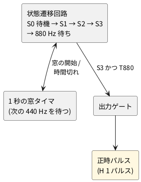

# 2-4 時報の状態遷移 — 440 Hz を 3 回数えて 880 Hz で正時パルス

全体の中の位置は [01-block.md](01-block.md) の ③ 状態遷移。T440 が 1 秒おきに 3 回来たあとに
T880 が来たら、正時パルスを 1 つ出す。

## ブロック図

入力は [03-detect.md](03-detect.md) の T440 と T880。

## 状態遷移の骨組み

| 状態 | 意味 | 次へ進む条件 | 崩れる条件 (S0 へ戻る) |
| --- | --- | --- | --- |
| S0 | 待機 | T440 が H になる | — |
| S1 | 予報音 1 回目を検出 | 約 1 秒後の窓で T440 が H になる | 窓の中で T440 が来ない |
| S2 | 予報音 2 回目を検出 | 約 1 秒後の窓で T440 が H になる | 窓の中で T440 が来ない |
| S3 | 予報音 3 回目を検出 | 約 1 秒後の窓で T880 が H になる | 窓の中で T880 が来ない |

S3 で T880 が H になった時点で、出力ゲートが正時パルスを 1 つ出し、S0 へ戻る。
窓の幅は放送局の時刻のずれと受信の遅れを見込んで、1 秒の前後に余裕を持たせる
(幅は調べて決める)。

(回路図はこれから書く)
