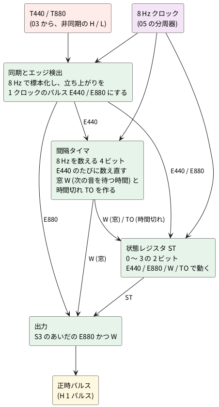
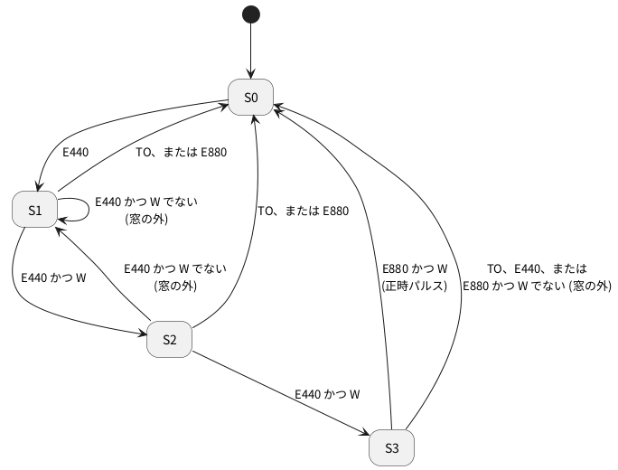

# 2-4 時報の状態遷移 — 440 Hz を 3 回数えて 880 Hz で正時パルス

> [!WARNING]
> **この題の実体配線図 (ブレッドボードとユニバーサル基板) は、まだ実際の回路で検証していない。** 配線は回路図のつながりを写し、check のネットリストで突き合わせたもので、組んで確かめてはいない。数値 (タイミング) も計算とシミュレーションで作ったもので、正しく動くかどうかは確実ではない。

全体の中の位置は [01-block.md](01-block.md) の ③ 状態遷移。T440 が 1 秒おきに 3 回来たあとに
T880 が来たら、正時パルスを 1 つ出す。

## ブロック図




入力は [03-detect.md](03-detect.md) の T440 と T880。出力は [05-clock.md](05-clock.md) の正時パルス。

図の信号の意味は、次のとおり。

| 信号 | 意味 |
| --- | --- |
| E440 | 440 Hz の音が**始まった**ことを知らせる、1 クロック (0.125 秒) のパルス |
| E880 | 880 Hz の音が**始まった**ことを知らせる、1 クロックのパルス |
| **W (窓)** | **「次の音が来てよい時間」のあいだだけ H になる信号。** 時報の予報音は 1 秒おきなので、前の E440 から約 1 秒 (0.875〜1.125 秒) のあいだだけ H になる。この時間の外に来た音は、時報の順番ではないとみなす |
| TO (時間切れ) | 前の E440 から 1.25 秒ほど待っても次の音が来なかったときに H になる。状態を待機 (S0) に戻す |
| ST (状態) | 0〜3 の数。予報音をここまで何回聞いたか (S0〜S3) を覚えている |

W は、「雑音や別の音を、時報と取り違えない」ための仕組みで、**1 秒の間隔を測る物差し**にあたる。W を H にするのは間隔タイマで、E440 が来るたびに数え直し、数が一定の範囲のときだけ H にする。

## 設計の方針

この回路は、**時間を状態と数に置き換える**。1 秒を測るのに、1 秒の単安定回路を使わず、一定の周期のクロックを数える。

- **クロックは 8 Hz**。05 の時計の分周器 (32.768 kHz ÷ 4096) の途中から取る (CD4040 の Q12)。1 クロックは 0.125 秒
- **T440 と T880 は、クロックと関係なく変わる**。D フリップフロップで 8 Hz に合わせて標本化し、もう 1 段遅らせて、立ち上がりだけを 1 クロックのパルス (E440、E880) にする
- **間隔タイマ**は、8 Hz を数える 4 ビットのカウンタ。E440 が来るたびに**値 2 を読み込む**。次の E440 までの数 (0.125 秒の何個ぶんか) を見る
- **窓 W**: 時報の予報音の間隔は 1 秒 (8 クロック)。標本化で ±1 クロックずれるので、間隔が 7〜9 クロック (0.875〜1.125 秒) のときだけ、順番どおりと認める。タイマの値で言えば 8、9、10 のとき (2 から数え始めるので、判定のゲートが少なくて済む)
- **時間切れ TO**: 数が 11 に達したら (間隔が 10 クロック以上)、順番が崩れたとして、状態を S0 に戻す
- **状態 ST**は、0〜3 の 2 ビット (S0〜S3)

## 状態の動き

| 状態 | 意味 |
| --- | --- |
| S0 | 待機 |
| S1 | 予報音 (440 Hz) を 1 回聞いた |
| S2 | 2 回聞いた |
| S3 | 3 回聞いた。880 Hz を待つ |

| イベント | 条件 | 動作 |
| --- | --- | --- |
| E440 | 状態が S1 か S2 で、**W が H** (窓のうち) | 状態を 1 つ進める。タイマを 2 から数え直す |
| E440 | 状態が S3 | **状態を S0 に戻す** (4 回目の 440 Hz は、時報の順番ではない) |
| E440 | 上以外。つまり、状態が S0、または S1 か S2 で **W が L** (窓の外) | 状態を S1 にする (数え直す)。タイマを 2 から数え直す |
| E880 | 状態が S3 で、**W が H** (窓のうち) | **正時パルスを出す。状態を S0 に戻す** |
| E880 | 上以外。つまり、状態が S3 でない、または **W が L** (窓の外) | 状態を S0 に戻す |
| 時間切れ TO | タイマの数が 11 | 状態を S0 に戻す |
| 電源投入 | — | 状態を S0 にする |

**「窓の外」とは、「W でない」(W の否定、W が L のとき) のことだ。** 状態遷移図では「W でない」と書き、日本語では「窓の外」と呼ぶ。W が H のあいだが「窓のうち」で、それ以外が「窓の外」になる。

| 言い方 | 意味 | W の値 |
| --- | --- | --- |
| 窓のうち (W) | 前の音から約 1 秒 (0.875〜1.125 秒) 後 | H |
| 窓の外 (W でない) | 早すぎる (0.875 秒より前) か、遅すぎる (1.125 秒より後) | L |

窓の外の E440 は、S0 ではなく **S1 (数え直し)** にする。雑音の音が先に来たあとに、本物の時報が続いても拾えるようにするためだ。ただし、S3 に来た E440 は、順番にない音なので S0 に戻す。




## タイミング (設計の計算値)

ふつうの時報を入れたときの様子を、設計から**計算で出した**。440 Hz が 0.04 秒、1.04 秒、2.04 秒に立ち上がり、880 Hz が 3.04 秒に立ち上がる。実機の波形ではない。TM は間隔タイマの数、ST は状態。

```logic
title: 図1 440 Hz を 3 回数えて 880 Hz で正時パルスが出る (計算)
device: ad3
window: 4s
sample: 1kHz
signals:
  CLK: dio0 clock 8Hz
  T440: dio1 edges 0s=0 40ms=1 240ms=0 1.04s=1 1.24s=0 2.04s=1 2.24s=0
  T880: dio2 edges 0s=0 3.04s=1
  TM: dio3..dio6 counter on CLK rising sequence 1 2 2 3 4 5 6 7 8 9 2 3 4 5 6 7 8 9 2 3 4 5 6 7 8 9 10 11 12 13 14 15 0
  ST: dio7..dio8 counter on CLK rising sequence 0 0 1 1 1 1 1 1 1 1 2 2 2 2 2 2 2 2 3 3 3 3 3 3 3 3 0 0 0 0 0 0 0
  OUT: dio9 edges 0s=0 3.125s=1 3.25s=0
buses:
  Timer: TM3..TM0 dec
  State: ST1..ST0 dec
cursors: [1.09375s, 3.21875s]
```


- 1 回目の E440 (0.125〜0.25 秒) で ST が 1 になり、タイマが 2 から数え始める。2 回目、3 回目も同じ間隔 (タイマは 9 まで数えて次の E440) で進み、**ST が 3 になる (2.25 秒)**
- カーソル X1 (1.094 秒) は、1 回目と 2 回目の E440 のあいだ (Timer 8、State 1)。X2 (3.219 秒) は、E880 のあいだ (Timer 9、State 3、OUT が H)
- 880 Hz の E880 (3.125〜3.25 秒) が、ST = 3 のあいだ、窓の中 (タイマ 9) で来るので、**OUT に 1 クロック (0.125 秒) のパルスが出て、ST が 0 に戻る (3.25 秒)**

### 順番が崩れたときの動き

正しい時報のほかに、**パルスを出してはいけない場合**の動きも見る。いずれも計算で、実機の波形ではない。

```logic
title: 図2 440 Hz が 4 回続くと、4 回目で待機に戻り、正時パルスは出ない (計算)
device: ad3
window: 5s
sample: 1kHz
signals:
  CLK: dio0 clock 8Hz
  T440: dio1 edges 0s=0 40ms=1 240ms=0 1.04s=1 1.24s=0 2.04s=1 2.24s=0 3.04s=1 3.24s=0
  T880: dio2 edges 0s=0 4.04s=1
  TM: dio3..dio6 counter on CLK rising sequence 1 2 2 3 4 5 6 7 8 9 2 3 4 5 6 7 8 9 2 3 4 5 6 7 8 9 2 3 4 5 6 7 8 9 10 11 12 13 14 15 0
  ST: dio7..dio8 counter on CLK rising sequence 0 0 1 1 1 1 1 1 1 1 2 2 2 2 2 2 2 2 3 3 3 3 3 3 3 3 0 0 0 0 0 0 0 0 0 0 0 0 0 0 0
  OUT: dio9 low
buses:
  Timer: TM3..TM0 dec
  State: ST1..ST0 dec
cursors: [3.1875s, 4.1875s]
```


| 見る所 | 読み値 | 意味 |
| --- | --- | --- |
| カーソル X1 (3.1875 秒) | Timer 9、State 3、T440 が H | 4 回目の 440 Hz が来ている。まだ S3 のまま |
| State の変わり目 | 0 → 1 (0.25 秒)、2 (1.25 秒)、3 (2.25 秒)、0 (3.25 秒) | 4 回目の E440 の次のクロックで S0 に戻る |
| カーソル X2 (4.1875 秒) | Timer 9、State 0、T880 が H、OUT 0 | 880 Hz が来たときは S0 なので、パルスは出ない |
| OUT の変わり目 | 0 | 正時パルスは出ない |

```logic
title: 図3 2 回目の音が 1.5 秒後に遅れると、時間切れで戻り、数え直しになる (計算)
device: ad3
window: 4.5s
sample: 1kHz
signals:
  CLK: dio0 clock 8Hz
  T440: dio1 edges 0s=0 40ms=1 240ms=0 1.54s=1 1.74s=0 2.54s=1 2.74s=0
  T880: dio2 edges 0s=0 3.54s=1 3.74s=0
  TM: dio3..dio6 counter on CLK rising sequence 1 2 2 3 4 5 6 7 8 9 10 11 12 13 2 3 4 5 6 7 8 9 2 3 4 5 6 7 8 9 10 11 12 13 14 15 0
  ST: dio7..dio8 counter on CLK rising sequence 0 0 1 1 1 1 1 1 1 1 1 1 0 0 1 1 1 1 1 1 1 1 2 2 2 2 2 2 2 2 0 0 0 0 0 0 0
  OUT: dio9 low
buses:
  Timer: TM3..TM0 dec
  State: ST1..ST0 dec
cursors: [1.4375s, 3.6875s]
```


| 見る所 | 読み値 | 意味 |
| --- | --- | --- |
| カーソル X1 (1.4375 秒) | Timer 11、State 1 | 1 回目の音から 11 クロック待った。時間切れ (TO) の瞬間 |
| State の変わり目 | 1 (0.25 秒)、0 (1.5 秒)、1 (1.75 秒)、2 (2.75 秒)、0 (3.75 秒) | 時間切れで S0 に戻り、遅れた音から S1 で数え直す |
| カーソル X2 (3.6875 秒) | Timer 9、State 2、T880 が H、OUT 0 | 数え直しの途中 (S2) で 880 Hz が来たので、パルスは出ない |
| OUT の変わり目 | 0 | 正時パルスは出ない |

この 2 つの動きは、次の「数値シミュレーション」の 4 回の 440 Hz と間隔の長い音の行に対応する。

**注意:** この計算は、T440 が約 0.2 秒 H になると置いている。[03-detect.md](03-detect.md) の計算では、
約 0.1 秒の音で T440 が H になるのは約 0.11 秒で、8 Hz の標本化の周期 (0.125 秒) より短い。
標本化の瞬間が H の外に当たると、音を取りこぼす。03 の R<sub>p</sub> や TH を見直して、H を 0.125 秒より十分長くしてから使う。

## 数値シミュレーション

この設計を、プログラム (Python) で、フリップフロップとカウンタの動きとして模して確かめた。**回路を作って測ったものではない。**

| 確かめたこと | 結果 |
| --- | --- |
| 時報が入る位相をずらして 25 通り (0〜0.125 秒) | すべて、正時パルスが 1 つだけ出る |
| 4 つの立ち上がりが、1 秒の位置から ±30 ms ずれる (4000 回) | 失敗 0 回 |
| 同じ、±100 ms ずれる (4000 回) | 失敗 270 回 (約 6.8 %) |
| 間隔が 0.5、0.6、0.7、1.3、1.5、2 秒の 440 Hz が 3 回、そのあと 880 Hz (各 500 回) | 正時パルスを出さなかった (500 回すべて) |
| 440 Hz が 1 秒おきに **4 回**、そのあと 880 Hz (500 回) | 正時パルスを出さなかった (500 回すべて) |

- 窓は ±1 クロック (±125 ms) までしか許さないので、立ち上がりが ±100 ms 以上ずれると、標本化のずれと合わさって外れることがある
- 放送の時報の間隔は正確に 1 秒なので、通常は受信側の検出の遅れのばらつき (数十 ms) が問題になる

## 回路図

回路は **4 つのユニット**に分ける。1 つのユニットは IC が 4 個以内で、フルサイズのブレッドボード 1 枚に載る大きさにした (ユニバーサル基板の大きさは「実体配線図」に書く)。ユニットの間は、同じ名前の端子どうしを線でつなぐ。

| ユニット | 役目 | IC | 入力 | 出力 |
| --- | --- | --- | --- | --- |
| 1 同期とエッジ検出 | T440・T880 を 8 Hz で標本化し、立ち上がりを 1 クロックのパルスにする | U5・U6 (74HC74)、U7 (74HC04)、U8 (74HC08) | T440、T880、CLK | E440、NE440 (E440 の反転)、E880 |
| 2 間隔タイマと窓 | E440 から次の E440 までを 8 Hz で数え、窓 W と時間切れ TO を作る | U9 (74HC163)、U10 (74HC08)、U11 (74HC02) | NE440、CLK | W、TO |
| 3 状態を動かす条件 | イベントと窓から、状態レジスタへの命令を作る | U12 (74HC86)、U13 (74HC08)、U14 (74HC32)、U15 (74HC02) | QA、QB、S3、W、TO、NE440、E440、E880、PON | LOADN、EN、CLRN |
| 4 状態レジスタと出力 | 状態 ST (QA・QB) を持ち、正時パルス OUT を出す | U16 (74HC163)、U17 (74HC08) | LOADN、EN、CLRN、CLK、E880、W | QA、QB、S3、OUT |

- CLK は 8 Hz のクロック、PON は電源投入のとき H になる信号 ([05-clock.md](05-clock.md) の電源投入のリセット)
- NE440 と LOADN、CLRN は、**L のとき働く**信号 (N は反転の印)
- すべての IC の電源は 5 V。IC の電源のピン (74HC74、74HC08 などの PIN 14、74HC163 の PIN 16) は +5V、GND のピン (PIN 7、74HC163 の PIN 8) は GND
- ゲートのピンの番号は、74HC74、74HC04、74HC08、74HC86、74HC32、74HC02 の使うゲートの番号を図に書いた (使わないゲートの入力は GND につなぐ)

### ユニット 1: 同期とエッジ検出

```circuit
title: 図4 同期とエッジ検出 (ユニット 1)
parts:
  T440: port 2,4
  T880: port 2,10
  CLK: port 2,6
  U5A:
    type: ic3
    at: 7,4
    label: 74HC74
    pins: [D, CLK, Q]
  U5B:
    type: ic3
    at: 15,4
    label: 74HC74
    pins: [D, CLK, Q]
  U6A:
    type: ic3
    at: 7,10
    label: 74HC74
    pins: [D, CLK, Q]
  U6B:
    type: ic3
    at: 15,10
    label: 74HC74
    pins: [D, CLK, Q]
  U7A: not 20,4
  U8A: and 25,4
  U7C: not 30,4
  U7B: not 20,10
  U8B: and 25,10
  E440: port 33,2
  NE440: port 37,4
  E880: port 33,10
wires:
  - 2,4 -- U5A.D
  - U5A.Q -- 11,4 -- U5B.D
  - 11,4 -- 11,2 -- 23,2
  - 23,2 |- U8A.a
  - U5B.Q -- U7A.in
  - U7A.out -| U8A.b
  - U8A.out -- 28,4 -- U7C.in
  - 28,4 -- 28,2 -- 33,2
  - U7C.out -- 37,4
  - 2,10 -- U6A.D
  - U6A.Q -- 11,10 -- U6B.D
  - 11,10 -- 11,8 -- 23,8
  - 23,8 |- U8B.a
  - U6B.Q -- U7B.in
  - U7B.out -| U8B.b
  - U8B.out -- 33,10
  - 2,6 -- 4,6 -- 7,6 -- 15,6
  - U5A.CLK -- 7,6
  - U5B.CLK -- 15,6
  - 4,6 -- 4,12 -- 7,12 -- 15,12
  - U6A.CLK -- 7,12
  - U6B.CLK -- 15,12
notes:
  - text 19.4,3.6 tiny center: "1"
  - text 20.6,3.6 tiny center: "2"
  - text 24.1,3.5 tiny center: "1"
  - text 24.1,4.6 tiny center: "2"
  - text 25.7,3.6 tiny center: "3"
  - text 29.4,3.6 tiny center: "5"
  - text 30.6,3.6 tiny center: "6"
  - text 19.4,9.6 tiny center: "3"
  - text 20.6,9.6 tiny center: "4"
  - text 24.1,9.4 tiny center: "4"
  - text 24.1,10.6 tiny center: "5"
  - text 25.7,9.6 tiny center: "6"
  - text 5.7,3.6 tiny center: "2"
  - text 8.3,3.6 tiny center: "5"
  - text 7.3,4.9 tiny center: "3"
  - text 13.7,3.6 tiny center: "12"
  - text 16.3,3.6 tiny center: "9"
  - text 15.3,4.9 tiny center: "11"
  - text 5.7,9.6 tiny center: "2"
  - text 8.3,9.6 tiny center: "5"
  - text 7.3,10.9 tiny center: "3"
  - text 13.7,9.6 tiny center: "12"
  - text 16.3,9.6 tiny center: "9"
  - text 15.3,10.9 tiny center: "11"
  - text 2,1 small left: 74HC74 は 2 個。PIN 14 は +5V、PIN 7 は GND、PIN 1・4・10・13 は +5V
style:
  pitch: 1
```


- T440 と T880 は、クロックと関係なく変わる。D フリップフロップ 2 段 (U5A→U5B、U6A→U6B) で 8 Hz に合わせ、1 段目の出力 (T4s) と 2 段目の出力 (T4d) の**差**で立ち上がりを見つける
- E440 は T4s かつ「T4d の反転」で、1 クロックの H パルス。NE440 はその反転で、ユニット 2 とユニット 3 が使う

### ユニット 2: 間隔タイマと窓

```circuit
title: 図5 間隔タイマと窓 (ユニット 2)
parts:
  NE440: port 3,1
  CLK: port 3,6.5
  U9: ic 10,5 74HC163
  VCC1: vcc 10,2 5V
  GND1: ground 10,8
  U10A: and 20,4
  U11A: nor 26,5
  U10C: and 32,3
  U10B: and 32,7
  W: port 38,7
  TO: port 38,3
wires:
  - 3,1 -| U9.LOAD
  - 3,6.5 |- U9.CLK
  - U9.VCC |- 10,2
  - U9.CLR |- 10,2
  - U9.GND |- 10,8
  - U9.A |- 5,3.5
  - U9.B |- 5,4
  - U9.C |- 5,4.5
  - U9.D |- 5,5
  - U9.ENP |- 5,5.5
  - U9.ENT |- 5,6
  - U9.QA |- U10A.a
  - U9.QB -| U10A.b
  - U10A.out -- 23,4
  - 23,4 -| U11A.a
  - U9.QC |- 24,5 -| U11A.b
  - 23,4 -- 28,4 -- 28,3
  - 28,3 |- U10C.a
  - U9.QD |- 30,5.5
  - 30,5.5 |- U10C.b
  - 30,5.5 |- U10B.a
  - U11A.out -- 28,5 |- U10B.b
  - U10C.out -- 38,3
  - U10B.out -- 38,7
notes:
  - text 4,3.5 tiny right: GND
  - text 4,4 tiny right: +5V
  - text 4,4.5 tiny right: GND
  - text 4,5 tiny right: GND
  - text 4,5.5 tiny right: +5V
  - text 4,6 tiny right: +5V
  - text 3,9 small left: B だけ +5V で、E440 のたびに値 2 を読み込む
  - text 18.9,3.5 tiny center: "1"
  - text 18.9,4.6 tiny center: "2"
  - text 20.7,3.6 tiny center: "3"
  - text 30.9,2.4 tiny center: "9"
  - text 30.9,3.6 tiny center: "10"
  - text 32.7,2.6 tiny center: "8"
  - text 30.9,6.5 tiny center: "4"
  - text 30.9,7.6 tiny center: "5"
  - text 32.7,6.6 tiny center: "6"
  - text 24.9,4.5 tiny center: "2"
  - text 24.9,5.6 tiny center: "3"
  - text 26.7,4.6 tiny center: "1"
style:
  grid: on
  pitch: 1
```


- 74HC163 (U9) は 4 ビットのカウンタ。LOAD は L のとき働く (NE440 を入れる)。**E440 のクロックの立ち上がりで、データ入力 (B = 1、A・C・D = 0、つまり値 2) を読み込む**。ほかのときは 8 Hz を数える
- m = QA かつ QB (U10A)。k = QC も m も 0 (U11A)。**W = QD かつ k** (U10B)。数が 8、9、10 のとき W が H になる
- **TO = m かつ QD** (U10C)。数が 11 になると H になる

### ユニット 3: 状態を動かす条件

```circuit
title: 図6 状態を動かす条件 (ユニット 3)
parts:
  W: port 2,1
  QA: port 2,2
  QB: port 2,4
  NE440: port 2,5
  E440: port 2,7
  E880: port 2,10
  TO: port 2,12
  S3: port 2,14
  PON: port 2,17
  U12A: xor 9,3
  U13A: and 18,3
  U14A: or 26,6
  U13B: and 26,8
  U14B: or 9,11
  U13C: and 14,15
  U14C: or 21,13
  U15A: nor 27,17
  LOADN: port 31,6
  EN: port 31,8
  CLRN: port 31,17
wires:
  - 2,2 |- U12A.a
  - 2,4 |- U12A.b
  - U12A.out -- 12,3 -| U13A.b
  - 2,1 -- 15,1 |- U13A.a
  - U13A.out -- 21,3
  - 21,3 |- U14A.b
  - 21,3 |- U13B.b
  - 2,5 |- U14A.a
  - 2,7 -- 6,7
  - 6,7 |- U13B.a
  - 6,7 |- U13C.b
  - 2,10 |- U14B.a
  - 2,12 |- U14B.b
  - U14B.out -| U14C.a
  - 2,14 |- U13C.a
  - U13C.out -- 18,15 |- U14C.b
  - U14C.out -| U15A.a
  - 2,17 |- U15A.b
  - U14A.out -- 31,6
  - U13B.out -- 31,8
  - U15A.out -- 31,17
notes:
  - text 7.8,2.4 tiny center: "1"
  - text 7.8,3.6 tiny center: "2"
  - text 9.7,2.6 tiny center: "3"
  - text 16.9,2.4 tiny center: "1"
  - text 16.9,3.6 tiny center: "2"
  - text 18.7,2.6 tiny center: "3"
  - text 24.9,5.5 tiny center: "1"
  - text 24.9,6.6 tiny center: "2"
  - text 26.7,5.6 tiny center: "3"
  - text 24.9,7.5 tiny center: "4"
  - text 24.9,8.6 tiny center: "5"
  - text 26.7,7.6 tiny center: "6"
  - text 7.8,10.4 tiny center: "4"
  - text 7.8,11.6 tiny center: "5"
  - text 9.7,10.6 tiny center: "6"
  - text 12.8,14.4 tiny center: "9"
  - text 12.8,15.6 tiny center: "10"
  - text 14.7,14.6 tiny center: "8"
  - text 19.9,12.4 tiny center: "9"
  - text 19.9,13.6 tiny center: "10"
  - text 21.7,12.6 tiny center: "8"
  - text 25.9,16.4 tiny center: "2"
  - text 25.9,17.6 tiny center: "3"
  - text 27.7,16.6 tiny center: "1"
  - text 9,19 small left: 74HC86、74HC08、74HC32、74HC02 は PIN 14 が +5V、PIN 7 が GND
style:
  pitch: 1
```


- x = QA と QB が違う (U12A) は、状態が S1 か S2 であること。ADV = W かつ x (U13A) は、「窓のうちで、状態を 1 つ進めてよい」
- LOADN = NE440 または ADV (U14A)。L のとき、状態レジスタに値 1 (S1) を読み込む。E440 で、ADV でないときだけ L になる
- EN = E440 かつ ADV (U13B)。H のとき、状態レジスタを 1 つ進める
- CLRN = NOT (E880 または TO または (S3 かつ E440) または PON)。U14B (E880 または TO)、U13C (S3 かつ E440)、U14C (OR)、U15A (NOR) で作る。L のとき、状態を 0 に戻す。**S3 かつ E440** は、状態が S3 のあいだに来た E440 (4 回目の 440 Hz) で、順番にない音として S0 に戻す

### ユニット 4: 状態レジスタと出力

```circuit
title: 図7 状態レジスタと出力 (ユニット 4)
parts:
  LOADN: port 3,1
  CLRN: port 3,2
  EN: port 3,5.5
  CLK: port 3,6.5
  U16: ic 12,5 74HC163
  GND1: ground 12,8
  U17A: and 22,4
  U17B: and 22,7
  U17C: and 32,5
  E880: port 18,7
  W: port 18,8
  OUT: port 38,5
  QA: port 38,2
  QB: port 38,9.5
  S3: port 38,3
wires:
  - 3,1 -| U16.LOAD
  - 3,2 -| U16.CLR
  - U16.VCC |- 5,3
  - U16.GND |- 12,8
  - 3,6.5 -| U16.CLK
  - 3,5.5 -- 7,5.5
  - 7,5.5 |- U16.ENP
  - 7,5.5 |- U16.ENT
  - U16.A |- 5,3.5
  - U16.B |- 5,4
  - U16.C |- 5,4.5
  - U16.D |- 5,5
  - U16.QA |- 16,4
  - 16,4 |- U17A.a
  - 16,4 -- 16,2 -- 38,2
  - U16.QB |- 16,4.5
  - 16,4.5 -| U17A.b
  - 16,4.5 -- 16,9.5 -- 38,9.5
  - 18,7 |- U17B.a
  - 18,8 |- U17B.b
  - U17A.out -- 24,4
  - 24,4 -- 28,4 |- U17C.a
  - 24,4 -- 24,3 -- 38,3
  - U17B.out -- 28,7 |- U17C.b
  - U17C.out -- 38,5
notes:
  - text 4,3.5 tiny right: +5V
  - text 4,4 tiny right: GND
  - text 4,4.5 tiny right: GND
  - text 4,5 tiny right: GND
  - text 4,3 tiny right: +5V
  - text 3,11 small left: 74HC163 は E440 のたびに値 1 (A だけ +5V) を読み込む
  - text 20.9,3.5 tiny center: "1"
  - text 20.9,4.6 tiny center: "2"
  - text 22.7,3.6 tiny center: "3"
  - text 20.9,6.5 tiny center: "4"
  - text 20.9,7.6 tiny center: "5"
  - text 22.7,6.6 tiny center: "6"
  - text 30.9,4.5 tiny center: "9"
  - text 30.9,5.6 tiny center: "10"
  - text 32.7,4.6 tiny center: "8"
  - text 9,10 small left: 74HC08 は PIN 14 が +5V、PIN 7 が GND
style:
  grid: on
  pitch: 1
```


- 74HC163 (U16) は状態 ST の 2 ビット (QA、QB)。CLRN (L で 0 に戻す)、LOADN (L で値 1 を読み込む)、EN (H で 1 つ進める) の順に優先される
- n1 = QA かつ QB (U17A) は「状態が S3」で、S3 としてユニット 3 にも出す。n2 = E880 かつ W (U17B)。**OUT = n1 かつ n2 (U17C)** が、正時パルス (1 クロックの H)
- QA と QB も、ユニット 3 に戻す

## 部品表

| 部品 | 個数 | 備考 |
| --- | --- | --- |
| 74HC74 | 2 | U5、U6 (D フリップフロップ 2 回路入り) |
| 74HC04 | 1 | U7 (インバータ 6 回路入りのうち 3 つを使う) |
| 74HC08 | 4 | U8、U10、U13、U17 (2 入力 AND、4 回路入り) |
| 74HC163 | 2 | U9 (間隔タイマ)、U16 (状態) |
| 74HC02 | 2 | U11、U15 (2 入力 NOR、4 回路入り) |
| 74HC86 | 1 | U12 (2 入力 XOR) |
| 74HC32 | 1 | U14 (2 入力 OR) |
| 0.1 µF のセラミックコンデンサ | 13 | IC ごとの電源のそば |
| 10 kΩ の抵抗 (1/4 W)・押しボタン (a 接点) | 各 1 | 試験用 (図12)。T880 のプルダウンと、T880 を H にするボタン |

IC は全部で 13 個。ユニットごとに 4 個以内なので、フルサイズのブレッドボード 1 枚に 1 ユニットを載せる。ユニバーサル基板には、ユニットごとに基板の大きさを変えて載せる (「実体配線図」)。

## 実体配線図

4 つのユニットを、フルサイズ (63 列) のブレッドボード 4 枚に 1 つずつ組む。**配線は、回路図 (図 4〜7) のピンのつながりをそのまま基板に写したもの**で、check のネットリストを回路図と突き合わせて確かめた。
基板の間は、同じ名前の端子どうしを線でつなぐ。電源 (5 V) と GND は 4 枚で共通にする。

- 線の色は、赤が + だけ、黒が GND だけ、黄が CLK、橙が基板の外とやりとりする信号、緑が基板の中の信号。
- 各 IC のそばに 0.1 µF を 1 個ずつ、上の + レールと − レールのあいだに入れる。
- 使わないゲートの入力は、GND に落とす。74HC74 の使わない PRE と CLR (PIN 1、4、10、13) は +5V に上げる。どちらも、レールからの線で描いてある。
- フルサイズの基板は、レールが中央で切れていることがある。図の中央にあるレールの渡しの線 (赤と黒) は、そのためだ。
- 74HC74、74HC86、74HC02 は、図の道具がピンの名前の表を持たないので、ピンは番号だけで出る。ピンの名前は、各ユニットの回路図の PIN の番号と合わせて読む。
- 配線は多い。読めない所は、check のネットリスト (`breadboard-fence check`) で、ピンごとのつながりを確かめる。

基板の外とやりとりする端子は、次のとおり。上下の箱は、線の出る側を表す。

| ユニット | 基板 | 入力 | 出力 |
| --- | --- | --- | --- |
| 1 | 図 8、8b | T440、T880、CLK | E440、NE440、E880 |
| 2 | 図 9、9b | NE440、CLK | W、TO |
| 3 | 図 10、10b | W、QA、QB、NE440、E440、E880、TO、S3、PON | LOADN、EN、CLRN |
| 4 | 図 11、11b | LOADN、CLRN、EN、CLK、E880、W | QA、QB、S3、OUT |

同じ 4 つのユニットを、ユニバーサル基板にも組めるようにした。ブレッドボードの図 (図 8〜11) のすぐあとに、同じ回路の図 8b〜11b を置いた。

### ユニバーサル基板の図 (図 8b〜11b) の見方

- 図は部品面から見たもの。配線は半田面で行う。厚みと基材は書いていないので 1.6 mm の FR-4
- 基板は在庫の順 (5×7 → 7×9 → 9×15 cm) に、配置と配線が収まる最初の基板を選んだ。ユニット 4 は 5×7 cm (横置きの `7x5cm`)、ユニット 2 は 7×9 cm、ユニット 1 と 3 は 9×15 cm (横置きの `15x9cm`)。ユニット 2 は 5×7 cm に IC が載るが、電源とほかの線を通すと詰まって配線が収まらなかった。ユニット 1 と 3 は IC が 4 個で、7×9 cm でも線が絡み合って追えなくなったので、9×15 cm にした。無理に詰めず基板を大きくした
- 線の色は、赤が + だけ、黒が GND だけ、黄が CLK。ほかの信号線は、たどりやすいように色を変えただけで、色に意味はない
- 線どうしが交わる所は、図の半円のところで被覆線を渡す。裸の線を重ねない。交わる所は多いので、半田付けの前に、1 本ずつ check のネットリストと照らして進める
- 各 IC のそばに 0.1 µF を 1 個ずつ、電源 (+) と GND の線のあいだに入れる。使わないゲートの入力は GND、74HC74 の使わない PRE と CLR は +5V につなぐ (ブレッドボードと同じ)
- 基板の外の電源 5V と、ほかのユニットとやりとりする信号は、箱のピンから基板の穴まで線を引いた。ここに半田付けのリード線をつなぐ
- 使わない出力 (74HC74 の /Q、74HC163 の QC・QD・RCO、74HC04 と 74HC08 の使わないゲートの出力) と、同じ IC の中だけで閉じる接続 (74HC08 の 2Y と 3B) は、ERC が「つながっていない」と言う。承知のうえなので、`points:` で `NC_` から始まる名前を付けた (この名前は図には出ない)
- 範囲の確認: 電圧は 5 V、クロックは 8 Hz、音の信号は 440 Hz と 880 Hz で、ユニバーサル基板の範囲 (12 V 以下、10 MHz 以下) に収まる
- ブレッドボードでなくユニバーサル基板にも組む理由は、時計として長く通電する作品なので、接触の揺れのない半田付けにも組めるようにするため

### 図 8・8b: ユニット 1 (同期とエッジ検出)

```bread
title: 図8 同期とエッジ検出のブレッドボード (ユニット 1)
board: full
parts:
  PS:
    type: device
    at: top
    label: 電源 5V
    pins: [+5V, GND]
  LINKT:
    type: device
    at: top
    label: 他のユニットへ (上)
    pins: [CLK, E880, E440, NE440]
  LINKR:
    type: device
    at: top
    label: 他のユニットへ (上・右)
    pins: [CLK, T440]
  LINKB:
    type: device
    at: bottom
    label: 他のユニットへ (下)
    pins: [T880, CLK]
  U6: dip14 @ e5 l=74HC74
  U8: dip14 @ e18 r180 74HC08
  U7: dip14 @ e35 r180 74HC04
  U5: dip14 @ e46 r180 l=74HC74
  C1: capacitor/ceramic +t13 -t13 100n
  C2: capacitor/ceramic +t26 -t26 100n
  C3: capacitor/ceramic +t39 -t39 100n
  C4: capacitor/ceramic +t55 -t55 100n
wires:
  - PS.+5V -- +t1 red
  - PS.GND -- -t1 black
  - +t31 -- +t33 red
  - -t31 -- -t34 black
  - +b31 -- +b33 red
  - -b31 -- -b33 black
  - +t60 -- +b60 red
  - -t60 -- -b60 black
  - +t5 -- a5 red
  - +t6 -- a6 red
  - +t9 -- a9 red
  - +b5 -- j5 red
  - +b8 -- j8 red
  - -b11 -- j11 black
  - -t18 -- a18 black
  - -b19 -- j19 black
  - -b20 -- j20 black
  - -b22 -- j22 black
  - -b23 -- j23 black
  - +b24 -- j24 red
  - -t35 -- a35 black
  - -b36 -- j36 black
  - -b38 -- j38 black
  - -b40 -- j40 black
  - +b41 -- j41 red
  - -t46 -- a46 black
  - +t49 -- a49 red
  - +t52 -- a52 red
  - +b48 -- j48 red
  - +b51 -- j51 red
  - +b52 -- j52 red
  - LINKT.CLK -- a8 yellow
  - LINKT.E880 -- a19 orange
  - LINKT.E440 -- a29 orange
  - LINKT.NE440 -- a36 orange
  - LINKR.CLK -- a50 yellow
  - LINKR.T440 -- a51 orange
  - LINKB.T880 -- j6 orange
  - LINKB.CLK -- j7 yellow
  - LINKB.CLK -- j49 yellow
  - h9 -- h3 green
  - e3 -- f3 green
  - c3 -- c7 green
  - b7 -- b21 green
  - c10 -- c14 blue
  - e14 -- f14 blue
  - i14 -- i26 blue
  - g26 -- g33 blue
  - e33 -- f33 blue
  - b33 -- b39 blue
  - c38 -- c32 purple
  - e32 -- f32 purple
  - j32 -- j25 purple
  - h25 -- h16 purple
  - e16 -- f16 purple
  - c16 -- c20 purple
  - c22 -- c29 orange
  - d29 -- d37 orange
  - b40 -- b43 brown
  - e43 -- f43 brown
  - h43 -- h28 brown
  - e28 -- f28 brown
  - b28 -- b23 brown
  - j47 -- j44 gray
  - e44 -- f44 gray
  - c44 -- c41 gray
  - b48 -- b54 pink
  - e54 -- f54 pink
  - h54 -- h50 pink
  - i50 -- i27 pink
  - e27 -- f27 pink
  - a27 -- a24 pink
```


```perf
title: 図8b 同期とエッジ検出のユニバーサル基板 (ユニット 1)
board:
  size: 15x9cm
  silk: board
  h: 1.6mm
  material: FR-4
  slots: on
points:
  NC_U6_6: j12
  NC_U6_8: k15
  NC_U7_8: am15
  NC_U7_10: ak15
  NC_U7_12: ai15
  NC_U8_8: ax15
  NC_U8_11: au15
  NC_U5_8: ab15
  NC_U5_6: aa12
parts:
  PS:
    type: device
    at: az-1
    label: 電源 5V
    pins: [GND, +5V]
  LINKT:
    type: device
    at: aa36
    label: 他ユニット
    pins: [CLK, T440, E440, NE440, E880]
  LINKB:
    type: device
    at: p-1
    label: 他ユニット
    pins: [T880, CLK]
  U8: dip14 ar15 74HC08
  U5: dip14 v15 74HC74
  U7: dip14 ag15 74HC04
  U6: dip14 e15 74HC74
  C1: capacitor/ceramic l16 l14 100n
  C2: capacitor/ceramic ac16 ac14 100n
  C3: capacitor/ceramic ag17 ai17 100n
  C4: capacitor/ceramic ar17 at17 100n
wires:
  - PS.GND -- az1 black
  - PS.+5V -- ba1 red
  - LINKT.CLK -- aa33 yellow
  - LINKT.T440 -- ab33 blue
  - LINKT.E440 -- ac33 blue
  - LINKT.NE440 -- ad33 purple
  - LINKT.E880 -- ae33 brown
  - LINKB.T880 -- p1 green
  - LINKB.CLK -- q1 yellow
  - e15 -- e30 red
  - e15 -- f15 red
  - e15 -- d15 red
  - d15 -- d12 red
  - d12 -- e12 red
  - i15 -- i16 red
  - i16 -- i30 red
  - h12 -- h13 red
  - h13 -- e13 red
  - e13 -- e12 red
  - l16 -- i16 red
  - v15 -- v30 red
  - v15 -- w15 red
  - v15 -- u15 red
  - u15 -- u12 red
  - u12 -- v12 red
  - z15 -- z16 red
  - z16 -- z30 red
  - y12 -- y13 red
  - y13 -- v13 red
  - v13 -- v12 red
  - ac16 -- z16 red
  - ag15 -- ag17 red
  - ag17 -- ag30 red
  - ar15 -- ar17 red
  - ar17 -- ar30 red
  - ba1 -- ba30 red
  - e30 -- i30 red
  - i30 -- v30 red
  - v30 -- z30 red
  - z30 -- ag30 red
  - ag30 -- ar30 red
  - ar30 -- ba30 red
  - k12 -- l12 black
  - l12 -- l4 black
  - l14 -- l12 black
  - ab12 -- ac12 black
  - ac12 -- ac4 black
  - ac14 -- ac12 black
  - ah16 -- ai16 black
  - ai16 -- aj16 black
  - aj16 -- al16 black
  - al16 -- an16 black
  - ah15 -- ah16 black
  - aj15 -- aj16 black
  - al15 -- al16 black
  - an16 -- an12 black
  - am12 -- an12 black
  - an12 -- an4 black
  - ai17 -- ai16 black
  - as16 -- at16 black
  - at16 -- av16 black
  - av16 -- aw16 black
  - aw16 -- ay16 black
  - as15 -- as16 black
  - at15 -- at16 black
  - av15 -- av16 black
  - aw15 -- aw16 black
  - ay16 -- ay12 black
  - ax12 -- ay12 black
  - ay12 -- ay4 black
  - at17 -- at16 black
  - az1 -- az4 black
  - l4 -- ac4 black
  - ac4 -- an4 black
  - an4 -- ay4 black
  - ay4 -- az4 black
  - w12 -- w10 blue
  - w10 -- t10 blue
  - t10 -- t32 blue
  - t32 -- ab32 blue
  - ab32 -- ab33 blue
  - z12 -- z14 green
  - z14 -- x14 green
  - x14 -- x15 green
  - x15 -- x18 green
  - x18 -- aq18 green
  - aq18 -- aq12 green
  - aq12 -- ar12 green
  - ai12 -- ai8 orange
  - ai8 -- m8 orange
  - m8 -- m17 orange
  - m17 -- j17 orange
  - j17 -- j15 orange
  - y15 -- y31 yellow
  - y31 -- c31 yellow
  - c31 -- c10 yellow
  - c10 -- g10 yellow
  - g10 -- g12 yellow
  - g10 -- g2 yellow
  - g2 -- q2 yellow
  - q2 -- q1 yellow
  - f12 -- f1 green
  - f1 -- p1 green
  - aw12 -- aw10 brown
  - aw10 -- az10 brown
  - az10 -- az33 brown
  - az33 -- ae33 brown
  - al12 -- al10 purple
  - al10 -- ao10 purple
  - ao10 -- ao31 purple
  - ao31 -- ad31 purple
  - ad31 -- ad33 purple
  - i12 -- i14 orange
  - i14 -- g14 orange
  - g14 -- g15 orange
  - i12 -- i3 orange
  - i3 -- au3 orange
  - au3 -- au12 orange
  - at12 -- at9 blue
  - at9 -- ap9 blue
  - ap9 -- ak9 blue
  - ak9 -- ak12 blue
  - ap9 -- ap32 blue
  - ap32 -- ac32 blue
  - ac32 -- ac33 blue
  - aa15 -- aa17 pink
  - aa17 -- af17 pink
  - af17 -- af12 pink
  - af12 -- ag12 pink
  - x12 -- x9 yellow
  - x9 -- n9 yellow
  - n9 -- n18 yellow
  - n18 -- h18 yellow
  - h18 -- h15 yellow
  - n18 -- n33 yellow
  - n33 -- aa33 yellow
  - av12 -- av8 white
  - av8 -- aj8 white
  - aj8 -- aj12 white
  - as12 -- as7 purple
  - as7 -- ah7 purple
  - ah7 -- ah12 purple
```


- 図 8b: 9×15 cm のユニバーサル基板を横に置く (54 列 × 33 行)。+ の筋を上 (30 行)、GND の筋を下 (4 行) に通し、IC は左から U6 が `e15`、U5 が `v15`、U7 が `ag15`、U8 が `ar15` に向きをそろえて 1 列に並べた (回していない)。74HC74 の 1Q→2D と 1PRE→1CLR は胴の下 (半田面) で結ぶ。交差は 29 か所。check のネットリストは図 8 と同じ

- IC は 74HC74 が 2 個 (U5、U6)、74HC04 (U7)、74HC08 (U8)。CLK は 4 つのフリップフロップの CLK ピン (PIN 3、11) へ、箱の CLK から 1 本ずつ引く。

### 図 9・9b: ユニット 2 (間隔タイマと窓)

```bread
title: 図9 間隔タイマと窓のブレッドボード (ユニット 2)
board: full
parts:
  PS:
    type: device
    at: top
    label: 電源 5V
    pins: [+5V, GND]
  LINKT:
    type: device
    at: top
    label: 他のユニットへ (上)
    pins: [W, NE440]
  LINKB:
    type: device
    at: bottom
    label: 他のユニットへ (下)
    pins: [TO, CLK]
  U11: dip14 @ e5 r180 l=74HC02
  U10: dip14 @ e13 r180 74HC08
  U9: dip16 @ e23 74HC163
  C1: capacitor/ceramic +t10 -t10 100n
  C2: capacitor/ceramic +t18 -t18 100n
  C3: capacitor/ceramic +t26 -t26 100n
wires:
  - PS.+5V -- +t1 red
  - PS.GND -- -t1 black
  - +t2 -- +b2 red
  - -t3 -- -b3 black
  - +t31 -- +t33 red
  - -t31 -- -t33 black
  - +b31 -- +b33 red
  - -b31 -- -b33 black
  - -t5 -- a5 black
  - -t6 -- a6 black
  - -t7 -- a7 black
  - -b5 -- j5 black
  - -b6 -- j6 black
  - -b8 -- j8 black
  - -b9 -- j9 black
  - +b11 -- j11 red
  - -t13 -- a13 black
  - -b17 -- j17 black
  - -b18 -- j18 black
  - +b19 -- j19 red
  - +t23 -- a23 red
  - +t29 -- a29 red
  - +b23 -- j23 red
  - -b25 -- j25 black
  - +b26 -- j26 red
  - -b27 -- j27 black
  - -b28 -- j28 black
  - +b29 -- j29 red
  - -b30 -- j30 black
  - LINKT.W -- a14 orange
  - LINKT.NE440 -- a30 orange
  - LINKB.TO -- j13 orange
  - LINKB.CLK -- j24 yellow
  - b25 -- b19 green
  - c26 -- c18 green
  - b11 -- b15 green
  - c10 -- c17 green
  - a10 -- a12 green
  - d12 -- g12 green
  - i12 -- i14 green
  - b27 -- b31 green
  - d31 -- g31 green
  - i31 -- i22 green
  - j22 -- j20 green
  - h20 -- h4 green
  - d4 -- g4 green
  - b4 -- b9 green
  - c28 -- c32 green
  - d32 -- g32 green
  - h32 -- h21 green
  - d21 -- g21 green
  - a21 -- a16 green
  - i21 -- i15 green
```


```perf
title: 図9b 間隔タイマと窓のユニバーサル基板 (ユニット 2)
board:
  size: 7x9cm
  h: 1.6mm
  material: FR-4
  slots: on
points:
  NC_U11_4: i9
  NC_U11_10: f10
  NC_U11_13: f7
  NC_U10_11: r13
  NC_U9_15: h23
parts:
  PS:
    type: device
    at: -b17
    label: 電源 5V
    pins: [GND, +5V]
  LINKT:
    type: device
    at: -b5
    label: 他ユニット
    pins: [W, NE440]
  LINKB:
    type: device
    at: -b25
    label: 他ユニット
    pins: [CLK, TO]
  U11: dip14 f6 74HC02
  U9: dip16 h24 r180 74HC163
  U10: dip14 r16 r180 74HC08
  C1: capacitor/ceramic g15 g13 100n
  C2: capacitor/ceramic t18 t16 100n
  C3: capacitor/ceramic e15 e13 100n
wires:
  - PS.GND -- a17 black
  - PS.+5V -- a18 red
  - LINKT.W -- a5 purple
  - LINKT.NE440 -- a6 orange
  - LINKB.CLK -- a25 yellow
  - LINKB.TO -- a26 brown
  - m6 -- m12 pink
  - m6 -- i6 pink
  - o12 -- m12 pink
  - i7 -- l7 orange
  - l9 -- l7 orange
  - l9 -- l14 orange
  - l9 -- s9 orange
  - r11 -- s11 orange
  - s11 -- s9 orange
  - l14 -- o14 orange
  - h20 -- j20 blue
  - j20 -- j8 blue
  - j8 -- i8 blue
  - f11 -- e11 black
  - f11 -- f12 black
  - e13 -- d13 black
  - e13 -- e11 black
  - e13 -- g13 black
  - t16 -- t14 black
  - o8 -- o4 black
  - o8 -- o10 black
  - o8 -- t8 black
  - g13 -- i13 black
  - d19 -- d22 black
  - d19 -- e19 black
  - d19 -- d17 black
  - e19 -- e20 black
  - t8 -- t14 black
  - i10 -- i11 black
  - i11 -- i12 black
  - o4 -- e4 black
  - t14 -- r14 black
  - e9 -- e11 black
  - e9 -- e4 black
  - e9 -- f9 black
  - i12 -- i13 black
  - f8 -- f9 black
  - r14 -- r15 black
  - d17 -- e17 black
  - d17 -- a17 black
  - d17 -- d13 black
  - d22 -- e22 black
  - g15 -- e15 red
  - g15 -- i15 red
  - c21 -- c24 red
  - c21 -- e21 red
  - c21 -- c18 red
  - t18 -- t24 red
  - t18 -- r18 red
  - e18 -- c18 red
  - i15 -- i18 red
  - e25 -- e24 red
  - e25 -- h25 red
  - f6 -- c6 red
  - h18 -- i18 red
  - c15 -- c18 red
  - c15 -- e15 red
  - c15 -- c6 red
  - h25 -- h24 red
  - r16 -- r18 red
  - h24 -- t24 red
  - c18 -- a18 red
  - c24 -- e24 red
  - e23 -- a23 yellow
  - a25 -- a23 yellow
  - h16 -- h17 orange
  - h16 -- a16 orange
  - a6 -- a16 orange
  - k19 -- k17 green
  - k19 -- h19 green
  - k13 -- o13 green
  - k13 -- k17 green
  - k17 -- s17 green
  - r12 -- s12 green
  - s12 -- s17 green
  - o15 -- m15 white
  - m15 -- m21 white
  - h21 -- m21 white
  - o16 -- o22 blue
  - o22 -- h22 blue
  - n11 -- n5 purple
  - n11 -- o11 purple
  - a5 -- n5 purple
  - v26 -- a26 brown
  - v26 -- v10 brown
  - v10 -- r10 brown
```


- 図 9b: 7×9 cm のユニバーサル基板 (26 列 × 31 行)。IC は U11 が `f6`、U9 が `h24`、U10 が `r16` (U9・U10 は 180 度回した)。交差は 20 か所。check のネットリストは図 9 と同じ

- 74HC163 (U9) のデータ入力は、B (PIN 4) だけ +5V、A・C・D (PIN 3、5、6) は GND で、値 2 を読み込む。CLR (PIN 1)、ENP (PIN 7)、ENT (PIN 10) は +5V。

### 図 10・10b: ユニット 3 (状態を動かす条件)

```bread
title: 図10 状態を動かす条件のブレッドボード (ユニット 3)
board: full
parts:
  PS:
    type: device
    at: top
    label: 電源 5V
    pins: [+5V, GND]
  LINKT:
    type: device
    at: top
    label: 他のユニットへ (上)
    pins: [PON, CLRN, TO, E880, LOADN, NE440, EN, E440, W, QB, QA]
  LINKB:
    type: device
    at: bottom
    label: 他のユニットへ (下)
    pins: [S3]
  U15: dip14 @ e3 r180 l=74HC02
  U14: dip14 @ e12 r180 74HC32
  U13: dip14 @ e21 r180 74HC08
  U12: dip14 @ e34 r180 l=74HC86
  C1: capacitor/ceramic +b10 -b10 100n
  C2: capacitor/ceramic +b19 -b19 100n
  C3: capacitor/ceramic +b28 -b28 100n
  C4: capacitor/ceramic +b41 -b41 100n
wires:
  # 電源とレール
  - PS.+5V -- +t1 red
  - PS.GND -- -t1 black
  - +t30 -- +t32 red
  - -t30 -- -t32 black
  - +b30 -- +b32 red
  - -b30 -- -b32 black
  - +t44 -- +b44 red
  - -t44 -- -b44 black
  # U15 74HC02 の電源と使わない入力
  - -t3 -- a3 black
  - -t4 -- a4 black
  - -t5 -- a5 black
  - -b3 -- j3 black
  - -b4 -- j4 black
  - -b6 -- j6 black
  - -b7 -- j7 black
  - +b9 -- j9 red
  # U14 74HC32
  - -t12 -- a12 black
  - -b16 -- j16 black
  - -b17 -- j17 black
  - +b18 -- j18 red
  # U13 74HC08
  - -t21 -- a21 black
  - -b25 -- j25 black
  - -b26 -- j26 black
  - +b27 -- j27 red
  # U12 74HC86
  - -t34 -- a34 black
  - -t36 -- a36 black
  - -t37 -- a37 black
  - -b35 -- j35 black
  - -b36 -- j36 black
  - -b38 -- j38 black
  - -b39 -- j39 black
  - +b40 -- j40 red
  # 他のユニットとの線
  - LINKT.PON -- a7 orange
  - LINKT.CLRN -- a9 orange
  - LINKT.TO -- a14 orange
  - LINKT.E880 -- a15 orange
  - LINKT.LOADN -- a16 orange
  - LINKT.NE440 -- a18 orange
  - LINKT.EN -- a22 orange
  - LINKT.E440 -- a24 orange
  - LINKT.W -- a27 orange
  - LINKT.QB -- a39 orange
  - LINKT.QA -- a40 orange
  - LINKB.S3 -- j22 orange
  # E440 を U13 の 10 番へ (28 列で下へ渡る)
  - c24 -- c28 orange
  - d28 -- g28 orange
  - h28 -- h23 orange
  # U14 3Y (8 番) → U15 1A (2 番) (10 列で上へ渡る)
  - i12 -- i10 green
  - g10 -- d10 green
  - c10 -- c8 green
  # U14 2Y (6 番) → U14 3A (9 番) (11 列で下へ渡る)
  - c13 -- c11 green
  - d11 -- g11 green
  - h11 -- h13 green
  # U13 3Y (8 番) → U14 3B (10 番)
  - i21 -- i14 green
  # U13 1Y (3 番) → U14 1B (2 番)・U13 2B (5 番)
  - c17 -- c23 green
  - b23 -- b25 green
  # U12 1Y (3 番) → U13 1B (2 番)
  - b26 -- b38 green
```


```perf
title: 図10b 状態を動かす条件のユニバーサル基板 (ユニット 3)
board:
  size: 15x9cm
  silk: board
  h: 1.6mm
  material: FR-4
  slots: on
points:
  NC_U15_10: av20
  NC_U15_13: as20
  NC_U15_4: au17
  U14_9_6: ai20
  NC_U14_11: ag20
  NC_U12_8: j20
  NC_U12_11: g20
  NC_U12_6: i17
  NC_U13_11: s20
parts:
  PS:
    type: device
    at: a36
    label: 電源 5V
    pins: [GND, +5V]
  LINKT:
    type: device
    at: t-1
    label: 他ユニット
    pins: [QA, QB, W, EN, E440, NE440, LOADN, E880, TO, CLRN, PON]
  LINKB:
    type: device
    at: u36
    label: 他ユニット
    pins: [S3]
  U15: dip14 ar20 74HC02
  U14: dip14 ad20 74HC32
  U12: dip14 d20 74HC86
  U13: dip14 p20 74HC08
  C1: capacitor/ceramic b25 b23 100n
  C2: capacitor/ceramic n25 n23 100n
  C3: capacitor/ceramic ab25 ab23 100n
  C4: capacitor/ceramic ap25 ap23 100n
wires:
  - PS.+5V -- b33 red
  - PS.GND -- a33 black
  - LINKT.QA -- t1 pink
  - LINKT.QB -- u1 green
  - LINKT.W -- v1 pink
  - LINKT.EN -- w1 green
  - LINKT.E440 -- x1 blue
  - LINKT.NE440 -- y1 blue
  - LINKT.LOADN -- z1 purple
  - LINKT.E880 -- aa1 brown
  - LINKT.TO -- ab1 white
  - LINKT.CLRN -- ac1 blue
  - LINKT.PON -- ad1 orange
  - LINKB.S3 -- u33 orange
  - a33 -- a23 black
  - a23 -- b23 black
  - b23 -- e23 black
  - e23 -- i23 black
  - i23 -- k23 black
  - k23 -- n23 black
  - n23 -- q23 black
  - q23 -- w23 black
  - w23 -- ab23 black
  - ab23 -- ae23 black
  - ae23 -- ak23 black
  - ak23 -- ap23 black
  - ap23 -- at23 black
  - at23 -- ay23 black
  - e23 -- e20 black
  - e20 -- f20 black
  - i23 -- i20 black
  - i20 -- h20 black
  - k23 -- k17 black
  - k17 -- k16 black
  - k16 -- h16 black
  - h16 -- h17 black
  - h17 -- g17 black
  - k17 -- j17 black
  - q23 -- q20 black
  - q20 -- r20 black
  - w23 -- w17 black
  - w17 -- v17 black
  - ae23 -- ae20 black
  - ae20 -- af20 black
  - ak23 -- ak17 black
  - ak17 -- aj17 black
  - at23 -- at20 black
  - at20 -- au20 black
  - ay23 -- ay20 black
  - ay20 -- ay17 black
  - ay17 -- ax17 black
  - ax17 -- aw17 black
  - aw17 -- av17 black
  - ay20 -- ax20 black
  - ax20 -- aw20 black
  - b33 -- b25 red
  - b25 -- d25 red
  - d25 -- n25 red
  - n25 -- p25 red
  - p25 -- ab25 red
  - ab25 -- ad25 red
  - ad25 -- ap25 red
  - ap25 -- ar25 red
  - d25 -- d20 red
  - p25 -- p20 red
  - ad25 -- ad20 red
  - ar25 -- ar20 red
  - f17 -- f15 white
  - f15 -- q15 white
  - q15 -- q17 white
  - r17 -- r15 brown
  - r15 -- t15 brown
  - t15 -- ae15 brown
  - ae15 -- ae17 brown
  - t17 -- t15 brown
  - v20 -- v21 yellow
  - v21 -- ah21 yellow
  - ah21 -- ah20 yellow
  - ai17 -- ai16 purple
  - ai16 -- al16 purple
  - al16 -- al22 purple
  - al22 -- ai22 purple
  - ai22 -- ai20 purple
  - aj20 -- aj21 green
  - aj21 -- am21 green
  - am21 -- am15 green
  - am15 -- as15 green
  - as15 -- as17 green
  - u33 -- u20 orange
  - d17 -- d2 pink
  - d2 -- t2 pink
  - t2 -- t1 pink
  - e17 -- e3 green
  - e3 -- u3 green
  - u3 -- u1 green
  - p17 -- p4 pink
  - p4 -- v4 pink
  - v4 -- v1 pink
  - s17 -- s5 blue
  - s5 -- x5 blue
  - x5 -- x22 blue
  - x22 -- t22 blue
  - t22 -- t20 blue
  - x5 -- x1 blue
  - u17 -- u6 green
  - u6 -- w6 green
  - w6 -- w1 green
  - at17 -- at2 orange
  - at2 -- ad2 orange
  - ad2 -- ad1 orange
  - ar17 -- ar3 blue
  - ar3 -- ac3 blue
  - ac3 -- ac1 blue
  - ah17 -- ah4 white
  - ah4 -- ab4 white
  - ab4 -- ab1 white
  - ag17 -- ag5 brown
  - ag5 -- aa5 brown
  - aa5 -- aa1 brown
  - af17 -- af6 purple
  - af6 -- z6 purple
  - z6 -- z1 purple
  - ad17 -- ad7 blue
  - ad7 -- y7 blue
  - y7 -- y1 blue
```


- 図 10b: 9×15 cm のユニバーサル基板を横に置く (54 列 × 33 行)。IC は U12 が `d20`、U13 が `p20`、U14 が `ad20`、U15 が `ar20` で、信号の流れの順に横一列に並べた。+5V と GND の筋は IC の上側に、他ユニットへの線は IC の下側にまとめ、交差は 22 か所。check のネットリストは図 10 と同じ

- IC は 74HC86 (U12)、74HC08 (U13)、74HC32 (U14)、74HC02 (U15)。入力が 9 本と出力が 3 本ある。入力は上の箱、S3 だけ下の箱から入れる。

### 図 11・11b: ユニット 4 (状態レジスタと出力)

```bread
title: 図11 状態レジスタと出力のブレッドボード (ユニット 4)
board: half
parts:
  PS:
    type: device
    at: top
    label: 電源 5V
    pins: [+5V, GND]
  LINKT:
    type: device
    at: top
    label: 他のユニットへ (上)
    pins: [EN, CLK, CLRN, S3, OUT]
  LINKB:
    type: device
    at: bottom
    label: 他のユニットへ (下)
    pins: [LOADN, QB, QA, E880, W]
  U16: dip16 @ e5 r180 74HC163
  U17: dip14 @ e16 74HC08
  C1: capacitor/ceramic +b14 -b14 100n
  C2: capacitor/ceramic +t14 -t14 100n
wires:
  - PS.+5V -- +t1 red
  - PS.GND -- -t1 black
  - -t25 -- -b25 black
  - +t26 -- +b26 red
  - -t5 -- a5 black
  - -t7 -- a7 black
  - -t8 -- a8 black
  - -t9 -- a9 black
  - +t10 -- a10 red
  - j12 -- +b12 red
  - +t16 -- a16 red
  - -t17 -- a17 black
  - -t18 -- a18 black
  - j22 -- -b22 black
  - LINKT.EN -- a3 orange
  - c3 -- c6 orange
  - d3 -- g3 orange
  - h3 -- h6 orange
  - LINKT.CLK -- a11 yellow
  - LINKT.CLRN -- a12 orange
  - LINKB.LOADN -- j5 orange
  - LINKB.QB -- j9 orange
  - LINKB.QA -- j10 orange
  - h10 -- h16 orange
  - i9 -- i17 orange
  - j18 -- j15 orange
  - g15 -- d15 orange
  - c15 -- c21 orange
  - LINKT.S3 -- a21 orange
  - LINKT.OUT -- a22 orange
  - LINKB.E880 -- j19 orange
  - LINKB.W -- j20 orange
  - h21 -- h23 green
  - g23 -- d23 green
  - b23 -- b20 green
```


```perf
title: 図11b 状態レジスタと出力のユニバーサル基板 (ユニット 4)
board:
  size: 7x5cm
  silk: board
  h: 1.6mm
  material: FR-4
  slots: on
points:
  NC_U16_11: q10
  NC_U16_12: p10
  NC_U16_15: m10
  U17_6_10: f13
  NC_U17_11: h10
parts:
  PS:
    type: device
    at: s-1
    label: 電源 5V
    pins: [+5V, GND]
  LINKT:
    type: device
    at: j-1
    label: 他ユニット
    pins: [OUT, S3, CLRN, CLK, EN]
  LINKB:
    type: device
    at: h21
    label: 他ユニット
    pins: [W, E880, QB, QA, LOADN]
  U17: dip14 k10 r180 74HC08
  U16: dip16 l10 74HC163
  C1: capacitor/ceramic j6 j8 100n
  C2: capacitor/ceramic k5 i5 100n
wires:
  - PS.+5V -- s1 red
  - PS.GND -- t1 black
  - LINKT.OUT -- j1 blue
  - LINKT.S3 -- k1 orange
  - LINKT.CLRN -- l1 blue
  - LINKT.CLK -- m1 yellow
  - LINKT.EN -- n1 purple
  - LINKB.W -- h18 pink
  - LINKB.E880 -- i18 brown
  - LINKB.QB -- j18 white
  - LINKB.QA -- k18 orange
  - LINKB.LOADN -- l18 green
  - k18 -- k13 orange
  - k13 -- n13 orange
  - n13 -- n10 orange
  - j15 -- j13 white
  - j15 -- j18 white
  - j15 -- o15 white
  - o15 -- o10 white
  - f2 -- f8 orange
  - f2 -- k2 orange
  - f10 -- f8 orange
  - i15 -- c15 orange
  - i15 -- i13 orange
  - c15 -- c8 orange
  - k2 -- k1 orange
  - c8 -- f8 orange
  - h16 -- h13 brown
  - h16 -- i16 brown
  - i18 -- i16 brown
  - g18 -- h18 pink
  - g18 -- g13 pink
  - f14 -- b14 green
  - f14 -- f13 green
  - g7 -- g10 green
  - g7 -- b7 green
  - b7 -- b14 green
  - p7 -- o7 black
  - p7 -- q7 black
  - i5 -- i8 black
  - i5 -- g5 black
  - g5 -- g3 black
  - g5 -- d5 black
  - o3 -- o7 black
  - o3 -- g3 black
  - o3 -- s3 black
  - i8 -- j8 black
  - i8 -- i10 black
  - i10 -- j10 black
  - d13 -- e13 black
  - d13 -- d5 black
  - t3 -- t1 black
  - t3 -- s3 black
  - s3 -- s7 black
  - j1 -- e1 blue
  - e10 -- e1 blue
  - s2 -- s1 red
  - s2 -- q2 red
  - q2 -- q5 red
  - k6 -- k5 red
  - k6 -- k10 red
  - k6 -- j6 red
  - k10 -- l10 red
  - q5 -- n5 red
  - k5 -- n5 red
  - n5 -- n7 red
  - l7 -- l1 blue
  - m1 -- m7 yellow
  - r5 -- r7 purple
  - r5 -- r1 purple
  - r5 -- u5 purple
  - r11 -- u11 purple
  - r11 -- r10 purple
  - u11 -- u5 purple
  - r1 -- n1 purple
  - s18 -- s10 green
  - s18 -- l18 green
```


- 図 11b: 5×7 cm のユニバーサル基板を横に置く (24 列 × 18 行)。IC は U16 が `l10`、U17 が `k10` (U17 は 180 度回した)。交差は 21 か所。check のネットリストは図 11 と同じ

- 74HC163 (U16) のデータ入力は、A (PIN 3) だけ +5V、B〜D は GND で、値 1 を読み込む。ENP (PIN 7) と ENT (PIN 10) は、EN を 1 本の線で受ける。

## Analog Discovery 3 で試験する

**計器は Analog Discovery 3 (AD3) 1 台。** 電源は Supplies の V+ (5 V)、クロックは Wavegen W1、T440 は Wavegen W2、見るのは Scope の 2 ch (T440 と OUT)。
ブロック全体の 74HC は 13 個で、8 Hz の遅い動作なので、電流は目安で 1 mA に満たず、V+ の 50 mA (USB 給電で 250 mW) に収まる。
T880 は 3 回目の T440 のあと、+5 V の線を押しボタンで触れて H にする。AD3 の DIO は 3.3 V の出力で、74HC (5 V) の H の下限 3.5 V に届かないので使わない。
本物の T440・T880 は検出の回路 ([03-detect.md](03-detect.md)) が作る。ここでは、それが無くても状態遷移だけを試験できるようにする。

```breadboard
title: 図12 AD3 と基板 1〜4 の端子 (試験用のつなぎ)
board: half
parts:
  S1: switch d8 d12
  R1: resistor b8 b10 10k
  AD:
    type: device
    at: top
    label: Analog Discovery 3
    pins: [V+, GND, W1, W2, "1+", "2+", "1-", "2-"]
  LINK:
    type: device
    at: bottom
    label: 基板 1〜4 の端子
    pins: [CLK, T440, T880, OUT, GND, +5V]
wires:
  - AD.V+ -- +t2 red
  - AD.GND -- -t3 black
  - LINK.+5V -- +t26 red
  - LINK.GND -- -t25 black
  - AD.W1 -- a4 yellow
  - LINK.CLK -- e4 yellow
  - AD.W2 -- a6 orange
  - AD.1+ -- a7 orange
  - c6 -- c7 orange
  - LINK.T440 -- e6 orange
  - LINK.T880 -- e8 green
  - a10 -- -t10 black
  - a12 -- +t12 red
  - AD.2+ -- a14 blue
  - LINK.OUT -- e14 blue
  - AD.1- -- -t16 black
  - AD.2- -- -t18 black
```


- 基板 1〜4 の電源 (5 V と GND) と、4 枚のブレッドボードの間の信号は、これまでの図のとおり。AD3 とつなぐのは、基板 1 の CLK・T440・T880 の入力と、基板 4 の OUT の出力
- 押しボタン S1 (12 列) は +5 V につなぎ、T880 (8 列) へ渡す。R1 (10 kΩ) は、押さないとき T880 を L に保つプルダウン

| 計器 | 設定 |
| --- | --- |
| Supplies | V+ = 5 V、Master Enable を入れる |
| Wavegen | W1: Square、8 Hz、Amplitude 2.5 V、Offset 2.5 V (0〜5 V)。W2: Pulse、1 Hz、Amplitude 2.5 V、Offset 2.5 V、Duty 20 % (幅 0.2 s)、Burst の回数 3 (1 秒おきに 3 回だけ出る) |
| Scope | CH1 = T440、CH2 = OUT。500 ms/div、Trigger は CH1 の立ち上がり、Mode は Normal (単発で測る)。1 回目の T440 が t = 0 |

図13 は、T440 の 3 回のあと T880 を触れたときの見えるはずの画面で、図1 (計算) と同じ時刻を CH1・CH2 で見たもの。
**OUT は T880 のあとの 3.125〜3.25 秒に 1 クロック (0.125 秒) だけ H になる。** 4 回目の T440 を出したり、間隔を 1.5 秒にしたりすると、OUT は出ない (図2・図3)。

```scope
title: 図13 T440 (CH1) が 3 回来たあと、OUT (CH2) に 0.125 s のパルスが 1 つ
time: 500ms/div
trigger: ch1 rising 2.5V at -5div
ch1: {wave: "= 5V * (step(t - 40ms) - step(t - 240ms) + step(t - 1.04s) - step(t - 1.24s) + step(t - 2.04s) - step(t - 2.24s))", range: 2V/div, position: 1div}
ch2: {wave: "= 5V * (step(t - 3.125s) - step(t - 3.25s))", range: 2V/div, position: -3div}
cursors: [1.5s, 3.2s]
measure: [vmax, vmin]
```


