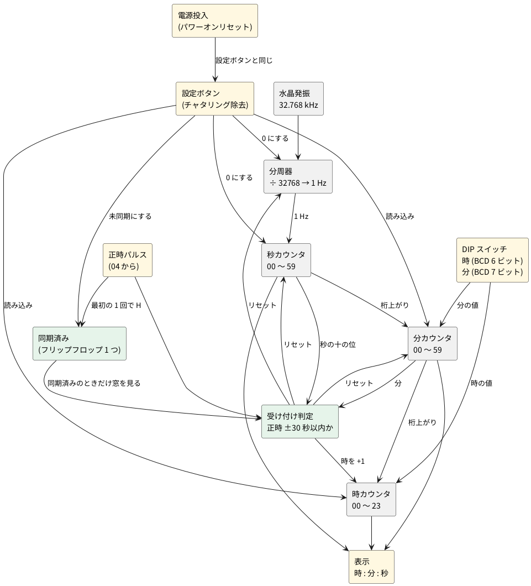

# 2-5 時計 — 32.768 kHz を数えて時分秒を出し、正時パルスで合わせる

> [!WARNING]
> **この題は、まだ実際の回路で検証していない。** 回路図・実体配線図・波形・数値は、設計から計算と見積りで作ったもので、組んで測ったものではない。水晶の負荷容量、パワーオンの時間、表示の電流は典型値からの見積りだ。組むときは、ユニットごとに確かめながら進めてほしい。

全体の中の位置は [01-block.md](01-block.md) の ④ 時計。水晶の 32.768 kHz を分周して 1 Hz にし、
時・分・秒を数えて表示する。[04-state-machine.md](04-state-machine.md) の正時パルスが来たら、
時計を正時に合わせる。

## ブロック図




## 時刻の初期設定 — 時と分は DIP スイッチで、秒は最初の正時パルスで

時報には時刻の情報が無い (正時を知らせるだけ) ので、**時と分は人が DIP スイッチで合わせる**。
DIP スイッチは BCD で、時が 6 ビット (十の位 2 + 一の位 4)、分が 7 ビット (十の位 3 + 一の位 4)
の計 13 本。利用者は今の時刻を DIP に入れ、**設定ボタンを押しているあいだに**時計へ読み込む
(カウンタの並列ロード)。そのとき秒と分周器は 0 になり、ボタンを離すと時計が動き出す。
ボタンは 0.125 秒 (8 Hz のクロックの 1 周期) 以上押す。これより短いと、クロックの立ち上がりを逃して読み込めない。

電源を入れた直後や設定ボタンを押した直後は、DIP の値が実際の時刻から数秒〜数十秒ずれる。
正時の窓 (次の節) の外のパルスは捨てるので、窓のままでは同期できないことがある。
そこで、**未同期のあいだは窓を見ず、最初の正時パルスを必ず受け付ける**。

1. 電源を入れる、または設定ボタンを押すと、DIP の値を読み込んで「未同期」になる。
   「未同期」の LED が点く。
2. 最初の正時パルスが来たら、分・秒・分周器を 0 にする。
   **時計の分が 30 以上なら時を +1 する** (正時に最も近い時へ丸める)。
3. 「同期済み」のフリップフロップを 1 にする (LED が消える)。以後は窓が有効になる。

| 状態 | 正時パルスの扱い |
| --- | --- |
| 未同期 | 窓を見ずに受け付ける。分・秒・分周器を 0 にし、分が 30 以上なら時を +1。同期済みにする |
| 同期済み | 次の節の窓の中だけ受け付ける |

「分が 30 以上」は、分の十の位 (BCD で 0〜5) が 3 以上かどうかで分かる。
3 = 011、4 = 100、5 = 101 なので、**ビット 2 が 1 か、ビット 1 とビット 0 がどちらも 1** のとき成り立つ。
ビット 1 だけを見ると 2 (010) も入ってしまうので足りない。窓の判定で使う「秒が 30 以上」も同じ作りで、
秒の十の位と分の十の位に、同じ回路を 2 つ置く。

足す部品は、DIP スイッチ 13 本 (8 連を 2 個)、設定ボタン (チャタリング除去つき)、
並列ロードつきのカウンタ (74HC163)、同期済みの 1 ビット (フリップフロップ 1 つ)、
電源投入時に設定ボタンと同じ動きをするパワーオンリセットだ。
カウンタには BCD で数える 74HC160 や 74HC162 もある。ただ、[04-state-machine.md](04-state-machine.md) と同じ 74HC163 なら、
在庫が 1 種類で済み、ピンの名前が回路図と実体配線図に出る。74HC163 は 4 ビットのバイナリなので、
0〜9 と 0〜5 の折り返しは、次の節の「折り返し」のとおり**ロードに 0 を入れて**作る。
DIP が時 24 以上・分 60 以上のような**範囲外の値のときは、読み込みを止める判定を置かない**
(部品を増やさないため。利用者が正しい値を入れる)。
同期するまでは表示の分が不正確なので、「未同期」の LED で知らせる。

RTC の IC (DS3231 など) は使わない。I2C で時刻を読み書きするのにマイコンが要り、
ロジックで時間を扱う練習の意図から外れる。毎正時に合わせ直すので、精度も要らない。

## 正時リセットの決まり

**同期済みのとき**、正時パルスを受け付けるのは、時計の正時の前後 30 秒以内だけ。判定は分と秒の十の位で作り、
秒の一の位は見ない。

秒の十の位は BCD で 0〜5 (000〜101)。**秒が 30 以上かどうかは、十の位が 3 以上かどうか**で、
ビット 2 が 1 か、ビット 1 とビット 0 がどちらも 1 のとき成り立つ。これを X とする。

| パルスのときの時計 | 条件 | 動作 |
| --- | --- | --- |
| 59 分 30 秒以降 | 分が 59 かつ X | 時を +1 し、分・秒・分周器を 0 にする |
| 00 分 29 秒まで | 分が 00 かつ X でない | 時はそのまま、分・秒・分周器を 0 にする |
| 上の外 | — | 何もしない |

時の +1 は 23 時から 0 時へ回る (23 → 00)。判定のゲートは、分の「59」「00」の検出と、
X の判定、AND と OR をあわせて十数個になる (次の「回路図」の図6)。

## 回路の組み立て

### 同期式にする

時計の部分は、**すべてのカウンタとフリップフロップを、8 Hz の CLK の立ち上がりで動かす**。
CLK は図1の CD4040B の Q12 で、[04-state-machine.md](04-state-machine.md) の CLK と同じものだ。
1 Hz は、別の信号 TICK で表す。TICK は 8 クロックに 1 回、1 クロックぶんだけ H になる。
各桁は「下の桁が最大の値で、TICK が来た」ときにだけ数える (イネーブルの鎖)。
ゲートの遅れ (数十 ns) は 125 ms に比べて無視できるので、ゲートの出力は次のクロックまでに必ず落ち着く。

### 折り返し

74HC163 は、LOAD が L のときは、イネーブルに関係なく、クロックの立ち上がりでデータ入力を読み込む。
そこで、折り返し (秒の 59 → 00 など) と、リセットと、DIP の設定を、**すべて LOAD で作る**。

- 折り返し: 「その桁が最大で、イネーブルされている」ときに LOAD を L にして 0 を読み込む。
- リセット (正時): 同じ LOAD を RS (ACC または SET) でも L にする。
- DIP の設定: DIP スイッチの COM を SET (設定中だけ H) につなぐ。SET が L のあいだは、スイッチが ON でも OFF でも、データ入力は 10 kΩ で GND に引かれて 0 になる。設定中だけ DIP の値が入る。

こうすると、折り返しの「0 を読み込む」と、設定の「DIP の値を読み込む」が、同じ LOAD とデータ入力で両立する。

### 分周器は止めない

正時パルスで、CD4040B (÷ 4096、8 Hz を出す側) は 0 にしない。止めると CLK が止まり、
[04-state-machine.md](04-state-machine.md) の E880 を消すクロックが来なくなって、正時パルスが出っぱなしになる。
そのかわり、÷ 8 の 74HC163 (U20) だけを RS で 8 に戻す。
合わせる精度は 8 Hz の格子 (± 0.125 秒) になり、これに時報の検出の遅れが加わる。時計としては十分だ。

### ユニット

| ユニット | 図 | 主な IC | 役目 |
| --- | --- | --- | --- |
| 1 発振と分周 | 図1 | U18 (CD4069UB)、U19 (CD4040B)、U20 (74HC163)、U46 (74HC02) | 32.768 kHz → 8 Hz の CLK → 1 Hz の TICK |
| 2 秒 | 図2 | U21・U22 (74HC163)、U33 (74HC08)、U42 (74HC02) | 秒の一の位 (0〜9) と十の位 (0〜5) |
| 3 分 | 図3 | U23・U24 (74HC163)、U34 (74HC08)、U42 (74HC02) | 分の一の位と十の位 |
| 4 時 | 図4 | U25・U26 (74HC163)、U35・U36 (74HC08)、U40 (74HC32)、U43 (74HC02) | 時の一の位 (0〜9) と十の位 (0〜2)、23 → 00 |
| 5 DIP | 図5 | S1〜S13、R1〜R13 | 時刻の入力 (13 ビット) |
| 6 窓判定 | 図6 | U36・U37 (74HC08)、U38〜U40 (74HC32)、U43 (74HC02) | 正時パルスを受け付けるか、時を +1 するか |
| 7 同期と設定 | 図7 | U41 (74HC32)、U44 (74HC74)、U45 (CD40106B) | 同期済み、設定ボタン、パワーオン |
| 8 表示 | 図8 | U27〜U32 (CD4511B)、D1〜D6 | BCD を 7 セグメントにする (6 桁) |

### 信号の名前

同じ名前の端子どうしは、図が違ってもつながっている。

| 名前 | 意味 |
| --- | --- |
| CLK | 8 Hz のクロック (U19 の Q12)。04 の CLK でもある |
| TICK | 1 秒に 1 回、1 クロックだけ H。U20 の RCO |
| SU0〜SU3、ST0〜ST2 | 秒の一の位、十の位 (QA が最下位。ST3 は使わない) |
| MU0〜MU3、MT0〜MT2 | 分の一の位、十の位 |
| HU0〜HU3、HT0・HT1 | 時の一の位、十の位 |
| ENST、ENMU、ENMT、CM | 桁上がり。秒 → 十の位、秒 → 分の一の位、分の一の位 → 十の位、分 → 時 |
| P | 正時パルス (04 の OUT)。1 クロックだけ H |
| X | 秒が 30 以上 |
| ACC | 正時パルスを受け付ける |
| SY、NSY | 同期済み、未同期 (SY の反転) |
| SET、SETN | 設定中 (ボタンまたは電源投入) が H、その反転 |
| RS | リセット (ACC または SET) |
| LDSU など | 各カウンタの LOAD (L で読み込む) |
| DHT1〜DMU0 | DIP スイッチからの入力 (D + 時 H か分 M + 十の位 T か一の位 U + ビット) |

## 回路図

回路は 8 つの図に分ける。ゲートは論理記号で描き、記号のピンに IC のピンの番号 (PIN) を添えた。
IC の電源 (PIN 14 または 16) と GND (PIN 7 または 8) は、図の下の注記か本文に書く。
使わないゲートの入力は GND につなぐ。

### ユニット 1: 発振と分周

```circuit
title: 図1 発振と分周 (ユニット 1)
parts:
  X1: crystal 6,3 16,3 32.768k
  Rf: resistor 6,5 11,5 10M
  U18A: not 9,7 CD4069UB
  Rd: resistor 12,7 16,7 270k
  C1: capacitor 6,9 6,11 18p
  C2: capacitor 16,9 16,11 18p
  GND1: ground 6,11
  GND2: ground 16,11
  U18B: not 17,14.8 CD4069UB
  U19: dip16 26,16 CD4040B r180
  GND3: ground 23.8,18.6
  CLK: port 32,17.68
  U20: ic 13,27 74HC163
  VCC: vcc 10,27 5V
  GND4: ground 9.4,25.5 r90
  VCC: vcc 9.4,27.75 5V
  CLK: port 9.4,28.5
  VCC: vcc 12.5,23.6 5V
  LDD: port 16.6,24.7
  GND5: ground 13,29.6
  TICK: port 16.6,28
  U46A: nor 31,25
  TICK: port 27.5,24.25
  RS: port 27.5,25.75
  LDD: port 34,25
wires:
  - 6,7 -- U18A.in
  - 6,7 -- 6,5
  - 6,5 -- 6,3
  - 6,7 -- 6,9
  - U18A.out -- 11,7
  - 11,7 -- 11,5
  - 11,7 -- 12,7
  - 16,7 -- 16,3
  - 16,7 -- 16,9
  - 11,7 -- 11,14.8
  - 11,14.8 -- U18B.in
  - U18B.out -| U19.CLOCK
  - U19.R -| 23.8,15.28
  - 23.8,15.28 -- 23.8,18.6
  - U19.Q12 -| 32,17.68
  - U20.D -| 10,27
  - U20.A -| 10.5,25.5
  - U20.B -| 10.5,26
  - U20.C -| 10.5,26.5
  - 10.5,25.5 -- 10.5,26
  - 10.5,26 -- 10.5,26.5
  - 10.5,25.5 -- 9.4,25.5
  - U20.ENP -| 10.5,27.5
  - U20.ENT -| 10.5,28
  - 10.5,27.5 -- 10.5,27.75
  - 10.5,27.75 -- 10.5,28
  - 10.5,27.75 -- 9.4,27.75
  - U20.CLK -| 9.4,28.5
  - 12.5,24.2 -| U20.VCC
  - 13,24.2 -| U20.CLR
  - 12.5,24.2 -- 13,24.2
  - 12.5,24.2 -- 12.5,23.6
  - U20.LOAD |- 16.6,24.7
  - 13,29.6 -| U20.GND
  - U20.RCO -| 16.6,28
  - 27.5,24.25 |- U46A.a
  - 27.5,25.75 |- U46A.b
  - U46A.out -- 34,25
notes:
  - text 24,12 small left: U19 CD4040B (4096 分周)  PIN 16 は +5V、PIN 8 は GND
  - text 10,16.8 small left: U18 CD4069UB  PIN 14 は +5V、PIN 7 は GND
  - text 14.5,23.1 small left: U20 74HC163 (8 分周)
  - text 29.9,24.4 tiny center: "2"
  - text 29.9,25.6 tiny center: "3"
  - text 31.7,24.6 tiny center: "1"
  - text 4,32.5 small left: 74HC02 の PIN 14 は +5V、PIN 7 は GND
style:
  pitch: 1
```


- 水晶 X1 (32.768 kHz) と CD4069UB の 1 つ目のインバータ U18A で、ピアース発振回路を作る。R<sub>f</sub> (10 MΩ) はインバータの入出力を結んで動作点を決め、R<sub>d</sub> (270 kΩ) は水晶に加わる電力を抑える。C1・C2 (18 pF) と基板の浮遊容量が水晶の負荷容量になる。
- 2 つ目のインバータ U18B で四角い波 (CK32) に整え、CD4040B (U19) に入れる。CD4040B は立ち下がりで数え、Q12 は 32768 ÷ 4096 で **8 Hz** になる。これが CLK だ。U19 の R は GND につなぎ、リセットしない。
- U20 (74HC163) は 8 Hz を 8 分周して TICK を作る。データ入力は 8 (D だけ +5V)。数は 8〜15 で、15 のあいだだけ RCO が H になる。これが TICK で、次のクロックで 8 に戻る。LOAD は LDD で、RS が H のときも 8 を読み込む。

### ユニット 2: 秒

```circuit
title: 図2 秒のカウンタ (ユニット 2)
parts:
  U21: ic 12,8 74HC163
  GND1: ground 8.4,6.5 r90
  TICK: port 8.4,8.75
  CLK: port 8.4,9.5
  VCC: vcc 11.5,4.6 5V
  LDSU: port 15.6,5.7
  GND2: ground 12,10.6
  SU0: port 15.6,7
  SU1: port 15.6,7.5
  SU2: port 15.6,8
  SU3: port 15.6,8.5
  U22: ic 12,19 74HC163
  GND3: ground 8.4,17.5 r90
  ENST: port 8.4,19.75
  CLK: port 8.4,20.5
  VCC: vcc 11.5,15.6 5V
  LDST: port 15.6,16.7
  GND4: ground 12,21.6
  ST0: port 15.6,18
  ST1: port 15.6,18.5
  ST2: port 15.6,19
  ST3: port 15.6,19.5
  U33A: and 23,6
  SU3: port 19.5,5.25
  SU0: port 19.5,6.75
  SU9: port 26,6
  U33B: and 23,9.4
  SU9: port 19.5,8.65
  TICK: port 19.5,10.15
  ENST: port 26,9.4
  U42A: nor 23,12.8
  RS: port 19.5,12.05
  ENST: port 19.5,13.55
  LDSU: port 26,12.8
  U33C: and 23,17
  ST2: port 19.5,16.25
  ST0: port 19.5,17.75
  ST5: port 26,17
  U33D: and 23,20.4
  ST5: port 19.5,19.65
  ENST: port 19.5,21.15
  ENMU: port 26,20.4
  U42B: nor 23,23.8
  RS: port 19.5,23.05
  ENMU: port 19.5,24.55
  LDST: port 26,23.8
wires:
  - U21.A -| 9.5,6.5
  - U21.B -| 9.5,7
  - U21.C -| 9.5,7.5
  - U21.D -| 9.5,8
  - 9.5,6.5 -- 9.5,7
  - 9.5,7 -- 9.5,7.5
  - 9.5,7.5 -- 9.5,8
  - 9.5,6.5 -- 8.4,6.5
  - U21.ENP -| 9.5,8.5
  - U21.ENT -| 9.5,9
  - 9.5,8.5 -- 9.5,8.75
  - 9.5,8.75 -- 9.5,9
  - 9.5,8.75 -- 8.4,8.75
  - U21.CLK -| 8.4,9.5
  - 11.5,5.2 -| U21.VCC
  - 12,5.2 -| U21.CLR
  - 11.5,5.2 -- 12,5.2
  - 11.5,5.2 -- 11.5,4.6
  - U21.LOAD |- 15.6,5.7
  - 12,10.6 -| U21.GND
  - U21.QA -| 15.6,7
  - U21.QB -| 15.6,7.5
  - U21.QC -| 15.6,8
  - U21.QD -| 15.6,8.5
  - U22.A -| 9.5,17.5
  - U22.B -| 9.5,18
  - U22.C -| 9.5,18.5
  - U22.D -| 9.5,19
  - 9.5,17.5 -- 9.5,18
  - 9.5,18 -- 9.5,18.5
  - 9.5,18.5 -- 9.5,19
  - 9.5,17.5 -- 8.4,17.5
  - U22.ENP -| 9.5,19.5
  - U22.ENT -| 9.5,20
  - 9.5,19.5 -- 9.5,19.75
  - 9.5,19.75 -- 9.5,20
  - 9.5,19.75 -- 8.4,19.75
  - U22.CLK -| 8.4,20.5
  - 11.5,16.2 -| U22.VCC
  - 12,16.2 -| U22.CLR
  - 11.5,16.2 -- 12,16.2
  - 11.5,16.2 -- 11.5,15.6
  - U22.LOAD |- 15.6,16.7
  - 12,21.6 -| U22.GND
  - U22.QA -| 15.6,18
  - U22.QB -| 15.6,18.5
  - U22.QC -| 15.6,19
  - U22.QD -| 15.6,19.5
  - 19.5,5.25 |- U33A.a
  - 19.5,6.75 |- U33A.b
  - U33A.out -- 26,6
  - 19.5,8.65 |- U33B.a
  - 19.5,10.15 |- U33B.b
  - U33B.out -- 26,9.4
  - 19.5,12.05 |- U42A.a
  - 19.5,13.55 |- U42A.b
  - U42A.out -- 26,12.8
  - 19.5,16.25 |- U33C.a
  - 19.5,17.75 |- U33C.b
  - U33C.out -- 26,17
  - 19.5,19.65 |- U33D.a
  - 19.5,21.15 |- U33D.b
  - U33D.out -- 26,20.4
  - 19.5,23.05 |- U42B.a
  - 19.5,24.55 |- U42B.b
  - U42B.out -- 26,23.8
notes:
  - text 13.5,4.1 small left: U21 74HC163 (秒の一の位)
  - text 13.5,15.1 small left: U22 74HC163 (秒の十の位)
  - text 21.9,5.4 tiny center: "1"
  - text 21.9,6.6 tiny center: "2"
  - text 23.7,5.6 tiny center: "3"
  - text 21.9,8.8 tiny center: "4"
  - text 21.9,10 tiny center: "5"
  - text 23.7,9 tiny center: "6"
  - text 21.9,12.2 tiny center: "2"
  - text 21.9,13.4 tiny center: "3"
  - text 23.7,12.4 tiny center: "1"
  - text 21.9,16.4 tiny center: "9"
  - text 21.9,17.6 tiny center: "10"
  - text 23.7,16.6 tiny center: "8"
  - text 21.9,19.8 tiny center: "12"
  - text 21.9,21 tiny center: "13"
  - text 23.7,20 tiny center: "11"
  - text 21.9,23.2 tiny center: "5"
  - text 21.9,24.4 tiny center: "6"
  - text 23.7,23.4 tiny center: "4"
  - text 3,27.5 small left: 74HC08・74HC02 は PIN 14 が +5V、PIN 7 が GND
style:
  pitch: 1
```


- U33A は秒の一の位が 9 (SU3 かつ SU0)。U33B は、9 で TICK が来たとき (ENST) で、十の位を 1 つ進める。同時に、U42A が一の位に 0 を読み込ませる (LDSU が L)。
- U33C は十の位が 5。U33D は、5 で ENST が来たとき (ENMU) で、分の一の位を 1 つ進める。U42B が十の位に 0 を読み込ませる。
- 一の位は TICK で数える。十の位は ENST で、データ入力はどちらも GND。

### ユニット 3: 分

```circuit
title: 図3 分のカウンタ (ユニット 3)
parts:
  U23: ic 12,8 74HC163
  DMU0: port 8.4,6.5
  DMU1: port 8.4,7
  DMU2: port 8.4,7.5
  DMU3: port 8.4,8
  ENMU: port 8.4,8.75
  CLK: port 8.4,9.5
  VCC: vcc 11.5,4.6 5V
  LDMU: port 15.6,5.7
  GND1: ground 12,10.6
  MU0: port 15.6,7
  MU1: port 15.6,7.5
  MU2: port 15.6,8
  MU3: port 15.6,8.5
  U24: ic 12,19 74HC163
  DMT0: port 8.4,17.5
  DMT1: port 8.4,18
  DMT2: port 8.4,18.5
  GND2: ground 8.4,19 r90
  ENMT: port 8.4,19.75
  CLK: port 8.4,20.5
  VCC: vcc 11.5,15.6 5V
  LDMT: port 15.6,16.7
  GND3: ground 12,21.6
  MT0: port 15.6,18
  MT1: port 15.6,18.5
  MT2: port 15.6,19
  MT3: port 15.6,19.5
  U34A: and 23,6
  MU3: port 19.5,5.25
  MU0: port 19.5,6.75
  MU9: port 26,6
  U34B: and 23,9.4
  MU9: port 19.5,8.65
  ENMU: port 19.5,10.15
  ENMT: port 26,9.4
  U42C: nor 23,12.8
  RS: port 19.5,12.05
  ENMT: port 19.5,13.55
  LDMU: port 26,12.8
  U34C: and 23,17
  MT2: port 19.5,16.25
  MT0: port 19.5,17.75
  MT5: port 26,17
  U34D: and 23,20.4
  MT5: port 19.5,19.65
  ENMT: port 19.5,21.15
  CM: port 26,20.4
  U42D: nor 23,23.8
  RS: port 19.5,23.05
  CM: port 19.5,24.55
  LDMT: port 26,23.8
wires:
  - U23.A -| 8.4,6.5
  - U23.B -| 8.4,7
  - U23.C -| 8.4,7.5
  - U23.D -| 8.4,8
  - U23.ENP -| 9.5,8.5
  - U23.ENT -| 9.5,9
  - 9.5,8.5 -- 9.5,8.75
  - 9.5,8.75 -- 9.5,9
  - 9.5,8.75 -- 8.4,8.75
  - U23.CLK -| 8.4,9.5
  - 11.5,5.2 -| U23.VCC
  - 12,5.2 -| U23.CLR
  - 11.5,5.2 -- 12,5.2
  - 11.5,5.2 -- 11.5,4.6
  - U23.LOAD |- 15.6,5.7
  - 12,10.6 -| U23.GND
  - U23.QA -| 15.6,7
  - U23.QB -| 15.6,7.5
  - U23.QC -| 15.6,8
  - U23.QD -| 15.6,8.5
  - U24.A -| 8.4,17.5
  - U24.B -| 8.4,18
  - U24.C -| 8.4,18.5
  - U24.D -| 9.5,19
  - 9.5,19 -- 8.4,19
  - U24.ENP -| 9.5,19.5
  - U24.ENT -| 9.5,20
  - 9.5,19.5 -- 9.5,19.75
  - 9.5,19.75 -- 9.5,20
  - 9.5,19.75 -- 8.4,19.75
  - U24.CLK -| 8.4,20.5
  - 11.5,16.2 -| U24.VCC
  - 12,16.2 -| U24.CLR
  - 11.5,16.2 -- 12,16.2
  - 11.5,16.2 -- 11.5,15.6
  - U24.LOAD |- 15.6,16.7
  - 12,21.6 -| U24.GND
  - U24.QA -| 15.6,18
  - U24.QB -| 15.6,18.5
  - U24.QC -| 15.6,19
  - U24.QD -| 15.6,19.5
  - 19.5,5.25 |- U34A.a
  - 19.5,6.75 |- U34A.b
  - U34A.out -- 26,6
  - 19.5,8.65 |- U34B.a
  - 19.5,10.15 |- U34B.b
  - U34B.out -- 26,9.4
  - 19.5,12.05 |- U42C.a
  - 19.5,13.55 |- U42C.b
  - U42C.out -- 26,12.8
  - 19.5,16.25 |- U34C.a
  - 19.5,17.75 |- U34C.b
  - U34C.out -- 26,17
  - 19.5,19.65 |- U34D.a
  - 19.5,21.15 |- U34D.b
  - U34D.out -- 26,20.4
  - 19.5,23.05 |- U42D.a
  - 19.5,24.55 |- U42D.b
  - U42D.out -- 26,23.8
notes:
  - text 13.5,4.1 small left: U23 74HC163 (分の一の位)
  - text 13.5,15.1 small left: U24 74HC163 (分の十の位)
  - text 21.9,5.4 tiny center: "1"
  - text 21.9,6.6 tiny center: "2"
  - text 23.7,5.6 tiny center: "3"
  - text 21.9,8.8 tiny center: "4"
  - text 21.9,10 tiny center: "5"
  - text 23.7,9 tiny center: "6"
  - text 21.9,12.2 tiny center: "8"
  - text 21.9,13.4 tiny center: "9"
  - text 23.7,12.4 tiny center: "10"
  - text 21.9,16.4 tiny center: "9"
  - text 21.9,17.6 tiny center: "10"
  - text 23.7,16.6 tiny center: "8"
  - text 21.9,19.8 tiny center: "12"
  - text 21.9,21 tiny center: "13"
  - text 23.7,20 tiny center: "11"
  - text 21.9,23.2 tiny center: "11"
  - text 21.9,24.4 tiny center: "12"
  - text 23.7,23.4 tiny center: "13"
  - text 3,27.5 small left: 74HC08・74HC02 は PIN 14 が +5V、PIN 7 が GND
style:
  pitch: 1
```


- 秒とほぼ同じ作りで、イネーブルは ENMU から始まる。データ入力は DIP スイッチ (DMU0〜DMU3、DMT0〜DMT2) につながる。分の十の位は 3 ビットなので、D は GND。
- U34D の CM (分が 59 で桁上がり) は、時のユニットへ行く。

### ユニット 4: 時

```circuit
title: 図4 時のカウンタ (ユニット 4)
parts:
  U25: ic 12,8 74HC163
  DHU0: port 8.4,6.5
  DHU1: port 8.4,7
  DHU2: port 8.4,7.5
  DHU3: port 8.4,8
  ENH: port 8.4,8.75
  CLK: port 8.4,9.5
  VCC: vcc 11.5,4.6 5V
  LDHU: port 15.6,5.7
  GND1: ground 12,10.6
  HU0: port 15.6,7
  HU1: port 15.6,7.5
  HU2: port 15.6,8
  HU3: port 15.6,8.5
  U26: ic 12,21 74HC163
  DHT0: port 8.4,19.5
  DHT1: port 8.4,20
  GND2: ground 8.4,20.5 r90
  ENHT: port 8.4,21.75
  CLK: port 8.4,22.5
  VCC: vcc 11.5,17.6 5V
  LDHT: port 15.6,18.7
  GND3: ground 12,23.6
  HT0: port 15.6,20
  HT1: port 15.6,20.5
  HT2: port 15.6,21
  HT3: port 15.6,21.5
  U40C: or 23,5
  CM: port 19.5,4.25
  HP: port 19.5,5.75
  ENH: port 26,5
  U35A: and 23,8.4
  HU3: port 19.5,7.65
  HU0: port 19.5,9.15
  HU9: port 26,8.4
  U35B: and 23,11.8
  HU9: port 19.5,11.05
  ENH: port 19.5,12.55
  ENHT: port 26,11.8
  U40D: or 23,15.2
  ENHT: port 19.5,14.45
  WH: port 19.5,15.95
  O8: port 26,15.2
  U35C: and 36,5
  HU1: port 32.5,4.25
  HU0: port 32.5,5.75
  H3: port 39,5
  U35D: and 36,8.4
  H3: port 32.5,7.65
  HT1: port 32.5,9.15
  H23: port 39,8.4
  U36A: and 36,11.8
  H23: port 32.5,11.05
  ENH: port 32.5,12.55
  WH: port 39,11.8
  U43A: nor 36,15.2
  SET: port 32.5,14.45
  O8: port 32.5,15.95
  LDHU: port 39,15.2
  U43B: nor 36,18.6
  SET: port 32.5,17.85
  WH: port 32.5,19.35
  LDHT: port 39,18.6
wires:
  - U25.A -| 8.4,6.5
  - U25.B -| 8.4,7
  - U25.C -| 8.4,7.5
  - U25.D -| 8.4,8
  - U25.ENP -| 9.5,8.5
  - U25.ENT -| 9.5,9
  - 9.5,8.5 -- 9.5,8.75
  - 9.5,8.75 -- 9.5,9
  - 9.5,8.75 -- 8.4,8.75
  - U25.CLK -| 8.4,9.5
  - 11.5,5.2 -| U25.VCC
  - 12,5.2 -| U25.CLR
  - 11.5,5.2 -- 12,5.2
  - 11.5,5.2 -- 11.5,4.6
  - U25.LOAD |- 15.6,5.7
  - 12,10.6 -| U25.GND
  - U25.QA -| 15.6,7
  - U25.QB -| 15.6,7.5
  - U25.QC -| 15.6,8
  - U25.QD -| 15.6,8.5
  - U26.A -| 8.4,19.5
  - U26.B -| 8.4,20
  - U26.C -| 9.5,20.5
  - U26.D -| 9.5,21
  - 9.5,20.5 -- 9.5,21
  - 9.5,20.5 -- 8.4,20.5
  - U26.ENP -| 9.5,21.5
  - U26.ENT -| 9.5,22
  - 9.5,21.5 -- 9.5,21.75
  - 9.5,21.75 -- 9.5,22
  - 9.5,21.75 -- 8.4,21.75
  - U26.CLK -| 8.4,22.5
  - 11.5,18.2 -| U26.VCC
  - 12,18.2 -| U26.CLR
  - 11.5,18.2 -- 12,18.2
  - 11.5,18.2 -- 11.5,17.6
  - U26.LOAD |- 15.6,18.7
  - 12,23.6 -| U26.GND
  - U26.QA -| 15.6,20
  - U26.QB -| 15.6,20.5
  - U26.QC -| 15.6,21
  - U26.QD -| 15.6,21.5
  - 19.5,4.25 |- U40C.a
  - 19.5,5.75 |- U40C.b
  - U40C.out -- 26,5
  - 19.5,7.65 |- U35A.a
  - 19.5,9.15 |- U35A.b
  - U35A.out -- 26,8.4
  - 19.5,11.05 |- U35B.a
  - 19.5,12.55 |- U35B.b
  - U35B.out -- 26,11.8
  - 19.5,14.45 |- U40D.a
  - 19.5,15.95 |- U40D.b
  - U40D.out -- 26,15.2
  - 32.5,4.25 |- U35C.a
  - 32.5,5.75 |- U35C.b
  - U35C.out -- 39,5
  - 32.5,7.65 |- U35D.a
  - 32.5,9.15 |- U35D.b
  - U35D.out -- 39,8.4
  - 32.5,11.05 |- U36A.a
  - 32.5,12.55 |- U36A.b
  - U36A.out -- 39,11.8
  - 32.5,14.45 |- U43A.a
  - 32.5,15.95 |- U43A.b
  - U43A.out -- 39,15.2
  - 32.5,17.85 |- U43B.a
  - 32.5,19.35 |- U43B.b
  - U43B.out -- 39,18.6
notes:
  - text 13.5,4.1 small left: U25 74HC163 (時の一の位)
  - text 13.5,17.1 small left: U26 74HC163 (時の十の位)
  - text 21.9,4.5 tiny center: "9"
  - text 21.9,5.6 tiny center: "10"
  - text 23.7,4.6 tiny center: "8"
  - text 21.9,7.8 tiny center: "1"
  - text 21.9,9 tiny center: "2"
  - text 23.7,8 tiny center: "3"
  - text 21.9,11.2 tiny center: "4"
  - text 21.9,12.4 tiny center: "5"
  - text 23.7,11.4 tiny center: "6"
  - text 21.9,14.7 tiny center: "12"
  - text 21.9,15.8 tiny center: "13"
  - text 23.7,14.8 tiny center: "11"
  - text 34.9,4.4 tiny center: "9"
  - text 34.9,5.6 tiny center: "10"
  - text 36.7,4.6 tiny center: "8"
  - text 34.9,7.8 tiny center: "12"
  - text 34.9,9 tiny center: "13"
  - text 36.7,8 tiny center: "11"
  - text 34.9,11.2 tiny center: "1"
  - text 34.9,12.4 tiny center: "2"
  - text 36.7,11.4 tiny center: "3"
  - text 34.9,14.6 tiny center: "2"
  - text 34.9,15.8 tiny center: "3"
  - text 36.7,14.8 tiny center: "1"
  - text 34.9,18 tiny center: "5"
  - text 34.9,19.2 tiny center: "6"
  - text 36.7,18.2 tiny center: "4"
  - text 3,28.5 small left: 74HC08・74HC32・74HC02 は PIN 14 が +5V、PIN 7 が GND
style:
  pitch: 1
```


- 時のイネーブル ENH は、分の桁上がり CM と、正時の +1 (HP) の OR だ (U40C)。
- U35A は時の一の位が 9。U35B は、9 で ENH が来たとき (ENHT) で、十の位を 1 つ進める。
- 23 → 00 は、一の位が 3 (U35C)、十の位が 2 (HT1) のとき (U35D)、ENH が来たら (U36A の WH) 両方に 0 を読み込ませる。一の位は 9 からも 0 に戻る (U40D が ENHT と WH の OR)。
- 十の位の C・D は GND。DIP の値が 24 時以上でも判定は置かない。

### ユニット 5: DIP スイッチ

```circuit
title: 図5 時刻を入れる DIP スイッチ (ユニット 5)
parts:
  SET: port 4,3
  S1: switch 4,6 8,6
  R1: resistor 10,6 10,7.5 10k
  GND1: ground 10,7.5
  DHT1: port 15,6
  S2: switch 4,9 8,9
  R2: resistor 10,9 10,10.5 10k
  GND2: ground 10,10.5
  DHT0: port 15,9
  S3: switch 4,12 8,12
  R3: resistor 10,12 10,13.5 10k
  GND3: ground 10,13.5
  DHU3: port 15,12
  S4: switch 4,15 8,15
  R4: resistor 10,15 10,16.5 10k
  GND4: ground 10,16.5
  DHU2: port 15,15
  S5: switch 4,18 8,18
  R5: resistor 10,18 10,19.5 10k
  GND5: ground 10,19.5
  DHU1: port 15,18
  S6: switch 4,21 8,21
  R6: resistor 10,21 10,22.5 10k
  GND6: ground 10,22.5
  DHU0: port 15,21
  SET: port 20,3
  S7: switch 20,6 24,6
  R7: resistor 26,6 26,7.5 10k
  GND7: ground 26,7.5
  DMT2: port 31,6
  S8: switch 20,9 24,9
  R8: resistor 26,9 26,10.5 10k
  GND8: ground 26,10.5
  DMT1: port 31,9
  S9: switch 20,12 24,12
  R9: resistor 26,12 26,13.5 10k
  GND9: ground 26,13.5
  DMT0: port 31,12
  S10: switch 20,15 24,15
  R10: resistor 26,15 26,16.5 10k
  GND10: ground 26,16.5
  DMU3: port 31,15
  S11: switch 20,18 24,18
  R11: resistor 26,18 26,19.5 10k
  GND11: ground 26,19.5
  DMU2: port 31,18
  S12: switch 20,21 24,21
  R12: resistor 26,21 26,22.5 10k
  GND12: ground 26,22.5
  DMU1: port 31,21
  S13: switch 20,24 24,24
  R13: resistor 26,24 26,25.5 10k
  GND13: ground 26,25.5
  DMU0: port 31,24
wires:
  - 8,6 -- 10,6
  - 10,6 -- 15,6
  - 8,9 -- 10,9
  - 10,9 -- 15,9
  - 8,12 -- 10,12
  - 10,12 -- 15,12
  - 8,15 -- 10,15
  - 10,15 -- 15,15
  - 8,18 -- 10,18
  - 10,18 -- 15,18
  - 8,21 -- 10,21
  - 10,21 -- 15,21
  - 4,3 -- 4,6
  - 4,6 -- 4,9
  - 4,9 -- 4,12
  - 4,12 -- 4,15
  - 4,15 -- 4,18
  - 4,18 -- 4,21
  - 24,6 -- 26,6
  - 26,6 -- 31,6
  - 24,9 -- 26,9
  - 26,9 -- 31,9
  - 24,12 -- 26,12
  - 26,12 -- 31,12
  - 24,15 -- 26,15
  - 26,15 -- 31,15
  - 24,18 -- 26,18
  - 26,18 -- 31,18
  - 24,21 -- 26,21
  - 26,21 -- 31,21
  - 24,24 -- 26,24
  - 26,24 -- 31,24
  - 20,3 -- 20,6
  - 20,6 -- 20,9
  - 20,9 -- 20,12
  - 20,12 -- 20,15
  - 20,15 -- 20,18
  - 20,18 -- 20,21
  - 20,21 -- 20,24
notes:
  - text 11.5,5.2 tiny left: 時 十の位 2
  - text 11.5,8.2 tiny left: 時 十の位 1
  - text 11.5,11.2 tiny left: 時 一の位 8
  - text 11.5,14.2 tiny left: 時 一の位 4
  - text 11.5,17.2 tiny left: 時 一の位 2
  - text 11.5,20.2 tiny left: 時 一の位 1
  - text 27.5,5.2 tiny left: 分 十の位 4
  - text 27.5,8.2 tiny left: 分 十の位 2
  - text 27.5,11.2 tiny left: 分 十の位 1
  - text 27.5,14.2 tiny left: 分 一の位 8
  - text 27.5,17.2 tiny left: 分 一の位 4
  - text 27.5,20.2 tiny left: 分 一の位 2
  - text 27.5,23.2 tiny left: 分 一の位 1
  - text 4,1.8 small left: 時 (6 本)
  - text 20,1.8 small left: 分 (7 本)
  - text 4,26 small left: S1 から S13 は 8 連の DIP スイッチ 2 個。R1 から R13 は 10 kΩ
style:
  pitch: 1
```


- COM は SET につなぐ。設定中だけ H になり、ON のスイッチのビットが 1 としてカウンタのデータ入力に入る。それ以外は 10 kΩ で 0 になる。

### ユニット 6: 窓判定

```circuit
title: 図6 窓判定 (ユニット 6)
parts:
  U36C: and 8,6
  ST1: port 4.5,5.25
  ST0: port 4.5,6.75
  XA: port 11,6
  U39C: or 8,9.4
  ST2: port 4.5,8.65
  XA: port 4.5,10.15
  X: port 11,9.4
  U36D: and 8,12.8
  MT1: port 4.5,12.05
  MT0: port 4.5,13.55
  MA: port 11,12.8
  U40B: or 8,16.2
  MT2: port 4.5,15.45
  MA: port 4.5,16.95
  M30: port 11,16.2
  U36B: and 8,19.6
  MT5: port 4.5,18.85
  MU9: port 4.5,20.35
  M59: port 11,19.6
  U38A: or 21,6
  MT2: port 17.5,5.25
  MT1: port 17.5,6.75
  OA: port 24,6
  U38B: or 21,9.4
  MT0: port 17.5,8.65
  MU3: port 17.5,10.15
  OB: port 24,9.4
  U38C: or 21,12.8
  MU2: port 17.5,12.05
  MU1: port 17.5,13.55
  OC: port 24,12.8
  U38D: or 21,16.2
  OA: port 17.5,15.45
  OB: port 17.5,16.95
  OD: port 24,16.2
  U39A: or 21,19.6
  OC: port 17.5,18.85
  MU0: port 17.5,20.35
  OE: port 24,19.6
  U39B: or 21,23
  OD: port 17.5,22.25
  OE: port 17.5,23.75
  OF: port 24,23
  U37A: and 34,6
  M59: port 30.5,5.25
  X: port 30.5,6.75
  W59: port 37,6
  U43D: nor 34,9.4
  OF: port 30.5,8.65
  X: port 30.5,10.15
  W00: port 37,9.4
  U39D: or 34,12.8
  W59: port 30.5,12.05
  W00: port 30.5,13.55
  O2: port 37,12.8
  U40A: or 34,16.2
  NSY: port 30.5,15.45
  O2: port 30.5,16.95
  O3: port 37,16.2
  U37B: and 34,19.6
  P: port 30.5,18.85
  O3: port 30.5,20.35
  ACC: port 37,19.6
  U37C: and 34,23
  ACC: port 30.5,22.25
  M30: port 30.5,23.75
  HP: port 37,23
wires:
  - 4.5,5.25 |- U36C.a
  - 4.5,6.75 |- U36C.b
  - U36C.out -- 11,6
  - 4.5,8.65 |- U39C.a
  - 4.5,10.15 |- U39C.b
  - U39C.out -- 11,9.4
  - 4.5,12.05 |- U36D.a
  - 4.5,13.55 |- U36D.b
  - U36D.out -- 11,12.8
  - 4.5,15.45 |- U40B.a
  - 4.5,16.95 |- U40B.b
  - U40B.out -- 11,16.2
  - 4.5,18.85 |- U36B.a
  - 4.5,20.35 |- U36B.b
  - U36B.out -- 11,19.6
  - 17.5,5.25 |- U38A.a
  - 17.5,6.75 |- U38A.b
  - U38A.out -- 24,6
  - 17.5,8.65 |- U38B.a
  - 17.5,10.15 |- U38B.b
  - U38B.out -- 24,9.4
  - 17.5,12.05 |- U38C.a
  - 17.5,13.55 |- U38C.b
  - U38C.out -- 24,12.8
  - 17.5,15.45 |- U38D.a
  - 17.5,16.95 |- U38D.b
  - U38D.out -- 24,16.2
  - 17.5,18.85 |- U39A.a
  - 17.5,20.35 |- U39A.b
  - U39A.out -- 24,19.6
  - 17.5,22.25 |- U39B.a
  - 17.5,23.75 |- U39B.b
  - U39B.out -- 24,23
  - 30.5,5.25 |- U37A.a
  - 30.5,6.75 |- U37A.b
  - U37A.out -- 37,6
  - 30.5,8.65 |- U43D.a
  - 30.5,10.15 |- U43D.b
  - U43D.out -- 37,9.4
  - 30.5,12.05 |- U39D.a
  - 30.5,13.55 |- U39D.b
  - U39D.out -- 37,12.8
  - 30.5,15.45 |- U40A.a
  - 30.5,16.95 |- U40A.b
  - U40A.out -- 37,16.2
  - 30.5,18.85 |- U37B.a
  - 30.5,20.35 |- U37B.b
  - U37B.out -- 37,19.6
  - 30.5,22.25 |- U37C.a
  - 30.5,23.75 |- U37C.b
  - U37C.out -- 37,23
notes:
  - text 6.9,5.4 tiny center: "9"
  - text 6.9,6.6 tiny center: "10"
  - text 8.7,5.6 tiny center: "8"
  - text 6.9,8.9 tiny center: "9"
  - text 6.9,10 tiny center: "10"
  - text 8.7,9 tiny center: "8"
  - text 6.9,12.2 tiny center: "12"
  - text 6.9,13.4 tiny center: "13"
  - text 8.7,12.4 tiny center: "11"
  - text 6.9,15.7 tiny center: "4"
  - text 6.9,16.8 tiny center: "5"
  - text 8.7,15.8 tiny center: "6"
  - text 6.9,19 tiny center: "4"
  - text 6.9,20.2 tiny center: "5"
  - text 8.7,19.2 tiny center: "6"
  - box 1.6,2.2 13,21.4 blue
  - text 2,3 small bold left: 秒・分の判定
  - text 19.9,5.5 tiny center: "1"
  - text 19.9,6.6 tiny center: "2"
  - text 21.7,5.6 tiny center: "3"
  - text 19.9,8.9 tiny center: "4"
  - text 19.9,10 tiny center: "5"
  - text 21.7,9 tiny center: "6"
  - text 19.9,12.3 tiny center: "9"
  - text 19.9,13.4 tiny center: "10"
  - text 21.7,12.4 tiny center: "8"
  - text 19.9,15.7 tiny center: "12"
  - text 19.9,16.8 tiny center: "13"
  - text 21.7,15.8 tiny center: "11"
  - text 19.9,19.1 tiny center: "1"
  - text 19.9,20.2 tiny center: "2"
  - text 21.7,19.2 tiny center: "3"
  - text 19.9,22.5 tiny center: "4"
  - text 19.9,23.6 tiny center: "5"
  - text 21.7,22.6 tiny center: "6"
  - box 14.6,2.2 26,24.8 blue
  - text 15,3 small bold left: 分が 00 かの判定
  - text 32.9,5.4 tiny center: "1"
  - text 32.9,6.6 tiny center: "2"
  - text 34.7,5.6 tiny center: "3"
  - text 32.9,8.8 tiny center: "11"
  - text 32.9,10 tiny center: "12"
  - text 34.7,9 tiny center: "13"
  - text 32.9,12.3 tiny center: "12"
  - text 32.9,13.4 tiny center: "13"
  - text 34.7,12.4 tiny center: "11"
  - text 32.9,15.7 tiny center: "1"
  - text 32.9,16.8 tiny center: "2"
  - text 34.7,15.8 tiny center: "3"
  - text 32.9,19 tiny center: "4"
  - text 32.9,20.2 tiny center: "5"
  - text 34.7,19.2 tiny center: "6"
  - text 32.9,22.4 tiny center: "9"
  - text 32.9,23.6 tiny center: "10"
  - text 34.7,22.6 tiny center: "8"
  - box 27.6,2.2 39,24.8 blue
  - text 28,3 small bold left: 窓の判定と時の +1
  - text 5,30 small left: 74HC08・74HC32・74HC02 は PIN 14 が +5V、PIN 7 が GND
style:
  pitch: 1
```


- 左の列は「秒が 30 以上か」(XA、X)、「分が 30 以上か」(MA、M30)、「分が 59 か」(M59 = MT5 かつ MU9。MT5・MU9 は図3の U34 から来る)。
- 中の列は、分の 7 ビットのどれか 1 つでも 1 かどうか (OA〜OF)。0 のときだけ、分は 00。
- 右の列は、窓の判定。W59 は「59 分かつ X」、W00 は「分が 00 かつ X でない」(NOR)。O2 はその OR、O3 は未同期 (NSY) との OR。ACC = P かつ O3。HP = ACC かつ M30 (分が 30 以上のときだけ時を +1)。
- 未同期なら O3 は 1 になるので、ACC = P で、窓を見ずに受け付ける。

### ユニット 7: 同期と設定

```circuit
title: 図7 同期済みと設定 (ユニット 7)
parts:
  VCC: vcc 6,2 5V
  R14: resistor 6,3 6,6 10k
  S14: button 6,6 6,9
  GND1: ground 6,9
  C14: capacitor 9,6 9,9 1u
  GND2: ground 9,9
  U45A: not 15,6 CD40106B
  BTN: port 20,6
  VCC: vcc 6,14 5V
  R15: resistor 6,15 6,18 100k
  C15: ecap 9,18 9,21 10u
  GND3: ground 9,21
  U45B: not 15,18 CD40106B
  PON: port 20,18
  U41C: or 26,6
  BTN: port 22.5,5.25
  PON: port 22.5,6.75
  SET: port 29,6
  U41B: or 26,10.4
  ACC: port 22.5,9.65
  SET: port 22.5,11.15
  RS: port 29,10.4
  U41A: or 26,14.8
  SY: port 22.5,14.05
  ACC: port 22.5,15.55
  SYD1: port 29,14.8
  U37D: and 26,19.2
  SYD1: port 22.5,18.45
  SETN: port 22.5,19.95
  SYD: port 29,19.2
  U45C: not 26,23.6 CD40106B
  SET: port 22.5,23.6
  SETN: port 29,23.6
  U45D: not 26,27 CD40106B
  SY: port 22.5,27
  NSY: port 29,27
  R23: resistor 31,27 35,27 330
  D7: led 35,27 39,27
  GND4: ground 39,27
  U44A:
    type: ic3
    at: 38,31
    label: 74HC74
    pins: [D, CLK, Q]
  SYD: port 33,31
  CLK: port 38,34.5
  SY: port 43,31
wires:
  - 6,2 -- 6,3
  - 6,6 -- 9,6
  - 9,6 -- 12,6
  - 12,6 -- U45A.in
  - U45A.out -- 20,6
  - 6,14 -- 6,15
  - 6,18 -- 9,18
  - 6,18 -- 12,18
  - 12,18 -- U45B.in
  - U45B.out -- 20,18
  - 22.5,5.25 |- U41C.a
  - 22.5,6.75 |- U41C.b
  - U41C.out -- 29,6
  - 22.5,9.65 |- U41B.a
  - 22.5,11.15 |- U41B.b
  - U41B.out -- 29,10.4
  - 22.5,14.05 |- U41A.a
  - 22.5,15.55 |- U41A.b
  - U41A.out -- 29,14.8
  - 22.5,18.45 |- U37D.a
  - 22.5,19.95 |- U37D.b
  - U37D.out -- 29,19.2
  - 22.5,23.6 -- U45C.in
  - U45C.out -- 29,23.6
  - 22.5,27 -- U45D.in
  - U45D.out -- 29,27
  - 29,27 -- 31,27
  - 33,31 -- U44A.D
  - 38,34.5 -- U44A.CLK
  - U44A.Q -- 43,31
notes:
  - text 14.4,5.3 tiny center: "1"
  - text 15.6,5.6 tiny center: "2"
  - text 14.4,17.3 tiny center: "3"
  - text 15.6,17.6 tiny center: "4"
  - text 9,3.4 small left: 設定ボタン (押すと H)
  - text 9,15.2 small left: 電源投入 (約 0.9 秒 H)
  - text 24.9,5.5 tiny center: "9"
  - text 24.9,6.6 tiny center: "10"
  - text 26.7,5.6 tiny center: "8"
  - text 24.9,9.9 tiny center: "4"
  - text 24.9,11 tiny center: "5"
  - text 26.7,10 tiny center: "6"
  - text 24.9,14.3 tiny center: "1"
  - text 24.9,15.4 tiny center: "2"
  - text 26.7,14.4 tiny center: "3"
  - text 24.9,18.6 tiny center: "12"
  - text 24.9,19.8 tiny center: "13"
  - text 26.7,18.8 tiny center: "11"
  - text 25.4,22.9 tiny center: "5"
  - text 26.6,23.2 tiny center: "6"
  - text 25.4,26.3 tiny center: "9"
  - text 26.6,26.6 tiny center: "8"
  - text 31,25.2 small left: 未同期の LED
  - text 34,28.8 tiny left: PIN 2 は D、PIN 3 は CLK、PIN 5 は Q
  - text 26,36.5 small left: 74HC74 の PIN 1・4・10・13・14 は +5V
  - text 26,37.5 small left: PIN 11・12 は GND、PIN 7 は GND
  - text 3,39.5 small left: 74HC32・74HC08・CD40106B は PIN 14 が +5V、PIN 7 が GND
style:
  pitch: 1
```


- 設定ボタンは、10 kΩ で +5V に引き上げ、1 µF で 10 ms ほどのチャタリング除去を入れ、シュミットのインバータ (U45A) で BTN にする。押すと BTN が H。
- パワーオンは、100 kΩ と 10 µF (時定数 1 秒) の立ち上がりをシュミットのインバータ (U45B) に通す。電源を入れてから約 0.9 秒、PON が H になる。
- SET = BTN または PON (U41C)。SETN はその反転 (U45C)。RS = ACC または SET (U41B)。
- 同期済み SY は、74HC74 の D フリップフロップ 1 つ。D = (SY または ACC) かつ SETN。正時パルスを受け付けると 1 になり、設定中は 0 に戻る。74HC74 の CLR・PRE は +5V、使わないほうの D と CLK は GND につなぐ。NSY で赤い LED が点く (未同期)。

### ユニット 8: 表示

```circuit
title: 図8 表示 (1 桁ぶん。6 桁とも同じ)
parts:
  U27: ic 13,9 CD4511B
  SU0: port 9.4,8.5
  SU1: port 9.4,9
  SU2: port 9.4,9.5
  SU3: port 9.4,10
  SEGa: port 16.6,7.5
  SEGb: port 16.6,8
  SEGc: port 16.6,8.5
  SEGd: port 16.6,9
  SEGe: port 16.6,9.5
  SEGf: port 16.6,10
  SEGg: port 16.6,10.5
  VCC: vcc 12.5,5.4 5V
  GND1: ground 13,12.4
  SEGa: port 20,3
  R16: resistor 22,3 26,3 330
  LEDa: port 28,3
  SEGb: port 20,4.8
  R17: resistor 22,4.8 26,4.8 330
  LEDb: port 28,4.8
  SEGc: port 20,6.6
  R18: resistor 22,6.6 26,6.6 330
  LEDc: port 28,6.6
  SEGd: port 20,8.4
  R19: resistor 22,8.4 26,8.4 330
  LEDd: port 28,8.4
  SEGe: port 20,10.2
  R20: resistor 22,10.2 26,10.2 330
  LEDe: port 28,10.2
  SEGf: port 20,12
  R21: resistor 22,12 26,12 330
  LEDf: port 28,12
  SEGg: port 20,13.8
  R22: resistor 22,13.8 26,13.8 330
  LEDg: port 28,13.8
  D1: seg7 36,9
  LEDa: port 32.5,6.75
  LEDb: port 32.5,7.25
  LEDc: port 32.5,7.75
  LEDd: port 32.5,8.25
  LEDe: port 32.5,8.75
  LEDf: port 32.5,9.25
  LEDg: port 32.5,9.75
  GND2: ground 32.5,11.25
wires:
  - 9.4,8.5 |- U27.INA
  - 9.4,9 |- U27.INB
  - 9.4,9.5 |- U27.INC
  - 9.4,10 |- U27.IND
  - U27.Oa -| 16.6,7.5
  - U27.Ob -| 16.6,8
  - U27.Oc -| 16.6,8.5
  - U27.Od -| 16.6,9
  - U27.Oe -| 16.6,9.5
  - U27.Of -| 16.6,10
  - U27.Og -| 16.6,10.5
  - 12.5,6 -| U27.VDD
  - 13,6 -| U27.LT
  - 13.5,6 -| U27.BL
  - 12.5,6 -- 13,6
  - 13,6 -- 13.5,6
  - 12.5,6 -- 12.5,5.4
  - 13,11.8 -| U27.VSS
  - 13.5,11.8 -| U27.LE/STROBE
  - 13,11.8 -- 13.5,11.8
  - 13,11.8 -- 13,12.4
  - 20,3 -- 22,3
  - 26,3 -- 28,3
  - 20,4.8 -- 22,4.8
  - 26,4.8 -- 28,4.8
  - 20,6.6 -- 22,6.6
  - 26,6.6 -- 28,6.6
  - 20,8.4 -- 22,8.4
  - 26,8.4 -- 28,8.4
  - 20,10.2 -- 22,10.2
  - 26,10.2 -- 28,10.2
  - 20,12 -- 22,12
  - 26,12 -- 28,12
  - 20,13.8 -- 22,13.8
  - 26,13.8 -- 28,13.8
  - 32.5,6.75 |- D1.a
  - 32.5,7.25 |- D1.b
  - 32.5,7.75 |- D1.c
  - 32.5,8.25 |- D1.d
  - 32.5,8.75 |- D1.e
  - 32.5,9.25 |- D1.f
  - 32.5,9.75 |- D1.g
  - 32.5,10.75 |- D1.COM1
  - 32.5,11.25 |- D1.COM2
  - 32.5,10.75 -- 32.5,11.25
notes:
  - text 3,17.8 small left: U27 CD4511B。LT・BL を +5V、LE を GND にすると、BCD がそのまま 7 セグの表示になる
  - text 3,19.2 small left: D1 は共通カソードの 7 セグ。R16 から R22 は 330 Ω
style:
  pitch: 1
```


- CD4511B は BCD を 7 セグメントの信号にする。LT と BL を +5V、LE を GND にすると、入力がそのまま表示になる。
- 図は秒の一の位 (SU0〜SU3) の例。ほかの 5 桁も同じ回路で、入力だけが下の表のとおり違う。1 セグメントに 330 Ω を直列に入れ、約 9 mA で光らせる。7 セグメントは共通カソード。

| 部品 | 表示する桁 | INA〜IND |
| --- | --- | --- |
| U27 | 秒の一の位 | SU0 SU1 SU2 SU3 |
| U28 | 秒の十の位 | ST0 ST1 ST2 ST3 |
| U29 | 分の一の位 | MU0 MU1 MU2 MU3 |
| U30 | 分の十の位 | MT0 MT1 MT2 MT3 |
| U31 | 時の一の位 | HU0 HU1 HU2 HU3 |
| U32 | 時の十の位 | HT0 HT1 HT2 HT3 |

## 部品表

| 部品 | 個数 | 備考 |
| --- | --- | --- |
| 32.768 kHz 水晶 (X1) | 1 | 負荷容量 12.5 pF を想定 |
| CD4069UB | 1 | U18。UB (バッファなし) を選ぶ。水晶の発振に使う |
| CD4040B | 1 | U19。74HC4040 でもよい |
| 74HC163 | 7 | U20〜U26 |
| CD4511B | 6 | U27〜U32 |
| 74HC08 | 5 | U33〜U37 (2 入力 AND、4 回路入り) |
| 74HC32 | 4 | U38〜U41 (2 入力 OR) |
| 74HC02 | 3 | U42・U43・U46 (2 入力 NOR)。U46 は 1 回路だけ使う |
| 74HC74 | 1 | U44 |
| CD40106B | 1 | U45 (シュミット・インバータ) |
| 7 セグメント LED (共通カソード) | 6 | D1〜D6 |
| 8 連 DIP スイッチ | 2 | S1〜S13 (13 本使う) |
| タクトスイッチ | 1 | S14 (設定ボタン) |
| LED (赤) | 1 | D7 (未同期) |
| 抵抗 10 MΩ | 1 | R<sub>f</sub> |
| 抵抗 270 kΩ | 1 | R<sub>d</sub> |
| 抵抗 100 kΩ | 1 | R15 |
| 抵抗 10 kΩ | 14 | R1〜R14 |
| 抵抗 330 Ω | 43 | R23 と、表示の 7 本 × 6 桁 |
| セラミックコンデンサ 18 pF | 2 | C1・C2 (E12) |
| セラミックコンデンサ 1 µF | 1 | C14 |
| 電解コンデンサ 10 µF | 1 | C15 |
| 0.1 µF のセラミックコンデンサ | 29 | IC ごとの電源のそば |

部品の値は E24 (C は E12) にした。抵抗 R16〜R22 は表示の 1 桁ぶんで、6 桁で 42 本になる。

## 実体配線図

ブレッドボードに載せる回路の周波数は、発振の 32.768 kHz が最高で、ブレッドボードの目安の 3 MHz 以下に収まる。
電源は 5 V で、電流は水晶・ロジックの部分で数 mA (見積り)。7 セグメントの表示は 1 桁で最大 60 mA ほど、
6 桁ではブレッドボード全体の目安 500 mA に近くなるので、**表示はブレッドボードの外に別に組む**。

描くのは、動きを確かめたい**発振と分周 (図9)**、**窓判定 (図10・図11)**、**同期と設定 (図12)** の 4 枚だ。
図9 と図12 は IC と部品が 30 列に収まらないので full のブレッドボード、図10・図11 は 3 個ずつに分けて half のブレッドボードにした。
窓判定は 6 個の IC が互いに線でつながり、1 枚に描くと線が重なって追えなくなる。
ブレッドボードとブレッドボードのあいだの線は、「他の基板へ」の箱の端子の名前で渡す (同じ名前どうしをつなぐ)。
各 IC の電源のそばには 0.1 µF を挿す (図には描いていない)。電源と GND は、どの図でも上と下のレールの両方に渡す。

ブレッドボードの 4 枚のあとに、同じ回路のユニバーサル基板の図 (図9b・図10b・図11b・図12b) を足した。
基板は永続的な工作なので、組み上げるなら全体を次のように分けて何枚かの基板にする。
図に描いた 4 枚 (発振と分周、窓判定の 2 枚、同期と設定) はこの分け方のまま 1 枚ずつ基板になる。
カウンタ (U21〜U26)・ゲート (U33〜U35・U42)・表示 (U27〜U32) は図に描かず、下の配線表で示す。基板に載せるなら、秒・分・時のカウンタとゲートを 1 ユニットずつ 1 枚、表示を 6 桁で 1 枚にし、基板どうしは信号の名前でつなぐ。
ブレッドボードは在庫の順 (5×7 → 7×9 → 9×15 cm) に、配置が収まる最初のものを選んだ。厚みと基材は書いていないので 1.6 mm の FR-4 である。
半田面から見た図ではなく、部品面から見た配置と配線の図で、線は半田面に通す。
使わない出力のピンがつながっていないという検査の知らせは、組み立てとして正しいので止めてある (`style: check: off`)。ネットは、ブレッドボードの図と同じであることを `check` のネットリストで突き合わせた。

### ブレッドボード 1: 発振と分周

```bread
title: 図9 発振と分周のブレッドボード (ユニット 1)
board: full
parts:
  PS:
    type: device
    at: top
    label: 電源 5V
    pins: [+5V, GND]
  XT:
    type: device
    at: top
    label: 他の基板へ (上)
    pins: [TICK]
  XB:
    type: device
    at: bottom
    label: 他の基板へ (下)
    pins: [CLK, RS]
  U18: dip14 @ e28 CD4069UB
  U19: dip16 @ e37 CD4040B
  U20: dip16 @ e47 74HC163
  U46: dip14 @ e56 74HC02
  X1: crystal/cylinder c6 c10 32.768k
  Rf: resistor b10 b13 10M
  Rd: resistor e6 e13 270k
  C2: capacitor/ceramic a6 -t6 18p
  C1: capacitor/ceramic a10 -t10 18p
wires:
  - PS.+5V -- +t1 red
  - PS.GND -- -t1 black
  - +t2 -- +b2 red
  - -t2 -- -b2 black
  - XT.TICK -- a48 green
  - XB.CLK -- j37 pink
  - XB.RS -- j58 brown
  - j47 -- +b47 red
  - j52 -- +b52 red
  - j53 -- +b53 red
  - a28 -- +t28 red
  - a37 -- +t37 red
  - a47 -- +t47 red
  - a53 -- +t53 red
  - a56 -- +t56 red
  - j32 -- -b32 black
  - j34 -- -b34 black
  - j44 -- -b44 black
  - j49 -- -b49 black
  - j50 -- -b50 black
  - j51 -- -b51 black
  - j54 -- -b54 black
  - j60 -- -b60 black
  - j61 -- -b61 black
  - j62 -- -b62 black
  - a29 -- -t29 black
  - a31 -- -t31 black
  - a33 -- -t33 black
  - a42 -- -t42 black
  - a58 -- -t58 black
  - a59 -- -t59 black
  - a61 -- -t61 black
  - a62 -- -t62 black
  - e35 -- f35 orange
  - e55 -- f55 yellow
  - e46 -- f46 green
  - e5 -- f5 blue
  - e14 -- f14 purple
  - e15 -- f15 white
  - g14 -- g28 purple
  - h15 -- h29 white
  - g37 -- g48 pink
  - h46 -- h57 green
  - d35 -- d43 orange
  - g31 -- g35 orange
  - d10 -- d14 purple
  - d46 -- d48 green
  - c13 -- c15 white
  - i13 -- i15 white
  - d54 -- d55 yellow
  - g55 -- g56 yellow
  - d5 -- d6 blue
  - g5 -- g6 blue
  - g29 -- g30 white
```


```perfboard
title: 図9b 発振と分周のユニバーサル基板 (ユニット 1)
board:
  size: 15x9cm
  silk: board
  h: 1.6mm
  material: FR-4
  slots: on
points:
  VCC: a23
  GND: b24
  TICK: aj21
  CLK: y18
  RS: au18
parts:
  U18: dip14 p21 CD4069UB
  U19: dip16 y21 CD4040B
  U20: dip16 ai21 74HC163
  U46: dip14 as21 74HC02
  X1: crystal/cylinder d21 g21
  C1: capacitor/ceramic d19 g19 18p
  C2: capacitor/ceramic d17 g17 18p
  Rf: resistor i20 m20 10M
  Rd: resistor i18 m18 270k
wires:
  - az23 -- as23 red
  - as23 -- ao23 red
  - as23 -- as21 red
  - ao23 -- ao21 red
  - ao23 -- ai23 red
  - ai23 -- ah23 red
  - ai23 -- ai21 red
  - ah23 -- y23 red
  - ah23 -- ah18 red
  - y23 -- y21 red
  - y23 -- p23 red
  - p23 -- p21 red
  - p23 -- VCC red
  - VCC -- a15 red
  - a15 -- an15 red
  - an15 -- an18 red
  - an15 -- ay15 red
  - ah18 -- ai18 red
  - an18 -- ao18 red
  - GND -- ba24 black
  - ba24 -- ba22 black
  - ba22 -- ba21 black
  - ba22 -- av22 black
  - ba21 -- ay21 black
  - ba21 -- ba16 black
  - ba16 -- aw16 black
  - aw16 -- aw18 black
  - aw16 -- ap16 black
  - ap16 -- ap18 black
  - ap16 -- ak16 black
  - ak16 -- ak18 black
  - ak16 -- af16 black
  - af16 -- af18 black
  - af16 -- w16 black
  - w16 -- w22 black
  - w16 -- v16 black
  - v16 -- v18 black
  - v16 -- t16 black
  - t16 -- t18 black
  - t16 -- g16 black
  - g16 -- b16 black
  - g16 -- g17 black
  - g17 -- g19 black
  - ak18 -- al18 black
  - al18 -- am18 black
  - aw18 -- ax18 black
  - ax18 -- ay18 black
  - ay21 -- ax21 black
  - av22 -- av21 black
  - av21 -- au21 black
  - w22 -- ad22 black
  - w22 -- u22 black
  - u22 -- s22 black
  - u22 -- u21 black
  - s22 -- s21 black
  - s22 -- q22 black
  - q22 -- q21 black
  - ad22 -- ad21 black
  - aj21 -- aj22 orange
  - aj22 -- ar22 orange
  - ar22 -- ar19 orange
  - ar19 -- at19 orange
  - at19 -- at18 orange
  - y18 -- y17 yellow
  - y17 -- aj17 yellow
  - aj17 -- aj18 yellow
  - p18 -- o18 blue
  - o18 -- o21 blue
  - o21 -- i21 blue
  - i21 -- i20 blue
  - i21 -- g21 blue
  - i20 -- d20 blue
  - d20 -- d19 blue
  - q18 -- r18 purple
  - q18 -- q17 purple
  - q17 -- m17 purple
  - m17 -- m18 purple
  - m18 -- m20 purple
  - s18 -- s19 white
  - s19 -- x19 white
  - x19 -- x20 white
  - x20 -- ae20 white
  - ae20 -- ae21 white
  - ap21 -- aq21 pink
  - aq21 -- aq18 pink
  - aq18 -- as18 pink
  - d21 -- c21 brown
  - c21 -- c18 brown
  - c18 -- c17 brown
  - c18 -- i18 brown
  - c17 -- d17 brown
style:
  check: off
notes:
  - mark aj21 yellow
  - mark y18 yellow
  - mark au18 yellow
  - parts
```


図9b は、上の図9 と同じ回路をユニバーサル基板に組む図だ。発振と分周の 4 個の IC (U18・U19・U20・U46) と水晶まわりの 5 部品を、15×9 cm (54 列 × 33 行) のユニバーサル基板に 1 列に並べた。5×7 cm と 7×9 cm は、IC が 4 個で 1 列に 50 穴ほど要るので収まらない。

- 電源 (赤) はユニバーサル基板の上と下の筋に、GND (黒) も上と下の筋に通し、各 IC の電源と GND のピンへ短い線で枝を出した。筋どうしはユニバーサル基板の端で結ぶ。
- 線の交差は、半円で跨いだ側を被覆線にする。
- 黄色の丸は、ユニバーサル基板の外へ出る信号のピンだ。そのピンへ直接半田付けして線を出す。信号の名前は次の表のとおり (図の中には名前を書いていない)。ブレッドボードの図の上の箱と同じ信号である。
- 使わない出力のピン (CD4040B の Q の多くなど) は、どこにもつながない。

| 信号 | 印を付けたピン |
| --- | --- |
| TICK | U20 の 15 番 RCO |
| CLK | U19 の 1 番 Q12 |
| RS | U46 の 3 |

- 水晶 X1 のまわりは、部品を左の端にまとめ、IC の 1・2・3・4 番ピンへ線で渡した。C1 と C2 は上のレール (GND) に直接つなぐ。
- 発振の部分の線は短いほどよい。長いと、浮遊容量で発振の周波数が変わり、時計が狂う。

### ブレッドボード 2・3: 窓判定

```bread
title: 図10 窓判定のブレッドボード 1/2 (ユニット 6)
board: half
parts:
  PS:
    type: device
    at: top
    label: 電源 5V
    pins: [+5V, GND]
  XT:
    type: device
    at: top
    label: 他の基板へ (上)
    pins: [MT0, MT1, ST0, ST1, XA, ENHT, O8, CM, SETN, SYD1, SYD]
  XB:
    type: device
    at: bottom
    label: 他の基板へ (下)
    pins: [H23, ENH, WH, MT5, MU9, NSY, O2, MT2, X, W59, ACC]
  U36: dip14 @ e6 74HC08
  U40: dip14 @ e14 74HC32
  U37: dip14 @ e22 74HC08
wires:
  - PS.+5V -- +t1 red
  - PS.GND -- -t1 black
  - +t2 -- +b2 red
  - -t2 -- -b2 black
  - XT.MT0 -- a7 gray
  - XT.MT1 -- a8 orange
  - XT.ST0 -- a10 yellow
  - XT.ST1 -- a11 green
  - XT.XA -- a12 blue
  - XT.ENHT -- a16 purple
  - XT.O8 -- a17 white
  - XT.CM -- a19 pink
  - XT.SETN -- a23 brown
  - XT.SYD1 -- a24 gray
  - XT.SYD -- a25 orange
  - XB.H23 -- j6 yellow
  - XB.ENH -- j7 yellow
  - XB.WH -- j8 purple
  - XB.MT5 -- j9 green
  - XB.MU9 -- j10 blue
  - XB.NSY -- j14 purple
  - XB.O2 -- j15 white
  - XB.MT2 -- j17 pink
  - XB.X -- j23 brown
  - XB.W59 -- j24 gray
  - XB.ACC -- j27 orange
  - a6 -- +t6 red
  - a14 -- +t14 red
  - a22 -- +t22 red
  - j12 -- -b12 black
  - j20 -- -b20 black
  - j28 -- -b28 black
  - e29 -- f29 orange
  - e13 -- f13 yellow
  - e21 -- f21 green
  - e5 -- f5 blue
  - e4 -- f4 purple
  - g5 -- g18 blue
  - h11 -- h22 white
  - d4 -- d15 purple
  - d18 -- d28 pink
  - i16 -- i26 brown
  - c13 -- c20 yellow
  - i7 -- i13 yellow
  - c21 -- c26 green
  - c5 -- c9 blue
  - h4 -- h8 purple
  - c27 -- c29 orange
  - g27 -- g29 orange
  - g19 -- g21 green
```


```perfboard
title: 図10b 窓判定のユニバーサル基板 1/2 (ユニット 6)
board:
  size: 9x7cm
  silk: board
  h: 1.6mm
  material: FR-4
  slots: on
points:
  VCC: a19
  GND: b20
  MT_0: d17
  MT_1: e17
  ST_0: g17
  ST_1: h17
  XA: i17
  ENHT: o17
  O_8: p17
  CM: r17
  SETN: x17
  SYD_1: y17
  SYD: z17
  H_23: c14
  ENH: d14
  WH: e14
  MT_5: f14
  MU_9: g14
  NSY: m14
  O_2: n14
  MT_2: p14
  X: x14
  W_59: y14
  ACC: ab14
parts:
  U36: dip14 c17 74HC08
  U40: dip14 m17 74HC32
  U37: dip14 w17 74HC08
wires:
  - ac19 -- w19 red
  - w19 -- m19 red
  - w19 -- w17 red
  - m19 -- c19 red
  - m19 -- m17 red
  - c19 -- c17 red
  - c19 -- VCC red
  - VCC -- a11 red
  - a11 -- ab11 red
  - GND -- ad20 black
  - ad20 -- ad14 black
  - ad14 -- ac14 black
  - ad14 -- ad12 black
  - ad12 -- s12 black
  - s12 -- s14 black
  - s12 -- i12 black
  - i12 -- i14 black
  - i12 -- b12 black
  - d14 -- d10 blue
  - d10 -- ae10 blue
  - ae10 -- ae15 blue
  - ae15 -- v15 blue
  - v15 -- v17 blue
  - v17 -- s17 blue
  - e14 -- e13 purple
  - e13 -- k13 purple
  - k13 -- k18 purple
  - k18 -- n18 purple
  - n18 -- n17 purple
  - ab14 -- ab17 blue
  - h14 -- h16 purple
  - h16 -- t16 purple
  - t16 -- t14 purple
  - t14 -- w14 purple
  - f17 -- f18 white
  - f18 -- j18 white
  - j18 -- j15 white
  - j15 -- q15 white
  - q15 -- q14 white
  - o14 -- o13 pink
  - o13 -- aa13 pink
  - aa13 -- aa14 pink
  - r14 -- r15 brown
  - r15 -- u15 brown
  - u15 -- u16 brown
  - u16 -- aa16 brown
  - aa16 -- aa17 brown
  - q17 -- q18 gray
  - q18 -- ac18 gray
  - ac18 -- ac17 gray
style:
  check: off
notes:
  - mark d17 yellow
  - mark e17 yellow
  - mark g17 yellow
  - mark h17 yellow
  - mark i17 yellow
  - mark o17 yellow
  - mark p17 yellow
  - mark r17 yellow
  - mark x17 yellow
  - mark y17 yellow
  - mark z17 yellow
  - mark c14 yellow
  - mark d14 yellow
  - mark e14 yellow
  - mark f14 yellow
  - mark g14 yellow
  - mark m14 yellow
  - mark n14 yellow
  - mark p14 yellow
  - mark x14 yellow
  - mark y14 yellow
  - mark ab14 yellow
  - parts
```


図10b は、上の図10 と同じ回路をユニバーサル基板に組む図だ。U36・U40・U37 の 3 個を、9×7 cm (31 列 × 26 行) のユニバーサル基板に 1 列に並べた。5×7 cm (24 × 18) には 3 個の IC が横に入らない。7×9 cm の横置きで、上下の電源筋と信号の道が通った。

- 電源 (赤) はユニバーサル基板の上と下の筋に、GND (黒) も上と下の筋に通し、各 IC の電源と GND のピンへ短い線で枝を出した。筋どうしはユニバーサル基板の端で結ぶ。
- 線の交差は、半円で跨いだ側を被覆線にする。
- 黄色の丸は、ユニバーサル基板の外へ出る信号のピンだ。そのピンへ直接半田付けして線を出す。信号の名前は次の表のとおり (図の中には名前を書いていない)。ブレッドボードの図の上の箱と同じ信号である。
- 使わない出力のピンは、どこにもつながない。

| 信号 | 印を付けたピン |
| --- | --- |
| MT0 | U36 の 13 番 4B |
| MT1 | U36 の 12 番 4A |
| ST0 | U36 の 10 番 3B |
| ST1 | U36 の 9 番 3A |
| XA | U36 の 8 番 3Y |
| ENHT | U40 の 12 番 4A |
| O8 | U40 の 11 番 4Y |
| CM | U40 の 9 番 3A |
| SETN | U37 の 13 番 4B |
| SYD1 | U37 の 12 番 4A |
| SYD | U37 の 11 番 4Y |
| H23 | U36 の 1 番 1A |
| ENH | U36 の 2 番 1B |
| WH | U36 の 3 番 1Y |
| MT5 | U36 の 4 番 2A |
| MU9 | U36 の 5 番 2B |
| NSY | U40 の 1 番 1A |
| O2 | U40 の 2 番 1B |
| MT2 | U40 の 4 番 2A |
| X | U37 の 2 番 1B |
| W59 | U37 の 3 番 1Y |
| ACC | U37 の 6 番 2Y |

```bread
title: 図11 窓判定のブレッドボード 2/2 (ユニット 6)
board: half
parts:
  PS:
    type: device
    at: top
    label: 電源 5V
    pins: [+5V, GND]
  XT:
    type: device
    at: top
    label: 他の基板へ (上)
    pins: [MU1, MU2, W59, O2, XA, ST2, X]
  XB:
    type: device
    at: bottom
    label: 他の基板へ (下)
    pins: [MT2, MT1, MT0, MU3, MU0, LDHU, SET, O8, LDHT, WH]
  U38: dip14 @ e6 74HC32
  U39: dip14 @ e14 74HC32
  U43: dip14 @ e22 74HC02
wires:
  - PS.+5V -- +t1 red
  - PS.GND -- -t1 black
  - +t2 -- +b2 red
  - -t2 -- -b2 black
  - XT.MU1 -- a10 orange
  - XT.MU2 -- a11 yellow
  - XT.W59 -- a16 green
  - XT.O2 -- a17 blue
  - XT.XA -- a18 purple
  - XT.ST2 -- a19 white
  - XT.X -- a20 pink
  - XB.MT2 -- j6 pink
  - XB.MT1 -- j7 brown
  - XB.MT0 -- j9 gray
  - XB.MU3 -- j10 orange
  - XB.MU0 -- j15 yellow
  - XB.LDHU -- j22 green
  - XB.SET -- j23 brown
  - XB.O8 -- j24 blue
  - XB.LDHT -- j25 purple
  - XB.WH -- j27 white
  - a6 -- +t6 red
  - a14 -- +t14 red
  - a22 -- +t22 red
  - j12 -- -b12 black
  - j20 -- -b20 black
  - j28 -- -b28 black
  - a27 -- -t27 black
  - a28 -- -t28 black
  - e5 -- f5 orange
  - e13 -- f13 yellow
  - e21 -- f21 green
  - e4 -- f4 blue
  - e29 -- f29 purple
  - g4 -- g17 blue
  - g19 -- g29 purple
  - d12 -- d21 green
  - c15 -- c23 white
  - h14 -- h21 green
  - c7 -- c13 yellow
  - d4 -- d9 blue
  - d25 -- d29 purple
  - b20 -- b24 pink
  - b5 -- b8 orange
  - h5 -- h8 orange
  - h23 -- h26 brown
  - h11 -- h13 yellow
  - i16 -- i18 gray
```


```perfboard
title: 図11b 窓判定のユニバーサル基板 2/2 (ユニット 6)
board:
  size: 9x7cm
  silk: board
  h: 1.6mm
  material: FR-4
  slots: on
points:
  VCC: a19
  GND: b20
  MU_1: g17
  MU_2: h17
  W_59: o17
  O_2: p17
  XA: q17
  ST_2: r17
  X: s17
  MT_2: c14
  MT_1: d14
  MT_0: f14
  MU_3: g14
  MU_0: n14
  LDHU: w14
  SET: x14
  O_8: y14
  LDHT: z14
  WH: ab14
parts:
  U38: dip14 c17 74HC32
  U39: dip14 m17 74HC32
  U43: dip14 w17 74HC02
wires:
  - ac19 -- w19 red
  - w19 -- m19 red
  - w19 -- w17 red
  - m19 -- c19 red
  - m19 -- m17 red
  - c19 -- c17 red
  - c19 -- VCC red
  - VCC -- a11 red
  - a11 -- ab11 red
  - GND -- ad20 black
  - ad20 -- ad17 black
  - ad17 -- ac17 black
  - ad17 -- ad14 black
  - ad14 -- ac14 black
  - ad14 -- ad12 black
  - ad12 -- s12 black
  - s12 -- s14 black
  - s12 -- i12 black
  - i12 -- i14 black
  - i12 -- b12 black
  - ac17 -- ab17 black
  - s17 -- t17 pink
  - t17 -- t16 pink
  - t16 -- y16 pink
  - y16 -- y17 pink
  - x14 -- x13 purple
  - x13 -- aa13 purple
  - aa13 -- aa14 purple
  - e14 -- e17 gray
  - h14 -- h13 orange
  - h13 -- b13 orange
  - b13 -- b16 orange
  - b16 -- d16 orange
  - d16 -- d17 orange
  - i17 -- j17 yellow
  - j17 -- j14 yellow
  - j14 -- m14 yellow
  - f17 -- f18 green
  - f18 -- k18 green
  - k18 -- k15 green
  - k15 -- p15 green
  - p15 -- p14 green
  - o14 -- o13 blue
  - o13 -- q13 blue
  - q13 -- q14 blue
  - r14 -- r15 purple
  - r15 -- z15 purple
  - z15 -- z17 purple
  - n17 -- n18 white
  - n18 -- x18 white
  - x18 -- x17 white
style:
  check: off
notes:
  - mark g17 yellow
  - mark h17 yellow
  - mark o17 yellow
  - mark p17 yellow
  - mark q17 yellow
  - mark r17 yellow
  - mark s17 yellow
  - mark c14 yellow
  - mark d14 yellow
  - mark f14 yellow
  - mark g14 yellow
  - mark n14 yellow
  - mark w14 yellow
  - mark x14 yellow
  - mark y14 yellow
  - mark z14 yellow
  - mark ab14 yellow
  - parts
```


図11b は、上の図11 と同じ回路をユニバーサル基板に組む図だ。U38・U39・U43 の 3 個を、9×7 cm (31 列 × 26 行) のユニバーサル基板に 1 列に並べた。5×7 cm (24 × 18) には 3 個の IC が横に入らない。7×9 cm の横置きで通った。

- 電源 (赤) はユニバーサル基板の上と下の筋に、GND (黒) も上と下の筋に通し、各 IC の電源と GND のピンへ短い線で枝を出した。筋どうしはユニバーサル基板の端で結ぶ。
- 線の交差は、半円で跨いだ側を被覆線にする。
- 黄色の丸は、ユニバーサル基板の外へ出る信号のピンだ。そのピンへ直接半田付けして線を出す。信号の名前は次の表のとおり (図の中には名前を書いていない)。ブレッドボードの図の上の箱と同じ信号である。
- 使わない出力のピンは、どこにもつながない。

| 信号 | 印を付けたピン |
| --- | --- |
| MU1 | U38 の 10 番 3B |
| MU2 | U38 の 9 番 3A |
| W59 | U39 の 12 番 4A |
| O2 | U39 の 11 番 4Y |
| XA | U39 の 10 番 3B |
| ST2 | U39 の 9 番 3A |
| X | U39 の 8 番 3Y |
| MT2 | U38 の 1 番 1A |
| MT1 | U38 の 2 番 1B |
| MT0 | U38 の 4 番 2A |
| MU3 | U38 の 5 番 2B |
| MU0 | U39 の 2 番 1B |
| LDHU | U43 の 1 |
| SET | U43 の 2 |
| O8 | U43 の 3 |
| LDHT | U43 の 4 |
| WH | U43 の 6 |

- 2 枚で窓判定の 6 個の IC (U36〜U40、U43) を載せる。ユニバーサル基板の外から来る信号 (ST0〜ST2、MT0〜MT2、MU0〜MU3 など) は、上の箱から入れ、出す信号 (ACC、LDHU など) は下の箱へ出す。
- ACC は図10 の基板で作り、図12 の基板 (U41・U44) へ渡す。

### ブレッドボード 4: 同期と設定

```bread
title: 図12 同期済みと設定のブレッドボード (ユニット 7)
board: full
parts:
  PS:
    type: device
    at: top
    label: 電源 5V
    pins: [+5V, GND]
  XT:
    type: device
    at: top
    label: 他の基板へ (上)
    pins: [NSY]
  XB:
    type: device
    at: bottom
    label: 他の基板へ (下)
    pins: [SET, SETN, ACC, SYD1, RS, SYD, CLK]
  R14: resistor b4 b8 10k
  S14: switch d4 d7 
  C14: capacitor/ceramic b10 b12 1u
  R15: resistor b15 b19 100k
  C15: capacitor/electrolytic d15 d18 10u
  U45: dip14 @ e24 CD40106B
  U41: dip14 @ e34 74HC32
  U44: dip14 @ e44 74HC74
wires:
  - PS.+5V -- +t1 red
  - PS.GND -- -t1 black
  - +t2 -- +b2 red
  - -t2 -- -b2 black
  - XT.NSY -- a30 brown
  - XB.SET -- j28 purple
  - XB.SETN -- j29 gray
  - XB.ACC -- j35 pink
  - XB.SYD1 -- j36 orange
  - XB.RS -- j39 yellow
  - XB.SYD -- j45 green
  - XB.CLK -- j46 blue
  - j44 -- +b44 red
  - j47 -- +b47 red
  - a8 -- +t8 red
  - a19 -- +t19 red
  - a24 -- +t24 red
  - a34 -- +t34 red
  - a44 -- +t44 red
  - a45 -- +t45 red
  - a48 -- +t48 red
  - j30 -- -b30 black
  - j40 -- -b40 black
  - j50 -- -b50 black
  - a7 -- -t7 black
  - a12 -- -t12 black
  - a18 -- -t18 black
  - a25 -- -t25 black
  - a27 -- -t27 black
  - a35 -- -t35 black
  - a36 -- -t36 black
  - a46 -- -t46 black
  - a47 -- -t47 black
  - e10 -- f10 orange
  - e31 -- f31 yellow
  - e15 -- f15 green
  - e32 -- f32 blue
  - e41 -- f41 purple
  - e33 -- f33 white
  - g10 -- g24 orange
  - g34 -- g48 white
  - h15 -- h26 green
  - h28 -- h38 purple
  - d31 -- d39 yellow
  - c4 -- c10 orange
  - g25 -- g31 yellow
  - c32 -- c38 blue
  - i27 -- i32 blue
  - b29 -- b33 white
  - i38 -- i41 purple
  - i35 -- i37 pink
  - d40 -- d41 purple
  - i33 -- i34 white
```


```perfboard
title: 図12b 同期済みと設定のユニバーサル基板 (ユニット 7)
board:
  size: 15x9cm
  silk: board
  h: 1.6mm
  material: FR-4
  slots: on
points:
  VCC: a23
  GND: b24
  NSY: x21
  SET: v18
  SETN: w18
  ACC: af18
  SYD_1: ag18
  RS: aj18
  SYD: ar18
  CLK: as18
parts:
  U45: dip14 r21 CD40106B
  U41: dip14 ae21 74HC32
  U44: dip14 aq21 74HC74
  R14: resistor d21 h21 10k
  S14: switch d19 g19
  C14: capacitor/ceramic d17 g17 1u
  R15: resistor j21 n21 100k
  C15: capacitor/electrolytic j19 m19 10u
wires:
  - az23 -- au23 red
  - au23 -- au21 red
  - au23 -- ar23 red
  - ar23 -- ar21 red
  - ar23 -- ap23 red
  - ap23 -- ap18 red
  - ap23 -- ae23 red
  - ae23 -- ae21 red
  - ae23 -- r23 red
  - r23 -- n23 red
  - r23 -- r21 red
  - n23 -- n21 red
  - n23 -- h23 red
  - h23 -- h21 red
  - h23 -- VCC red
  - VCC -- a15 red
  - a15 -- ay15 red
  - ar21 -- aq21 red
  - ap18 -- aq18 red
  - aq18 -- aq17 red
  - aq17 -- at17 red
  - at17 -- at18 red
  - GND -- at24 black
  - at24 -- at21 black
  - at24 -- ba24 black
  - ba24 -- ba16 black
  - ba16 -- aw16 black
  - aw16 -- aw18 black
  - aw16 -- al16 black
  - al16 -- al22 black
  - al16 -- ak16 black
  - ak16 -- ak18 black
  - ak16 -- y16 black
  - y16 -- y22 black
  - y16 -- x16 black
  - x16 -- m16 black
  - x16 -- x18 black
  - m16 -- g16 black
  - m16 -- m19 black
  - g16 -- b16 black
  - g16 -- g17 black
  - g17 -- g19 black
  - y22 -- u22 black
  - u22 -- s22 black
  - u22 -- u21 black
  - s22 -- s21 black
  - al22 -- ag22 black
  - ag22 -- ag21 black
  - ag21 -- af21 black
  - at21 -- as21 black
  - v18 -- v17 yellow
  - v17 -- ai17 yellow
  - ai17 -- ai18 yellow
  - ai18 -- ai19 yellow
  - ai19 -- ak19 yellow
  - ak19 -- ak21 yellow
  - af18 -- af19 blue
  - af19 -- ah19 blue
  - ah19 -- ah18 blue
  - d21 -- d20 gray
  - d20 -- n20 gray
  - d20 -- d19 gray
  - d19 -- d17 gray
  - n20 -- n18 gray
  - n18 -- r18 gray
  - j21 -- j19 orange
  - j19 -- j17 orange
  - j17 -- t17 orange
  - t17 -- t18 orange
  - s18 -- s19 yellow
  - s19 -- q19 yellow
  - q19 -- q25 yellow
  - q25 -- am25 yellow
  - am25 -- am20 yellow
  - am20 -- aj20 yellow
  - aj20 -- aj21 yellow
  - u18 -- u19 green
  - u19 -- aa19 green
  - aa19 -- aa20 green
  - aa20 -- ai20 green
  - ai20 -- ai21 green
  - w21 -- w20 blue
  - w20 -- z20 blue
  - z20 -- z18 blue
  - z18 -- ae18 blue
  - ae18 -- ae14 blue
  - ae14 -- au14 blue
  - au14 -- au18 blue
style:
  check: off
notes:
  - mark x21 yellow
  - mark v18 yellow
  - mark w18 yellow
  - mark af18 yellow
  - mark ag18 yellow
  - mark aj18 yellow
  - mark ar18 yellow
  - mark as18 yellow
  - parts
```


図12b は、上の図12 と同じ回路をユニバーサル基板に組む図だ。設定ボタンとパワーオンの RC (R14・S14・C14・R15・C15) を左に、U45・U41・U44 を右に、15×9 cm (54 列 × 33 行) のユニバーサル基板に並べた。5×7 cm と 7×9 cm は、部品と IC 3 個で 40 穴ほど要るので収まらない。

- 電源 (赤) はユニバーサル基板の上と下の筋に、GND (黒) も上と下の筋に通し、各 IC の電源と GND のピンへ短い線で枝を出した。筋どうしはユニバーサル基板の端で結ぶ。
- 線の交差は、半円で跨いだ側を被覆線にする。
- 黄色の丸は、ユニバーサル基板の外へ出る信号のピンだ。そのピンへ直接半田付けして線を出す。信号の名前は次の表のとおり (図の中には名前を書いていない)。ブレッドボードの図の上の箱と同じ信号である。
- 使わない出力のピンは、どこにもつながない。

| 信号 | 印を付けたピン |
| --- | --- |
| NSY | U45 の 8 番 J |
| SET | U45 の 5 番 C |
| SETN | U45 の 6 番 I |
| ACC | U41 の 2 番 1B |
| SYD1 | U41 の 3 番 1Y |
| RS | U41 の 6 番 2Y |
| SYD | U44 の 2 |
| CLK | U44 の 3 |

- 設定ボタンとパワーオンの RC を左に、IC を右に置いた。PON と BTN はユニバーサル基板の中で U41 に入る。
- 外へ出る信号は、SET (設定中)、SETN、RS、SYD1 (図10 の U37D へ)、NSY (未同期の LED へ)。入るのは ACC、SYD、CLK。

### カウンタと表示は配線表で示す

秒・分・時のカウンタ (U21〜U26) と、そのゲート (U33〜U35、U42)、表示 (U27〜U32) は、同じ形の繰り返しで、
1 桁あたり IC が 2〜3 個、線が 30 本ほど要る。基板 1 枚に 2 桁以上を描くと線が重なって読めないので、
実体配線図は描かず、配線表で示す。**回路図の図2〜図4・図8を、次の表の順に、IC のピンへ線でつなぐ。**

74HC163 のカウンタ。PIN 1 (CLR) と PIN 16 (VCC) は +5V、PIN 2 (CLK) は CLK、PIN 8 (GND) は GND、PIN 15 (RCO) は使わない (U20 だけ TICK)。
ENP (PIN 7) と ENT (PIN 10) は同じ信号につなぐ。

| 部品 | 桁 | A〜D (PIN 3〜6) | ENP・ENT (PIN 7・10) | LOAD (PIN 9) | QA〜QD (PIN 14〜11) |
| --- | --- | --- | --- | --- | --- |
| U20 | 8 分周 | GND GND GND VCC | VCC | LDD | — — — — |
| U21 | 秒の一の位 | GND GND GND GND | TICK | LDSU | SU0 SU1 SU2 SU3 |
| U22 | 秒の十の位 | GND GND GND GND | ENST | LDST | ST0 ST1 ST2 ST3 |
| U23 | 分の一の位 | DMU0 DMU1 DMU2 DMU3 | ENMU | LDMU | MU0 MU1 MU2 MU3 |
| U24 | 分の十の位 | DMT0 DMT1 DMT2 GND | ENMT | LDMT | MT0 MT1 MT2 MT3 |
| U25 | 時の一の位 | DHU0 DHU1 DHU2 DHU3 | ENH | LDHU | HU0 HU1 HU2 HU3 |
| U26 | 時の十の位 | DHT0 DHT1 GND GND | ENHT | LDHT | HT0 HT1 HT2 HT3 |

ゲートの IC (PIN 14 が +5V、PIN 7 が GND)。使わないゲートの入力は GND につなぐ。

| 部品 | ピン | 式 |
| --- | --- | --- |
| U33A | 1・2 → 3 | SU9 = SU3 かつ SU0 |
| U33B | 4・5 → 6 | ENST = SU9 かつ TICK |
| U33C | 9・10 → 8 | ST5 = ST2 かつ ST0 |
| U33D | 12・13 → 11 | ENMU = ST5 かつ ENST |
| U34A | 1・2 → 3 | MU9 = MU3 かつ MU0 |
| U34B | 4・5 → 6 | ENMT = MU9 かつ ENMU |
| U34C | 9・10 → 8 | MT5 = MT2 かつ MT0 |
| U34D | 12・13 → 11 | CM = MT5 かつ ENMT |
| U35A | 1・2 → 3 | HU9 = HU3 かつ HU0 |
| U35B | 4・5 → 6 | ENHT = HU9 かつ ENH |
| U35C | 9・10 → 8 | H3 = HU1 かつ HU0 |
| U35D | 12・13 → 11 | H23 = H3 かつ HT1 |
| U42A | 2・3 → 1 | LDSU = NOR (RS, ENST) |
| U42B | 5・6 → 4 | LDST = NOR (RS, ENMU) |
| U42C | 8・9 → 10 | LDMU = NOR (RS, ENMT) |
| U42D | 11・12 → 13 | LDMT = NOR (RS, CM) |

## 調べる

計器は Analog Discovery 3 (AD3) に決める。発振の 32.768 kHz も、8 Hz のクロックも、AD3 の範囲に入る。
ロジックの信号はロジックアナライザ (DIO) で見る。次の図は、**設計から計算で出した見えるはずの画面**で、実測ではない。

### 水晶の発振波形

```scope
title: 図13 水晶発振の波形 (XOUT と CK32、推測)
time: 10us/div
trigger: ch1 rising 2.5V
ch1: sine 32.768kHz 2.2V offset 2.5V
ch2: square 32.768kHz 2.5V offset 2.5V phase 180deg
cursors: [0, 30.52us]
measure: [freq, vpp, avg]
```


| 見る所 | 見るべき値 | check の読み値 |
| --- | --- | --- |
| CH1 (XOUT、U18 の PIN 2) の周波数 | 32.768 kHz | 32.77 kHz |
| CH1 の振幅 | 仮の値 4.4 Vpp。中心は 2.5 V 付近 | Vpp 4.40 V、Avg 2.50 V |
| CH2 (CK32、U18 の PIN 4) | 0 V と 5 V の四角い波、周波数 32.768 kHz | Vpp 5.00 V、32.77 kHz |
| カーソル | 1 周期 = 1 ÷ 32.768 kHz = 30.52 µs | ΔX 30.52 µs (32.77 kHz) |

- 周波数は **CK32 (PIN 4) で測る**。XOUT にプローブを当てると、プローブの容量 (10 pF 前後) が負荷容量に加わり、周波数が数 ppm 以上ずれる。XOUT は形を見るだけにする。
- CH1 の振幅 4.4 Vpp は仮の値で、実測ではない。発振が弱いときは Rd を小さく、強すぎるときは大きくする。

### 8 Hz のクロックと TICK

```scope
title: 図14 8 Hz の CLK と 1 Hz の TICK (推測)
time: 125ms/div
trigger: ch2 rising 2.5V
ch1: square 8Hz 2.5V offset 2.5V
ch2: pulse 1Hz 2.5V offset 2.5V duty 12.5%
cursors: [31.25ms, 156.25ms]
measure: [freq, duty]
```


| 見る所 | 見るべき値 | check の読み値 |
| --- | --- | --- |
| CH1 (CLK) | 8 Hz、デューティ 50 % | 8.000 Hz、50.0 % |
| CH2 (TICK) | 1 Hz、デューティ 12.5 % (125 ms) | 1.000 Hz、12.5 % |
| カーソル X1 (31.25 ms) | CLK も TICK も H | CH1 5.00 V、CH2 5.00 V |
| カーソル X2 (156.3 ms) | CLK は H、TICK は L | CH1 5.00 V、CH2 0 V |
| ΔX | 125 ms = 1 ÷ 8 Hz | 125.0 ms (8.000 Hz) |

### 秒の桁上がり

```logic
title: 図15 秒が 59 から 00 になり、分が +1 になる (計算)
device: ad3
window: 5s
sample: 1kHz
signals:
  CLK: dio0 clock 8Hz
  TICK: pattern 00000001 bit 125ms repeat
  SU: dio1..dio4 counter on CLK rising sequence 7 7 7 7 7 7 7 7 8 8 8 8 8 8 8 8 9 9 9 9 9 9 9 9 0 0 0 0 0 0 0 0 1 1 1 1 1 1 1 1 2
  ST: dio5..dio7 counter on CLK rising sequence 5 5 5 5 5 5 5 5 5 5 5 5 5 5 5 5 5 5 5 5 5 5 5 5 0 0 0 0 0 0 0 0 0 0 0 0 0 0 0 0 0
  MU: dio8..dio11 counter on CLK rising sequence 4 4 4 4 4 4 4 4 4 4 4 4 4 4 4 4 4 4 4 4 4 4 4 4 5 5 5 5 5 5 5 5 5 5 5 5 5 5 5 5 5
  ENMU: edges 0s=0 2.875s=1 3s=0
buses:
  Sec1: SU3..SU0 dec
  Sec10: ST2..ST0 dec
  Min1: MU3..MU0 dec
cursors: [2.9375s, 3.46875s]
trigger: ENMU rising
```


| 見る所 | 見るべき値 | check の読み値 |
| --- | --- | --- |
| 秒の一の位 (Sec1) の並び | 1 秒ごとに 7 → 8 → 9 → 0 → 1 | 7@0 s、8@1 s、9@2 s、0@3 s、1@4 s |
| カーソル X1 (2.938 s、桁上がりの手前) | 秒 59、分の一の位 4、ENMU が H | Sec1 9、Sec10 5、Min1 4、ENMU 1 |
| カーソル X2 (3.469 s、桁上がりの後) | 秒 00、分の一の位 5、ENMU が L | Sec1 0、Sec10 0、Min1 5、ENMU 0 |

- 桁が変わるのは、TICK が H だった 1 クロックのあとの、CLK の立ち上がりだけだ。ENMU が H のクロックで、秒の 59 が 00 に、分の一の位が +1 になる。

### 正時パルスでリセットする

```logic
title: 図16 正時パルスで分と秒が 0 に戻り、時が +1 になる (計算)
device: ad3
window: 2.5s
sample: 1kHz
signals:
  CLK: dio0 clock 8Hz
  ACC: edges 0s=0 0.5s=1 0.625s=0
  TICK: edges 0s=0 0.125s=1 0.25s=0 1.5s=1 1.625s=0
  SU: dio1..dio4 counter on CLK rising sequence 4 4 5 5 5 0 0 0 0 0 0 0 0 1 1 1 1 1 1 1 1
  ST: dio5..dio7 counter on CLK rising sequence 4 4 4 4 4 0 0 0 0 0 0 0 0 0 0 0 0 0 0 0 0
  MU: dio8..dio11 counter on CLK rising sequence 9 9 9 9 9 0 0 0 0 0 0 0 0 0 0 0 0 0 0 0 0
  HU0: edges 0s=0 0.625s=1
buses:
  Sec1: SU3..SU0 dec
  Sec10: ST2..ST0 dec
  Min1: MU3..MU0 dec
cursors: [0.5625s, 1.5625s]
```


| 見る所 | 見るべき値 | check の読み値 |
| --- | --- | --- |
| カーソル X1 (562.5 ms、ACC が H のとき) | 10 時 59 分 45 秒のまま | Sec1 5、Sec10 4、Min1 9、HU0 0 |
| カーソル X2 (1.563 s、リセットの 1 秒後の TICK) | 分・秒が 0、時の一の位が 1 になる | Sec1 0、Sec10 0、Min1 0、HU0 1、TICK 1 |
| 秒の一の位の並び | 4 → 5 → 0 (625 ms) → 1 (1.625 s) | 4@0、5@250 ms、0@625 ms、1@1625 ms |
| ΔX | リセットから次の TICK まで 1 秒 | 1.000 s (1.000 Hz) |

- ACC が H だった 1 クロックのあと、0.625 s の立ち上がりで、秒・分が 0 になり、÷ 8 が 8 を読み込んで数え直す。最初の TICK は、そこから 8 クロック後 (1.5 秒) に H になり、1.625 s に秒が 01 になる。時の一の位は 0 → 1 (10 → 11 時)。

### 水晶のずれ

```graph
title: 図17 水晶の温度による周波数のずれ (典型値から計算)
x: 温度 °C -10..50
y:
  - 周波数偏差 ppm
  - 一日のずれ s
lines:
  周波数偏差 ppm: -0.034 * (x - 25)^2
  一日のずれ s: -0.034 * (x - 25)^2 * 0.0864
notes:
  - mark 0
  - mark 25
  - mark 45
```


| 見る所 | 見るべき値 | check の読み値 |
| --- | --- | --- |
| 25 °C | ずれ 0 | 0 ppm、0 s |
| 0 °C | − 0.034 ppm/°C² × (25 °C)² | − 21.3 ppm、− 1.84 s/日 |
| 45 °C | − 0.034 ppm/°C² × (20 °C)² | − 13.6 ppm、− 1.18 s/日 |

- 32.768 kHz の音叉型の水晶は、25 °C 付近で最も速く、温度が離れると遅れる (放物線)。係数 − 0.034 ppm/°C² は典型値で、実物の規格を確かめる。
- 1 ppm は 1 日で 0.0864 秒。20 ppm なら 1 日で約 1.7 秒、1 時間で 0.07 秒ずれる。正時の窓 ±30 秒に対して十分小さく、毎正時に合わせ直すので、ずれは積もらない。

## 計算・見積り (未検証)

次の数は、設計からの計算と典型値からの見積りで、実測ではない。

| 項目 | 見積り | 根拠 |
| --- | --- | --- |
| 水晶の負荷容量 | 約 12 pF | C1・C2 = 18 pF の直列 9 pF + 浮遊容量 3 pF (仮)。水晶は 12.5 pF を想定 |
| 直列抵抗 R<sub>d</sub> | 270 kΩ | C2 のリアクタンス 1 ÷ (2π × 32768 Hz × 18 pF) = 270 kΩ に合わせた |
| 設定ボタンのチャタリング除去 | 10 ms | 10 kΩ × 1 µF |
| パワーオンの H の長さ | 約 0.9 秒 (0.6〜1.3 秒) | RC = 1 秒、シュミットのしきい値 2.9 V (典型値) で 1 × ln (5 ÷ (5 − 2.9)) |
| 設定ボタンを押す時間 | 0.125 秒以上 | CLK の 1 周期。パワーオンは約 0.9 秒で足りる |
| 同期の精度 | ± 0.125 秒 + 時報の検出の遅れ | 8 Hz の格子で合わせる |
| 表示の電流 | 1 セグメント 約 9 mA、1 桁で最大 約 60 mA | 330 Ω、LED の順方向電圧 2 V (仮) |

組むときの注意は、次のとおり。

- 発振がかからないときは、C1・C2 を 12 pF〜22 pF で替え、R<sub>d</sub> を 100 kΩ〜470 kΩ で替えてみる。CD4069UB の代わりにバッファつきの 74HC04 を使うと、発振が不安定になることがある。
- ゲートの IC の使わない入力は、必ず GND につなぐ。浮かせると、消費電流が増え、動きが不安定になる。
- 設定ボタンで時刻を合わせたあと、最初の正時パルスまでは「未同期」の LED が点く。
