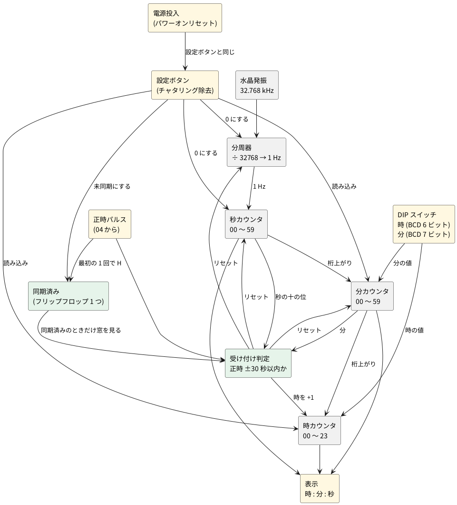

# 2-5 時計 — 32.768 kHz を数えて時分秒を出し、正時パルスで合わせる

> [!WARNING]
> **この題は、まだ実際の回路で検証していない。** 回路図・実体配線図・波形・数値は、設計から計算と見積りで作ったもので、組んで測ったものではない。水晶の負荷容量、パワーオンの時間、表示の電流は典型値からの見積りだ。組むときは、ユニットごとに確かめながら進めてほしい。

全体の中の位置は [01-block.md](01-block.md) の ④ 時計。水晶の 32.768 kHz を分周して 1 Hz にし、
時・分・秒を数えて表示する。[04-state-machine.md](04-state-machine.md) の正時パルスが来たら、
時計を正時に合わせる。

## ブロック図




## 時刻の初期設定 — 時と分は DIP スイッチで、秒は最初の正時パルスで

時報には時刻の情報が無い (正時を知らせるだけ) ので、**時と分は人が DIP スイッチで合わせる**。
DIP スイッチは BCD で、時が 6 ビット (十の位 2 + 一の位 4)、分が 7 ビット (十の位 3 + 一の位 4)
の計 13 本。利用者は今の時刻を DIP に入れ、**設定ボタンを押しているあいだに**時計へ読み込む
(カウンタの並列ロード)。そのとき秒と分周器は 0 になり、ボタンを離すと時計が動き出す。
ボタンは 0.125 秒 (8 Hz のクロックの 1 周期) 以上押す。これより短いと、クロックの立ち上がりを逃して読み込めない。

電源を入れた直後や設定ボタンを押した直後は、DIP の値が実際の時刻から数秒〜数十秒ずれる。
正時の窓 (次の節) の外のパルスは捨てるので、窓のままでは同期できないことがある。
そこで、**未同期のあいだは窓を見ず、最初の正時パルスを必ず受け付ける**。

1. 電源を入れる、または設定ボタンを押すと、DIP の値を読み込んで「未同期」になる。
   「未同期」の LED が点く。
2. 最初の正時パルスが来たら、分・秒・分周器を 0 にする。
   **時計の分が 30 以上なら時を +1 する** (正時に最も近い時へ丸める)。
3. 「同期済み」のフリップフロップを 1 にする (LED が消える)。以後は窓が有効になる。

| 状態 | 正時パルスの扱い |
| --- | --- |
| 未同期 | 窓を見ずに受け付ける。分・秒・分周器を 0 にし、分が 30 以上なら時を +1。同期済みにする |
| 同期済み | 次の節の窓の中だけ受け付ける |

「分が 30 以上」は、分の十の位 (BCD で 0〜5) が 3 以上かどうかで分かる。
3 = 011、4 = 100、5 = 101 なので、**ビット 2 が 1 か、ビット 1 とビット 0 がどちらも 1** のとき成り立つ。
ビット 1 だけを見ると 2 (010) も入ってしまうので足りない。窓の判定で使う「秒が 30 以上」も同じ作りで、
秒の十の位と分の十の位に、同じ回路を 2 つ置く。

足す部品は、DIP スイッチ 13 本 (8 連を 2 個)、設定ボタン (チャタリング除去つき)、
並列ロードつきのカウンタ (74HC163)、同期済みの 1 ビット (フリップフロップ 1 つ)、
電源投入時に設定ボタンと同じ動きをするパワーオンリセットだ。
カウンタには BCD で数える 74HC160 や 74HC162 もある。ただ、[04-state-machine.md](04-state-machine.md) と同じ 74HC163 なら、
在庫が 1 種類で済み、足の名前が回路図と実体配線図に出る。74HC163 は 4 ビットのバイナリなので、
0〜9 と 0〜5 の折り返しは、次の節の「折り返し」のとおり**ロードに 0 を入れて**作る。
DIP が時 24 以上・分 60 以上のような**範囲外の値のときは、読み込みを止める判定を置かない**
(部品を増やさないため。利用者が正しい値を入れる)。
同期するまでは表示の分が不正確なので、「未同期」の LED で知らせる。

RTC の IC (DS3231 など) は使わない。I2C で時刻を読み書きするのにマイコンが要り、
ロジックで時間を扱う練習の意図から外れる。毎正時に合わせ直すので、精度も要らない。

## 正時リセットの決まり

**同期済みのとき**、正時パルスを受け付けるのは、時計の正時の前後 30 秒以内だけ。判定は分と秒の十の位で作り、
秒の一の位は見ない。

秒の十の位は BCD で 0〜5 (000〜101)。**秒が 30 以上かどうかは、十の位が 3 以上かどうか**で、
ビット 2 が 1 か、ビット 1 とビット 0 がどちらも 1 のとき成り立つ。これを X とする。

| パルスのときの時計 | 条件 | 動作 |
| --- | --- | --- |
| 59 分 30 秒以降 | 分が 59 かつ X | 時を +1 し、分・秒・分周器を 0 にする |
| 00 分 29 秒まで | 分が 00 かつ X でない | 時はそのまま、分・秒・分周器を 0 にする |
| 上の外 | — | 何もしない |

時の +1 は 23 時から 0 時へ回る (23 → 00)。判定のゲートは、分の「59」「00」の検出と、
X の判定、AND と OR をあわせて十数個になる (次の「回路図」の図6)。

## 回路の組み立て

### 同期式にする

時計の部分は、**すべてのカウンタとフリップフロップを、8 Hz の CLK の立ち上がりで動かす**。
CLK は図1の CD4040B の Q12 で、[04-state-machine.md](04-state-machine.md) の CLK と同じものだ。
1 Hz は、別の信号 TICK で表す。TICK は 8 クロックに 1 回、1 クロックぶんだけ H になる。
各桁は「下の桁が最大の値で、TICK が来た」ときにだけ数える (イネーブルの鎖)。
ゲートの遅れ (数十 ns) は 125 ms に比べて無視できるので、ゲートの出力は次のクロックまでに必ず落ち着く。

### 折り返し

74HC163 は、LOAD が L のときは、イネーブルに関係なく、クロックの立ち上がりでデータ入力を読み込む。
そこで、折り返し (秒の 59 → 00 など) と、リセットと、DIP の設定を、**すべて LOAD で作る**。

- 折り返し: 「その桁が最大で、イネーブルされている」ときに LOAD を L にして 0 を読み込む。
- リセット (正時): 同じ LOAD を RS (ACC または SET) でも L にする。
- DIP の設定: DIP スイッチの COM を SET (設定中だけ H) につなぐ。SET が L のあいだは、スイッチが ON でも OFF でも、データ入力は 10 kΩ で GND に引かれて 0 になる。設定中だけ DIP の値が入る。

こうすると、折り返しの「0 を読み込む」と、設定の「DIP の値を読み込む」が、同じ LOAD とデータ入力で両立する。

### 分周器は止めない

正時パルスで、CD4040B (÷ 4096、8 Hz を出す側) は 0 にしない。止めると CLK が止まり、
[04-state-machine.md](04-state-machine.md) の E880 を消すクロックが来なくなって、正時パルスが出っぱなしになる。
そのかわり、÷ 8 の 74HC163 (U20) だけを RS で 8 に戻す。
合わせる精度は 8 Hz の格子 (± 0.125 秒) になり、これに時報の検出の遅れが加わる。時計としては十分だ。

### ユニット

| ユニット | 図 | 主な IC | 役目 |
| --- | --- | --- | --- |
| 1 発振と分周 | 図1 | U18 (CD4069UB)、U19 (CD4040B)、U20 (74HC163)、U46 (74HC02) | 32.768 kHz → 8 Hz の CLK → 1 Hz の TICK |
| 2 秒 | 図2 | U21・U22 (74HC163)、U33 (74HC08)、U42 (74HC02) | 秒の一の位 (0〜9) と十の位 (0〜5) |
| 3 分 | 図3 | U23・U24 (74HC163)、U34 (74HC08)、U42 (74HC02) | 分の一の位と十の位 |
| 4 時 | 図4 | U25・U26 (74HC163)、U35・U36 (74HC08)、U40 (74HC32)、U43 (74HC02) | 時の一の位 (0〜9) と十の位 (0〜2)、23 → 00 |
| 5 DIP | 図5 | S1〜S13、R1〜R13 | 時刻の入力 (13 ビット) |
| 6 窓判定 | 図6 | U36・U37 (74HC08)、U38〜U40 (74HC32)、U43 (74HC02) | 正時パルスを受け付けるか、時を +1 するか |
| 7 同期と設定 | 図7 | U41 (74HC32)、U44 (74HC74)、U45 (CD40106B) | 同期済み、設定ボタン、パワーオン |
| 8 表示 | 図8 | U27〜U32 (CD4511B)、D1〜D6 | BCD を 7 セグメントにする (6 桁) |

### 信号の名前

同じ名前の端子どうしは、図が違ってもつながっている。

| 名前 | 意味 |
| --- | --- |
| CLK | 8 Hz のクロック (U19 の Q12)。04 の CLK でもある |
| TICK | 1 秒に 1 回、1 クロックだけ H。U20 の RCO |
| SU0〜SU3、ST0〜ST2 | 秒の一の位、十の位 (QA が最下位。ST3 は使わない) |
| MU0〜MU3、MT0〜MT2 | 分の一の位、十の位 |
| HU0〜HU3、HT0・HT1 | 時の一の位、十の位 |
| ENST、ENMU、ENMT、CM | 桁上がり。秒 → 十の位、秒 → 分の一の位、分の一の位 → 十の位、分 → 時 |
| P | 正時パルス (04 の OUT)。1 クロックだけ H |
| X | 秒が 30 以上 |
| ACC | 正時パルスを受け付ける |
| SY、NSY | 同期済み、未同期 (SY の反転) |
| SET、SETN | 設定中 (ボタンまたは電源投入) が H、その反転 |
| RS | リセット (ACC または SET) |
| LDSU など | 各カウンタの LOAD (L で読み込む) |
| DHT1〜DMU0 | DIP スイッチからの入力 (D + 時 H か分 M + 十の位 T か一の位 U + ビット) |

## 回路図

回路は 8 つの図に分ける。ゲートは論理記号で描き、記号の足に IC の足の番号 (PIN) を添えた。
IC の電源 (PIN 14 または 16) と GND (PIN 7 または 8) は、図の下の注記か本文に書く。
使わないゲートの入力は GND につなぐ。

### ユニット 1: 発振と分周

```circuit
title: 図1 発振と分周 (ユニット 1)
parts:
  X1: crystal c6 c16 32.768k
  Rf: resistor e6 e11 10M
  U18A: not g9 CD4069UB
  Rd: resistor g12 g16 270k
  C1: capacitor i6 k6 18p
  C2: capacitor i16 k16 18p
  GND1: ground k6
  GND2: ground k16
  U18B: not n17i0 CD4069UB
  U19: dip16 p26 CD4040B r180
  GND3: ground r23g8
  CLK: port q32g0i0
  U20: ic aa13 74HC163
  VCC: vcc aa10 5V
  GND4: ground y9f4 r90
  VCC: vcc aa9h4f0 5V
  CLK: port ab9f4
  VCC: vcc w12g5 5V
  LDD: port x16h6
  GND5: ground ac13g0
  TICK: port ab16a6
  U46A: nor y31
  TICK: port x27c5f0
  RS: port y27h5f0
  LDD: port y34
wires:
  - g6 -- U18A.in
  - g6 -- e6
  - e6 -- c6
  - g6 -- i6
  - U18A.out -- g11
  - g11 -- e11
  - g11 -- g12
  - g16 -- c16
  - g16 -- i16
  - g11 -- n11i0
  - n11i0 -- U18B.in
  - U18B.out -| U19.CLOCK
  - U19.R -| o23c8i0
  - o23c8i0 -- r23g8
  - U19.Q12 -| q32g0i0
  - U20.D -| aa10
  - U20.A -| y10f5
  - U20.B -| z10a5
  - U20.C -| z10f5
  - y10f5 -- z10a5
  - z10a5 -- z10f5
  - y10f5 -- y9f4
  - U20.ENP -| aa10f5
  - U20.ENT -| ab10a5
  - aa10f5 -- aa10h5f0
  - aa10h5f0 -- ab10a5
  - aa10h5f0 -- aa9h4f0
  - U20.CLK -| ab9f4
  - x12c5 -| U20.VCC
  - x13c0 -| U20.CLR
  - x12c5 -- x13c0
  - x12c5 -- w12g5
  - U20.LOAD |- x16h6
  - ac13g0 -| U20.GND
  - U20.RCO -| ab16a6
  - x27c5f0 |- U46A.a
  - y27h5f0 |- U46A.b
  - U46A.out -- y34
notes:
  - text l24 small left: U19 CD4040B (4096 分周)  PIN 16 は +5V、PIN 8 は GND
  - text p10i0 small left: U18 CD4069UB  PIN 14 は +5V、PIN 7 は GND
  - text w14b5 small left: U20 74HC163 (8 分周)
  - text x29e9 tiny center: "2"
  - text y29g9 tiny center: "3"
  - text x31g7 tiny center: "1"
  - text af4f0 small left: 74HC02 の PIN 14 は +5V、PIN 7 は GND
style:
  pitch: 1
```


- 水晶 X1 (32.768 kHz) と CD4069UB の 1 つ目のインバータ U18A で、ピアース発振回路を作る。R<sub>f</sub> (10 MΩ) はインバータの入出力を結んで動作点を決め、R<sub>d</sub> (270 kΩ) は水晶に加わる電力を抑える。C1・C2 (18 pF) と基板の浮遊容量が水晶の負荷容量になる。
- 2 つ目のインバータ U18B で四角い波 (CK32) に整え、CD4040B (U19) に入れる。CD4040B は立ち下がりで数え、Q12 は 32768 ÷ 4096 で **8 Hz** になる。これが CLK だ。U19 の R は GND につなぎ、リセットしない。
- U20 (74HC163) は 8 Hz を 8 分周して TICK を作る。データ入力は 8 (D だけ +5V)。数は 8〜15 で、15 のあいだだけ RCO が H になる。これが TICK で、次のクロックで 8 に戻る。LOAD は LDD で、RS が H のときも 8 を読み込む。

### ユニット 2: 秒

```circuit
title: 図2 秒のカウンタ (ユニット 2)
parts:
  U21: ic h12 74HC163
  GND1: ground f8f4 r90
  TICK: port h8h4f0
  CLK: port i8f4
  VCC: vcc d11g5 5V
  LDSU: port e15h6
  GND2: ground j12g0
  SU0: port g15a6
  SU1: port g15f6
  SU2: port h15a6
  SU3: port h15f6
  U22: ic s12 74HC163
  GND3: ground q8f4 r90
  ENST: port s8h4f0
  CLK: port t8f4
  VCC: vcc o11g5 5V
  LDST: port p15h6
  GND4: ground u12g0
  ST0: port r15a6
  ST1: port r15f6
  ST2: port s15a6
  ST3: port s15f6
  U33A: and f23
  SU3: port e19c5f0
  SU0: port f19h5f0
  SU9: port f26
  U33B: and i23e0
  SU9: port h19g5f0
  TICK: port j19b5f0
  ENST: port i26e0
  U42A: nor l23i0
  RS: port l19a5f0
  ENST: port m19f5f0
  LDSU: port l26i0
  U33C: and q23
  ST2: port p19c5f0
  ST0: port q19h5f0
  ST5: port q26
  U33D: and t23e0
  ST5: port s19g5f0
  ENST: port u19b5f0
  ENMU: port t26e0
  U42B: nor w23i0
  RS: port w19a5f0
  ENMU: port x19f5f0
  LDST: port w26i0
wires:
  - U21.A -| f9f5
  - U21.B -| g9a5
  - U21.C -| g9f5
  - U21.D -| h9a5
  - f9f5 -- g9a5
  - g9a5 -- g9f5
  - g9f5 -- h9a5
  - f9f5 -- f8f4
  - U21.ENP -| h9f5
  - U21.ENT -| i9a5
  - h9f5 -- h9h5f0
  - h9h5f0 -- i9a5
  - h9h5f0 -- h8h4f0
  - U21.CLK -| i8f4
  - e11c5 -| U21.VCC
  - e12c0 -| U21.CLR
  - e11c5 -- e12c0
  - e11c5 -- d11g5
  - U21.LOAD |- e15h6
  - j12g0 -| U21.GND
  - U21.QA -| g15a6
  - U21.QB -| g15f6
  - U21.QC -| h15a6
  - U21.QD -| h15f6
  - U22.A -| q9f5
  - U22.B -| r9a5
  - U22.C -| r9f5
  - U22.D -| s9a5
  - q9f5 -- r9a5
  - r9a5 -- r9f5
  - r9f5 -- s9a5
  - q9f5 -- q8f4
  - U22.ENP -| s9f5
  - U22.ENT -| t9a5
  - s9f5 -- s9h5f0
  - s9h5f0 -- t9a5
  - s9h5f0 -- s8h4f0
  - U22.CLK -| t8f4
  - p11c5 -| U22.VCC
  - p12c0 -| U22.CLR
  - p11c5 -- p12c0
  - p11c5 -- o11g5
  - U22.LOAD |- p15h6
  - u12g0 -| U22.GND
  - U22.QA -| r15a6
  - U22.QB -| r15f6
  - U22.QC -| s15a6
  - U22.QD -| s15f6
  - e19c5f0 |- U33A.a
  - f19h5f0 |- U33A.b
  - U33A.out -- f26
  - h19g5f0 |- U33B.a
  - j19b5f0 |- U33B.b
  - U33B.out -- i26e0
  - l19a5f0 |- U42A.a
  - m19f5f0 |- U42A.b
  - U42A.out -- l26i0
  - p19c5f0 |- U33C.a
  - q19h5f0 |- U33C.b
  - U33C.out -- q26
  - s19g5f0 |- U33D.a
  - u19b5f0 |- U33D.b
  - U33D.out -- t26e0
  - w19a5f0 |- U42B.a
  - x19f5f0 |- U42B.b
  - U42B.out -- w26i0
notes:
  - text d13b5 small left: U21 74HC163 (秒の一の位)
  - text o13b5 small left: U22 74HC163 (秒の十の位)
  - text e21e9 tiny center: "1"
  - text f21g9 tiny center: "2"
  - text e23g7 tiny center: "3"
  - text h21i9 tiny center: "4"
  - text j21a9 tiny center: "5"
  - text i23a7 tiny center: "6"
  - text l21c9 tiny center: "2"
  - text m21e9 tiny center: "3"
  - text l23e7 tiny center: "1"
  - text p21e9 tiny center: "9"
  - text q21g9 tiny center: "10"
  - text p23g7 tiny center: "8"
  - text s21i9 tiny center: "12"
  - text u21a9 tiny center: "13"
  - text t23a7 tiny center: "11"
  - text w21c9 tiny center: "5"
  - text x21e9 tiny center: "6"
  - text w23e7 tiny center: "4"
  - text aa3f0 small left: 74HC08・74HC02 は PIN 14 が +5V、PIN 7 が GND
style:
  pitch: 1
```


- U33A は秒の一の位が 9 (SU3 かつ SU0)。U33B は、9 で TICK が来たとき (ENST) で、十の位を 1 つ進める。同時に、U42A が一の位に 0 を読み込ませる (LDSU が L)。
- U33C は十の位が 5。U33D は、5 で ENST が来たとき (ENMU) で、分の一の位を 1 つ進める。U42B が十の位に 0 を読み込ませる。
- 一の位は TICK で数える。十の位は ENST で、データ入力はどちらも GND。

### ユニット 3: 分

```circuit
title: 図3 分のカウンタ (ユニット 3)
parts:
  U23: ic h12 74HC163
  DMU0: port f8f4
  DMU1: port g8a4
  DMU2: port g8f4
  DMU3: port h8a4
  ENMU: port h8h4f0
  CLK: port i8f4
  VCC: vcc d11g5 5V
  LDMU: port e15h6
  GND1: ground j12g0
  MU0: port g15a6
  MU1: port g15f6
  MU2: port h15a6
  MU3: port h15f6
  U24: ic s12 74HC163
  DMT0: port q8f4
  DMT1: port r8a4
  DMT2: port r8f4
  GND2: ground s8a4 r90
  ENMT: port s8h4f0
  CLK: port t8f4
  VCC: vcc o11g5 5V
  LDMT: port p15h6
  GND3: ground u12g0
  MT0: port r15a6
  MT1: port r15f6
  MT2: port s15a6
  MT3: port s15f6
  U34A: and f23
  MU3: port e19c5f0
  MU0: port f19h5f0
  MU9: port f26
  U34B: and i23e0
  MU9: port h19g5f0
  ENMU: port j19b5f0
  ENMT: port i26e0
  U42C: nor l23i0
  RS: port l19a5f0
  ENMT: port m19f5f0
  LDMU: port l26i0
  U34C: and q23
  MT2: port p19c5f0
  MT0: port q19h5f0
  MT5: port q26
  U34D: and t23e0
  MT5: port s19g5f0
  ENMT: port u19b5f0
  CM: port t26e0
  U42D: nor w23i0
  RS: port w19a5f0
  CM: port x19f5f0
  LDMT: port w26i0
wires:
  - U23.A -| f8f4
  - U23.B -| g8a4
  - U23.C -| g8f4
  - U23.D -| h8a4
  - U23.ENP -| h9f5
  - U23.ENT -| i9a5
  - h9f5 -- h9h5f0
  - h9h5f0 -- i9a5
  - h9h5f0 -- h8h4f0
  - U23.CLK -| i8f4
  - e11c5 -| U23.VCC
  - e12c0 -| U23.CLR
  - e11c5 -- e12c0
  - e11c5 -- d11g5
  - U23.LOAD |- e15h6
  - j12g0 -| U23.GND
  - U23.QA -| g15a6
  - U23.QB -| g15f6
  - U23.QC -| h15a6
  - U23.QD -| h15f6
  - U24.A -| q8f4
  - U24.B -| r8a4
  - U24.C -| r8f4
  - U24.D -| s9a5
  - s9a5 -- s8a4
  - U24.ENP -| s9f5
  - U24.ENT -| t9a5
  - s9f5 -- s9h5f0
  - s9h5f0 -- t9a5
  - s9h5f0 -- s8h4f0
  - U24.CLK -| t8f4
  - p11c5 -| U24.VCC
  - p12c0 -| U24.CLR
  - p11c5 -- p12c0
  - p11c5 -- o11g5
  - U24.LOAD |- p15h6
  - u12g0 -| U24.GND
  - U24.QA -| r15a6
  - U24.QB -| r15f6
  - U24.QC -| s15a6
  - U24.QD -| s15f6
  - e19c5f0 |- U34A.a
  - f19h5f0 |- U34A.b
  - U34A.out -- f26
  - h19g5f0 |- U34B.a
  - j19b5f0 |- U34B.b
  - U34B.out -- i26e0
  - l19a5f0 |- U42C.a
  - m19f5f0 |- U42C.b
  - U42C.out -- l26i0
  - p19c5f0 |- U34C.a
  - q19h5f0 |- U34C.b
  - U34C.out -- q26
  - s19g5f0 |- U34D.a
  - u19b5f0 |- U34D.b
  - U34D.out -- t26e0
  - w19a5f0 |- U42D.a
  - x19f5f0 |- U42D.b
  - U42D.out -- w26i0
notes:
  - text d13b5 small left: U23 74HC163 (分の一の位)
  - text o13b5 small left: U24 74HC163 (分の十の位)
  - text e21e9 tiny center: "1"
  - text f21g9 tiny center: "2"
  - text e23g7 tiny center: "3"
  - text h21i9 tiny center: "4"
  - text j21a9 tiny center: "5"
  - text i23a7 tiny center: "6"
  - text l21c9 tiny center: "8"
  - text m21e9 tiny center: "9"
  - text l23e7 tiny center: "10"
  - text p21e9 tiny center: "9"
  - text q21g9 tiny center: "10"
  - text p23g7 tiny center: "8"
  - text s21i9 tiny center: "12"
  - text u21a9 tiny center: "13"
  - text t23a7 tiny center: "11"
  - text w21c9 tiny center: "11"
  - text x21e9 tiny center: "12"
  - text w23e7 tiny center: "13"
  - text aa3f0 small left: 74HC08・74HC02 は PIN 14 が +5V、PIN 7 が GND
style:
  pitch: 1
```


- 秒とほぼ同じ作りで、イネーブルは ENMU から始まる。データ入力は DIP スイッチ (DMU0〜DMU3、DMT0〜DMT2) につながる。分の十の位は 3 ビットなので、D は GND。
- U34D の CM (分が 59 で桁上がり) は、時のユニットへ行く。

### ユニット 4: 時

```circuit
title: 図4 時のカウンタ (ユニット 4)
parts:
  U25: ic h12 74HC163
  DHU0: port f8f4
  DHU1: port g8a4
  DHU2: port g8f4
  DHU3: port h8a4
  ENH: port h8h4f0
  CLK: port i8f4
  VCC: vcc d11g5 5V
  LDHU: port e15h6
  GND1: ground j12g0
  HU0: port g15a6
  HU1: port g15f6
  HU2: port h15a6
  HU3: port h15f6
  U26: ic u12 74HC163
  DHT0: port s8f4
  DHT1: port t8a4
  GND2: ground t8f4 r90
  ENHT: port u8h4f0
  CLK: port v8f4
  VCC: vcc q11g5 5V
  LDHT: port r15h6
  GND3: ground w12g0
  HT0: port t15a6
  HT1: port t15f6
  HT2: port u15a6
  HT3: port u15f6
  U40C: or e23
  CM: port d19c5f0
  HP: port e19h5f0
  ENH: port e26
  U35A: and h23e0
  HU3: port g19g5f0
  HU0: port i19b5f0
  HU9: port h26e0
  U35B: and k23i0
  HU9: port k19a5f0
  ENH: port l19f5f0
  ENHT: port k26i0
  U40D: or o23c0
  ENHT: port n19e5f0
  WH: port o19j5f0
  O8: port o26c0
  U35C: and e36
  HU1: port d32c5f0
  HU0: port e32h5f0
  H3: port e39
  U35D: and h36e0
  H3: port g32g5f0
  HT1: port i32b5f0
  H23: port h39e0
  U36A: and k36i0
  H23: port k32a5f0
  ENH: port l32f5f0
  WH: port k39i0
  U43A: nor o36c0
  SET: port n32e5f0
  O8: port o32j5f0
  LDHU: port o39c0
  U43B: nor r36g0
  SET: port q32i5f0
  WH: port s32d5f0
  LDHT: port r39g0
wires:
  - U25.A -| f8f4
  - U25.B -| g8a4
  - U25.C -| g8f4
  - U25.D -| h8a4
  - U25.ENP -| h9f5
  - U25.ENT -| i9a5
  - h9f5 -- h9h5f0
  - h9h5f0 -- i9a5
  - h9h5f0 -- h8h4f0
  - U25.CLK -| i8f4
  - e11c5 -| U25.VCC
  - e12c0 -| U25.CLR
  - e11c5 -- e12c0
  - e11c5 -- d11g5
  - U25.LOAD |- e15h6
  - j12g0 -| U25.GND
  - U25.QA -| g15a6
  - U25.QB -| g15f6
  - U25.QC -| h15a6
  - U25.QD -| h15f6
  - U26.A -| s8f4
  - U26.B -| t8a4
  - U26.C -| t9f5
  - U26.D -| u9a5
  - t9f5 -- u9a5
  - t9f5 -- t8f4
  - U26.ENP -| u9f5
  - U26.ENT -| v9a5
  - u9f5 -- u9h5f0
  - u9h5f0 -- v9a5
  - u9h5f0 -- u8h4f0
  - U26.CLK -| v8f4
  - r11c5 -| U26.VCC
  - r12c0 -| U26.CLR
  - r11c5 -- r12c0
  - r11c5 -- q11g5
  - U26.LOAD |- r15h6
  - w12g0 -| U26.GND
  - U26.QA -| t15a6
  - U26.QB -| t15f6
  - U26.QC -| u15a6
  - U26.QD -| u15f6
  - d19c5f0 |- U40C.a
  - e19h5f0 |- U40C.b
  - U40C.out -- e26
  - g19g5f0 |- U35A.a
  - i19b5f0 |- U35A.b
  - U35A.out -- h26e0
  - k19a5f0 |- U35B.a
  - l19f5f0 |- U35B.b
  - U35B.out -- k26i0
  - n19e5f0 |- U40D.a
  - o19j5f0 |- U40D.b
  - U40D.out -- o26c0
  - d32c5f0 |- U35C.a
  - e32h5f0 |- U35C.b
  - U35C.out -- e39
  - g32g5f0 |- U35D.a
  - i32b5f0 |- U35D.b
  - U35D.out -- h39e0
  - k32a5f0 |- U36A.a
  - l32f5f0 |- U36A.b
  - U36A.out -- k39i0
  - n32e5f0 |- U43A.a
  - o32j5f0 |- U43A.b
  - U43A.out -- o39c0
  - q32i5f0 |- U43B.a
  - s32d5f0 |- U43B.b
  - U43B.out -- r39g0
notes:
  - text d13b5 small left: U25 74HC163 (時の一の位)
  - text q13b5 small left: U26 74HC163 (時の十の位)
  - text d21f9 tiny center: "9"
  - text e21g9 tiny center: "10"
  - text d23g7 tiny center: "8"
  - text g21i9 tiny center: "1"
  - text i21a9 tiny center: "2"
  - text h23a7 tiny center: "3"
  - text k21c9 tiny center: "4"
  - text l21e9 tiny center: "5"
  - text k23e7 tiny center: "6"
  - text n21h9 tiny center: "12"
  - text o21i9 tiny center: "13"
  - text n23i7 tiny center: "11"
  - text d34e9 tiny center: "9"
  - text e34g9 tiny center: "10"
  - text d36g7 tiny center: "8"
  - text g34i9 tiny center: "12"
  - text i34a9 tiny center: "13"
  - text h36a7 tiny center: "11"
  - text k34c9 tiny center: "1"
  - text l34e9 tiny center: "2"
  - text k36e7 tiny center: "3"
  - text n34g9 tiny center: "2"
  - text o34i9 tiny center: "3"
  - text n36i7 tiny center: "1"
  - text r34a9 tiny center: "5"
  - text s34c9 tiny center: "6"
  - text r36c7 tiny center: "4"
  - text ab3f0 small left: 74HC08・74HC32・74HC02 は PIN 14 が +5V、PIN 7 が GND
style:
  pitch: 1
```


- 時のイネーブル ENH は、分の桁上がり CM と、正時の +1 (HP) の OR だ (U40C)。
- U35A は時の一の位が 9。U35B は、9 で ENH が来たとき (ENHT) で、十の位を 1 つ進める。
- 23 → 00 は、一の位が 3 (U35C)、十の位が 2 (HT1) のとき (U35D)、ENH が来たら (U36A の WH) 両方に 0 を読み込ませる。一の位は 9 からも 0 に戻る (U40D が ENHT と WH の OR)。
- 十の位の C・D は GND。DIP の値が 24 時以上でも判定は置かない。

### ユニット 5: DIP スイッチ

```circuit
title: 図5 時刻を入れる DIP スイッチ (ユニット 5)
parts:
  SET: port c4
  S1: switch f4 f8
  R1: resistor f10 g10f0 10k
  GND1: ground g10f0
  DHT1: port f15
  S2: switch i4 i8
  R2: resistor i10 j10f0 10k
  GND2: ground j10f0
  DHT0: port i15
  S3: switch l4 l8
  R3: resistor l10 m10f0 10k
  GND3: ground m10f0
  DHU3: port l15
  S4: switch o4 o8
  R4: resistor o10 p10f0 10k
  GND4: ground p10f0
  DHU2: port o15
  S5: switch r4 r8
  R5: resistor r10 s10f0 10k
  GND5: ground s10f0
  DHU1: port r15
  S6: switch u4 u8
  R6: resistor u10 v10f0 10k
  GND6: ground v10f0
  DHU0: port u15
  SET: port c20
  S7: switch f20 f24
  R7: resistor f26 g26f0 10k
  GND7: ground g26f0
  DMT2: port f31
  S8: switch i20 i24
  R8: resistor i26 j26f0 10k
  GND8: ground j26f0
  DMT1: port i31
  S9: switch l20 l24
  R9: resistor l26 m26f0 10k
  GND9: ground m26f0
  DMT0: port l31
  S10: switch o20 o24
  R10: resistor o26 p26f0 10k
  GND10: ground p26f0
  DMU3: port o31
  S11: switch r20 r24
  R11: resistor r26 s26f0 10k
  GND11: ground s26f0
  DMU2: port r31
  S12: switch u20 u24
  R12: resistor u26 v26f0 10k
  GND12: ground v26f0
  DMU1: port u31
  S13: switch x20 x24
  R13: resistor x26 y26f0 10k
  GND13: ground y26f0
  DMU0: port x31
wires:
  - f8 -- f10
  - f10 -- f15
  - i8 -- i10
  - i10 -- i15
  - l8 -- l10
  - l10 -- l15
  - o8 -- o10
  - o10 -- o15
  - r8 -- r10
  - r10 -- r15
  - u8 -- u10
  - u10 -- u15
  - c4 -- f4
  - f4 -- i4
  - i4 -- l4
  - l4 -- o4
  - o4 -- r4
  - r4 -- u4
  - f24 -- f26
  - f26 -- f31
  - i24 -- i26
  - i26 -- i31
  - l24 -- l26
  - l26 -- l31
  - o24 -- o26
  - o26 -- o31
  - r24 -- r26
  - r26 -- r31
  - u24 -- u26
  - u26 -- u31
  - x24 -- x26
  - x26 -- x31
  - c20 -- f20
  - f20 -- i20
  - i20 -- l20
  - l20 -- o20
  - o20 -- r20
  - r20 -- u20
  - u20 -- x20
notes:
  - text e11c5 tiny left: 時 十の位 2
  - text h11c5 tiny left: 時 十の位 1
  - text k11c5 tiny left: 時 一の位 8
  - text n11c5 tiny left: 時 一の位 4
  - text q11c5 tiny left: 時 一の位 2
  - text t11c5 tiny left: 時 一の位 1
  - text e27c5 tiny left: 分 十の位 4
  - text h27c5 tiny left: 分 十の位 2
  - text k27c5 tiny left: 分 十の位 1
  - text n27c5 tiny left: 分 一の位 8
  - text q27c5 tiny left: 分 一の位 4
  - text t27c5 tiny left: 分 一の位 2
  - text w27c5 tiny left: 分 一の位 1
  - text a4i0 small left: 時 (6 本)
  - text a20i0 small left: 分 (7 本)
  - text z4 small left: S1 から S13 は 8 連の DIP スイッチ 2 個。R1 から R13 は 10 kΩ
style:
  pitch: 1
```


- COM は SET につなぐ。設定中だけ H になり、ON のスイッチのビットが 1 としてカウンタのデータ入力に入る。それ以外は 10 kΩ で 0 になる。

### ユニット 6: 窓判定

```circuit
title: 図6 窓判定 (ユニット 6)
parts:
  U36C: and f8
  ST1: port e4c5f0
  ST0: port f4h5f0
  XA: port f11
  U39C: or i8e0
  ST2: port h4g5f0
  XA: port j4b5f0
  X: port i11e0
  U36D: and l8i0
  MT1: port l4a5f0
  MT0: port m4f5f0
  MA: port l11i0
  U40B: or p8c0
  MT2: port o4e5f0
  MA: port p4j5f0
  M30: port p11c0
  U36B: and s8g0
  MT5: port r4i5f0
  MU9: port t4d5f0
  M59: port s11g0
  U38A: or f21
  MT2: port e17c5f0
  MT1: port f17h5f0
  OA: port f24
  U38B: or i21e0
  MT0: port h17g5f0
  MU3: port j17b5f0
  OB: port i24e0
  U38C: or l21i0
  MU2: port l17a5f0
  MU1: port m17f5f0
  OC: port l24i0
  U38D: or p21c0
  OA: port o17e5f0
  OB: port p17j5f0
  OD: port p24c0
  U39A: or s21g0
  OC: port r17i5f0
  MU0: port t17d5f0
  OE: port s24g0
  U39B: or w21
  OD: port v17c5f0
  OE: port w17h5f0
  OF: port w24
  U37A: and f34
  M59: port e30c5f0
  X: port f30h5f0
  W59: port f37
  U43D: nor i34e0
  OF: port h30g5f0
  X: port j30b5f0
  W00: port i37e0
  U39D: or l34i0
  W59: port l30a5f0
  W00: port m30f5f0
  O2: port l37i0
  U40A: or p34c0
  NSY: port o30e5f0
  O2: port p30j5f0
  O3: port p37c0
  U37B: and s34g0
  P: port r30i5f0
  O3: port t30d5f0
  ACC: port s37g0
  U37C: and w34
  ACC: port v30c5f0
  M30: port w30h5f0
  HP: port w37
wires:
  - e4c5f0 |- U36C.a
  - f4h5f0 |- U36C.b
  - U36C.out -- f11
  - h4g5f0 |- U39C.a
  - j4b5f0 |- U39C.b
  - U39C.out -- i11e0
  - l4a5f0 |- U36D.a
  - m4f5f0 |- U36D.b
  - U36D.out -- l11i0
  - o4e5f0 |- U40B.a
  - p4j5f0 |- U40B.b
  - U40B.out -- p11c0
  - r4i5f0 |- U36B.a
  - t4d5f0 |- U36B.b
  - U36B.out -- s11g0
  - e17c5f0 |- U38A.a
  - f17h5f0 |- U38A.b
  - U38A.out -- f24
  - h17g5f0 |- U38B.a
  - j17b5f0 |- U38B.b
  - U38B.out -- i24e0
  - l17a5f0 |- U38C.a
  - m17f5f0 |- U38C.b
  - U38C.out -- l24i0
  - o17e5f0 |- U38D.a
  - p17j5f0 |- U38D.b
  - U38D.out -- p24c0
  - r17i5f0 |- U39A.a
  - t17d5f0 |- U39A.b
  - U39A.out -- s24g0
  - v17c5f0 |- U39B.a
  - w17h5f0 |- U39B.b
  - U39B.out -- w24
  - e30c5f0 |- U37A.a
  - f30h5f0 |- U37A.b
  - U37A.out -- f37
  - h30g5f0 |- U43D.a
  - j30b5f0 |- U43D.b
  - U43D.out -- i37e0
  - l30a5f0 |- U39D.a
  - m30f5f0 |- U39D.b
  - U39D.out -- l37i0
  - o30e5f0 |- U40A.a
  - p30j5f0 |- U40A.b
  - U40A.out -- p37c0
  - r30i5f0 |- U37B.a
  - t30d5f0 |- U37B.b
  - U37B.out -- s37g0
  - v30c5f0 |- U37C.a
  - w30h5f0 |- U37C.b
  - U37C.out -- w37
notes:
  - text e6e9 tiny center: "9"
  - text f6g9 tiny center: "10"
  - text e8g7 tiny center: "8"
  - text h6j9 tiny center: "9"
  - text j6a9 tiny center: "10"
  - text i8a7 tiny center: "8"
  - text l6c9 tiny center: "12"
  - text m6e9 tiny center: "13"
  - text l8e7 tiny center: "11"
  - text o6h9 tiny center: "4"
  - text p6i9 tiny center: "5"
  - text o8i7 tiny center: "6"
  - text s6a9 tiny center: "4"
  - text t6c9 tiny center: "5"
  - text s8c7 tiny center: "6"
  - box b1c6 u13e0 blue
  - text c2 small bold left: 秒・分の判定
  - text e19f9 tiny center: "1"
  - text f19g9 tiny center: "2"
  - text e21g7 tiny center: "3"
  - text h19j9 tiny center: "4"
  - text j19a9 tiny center: "5"
  - text i21a7 tiny center: "6"
  - text l19d9 tiny center: "9"
  - text m19e9 tiny center: "10"
  - text l21e7 tiny center: "8"
  - text o19h9 tiny center: "12"
  - text p19i9 tiny center: "13"
  - text o21i7 tiny center: "11"
  - text s19b9 tiny center: "1"
  - text t19c9 tiny center: "2"
  - text s21c7 tiny center: "3"
  - text v19f9 tiny center: "4"
  - text w19g9 tiny center: "5"
  - text v21g7 tiny center: "6"
  - box b14c6 x26i0 blue
  - text c15 small bold left: 分が 00 かの判定
  - text e32e9 tiny center: "1"
  - text f32g9 tiny center: "2"
  - text e34g7 tiny center: "3"
  - text h32i9 tiny center: "11"
  - text j32a9 tiny center: "12"
  - text i34a7 tiny center: "13"
  - text l32d9 tiny center: "12"
  - text m32e9 tiny center: "13"
  - text l34e7 tiny center: "11"
  - text o32h9 tiny center: "1"
  - text p32i9 tiny center: "2"
  - text o34i7 tiny center: "3"
  - text s32a9 tiny center: "4"
  - text t32c9 tiny center: "5"
  - text s34c7 tiny center: "6"
  - text v32e9 tiny center: "9"
  - text w32g9 tiny center: "10"
  - text v34g7 tiny center: "8"
  - box b27c6 x39i0 blue
  - text c28 small bold left: 窓の判定と時の +1
  - text ad5 small left: 74HC08・74HC32・74HC02 は PIN 14 が +5V、PIN 7 が GND
style:
  pitch: 1
```


- 左の列は「秒が 30 以上か」(XA、X)、「分が 30 以上か」(MA、M30)、「分が 59 か」(M59 = MT5 かつ MU9。MT5・MU9 は図3の U34 から来る)。
- 中の列は、分の 7 ビットのどれか 1 つでも 1 かどうか (OA〜OF)。0 のときだけ、分は 00。
- 右の列は、窓の判定。W59 は「59 分かつ X」、W00 は「分が 00 かつ X でない」(NOR)。O2 はその OR、O3 は未同期 (NSY) との OR。ACC = P かつ O3。HP = ACC かつ M30 (分が 30 以上のときだけ時を +1)。
- 未同期なら O3 は 1 になるので、ACC = P で、窓を見ずに受け付ける。

### ユニット 7: 同期と設定

```circuit
title: 図7 同期済みと設定 (ユニット 7)
parts:
  VCC: vcc b6 5V
  R14: resistor c6 f6 10k
  S14: button f6 i6
  GND1: ground i6
  C14: capacitor f9 i9 1u
  GND2: ground i9
  U45A: not f15 CD40106B
  BTN: port f20
  VCC: vcc n6 5V
  R15: resistor o6 r6 100k
  C15: ecap r9 u9 10u
  GND3: ground u9
  U45B: not r15 CD40106B
  PON: port r20
  U41C: or f26
  BTN: port e22c5f0
  PON: port f22h5f0
  SET: port f29
  U41B: or j26e0
  ACC: port i22g5f0
  SET: port k22b5f0
  RS: port j29e0
  U41A: or n26i0
  SY: port n22a5f0
  ACC: port o22f5f0
  SYD1: port n29i0
  U37D: and s26c0
  SYD1: port r22e5f0
  SETN: port s22j5f0
  SYD: port s29c0
  U45C: not w26g0 CD40106B
  SET: port w22g5
  SETN: port w29g0
  U45D: not aa26 CD40106B
  SY: port aa22a5
  NSY: port aa29
  R23: resistor aa31 aa35 330
  D2: led aa35 aa39
  GND4: ground aa39
  U44A:
    type: ic3
    at: ae38
    label: 74HC74
    pins: [D, CLK, Q]
  SYD: port ae33
  CLK: port ah38f0
  SY: port ae43
wires:
  - b6 -- c6
  - f6 -- f9
  - f9 -- f12
  - f12 -- U45A.in
  - U45A.out -- f20
  - n6 -- o6
  - r6 -- r9
  - r6 -- r12
  - r12 -- U45B.in
  - U45B.out -- r20
  - e22c5f0 |- U41C.a
  - f22h5f0 |- U41C.b
  - U41C.out -- f29
  - i22g5f0 |- U41B.a
  - k22b5f0 |- U41B.b
  - U41B.out -- j29e0
  - n22a5f0 |- U41A.a
  - o22f5f0 |- U41A.b
  - U41A.out -- n29i0
  - r22e5f0 |- U37D.a
  - s22j5f0 |- U37D.b
  - U37D.out -- s29c0
  - w22g5 -- U45C.in
  - U45C.out -- w29g0
  - aa22a5 -- U45D.in
  - U45D.out -- aa29
  - aa29 -- aa31
  - ae33 -- U44A.D
  - ah38f0 -- U44A.CLK
  - U44A.Q -- ae43
notes:
  - text e14d4 tiny center: "1"
  - text e15g6 tiny center: "2"
  - text q14d4 tiny center: "3"
  - text q15g6 tiny center: "4"
  - text c9e0 small left: 設定ボタン (押すと H)
  - text o9c0 small left: 電源投入 (約 0.9 秒 H)
  - text e24f9 tiny center: "9"
  - text f24g9 tiny center: "10"
  - text e26g7 tiny center: "8"
  - text i24j9 tiny center: "4"
  - text k24a9 tiny center: "5"
  - text j26a7 tiny center: "6"
  - text n24d9 tiny center: "1"
  - text o24e9 tiny center: "2"
  - text n26e7 tiny center: "3"
  - text r24g9 tiny center: "12"
  - text s24i9 tiny center: "13"
  - text r26i7 tiny center: "11"
  - text v25j4 tiny center: "5"
  - text w26c6 tiny center: "6"
  - text z25d4 tiny center: "9"
  - text z26g6 tiny center: "8"
  - text y31c0 small left: 未同期の LED
  - text ab34i0 tiny left: PIN 2 は D、PIN 3 は CLK、PIN 5 は Q
  - text aj26f0 small left: 74HC74 の PIN 1・4・10・13・14 は +5V
  - text ak26f0 small left: PIN 11・12 は GND、PIN 7 は GND
  - text am3f0 small left: 74HC32・74HC08・CD40106B は PIN 14 が +5V、PIN 7 が GND
style:
  pitch: 1
```


- 設定ボタンは、10 kΩ で +5V に引き上げ、1 µF で 10 ms ほどのチャタリング除去を入れ、シュミットのインバータ (U45A) で BTN にする。押すと BTN が H。
- パワーオンは、100 kΩ と 10 µF (時定数 1 秒) の立ち上がりをシュミットのインバータ (U45B) に通す。電源を入れてから約 0.9 秒、PON が H になる。
- SET = BTN または PON (U41C)。SETN はその反転 (U45C)。RS = ACC または SET (U41B)。
- 同期済み SY は、74HC74 の D フリップフロップ 1 つ。D = (SY または ACC) かつ SETN。正時パルスを受け付けると 1 になり、設定中は 0 に戻る。74HC74 の CLR・PRE は +5V、使わないほうの D と CLK は GND につなぐ。NSY で赤い LED が点く (未同期)。

### ユニット 8: 表示

```circuit
title: 図8 表示 (1 桁ぶん。6 桁とも同じ)
parts:
  U27: ic i13 CD4511B
  SU0: port h9f4
  SU1: port i9a4
  SU2: port i9f4
  SU3: port j9a4
  SEGa: port g16f6
  SEGb: port h16a6
  SEGc: port h16f6
  SEGd: port i16a6
  SEGe: port i16f6
  SEGf: port j16a6
  SEGg: port j16f6
  VCC: vcc e12e5 5V
  GND1: ground l13e0
  SEGa: port c20
  R16: resistor c22 c26 330
  LEDa: port c28
  SEGb: port d20i0
  R17: resistor d22i0 d26i0 330
  LEDb: port d28i0
  SEGc: port f20g0
  R18: resistor f22g0 f26g0 330
  LEDc: port f28g0
  SEGd: port h20e0
  R19: resistor h22e0 h26e0 330
  LEDd: port h28e0
  SEGe: port j20c0
  R20: resistor j22c0 j26c0 330
  LEDe: port j28c0
  SEGf: port l20
  R21: resistor l22 l26 330
  LEDf: port l28
  SEGg: port m20i0
  R22: resistor m22i0 m26i0 330
  LEDg: port m28i0
  D1: seg7 i36
  LEDa: port f32h5f0
  LEDb: port g32c5f0
  LEDc: port g32h5f0
  LEDd: port h32c5f0
  LEDe: port h32h5f0
  LEDf: port i32c5f0
  LEDg: port i32h5f0
  GND2: ground k32c5f0
wires:
  - h9f4 |- U27.INA
  - i9a4 |- U27.INB
  - i9f4 |- U27.INC
  - j9a4 |- U27.IND
  - U27.Oa -| g16f6
  - U27.Ob -| h16a6
  - U27.Oc -| h16f6
  - U27.Od -| i16a6
  - U27.Oe -| i16f6
  - U27.Of -| j16a6
  - U27.Og -| j16f6
  - f12a5 -| U27.VDD
  - f13 -| U27.LT
  - f13a5 -| U27.BL
  - f12a5 -- f13
  - f13 -- f13a5
  - f12a5 -- e12e5
  - k13i0 -| U27.VSS
  - k13i5 -| U27.LE/STROBE
  - k13i0 -- k13i5
  - k13i0 -- l13e0
  - c20 -- c22
  - c26 -- c28
  - d20i0 -- d22i0
  - d26i0 -- d28i0
  - f20g0 -- f22g0
  - f26g0 -- f28g0
  - h20e0 -- h22e0
  - h26e0 -- h28e0
  - j20c0 -- j22c0
  - j26c0 -- j28c0
  - l20 -- l22
  - l26 -- l28
  - m20i0 -- m22i0
  - m26i0 -- m28i0
  - f32h5f0 |- D1.a
  - g32c5f0 |- D1.b
  - g32h5f0 |- D1.c
  - h32c5f0 |- D1.d
  - h32h5f0 |- D1.e
  - i32c5f0 |- D1.f
  - i32h5f0 |- D1.g
  - j32h5f0 |- D1.COM1
  - k32c5f0 |- D1.COM2
  - j32h5f0 -- k32c5f0
notes:
  - text q3i0 small left: U27 CD4511B。LT・BL を +5V、LE を GND にすると、BCD がそのまま 7 セグの表示になる
  - text s3c0 small left: D1 は共通カソードの 7 セグ。R16 から R22 は 330 Ω
style:
  pitch: 1
```


- CD4511B は BCD を 7 セグメントの信号にする。LT と BL を +5V、LE を GND にすると、入力がそのまま表示になる。
- 図は秒の一の位 (SU0〜SU3) の例。ほかの 5 桁も同じ回路で、入力だけが下の表のとおり違う。1 セグメントに 330 Ω を直列に入れ、約 9 mA で光らせる。7 セグメントは共通カソード。

| 部品 | 表示する桁 | INA〜IND |
| --- | --- | --- |
| U27 | 秒の一の位 | SU0 SU1 SU2 SU3 |
| U28 | 秒の十の位 | ST0 ST1 ST2 ST3 |
| U29 | 分の一の位 | MU0 MU1 MU2 MU3 |
| U30 | 分の十の位 | MT0 MT1 MT2 MT3 |
| U31 | 時の一の位 | HU0 HU1 HU2 HU3 |
| U32 | 時の十の位 | HT0 HT1 HT2 HT3 |

## 部品表

| 部品 | 個数 | 備考 |
| --- | --- | --- |
| 32.768 kHz 水晶 (X1) | 1 | 負荷容量 12.5 pF を想定 |
| CD4069UB | 1 | U18。UB (バッファなし) を選ぶ。水晶の発振に使う |
| CD4040B | 1 | U19。74HC4040 でもよい |
| 74HC163 | 7 | U20〜U26 |
| CD4511B | 6 | U27〜U32 |
| 74HC08 | 5 | U33〜U37 (2 入力 AND、4 回路入り) |
| 74HC32 | 4 | U38〜U41 (2 入力 OR) |
| 74HC02 | 3 | U42・U43・U46 (2 入力 NOR)。U46 は 1 回路だけ使う |
| 74HC74 | 1 | U44 |
| CD40106B | 1 | U45 (シュミット・インバータ) |
| 7 セグメント LED (共通カソード) | 6 | D1〜D6 |
| 8 連 DIP スイッチ | 2 | S1〜S13 (13 本使う) |
| タクトスイッチ | 1 | S14 (設定ボタン) |
| LED (赤) | 1 | D2 (未同期) |
| 抵抗 10 MΩ | 1 | R<sub>f</sub> |
| 抵抗 270 kΩ | 1 | R<sub>d</sub> |
| 抵抗 100 kΩ | 1 | R15 |
| 抵抗 10 kΩ | 14 | R1〜R14 |
| 抵抗 330 Ω | 43 | R23 と、表示の 7 本 × 6 桁 |
| セラミックコンデンサ 18 pF | 2 | C1・C2 (E12) |
| セラミックコンデンサ 1 µF | 1 | C14 |
| 電解コンデンサ 10 µF | 1 | C15 |
| 0.1 µF のセラミックコンデンサ | 29 | IC ごとの電源のそば |

部品の値は E24 (C は E12) にした。抵抗 R16〜R22 は表示の 1 桁ぶんで、6 桁で 42 本になる。

## 実体配線図

ブレッドボードに載せる回路の周波数は、発振の 32.768 kHz が最高で、板の目安の 3 MHz 以下に収まる。
電源は 5 V で、電流は水晶・ロジックの部分で数 mA (見積り)。7 セグメントの表示は 1 桁で最大 60 mA ほど、
6 桁では板全体の目安 500 mA に近くなるので、**表示は板の外に別に組む**。

描くのは、動きを確かめたい**発振と分周 (図9)**、**窓判定 (図10・図11)**、**同期と設定 (図12)** の 4 枚だ。
図9 と図12 は IC と部品が 30 列に収まらないので full の板、図10・図11 は 3 個ずつに分けて half の板にした。
窓判定は 6 個の IC が互いに線でつながり、1 枚に描くと線が重なって追えなくなる。
板と板のあいだの線は、「他の基板へ」の箱の端子の名前で渡す (同じ名前どうしをつなぐ)。
各 IC の電源のそばには 0.1 µF を挿す (図には描いていない)。電源と GND は、どの図でも上と下のレールの両方に渡す。

ブレッドボードの 4 枚のあとに、同じ回路のユニバーサル基板の図 (図9b・図10b・図11b・図12b) を足した。
基板は永続的な工作なので、組み上げるなら全体を次のように分けて何枚かの基板にする。
図に描いた 4 枚 (発振と分周、窓判定の 2 枚、同期と設定) はこの分け方のまま 1 枚ずつ基板になる。
カウンタ (U21〜U26)・ゲート (U33〜U35・U42)・表示 (U27〜U32) は図に描かず、下の配線表で示す。基板に載せるなら、秒・分・時のカウンタとゲートを 1 ユニットずつ 1 枚、表示を 6 桁で 1 枚にし、基板どうしは信号の名前でつなぐ。
板は在庫の順 (5×7 → 7×9 → 9×15 cm) に、配置が収まる最初のものを選んだ。厚みと基材は書いていないので 1.6 mm の FR-4 である。
半田面から見た図ではなく、部品面から見た配置と配線の図で、線は半田面に通す。
使わない出力の足がつながっていないという検査の知らせは、組み立てとして正しいので止めてある (`style: check: off`)。ネットは、ブレッドボードの図と同じであることを `check` のネットリストで突き合わせた。

### ブレッドボード 1: 発振と分周

```bread
title: 図9 発振と分周のブレッドボード (ユニット 1)
board: full
parts:
  PS:
    type: device
    at: top
    label: 電源 5V
    pins: [+5V, GND]
  XT:
    type: device
    at: top
    label: 他の基板へ (上)
    pins: [TICK]
  XB:
    type: device
    at: bottom
    label: 他の基板へ (下)
    pins: [CLK, RS]
  U18: dip14 @ e28 CD4069UB
  U19: dip16 @ e37 CD4040B
  U20: dip16 @ e47 74HC163
  U46: dip14 @ e56
  X1: crystal/cylinder c6 c10 32.768k
  Rf: resistor b10 b13 10M
  Rd: resistor e6 e13 270k
  C2: capacitor/ceramic a6 -t6 18p
  C1: capacitor/ceramic a10 -t10 18p
wires:
  - PS.+5V -- +t1 red
  - PS.GND -- -t1 black
  - +t2 -- +b2 red
  - -t2 -- -b2 black
  - XT.TICK -- a48 green
  - XB.CLK -- j37 pink
  - XB.RS -- j58 brown
  - j47 -- +b47 red
  - j52 -- +b52 red
  - j53 -- +b53 red
  - a28 -- +t28 red
  - a37 -- +t37 red
  - a47 -- +t47 red
  - a53 -- +t53 red
  - a56 -- +t56 red
  - j32 -- -b32 black
  - j34 -- -b34 black
  - j44 -- -b44 black
  - j49 -- -b49 black
  - j50 -- -b50 black
  - j51 -- -b51 black
  - j54 -- -b54 black
  - j60 -- -b60 black
  - j61 -- -b61 black
  - j62 -- -b62 black
  - a29 -- -t29 black
  - a31 -- -t31 black
  - a33 -- -t33 black
  - a42 -- -t42 black
  - a58 -- -t58 black
  - a59 -- -t59 black
  - a61 -- -t61 black
  - a62 -- -t62 black
  - e35 -- f35 orange
  - e55 -- f55 yellow
  - e46 -- f46 green
  - e5 -- f5 blue
  - e14 -- f14 purple
  - e15 -- f15 white
  - g14 -- g28 purple
  - h15 -- h29 white
  - g37 -- g48 pink
  - h46 -- h57 green
  - d35 -- d43 orange
  - g31 -- g35 orange
  - d10 -- d14 purple
  - d46 -- d48 green
  - c13 -- c15 white
  - i13 -- i15 white
  - d54 -- d55 yellow
  - g55 -- g56 yellow
  - d5 -- d6 blue
  - g5 -- g6 blue
  - g29 -- g30 white
notes:
  - text: U46 は 74HC02 (足の名前の表に無いので番号だけ)
```


```perfboard
title: 図9b 発振と分周のユニバーサル基板 (ユニット 1)
board: 15x9cm
points:
  VCC: k1
  GND: j2
  TICK: m36
  CLK: p25
  RS: p47
parts:
  U18: dip14 m16 CD4069UB
  U19: dip16 m25 CD4040B
  U20: dip16 m35 74HC163
  U46: dip14 m45 74HC02
  X1: crystal/cylinder m4 m7
  C1: capacitor/ceramic o4 o7 18p
  C2: capacitor/ceramic q4 q7 18p
  Rf: resistor n9 n13 10M
  Rd: resistor p9 p13 270k
wires:
  - k52 -- k45 red
  - k45 -- k41 red
  - k45 -- m45 red
  - k41 -- m41 red
  - k41 -- k35 red
  - k35 -- k34 red
  - k35 -- m35 red
  - k34 -- k25 red
  - k34 -- p34 red
  - k25 -- m25 red
  - k25 -- k16 red
  - k16 -- m16 red
  - k16 -- VCC red
  - VCC -- s1 red
  - s1 -- s40 red
  - s40 -- p40 red
  - s40 -- s51 red
  - p34 -- p35 red
  - p40 -- p41 red
  - GND -- j53 black
  - j53 -- l53 black
  - l53 -- m53 black
  - l53 -- l48 black
  - m53 -- m51 black
  - m53 -- r53 black
  - r53 -- r49 black
  - r49 -- p49 black
  - r49 -- r42 black
  - r42 -- p42 black
  - r42 -- r37 black
  - r37 -- p37 black
  - r37 -- r32 black
  - r32 -- p32 black
  - r32 -- r23 black
  - r23 -- l23 black
  - r23 -- r22 black
  - r22 -- p22 black
  - r22 -- r20 black
  - r20 -- p20 black
  - r20 -- r7 black
  - r7 -- r2 black
  - r7 -- q7 black
  - q7 -- o7 black
  - p37 -- p38 black
  - p38 -- p39 black
  - p49 -- p50 black
  - p50 -- p51 black
  - m51 -- m50 black
  - l48 -- m48 black
  - m48 -- m47 black
  - l23 -- l30 black
  - l23 -- l21 black
  - l21 -- l19 black
  - l21 -- m21 black
  - l19 -- m19 black
  - l19 -- l17 black
  - l17 -- m17 black
  - l30 -- m30 black
  - m36 -- l36 orange
  - l36 -- l44 orange
  - l44 -- o44 orange
  - o44 -- o46 orange
  - o46 -- p46 orange
  - p25 -- q25 yellow
  - q25 -- q36 yellow
  - q36 -- p36 yellow
  - p16 -- p15 blue
  - p15 -- m15 blue
  - m15 -- m9 blue
  - m9 -- n9 blue
  - m9 -- m7 blue
  - n9 -- n4 blue
  - n4 -- o4 blue
  - p17 -- p18 purple
  - p17 -- q17 purple
  - q17 -- q13 purple
  - q13 -- p13 purple
  - p13 -- n13 purple
  - p19 -- o19 white
  - o19 -- o24 white
  - o24 -- n24 white
  - n24 -- n31 white
  - n31 -- m31 white
  - m42 -- m43 pink
  - m43 -- p43 pink
  - p43 -- p45 pink
  - m4 -- m3 brown
  - m3 -- p3 brown
  - p3 -- q3 brown
  - p3 -- p9 brown
  - q3 -- q4 brown
style:
  check: off
notes:
  - mark m36 yellow
  - mark p25 yellow
  - mark p47 yellow
  - parts
```


図9b は、上の図9 と同じ回路をユニバーサル基板に組む図だ。発振と分周の 4 個の IC (U18・U19・U20・U46) と水晶まわりの 5 部品を、15×9 cm (54 列 × 33 行) の板に 1 列に並べた。5×7 cm と 7×9 cm は、IC が 4 個で 1 列に 50 穴ほど要るので収まらない。

- 電源 (赤) は板の上と下の筋に、GND (黒) も上と下の筋に通し、各 IC の電源と GND の足へ短い線で枝を出した。筋どうしは板の端で結ぶ。
- 線の交差は、半円で跨いだ側を被覆線にする。
- 黄色の丸は、板の外へ出る信号の足だ。その足へ直接半田付けして線を出す。信号の名前は次の表のとおり (図の中には名前を書いていない)。ブレッドボードの図の上の箱と同じ信号である。
- 使わない出力の足 (CD4040B の Q の多くなど) は、どこにもつながない。

| 信号 | 印を付けた足 |
| --- | --- |
| TICK | U20 の 15 番 RCO |
| CLK | U19 の 1 番 Q12 |
| RS | U46 の 3 |

- 水晶 X1 のまわりは、部品を左の端にまとめ、IC の 1・2・3・4 番ピンへ線で渡した。C1 と C2 は上のレール (GND) に直接つなぐ。
- 発振の部分の線は短いほどよい。長いと、浮遊容量で発振の周波数が変わり、時計が狂う。

### ブレッドボード 2・3: 窓判定

```bread
title: 図10 窓判定のブレッドボード 1/2 (ユニット 6)
board: half
parts:
  PS:
    type: device
    at: top
    label: 電源 5V
    pins: [+5V, GND]
  XT:
    type: device
    at: top
    label: 他の基板へ (上)
    pins: [MT0, MT1, ST0, ST1, XA, ENHT, O8, CM, SETN, SYD1, SYD]
  XB:
    type: device
    at: bottom
    label: 他の基板へ (下)
    pins: [H23, ENH, WH, MT5, MU9, NSY, O2, MT2, X, W59, ACC]
  U36: dip14 @ e3 74HC08
  U40: dip14 @ e11 74HC32
  U37: dip14 @ e19 74HC08
wires:
  - PS.+5V -- +t1 red
  - PS.GND -- -t1 black
  - +t2 -- +b2 red
  - -t2 -- -b2 black
  - XT.MT0 -- a4 gray
  - XT.MT1 -- a5 orange
  - XT.ST0 -- a7 yellow
  - XT.ST1 -- a8 green
  - XT.XA -- a9 blue
  - XT.ENHT -- a13 purple
  - XT.O8 -- a14 white
  - XT.CM -- a16 pink
  - XT.SETN -- a20 brown
  - XT.SYD1 -- a21 gray
  - XT.SYD -- a22 orange
  - XB.H23 -- j3 yellow
  - XB.ENH -- j4 yellow
  - XB.WH -- j5 purple
  - XB.MT5 -- j6 green
  - XB.MU9 -- j7 blue
  - XB.NSY -- j11 purple
  - XB.O2 -- j12 white
  - XB.MT2 -- j14 pink
  - XB.X -- j20 brown
  - XB.W59 -- j21 gray
  - XB.ACC -- j24 orange
  - a3 -- +t3 red
  - a11 -- +t11 red
  - a19 -- +t19 red
  - j9 -- -b9 black
  - j17 -- -b17 black
  - j25 -- -b25 black
  - e26 -- f26 orange
  - e10 -- f10 yellow
  - e18 -- f18 green
  - e2 -- f2 blue
  - e1 -- f1 purple
  - g2 -- g15 blue
  - h8 -- h19 white
  - d1 -- d12 purple
  - d15 -- d25 pink
  - i13 -- i23 brown
  - c10 -- c17 yellow
  - i4 -- i10 yellow
  - c18 -- c23 green
  - c2 -- c6 blue
  - h1 -- h5 purple
  - c24 -- c26 orange
  - g24 -- g26 orange
  - g16 -- g18 green
```


```perfboard
title: 図10b 窓判定のユニバーサル基板 1/2 (ユニット 6)
board: 9x7cm
points:
  VCC: h1
  GND: g2
  MT_0: j4
  MT_1: j5
  ST_0: j7
  ST_1: j8
  XA: j9
  ENHT: j15
  O_8: j16
  CM: j18
  SETN: j24
  SYD_1: j25
  SYD: j26
  H_23: m3
  ENH: m4
  WH: m5
  MT_5: m6
  MU_9: m7
  NSY: m13
  O_2: m14
  MT_2: m16
  X: m24
  W_59: m25
  ACC: m28
parts:
  U36: dip14 j3 74HC08
  U40: dip14 j13 74HC32
  U37: dip14 j23 74HC08
wires:
  - h29 -- h23 red
  - h23 -- h13 red
  - h23 -- j23 red
  - h13 -- h3 red
  - h13 -- j13 red
  - h3 -- j3 red
  - h3 -- VCC red
  - VCC -- p1 red
  - p1 -- p28 red
  - GND -- g30 black
  - g30 -- m30 black
  - m30 -- m29 black
  - m30 -- o30 black
  - o30 -- o19 black
  - o19 -- m19 black
  - o19 -- o9 black
  - o9 -- m9 black
  - o9 -- o2 black
  - m4 -- q4 blue
  - q4 -- q31 blue
  - q31 -- l31 blue
  - l31 -- l22 blue
  - l22 -- j22 blue
  - j22 -- j19 blue
  - m5 -- n5 purple
  - n5 -- n11 purple
  - n11 -- i11 purple
  - i11 -- i14 purple
  - i14 -- j14 purple
  - m28 -- j28 blue
  - m8 -- k8 purple
  - k8 -- k20 purple
  - k20 -- m20 purple
  - m20 -- m23 purple
  - j6 -- i6 white
  - i6 -- i10 white
  - i10 -- l10 white
  - l10 -- l17 white
  - l17 -- m17 white
  - m15 -- n15 pink
  - n15 -- n27 pink
  - n27 -- m27 pink
  - m18 -- l18 brown
  - l18 -- l21 brown
  - l21 -- k21 brown
  - k21 -- k27 brown
  - k27 -- j27 brown
  - j17 -- i17 gray
  - i17 -- i29 gray
  - i29 -- j29 gray
style:
  check: off
notes:
  - mark j4 yellow
  - mark j5 yellow
  - mark j7 yellow
  - mark j8 yellow
  - mark j9 yellow
  - mark j15 yellow
  - mark j16 yellow
  - mark j18 yellow
  - mark j24 yellow
  - mark j25 yellow
  - mark j26 yellow
  - mark m3 yellow
  - mark m4 yellow
  - mark m5 yellow
  - mark m6 yellow
  - mark m7 yellow
  - mark m13 yellow
  - mark m14 yellow
  - mark m16 yellow
  - mark m24 yellow
  - mark m25 yellow
  - mark m28 yellow
  - parts
```


図10b は、上の図10 と同じ回路をユニバーサル基板に組む図だ。U36・U40・U37 の 3 個を、9×7 cm (31 列 × 26 行) の板に 1 列に並べた。5×7 cm (24 × 18) には 3 個の IC が横に入らない。7×9 cm の横置きで、上下の電源筋と信号の道が通った。

- 電源 (赤) は板の上と下の筋に、GND (黒) も上と下の筋に通し、各 IC の電源と GND の足へ短い線で枝を出した。筋どうしは板の端で結ぶ。
- 線の交差は、半円で跨いだ側を被覆線にする。
- 黄色の丸は、板の外へ出る信号の足だ。その足へ直接半田付けして線を出す。信号の名前は次の表のとおり (図の中には名前を書いていない)。ブレッドボードの図の上の箱と同じ信号である。
- 使わない出力の足 (CD4040B の Q の多くなど) は、どこにもつながない。

| 信号 | 印を付けた足 |
| --- | --- |
| MT0 | U36 の 13 番 4B |
| MT1 | U36 の 12 番 4A |
| ST0 | U36 の 10 番 3B |
| ST1 | U36 の 9 番 3A |
| XA | U36 の 8 番 3Y |
| ENHT | U40 の 12 番 4A |
| O8 | U40 の 11 番 4Y |
| CM | U40 の 9 番 3A |
| SETN | U37 の 13 番 4B |
| SYD1 | U37 の 12 番 4A |
| SYD | U37 の 11 番 4Y |
| H23 | U36 の 1 番 1A |
| ENH | U36 の 2 番 1B |
| WH | U36 の 3 番 1Y |
| MT5 | U36 の 4 番 2A |
| MU9 | U36 の 5 番 2B |
| NSY | U40 の 1 番 1A |
| O2 | U40 の 2 番 1B |
| MT2 | U40 の 4 番 2A |
| X | U37 の 2 番 1B |
| W59 | U37 の 3 番 1Y |
| ACC | U37 の 6 番 2Y |

```bread
title: 図11 窓判定のブレッドボード 2/2 (ユニット 6)
board: half
parts:
  PS:
    type: device
    at: top
    label: 電源 5V
    pins: [+5V, GND]
  XT:
    type: device
    at: top
    label: 他の基板へ (上)
    pins: [MU1, MU2, W59, O2, XA, ST2, X]
  XB:
    type: device
    at: bottom
    label: 他の基板へ (下)
    pins: [MT2, MT1, MT0, MU3, MU0, LDHU, SET, O8, LDHT, WH]
  U38: dip14 @ e3 74HC32
  U39: dip14 @ e11 74HC32
  U43: dip14 @ e19
wires:
  - PS.+5V -- +t1 red
  - PS.GND -- -t1 black
  - +t2 -- +b2 red
  - -t2 -- -b2 black
  - XT.MU1 -- a7 orange
  - XT.MU2 -- a8 yellow
  - XT.W59 -- a13 green
  - XT.O2 -- a14 blue
  - XT.XA -- a15 purple
  - XT.ST2 -- a16 white
  - XT.X -- a17 pink
  - XB.MT2 -- j3 pink
  - XB.MT1 -- j4 brown
  - XB.MT0 -- j6 gray
  - XB.MU3 -- j7 orange
  - XB.MU0 -- j12 yellow
  - XB.LDHU -- j19 green
  - XB.SET -- j20 brown
  - XB.O8 -- j21 blue
  - XB.LDHT -- j22 purple
  - XB.WH -- j24 white
  - a3 -- +t3 red
  - a11 -- +t11 red
  - a19 -- +t19 red
  - j9 -- -b9 black
  - j17 -- -b17 black
  - j25 -- -b25 black
  - a24 -- -t24 black
  - a25 -- -t25 black
  - e2 -- f2 orange
  - e10 -- f10 yellow
  - e18 -- f18 green
  - e1 -- f1 blue
  - e26 -- f26 purple
  - g1 -- g14 blue
  - g16 -- g26 purple
  - d9 -- d18 green
  - c12 -- c20 white
  - h11 -- h18 green
  - c4 -- c10 yellow
  - d1 -- d6 blue
  - d22 -- d26 purple
  - b17 -- b21 pink
  - b2 -- b5 orange
  - h2 -- h5 orange
  - h20 -- h23 brown
  - h8 -- h10 yellow
  - i13 -- i15 gray
notes:
  - text: U43 は 74HC02 (足の名前の表に無いので番号だけ)
```


```perfboard
title: 図11b 窓判定のユニバーサル基板 2/2 (ユニット 6)
board: 9x7cm
points:
  VCC: h1
  GND: g2
  MU_1: j7
  MU_2: j8
  W_59: j15
  O_2: j16
  XA: j17
  ST_2: j18
  X: j19
  MT_2: m3
  MT_1: m4
  MT_0: m6
  MU_3: m7
  MU_0: m14
  LDHU: m23
  SET: m24
  O_8: m25
  LDHT: m26
  WH: m28
parts:
  U38: dip14 j3 74HC32
  U39: dip14 j13 74HC32
  U43: dip14 j23 74HC02
wires:
  - h29 -- h23 red
  - h23 -- h13 red
  - h23 -- j23 red
  - h13 -- h3 red
  - h13 -- j13 red
  - h3 -- j3 red
  - h3 -- VCC red
  - VCC -- p1 red
  - p1 -- p28 red
  - GND -- g30 black
  - g30 -- j30 black
  - j30 -- j29 black
  - j30 -- m30 black
  - m30 -- m29 black
  - m30 -- o30 black
  - o30 -- o19 black
  - o19 -- m19 black
  - o19 -- o9 black
  - o9 -- m9 black
  - o9 -- o2 black
  - j29 -- j28 black
  - j19 -- j20 pink
  - j20 -- k20 pink
  - k20 -- k25 pink
  - k25 -- j25 pink
  - m24 -- n24 purple
  - n24 -- n27 purple
  - n27 -- m27 purple
  - m5 -- j5 gray
  - m8 -- n8 orange
  - n8 -- n2 orange
  - n2 -- k2 orange
  - k2 -- k4 orange
  - k4 -- j4 orange
  - j9 -- j10 yellow
  - j10 -- m10 yellow
  - m10 -- m13 yellow
  - j6 -- i6 green
  - i6 -- i11 green
  - i11 -- l11 green
  - l11 -- l16 green
  - l16 -- m16 green
  - m15 -- n15 blue
  - n15 -- n17 blue
  - n17 -- m17 blue
  - m18 -- l18 purple
  - l18 -- l26 purple
  - l26 -- j26 purple
  - j14 -- i14 white
  - i14 -- i24 white
  - i24 -- j24 white
style:
  check: off
notes:
  - mark j7 yellow
  - mark j8 yellow
  - mark j15 yellow
  - mark j16 yellow
  - mark j17 yellow
  - mark j18 yellow
  - mark j19 yellow
  - mark m3 yellow
  - mark m4 yellow
  - mark m6 yellow
  - mark m7 yellow
  - mark m14 yellow
  - mark m23 yellow
  - mark m24 yellow
  - mark m25 yellow
  - mark m26 yellow
  - mark m28 yellow
  - parts
```


図11b は、上の図11 と同じ回路をユニバーサル基板に組む図だ。U38・U39・U43 の 3 個を、9×7 cm (31 列 × 26 行) の板に 1 列に並べた。5×7 cm (24 × 18) には 3 個の IC が横に入らない。7×9 cm の横置きで通った。

- 電源 (赤) は板の上と下の筋に、GND (黒) も上と下の筋に通し、各 IC の電源と GND の足へ短い線で枝を出した。筋どうしは板の端で結ぶ。
- 線の交差は、半円で跨いだ側を被覆線にする。
- 黄色の丸は、板の外へ出る信号の足だ。その足へ直接半田付けして線を出す。信号の名前は次の表のとおり (図の中には名前を書いていない)。ブレッドボードの図の上の箱と同じ信号である。
- 使わない出力の足 (CD4040B の Q の多くなど) は、どこにもつながない。

| 信号 | 印を付けた足 |
| --- | --- |
| MU1 | U38 の 10 番 3B |
| MU2 | U38 の 9 番 3A |
| W59 | U39 の 12 番 4A |
| O2 | U39 の 11 番 4Y |
| XA | U39 の 10 番 3B |
| ST2 | U39 の 9 番 3A |
| X | U39 の 8 番 3Y |
| MT2 | U38 の 1 番 1A |
| MT1 | U38 の 2 番 1B |
| MT0 | U38 の 4 番 2A |
| MU3 | U38 の 5 番 2B |
| MU0 | U39 の 2 番 1B |
| LDHU | U43 の 1 |
| SET | U43 の 2 |
| O8 | U43 の 3 |
| LDHT | U43 の 4 |
| WH | U43 の 6 |

- 2 枚で窓判定の 6 個の IC (U36〜U40、U43) を載せる。板の外から来る信号 (ST0〜ST2、MT0〜MT2、MU0〜MU3 など) は、上の箱から入れ、出す信号 (ACC、LDHU など) は下の箱へ出す。
- ACC は図10 の板で作り、図12 の板 (U41・U44) へ渡す。

### ブレッドボード 4: 同期と設定

```bread
title: 図12 同期済みと設定のブレッドボード (ユニット 7)
board: full
parts:
  PS:
    type: device
    at: top
    label: 電源 5V
    pins: [+5V, GND]
  XT:
    type: device
    at: top
    label: 他の基板へ (上)
    pins: [NSY]
  XB:
    type: device
    at: bottom
    label: 他の基板へ (下)
    pins: [SET, SETN, ACC, SYD1, RS, SYD, CLK]
  R14: resistor b4 b8 10k
  S14: switch d4 d7 
  C14: capacitor/ceramic b10 b12 1u
  R15: resistor b15 b19 100k
  C15: capacitor/electrolytic d15 d18 10u
  U45: dip14 @ e24 CD40106B
  U41: dip14 @ e34 74HC32
  U44: dip14 @ e44
wires:
  - PS.+5V -- +t1 red
  - PS.GND -- -t1 black
  - +t2 -- +b2 red
  - -t2 -- -b2 black
  - XT.NSY -- a30 brown
  - XB.SET -- j28 purple
  - XB.SETN -- j29 gray
  - XB.ACC -- j35 pink
  - XB.SYD1 -- j36 orange
  - XB.RS -- j39 yellow
  - XB.SYD -- j45 green
  - XB.CLK -- j46 blue
  - j44 -- +b44 red
  - j47 -- +b47 red
  - a8 -- +t8 red
  - a19 -- +t19 red
  - a24 -- +t24 red
  - a34 -- +t34 red
  - a44 -- +t44 red
  - a45 -- +t45 red
  - a48 -- +t48 red
  - j30 -- -b30 black
  - j40 -- -b40 black
  - j50 -- -b50 black
  - a7 -- -t7 black
  - a12 -- -t12 black
  - a18 -- -t18 black
  - a25 -- -t25 black
  - a27 -- -t27 black
  - a35 -- -t35 black
  - a36 -- -t36 black
  - a46 -- -t46 black
  - a47 -- -t47 black
  - e10 -- f10 orange
  - e31 -- f31 yellow
  - e15 -- f15 green
  - e32 -- f32 blue
  - e41 -- f41 purple
  - e33 -- f33 white
  - g10 -- g24 orange
  - g34 -- g48 white
  - h15 -- h26 green
  - h28 -- h38 purple
  - d31 -- d39 yellow
  - c4 -- c10 orange
  - g25 -- g31 yellow
  - c32 -- c38 blue
  - i27 -- i32 blue
  - b29 -- b33 white
  - i38 -- i41 purple
  - i35 -- i37 pink
  - d40 -- d41 purple
  - i33 -- i34 white
notes:
  - text: U44 は 74HC74 (足の名前の表に無いので番号だけ)
```


```perfboard
title: 図12b 同期済みと設定のユニバーサル基板 (ユニット 7)
board: 15x9cm
points:
  VCC: k1
  GND: j2
  NSY: m24
  SET: p22
  SETN: p23
  ACC: p32
  SYD_1: p33
  RS: p36
  SYD: p44
  CLK: p45
parts:
  U45: dip14 m18 CD40106B
  U41: dip14 m31 74HC32
  U44: dip14 m43 74HC74
  R14: resistor m4 m8 10k
  S14: switch o4 o7
  C14: capacitor/ceramic q4 q7 1u
  R15: resistor m10 m14 100k
  C15: capacitor/electrolytic o10 o13 10u
wires:
  - k52 -- k47 red
  - k47 -- m47 red
  - k47 -- k44 red
  - k44 -- m44 red
  - k44 -- k42 red
  - k42 -- p42 red
  - k42 -- k31 red
  - k31 -- m31 red
  - k31 -- k18 red
  - k18 -- k14 red
  - k18 -- m18 red
  - k14 -- m14 red
  - k14 -- k8 red
  - k8 -- m8 red
  - k8 -- VCC red
  - VCC -- s1 red
  - s1 -- s51 red
  - m44 -- m43 red
  - p42 -- p43 red
  - p43 -- q43 red
  - q43 -- q46 red
  - q46 -- p46 red
  - GND -- j46 black
  - j46 -- m46 black
  - j46 -- j53 black
  - j53 -- r53 black
  - r53 -- r49 black
  - r49 -- p49 black
  - r49 -- r38 black
  - r38 -- l38 black
  - r38 -- r37 black
  - r37 -- p37 black
  - r37 -- r25 black
  - r25 -- l25 black
  - r25 -- r24 black
  - r24 -- r13 black
  - r24 -- p24 black
  - r13 -- r7 black
  - r13 -- o13 black
  - r7 -- r2 black
  - r7 -- q7 black
  - q7 -- o7 black
  - l25 -- l21 black
  - l21 -- l19 black
  - l21 -- m21 black
  - l19 -- m19 black
  - l38 -- l33 black
  - l33 -- m33 black
  - m33 -- m32 black
  - m46 -- m45 black
  - p22 -- q22 yellow
  - q22 -- q35 yellow
  - q35 -- p35 yellow
  - p35 -- o35 yellow
  - o35 -- o37 yellow
  - o37 -- m37 yellow
  - p32 -- o32 blue
  - o32 -- o34 blue
  - o34 -- p34 blue
  - m4 -- n4 gray
  - n4 -- n14 gray
  - n4 -- o4 gray
  - o4 -- q4 gray
  - n14 -- p14 gray
  - p14 -- p18 gray
  - m10 -- o10 orange
  - o10 -- q10 orange
  - q10 -- q20 orange
  - q20 -- p20 orange
  - p19 -- o19 yellow
  - o19 -- o17 yellow
  - o17 -- i17 yellow
  - i17 -- i39 yellow
  - i39 -- n39 yellow
  - n39 -- n36 yellow
  - n36 -- m36 yellow
  - p21 -- o21 green
  - o21 -- o27 green
  - o27 -- n27 green
  - n27 -- n35 green
  - n35 -- m35 green
  - m23 -- n23 blue
  - n23 -- n26 blue
  - n26 -- p26 blue
  - p26 -- p31 blue
  - p31 -- t31 blue
  - t31 -- t47 blue
  - t47 -- p47 blue
style:
  check: off
notes:
  - mark m24 yellow
  - mark p22 yellow
  - mark p23 yellow
  - mark p32 yellow
  - mark p33 yellow
  - mark p36 yellow
  - mark p44 yellow
  - mark p45 yellow
  - parts
```


図12b は、上の図12 と同じ回路をユニバーサル基板に組む図だ。設定ボタンとパワーオンの RC (R14・S14・C14・R15・C15) を左に、U45・U41・U44 を右に、15×9 cm (54 列 × 33 行) の板に並べた。5×7 cm と 7×9 cm は、部品と IC 3 個で 40 穴ほど要るので収まらない。

- 電源 (赤) は板の上と下の筋に、GND (黒) も上と下の筋に通し、各 IC の電源と GND の足へ短い線で枝を出した。筋どうしは板の端で結ぶ。
- 線の交差は、半円で跨いだ側を被覆線にする。
- 黄色の丸は、板の外へ出る信号の足だ。その足へ直接半田付けして線を出す。信号の名前は次の表のとおり (図の中には名前を書いていない)。ブレッドボードの図の上の箱と同じ信号である。
- 使わない出力の足 (CD4040B の Q の多くなど) は、どこにもつながない。

| 信号 | 印を付けた足 |
| --- | --- |
| NSY | U45 の 8 番 J |
| SET | U45 の 5 番 C |
| SETN | U45 の 6 番 I |
| ACC | U41 の 2 番 1B |
| SYD1 | U41 の 3 番 1Y |
| RS | U41 の 6 番 2Y |
| SYD | U44 の 2 |
| CLK | U44 の 3 |

- 設定ボタンとパワーオンの RC を左に、IC を右に置いた。PON と BTN は板の中で U41 に入る。
- 外へ出る信号は、SET (設定中)、SETN、RS、SYD1 (図10 の U37D へ)、NSY (未同期の LED へ)。入るのは ACC、SYD、CLK。

### カウンタと表示は配線表で示す

秒・分・時のカウンタ (U21〜U26) と、そのゲート (U33〜U35、U42)、表示 (U27〜U32) は、同じ形の繰り返しで、
1 桁あたり IC が 2〜3 個、線が 30 本ほど要る。板 1 枚に 2 桁以上を描くと線が重なって読めないので、
実体配線図は描かず、配線表で示す。**回路図の図2〜図4・図8を、次の表の順に、IC の足へ線でつなぐ。**

74HC163 のカウンタ。PIN 1 (CLR) と PIN 16 (VCC) は +5V、PIN 2 (CLK) は CLK、PIN 8 (GND) は GND、PIN 15 (RCO) は使わない (U20 だけ TICK)。
ENP (PIN 7) と ENT (PIN 10) は同じ信号につなぐ。

| 部品 | 桁 | A〜D (PIN 3〜6) | ENP・ENT (PIN 7・10) | LOAD (PIN 9) | QA〜QD (PIN 14〜11) |
| --- | --- | --- | --- | --- | --- |
| U20 | 8 分周 | GND GND GND VCC | VCC | LDD | — — — — |
| U21 | 秒の一の位 | GND GND GND GND | TICK | LDSU | SU0 SU1 SU2 SU3 |
| U22 | 秒の十の位 | GND GND GND GND | ENST | LDST | ST0 ST1 ST2 ST3 |
| U23 | 分の一の位 | DMU0 DMU1 DMU2 DMU3 | ENMU | LDMU | MU0 MU1 MU2 MU3 |
| U24 | 分の十の位 | DMT0 DMT1 DMT2 GND | ENMT | LDMT | MT0 MT1 MT2 MT3 |
| U25 | 時の一の位 | DHU0 DHU1 DHU2 DHU3 | ENH | LDHU | HU0 HU1 HU2 HU3 |
| U26 | 時の十の位 | DHT0 DHT1 GND GND | ENHT | LDHT | HT0 HT1 HT2 HT3 |

ゲートの IC (PIN 14 が +5V、PIN 7 が GND)。使わないゲートの入力は GND につなぐ。

| 部品 | 足 | 式 |
| --- | --- | --- |
| U33A | 1・2 → 3 | SU9 = SU3 かつ SU0 |
| U33B | 4・5 → 6 | ENST = SU9 かつ TICK |
| U33C | 9・10 → 8 | ST5 = ST2 かつ ST0 |
| U33D | 12・13 → 11 | ENMU = ST5 かつ ENST |
| U34A | 1・2 → 3 | MU9 = MU3 かつ MU0 |
| U34B | 4・5 → 6 | ENMT = MU9 かつ ENMU |
| U34C | 9・10 → 8 | MT5 = MT2 かつ MT0 |
| U34D | 12・13 → 11 | CM = MT5 かつ ENMT |
| U35A | 1・2 → 3 | HU9 = HU3 かつ HU0 |
| U35B | 4・5 → 6 | ENHT = HU9 かつ ENH |
| U35C | 9・10 → 8 | H3 = HU1 かつ HU0 |
| U35D | 12・13 → 11 | H23 = H3 かつ HT1 |
| U42A | 2・3 → 1 | LDSU = NOR (RS, ENST) |
| U42B | 5・6 → 4 | LDST = NOR (RS, ENMU) |
| U42C | 8・9 → 10 | LDMU = NOR (RS, ENMT) |
| U42D | 11・12 → 13 | LDMT = NOR (RS, CM) |

## 調べる

計器は Analog Discovery 3 (AD3) に決める。発振の 32.768 kHz も、8 Hz のクロックも、AD3 の範囲に入る。
ロジックの信号はロジックアナライザ (DIO) で見る。次の図は、**設計から計算で出した見えるはずの画面**で、実測ではない。

### 水晶の発振波形

```scope
title: 図13 水晶発振の波形 (XOUT と CK32、推測)
time: 10us/div
trigger: ch1 rising 2.5V
ch1: sine 32.768kHz 2.2V offset 2.5V
ch2: square 32.768kHz 2.5V offset 2.5V phase 180deg
cursors: [0, 30.52us]
measure: [freq, vpp, avg]
```


| 見る所 | 見るべき値 | check の読み値 |
| --- | --- | --- |
| CH1 (XOUT、U18 の PIN 2) の周波数 | 32.768 kHz | 32.77 kHz |
| CH1 の振幅 | 仮の値 4.4 Vpp。中心は 2.5 V 付近 | Vpp 4.40 V、Avg 2.50 V |
| CH2 (CK32、U18 の PIN 4) | 0 V と 5 V の四角い波、周波数 32.768 kHz | Vpp 5.00 V、32.77 kHz |
| カーソル | 1 周期 = 1 ÷ 32.768 kHz = 30.52 µs | ΔX 30.52 µs (32.77 kHz) |

- 周波数は **CK32 (PIN 4) で測る**。XOUT にプローブを当てると、プローブの容量 (10 pF 前後) が負荷容量に加わり、周波数が数 ppm 以上ずれる。XOUT は形を見るだけにする。
- CH1 の振幅 4.4 Vpp は仮の値で、実測ではない。発振が弱いときは Rd を小さく、強すぎるときは大きくする。

### 8 Hz のクロックと TICK

```scope
title: 図14 8 Hz の CLK と 1 Hz の TICK (推測)
time: 125ms/div
trigger: ch2 rising 2.5V
ch1: square 8Hz 2.5V offset 2.5V
ch2: pulse 1Hz 2.5V offset 2.5V duty 12.5%
cursors: [31.25ms, 156.25ms]
measure: [freq, duty]
```


| 見る所 | 見るべき値 | check の読み値 |
| --- | --- | --- |
| CH1 (CLK) | 8 Hz、デューティ 50 % | 8.000 Hz、50.0 % |
| CH2 (TICK) | 1 Hz、デューティ 12.5 % (125 ms) | 1.000 Hz、12.5 % |
| カーソル X1 (31.25 ms) | CLK も TICK も H | CH1 5.00 V、CH2 5.00 V |
| カーソル X2 (156.3 ms) | CLK は H、TICK は L | CH1 5.00 V、CH2 0 V |
| ΔX | 125 ms = 1 ÷ 8 Hz | 125.0 ms (8.000 Hz) |

### 秒の桁上がり

```logic
title: 図15 秒が 59 から 00 になり、分が +1 になる (計算)
device: ad3
window: 5s
sample: 1kHz
signals:
  CLK: dio0 clock 8Hz
  TICK: pattern 00000001 bit 125ms repeat
  SU: dio1..dio4 counter on CLK rising sequence 7 7 7 7 7 7 7 7 8 8 8 8 8 8 8 8 9 9 9 9 9 9 9 9 0 0 0 0 0 0 0 0 1 1 1 1 1 1 1 1 2
  ST: dio5..dio7 counter on CLK rising sequence 5 5 5 5 5 5 5 5 5 5 5 5 5 5 5 5 5 5 5 5 5 5 5 5 0 0 0 0 0 0 0 0 0 0 0 0 0 0 0 0 0
  MU: dio8..dio11 counter on CLK rising sequence 4 4 4 4 4 4 4 4 4 4 4 4 4 4 4 4 4 4 4 4 4 4 4 4 5 5 5 5 5 5 5 5 5 5 5 5 5 5 5 5 5
  ENMU: edges 0s=0 2.875s=1 3s=0
buses:
  Sec1: SU3..SU0 dec
  Sec10: ST2..ST0 dec
  Min1: MU3..MU0 dec
cursors: [2.9375s, 3.46875s]
trigger: ENMU rising
```


| 見る所 | 見るべき値 | check の読み値 |
| --- | --- | --- |
| 秒の一の位 (Sec1) の並び | 1 秒ごとに 7 → 8 → 9 → 0 → 1 | 7@0 s、8@1 s、9@2 s、0@3 s、1@4 s |
| カーソル X1 (2.938 s、桁上がりの手前) | 秒 59、分の一の位 4、ENMU が H | Sec1 9、Sec10 5、Min1 4、ENMU 1 |
| カーソル X2 (3.469 s、桁上がりの後) | 秒 00、分の一の位 5、ENMU が L | Sec1 0、Sec10 0、Min1 5、ENMU 0 |

- 桁が変わるのは、TICK が H だった 1 クロックのあとの、CLK の立ち上がりだけだ。ENMU が H のクロックで、秒の 59 が 00 に、分の一の位が +1 になる。

### 正時パルスでリセットする

```logic
title: 図16 正時パルスで分と秒が 0 に戻り、時が +1 になる (計算)
device: ad3
window: 2.5s
sample: 1kHz
signals:
  CLK: dio0 clock 8Hz
  ACC: edges 0s=0 0.5s=1 0.625s=0
  TICK: edges 0s=0 0.125s=1 0.25s=0 1.5s=1 1.625s=0
  SU: dio1..dio4 counter on CLK rising sequence 4 4 5 5 5 0 0 0 0 0 0 0 0 1 1 1 1 1 1 1 1
  ST: dio5..dio7 counter on CLK rising sequence 4 4 4 4 4 0 0 0 0 0 0 0 0 0 0 0 0 0 0 0 0
  MU: dio8..dio11 counter on CLK rising sequence 9 9 9 9 9 0 0 0 0 0 0 0 0 0 0 0 0 0 0 0 0
  HU0: edges 0s=0 0.625s=1
buses:
  Sec1: SU3..SU0 dec
  Sec10: ST2..ST0 dec
  Min1: MU3..MU0 dec
cursors: [0.5625s, 1.5625s]
```


| 見る所 | 見るべき値 | check の読み値 |
| --- | --- | --- |
| カーソル X1 (562.5 ms、ACC が H のとき) | 10 時 59 分 45 秒のまま | Sec1 5、Sec10 4、Min1 9、HU0 0 |
| カーソル X2 (1.563 s、リセットの 1 秒後の TICK) | 分・秒が 0、時の一の位が 1 になる | Sec1 0、Sec10 0、Min1 0、HU0 1、TICK 1 |
| 秒の一の位の並び | 4 → 5 → 0 (625 ms) → 1 (1.625 s) | 4@0、5@250 ms、0@625 ms、1@1625 ms |
| ΔX | リセットから次の TICK まで 1 秒 | 1.000 s (1.000 Hz) |

- ACC が H だった 1 クロックのあと、0.625 s の立ち上がりで、秒・分が 0 になり、÷ 8 が 8 を読み込んで数え直す。最初の TICK は、そこから 8 クロック後 (1.5 秒) に H になり、1.625 s に秒が 01 になる。時の一の位は 0 → 1 (10 → 11 時)。

### 水晶のずれ

```graph
title: 図17 水晶の温度による周波数のずれ (典型値から計算)
x: 温度 °C -10..50
y:
  - 周波数偏差 ppm
  - 一日のずれ s
lines:
  周波数偏差 ppm: -0.034 * (x - 25)^2
  一日のずれ s: -0.034 * (x - 25)^2 * 0.0864
notes:
  - mark 0
  - mark 25
  - mark 45
```


| 見る所 | 見るべき値 | check の読み値 |
| --- | --- | --- |
| 25 °C | ずれ 0 | 0 ppm、0 s |
| 0 °C | − 0.034 ppm/°C² × (25 °C)² | − 21.3 ppm、− 1.84 s/日 |
| 45 °C | − 0.034 ppm/°C² × (20 °C)² | − 13.6 ppm、− 1.18 s/日 |

- 32.768 kHz の音叉型の水晶は、25 °C 付近で最も速く、温度が離れると遅れる (放物線)。係数 − 0.034 ppm/°C² は典型値で、実物の規格を確かめる。
- 1 ppm は 1 日で 0.0864 秒。20 ppm なら 1 日で約 1.7 秒、1 時間で 0.07 秒ずれる。正時の窓 ±30 秒に対して十分小さく、毎正時に合わせ直すので、ずれは積もらない。

## 計算・見積り (未検証)

次の数は、設計からの計算と典型値からの見積りで、実測ではない。

| 項目 | 見積り | 根拠 |
| --- | --- | --- |
| 水晶の負荷容量 | 約 12 pF | C1・C2 = 18 pF の直列 9 pF + 浮遊容量 3 pF (仮)。水晶は 12.5 pF を想定 |
| 直列抵抗 R<sub>d</sub> | 270 kΩ | C2 のリアクタンス 1 ÷ (2π × 32768 Hz × 18 pF) = 270 kΩ に合わせた |
| 設定ボタンのチャタリング除去 | 10 ms | 10 kΩ × 1 µF |
| パワーオンの H の長さ | 約 0.9 秒 (0.6〜1.3 秒) | RC = 1 秒、シュミットのしきい値 2.9 V (典型値) で 1 × ln (5 ÷ (5 − 2.9)) |
| 設定ボタンを押す時間 | 0.125 秒以上 | CLK の 1 周期。パワーオンは約 0.9 秒で足りる |
| 同期の精度 | ± 0.125 秒 + 時報の検出の遅れ | 8 Hz の格子で合わせる |
| 表示の電流 | 1 セグメント 約 9 mA、1 桁で最大 約 60 mA | 330 Ω、LED の順方向電圧 2 V (仮) |

組むときの注意は、次のとおり。

- 発振がかからないときは、C1・C2 を 12 pF〜22 pF で替え、R<sub>d</sub> を 100 kΩ〜470 kΩ で替えてみる。CD4069UB の代わりにバッファつきの 74HC04 を使うと、発振が不安定になることがある。
- ゲートの IC の使わない入力は、必ず GND につなぐ。浮かせると、消費電流が増え、動きが不安定になる。
- 設定ボタンで時刻を合わせたあと、最初の正時パルスまでは「未同期」の LED が点く。
