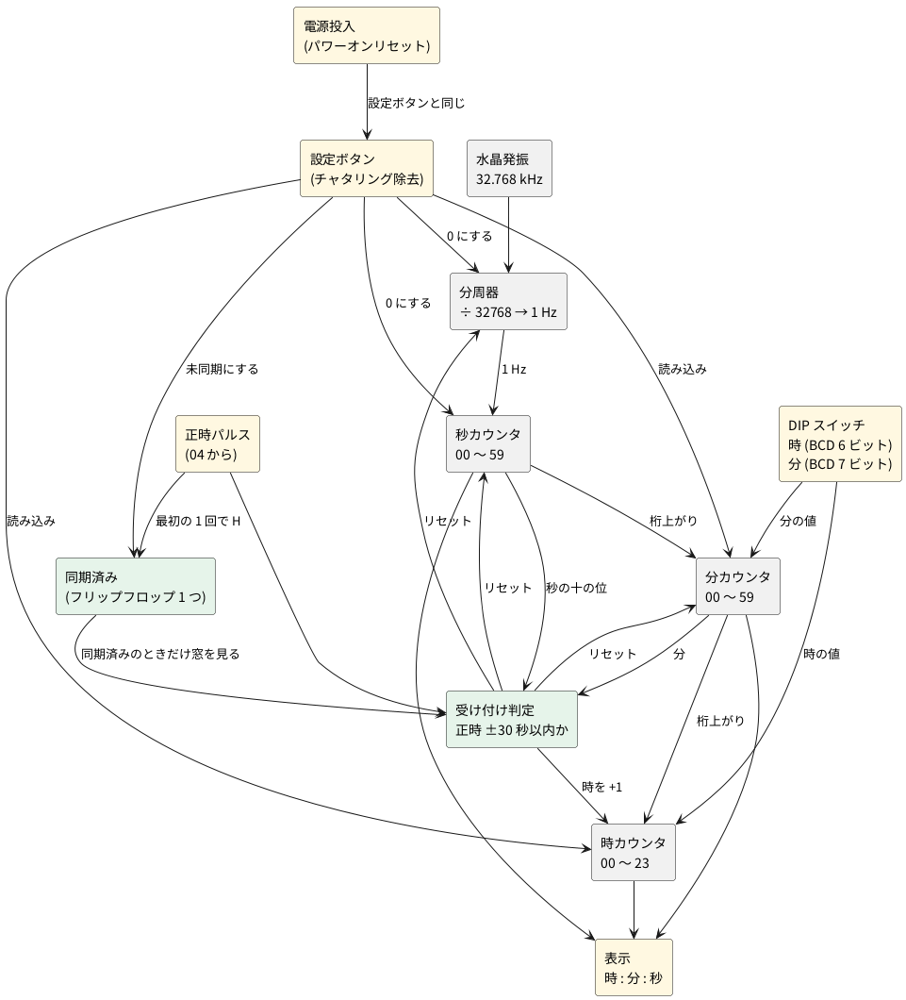

# 2-5 時計 — 32.768 kHz を数えて時分秒を出し、正時パルスで合わせる

全体の中の位置は [01-block.md](01-block.md) の ④ 時計。水晶の 32.768 kHz を分周して 1 Hz にし、
時・分・秒を数えて表示する。[04-state-machine.md](04-state-machine.md) の正時パルスが来たら、
時計を正時に合わせる。

## ブロック図

## 時刻の初期設定 — 時と分は DIP スイッチで、秒は最初の正時パルスで

時報には時刻の情報が無い (正時を知らせるだけ) ので、**時と分は人が DIP スイッチで合わせる**。
DIP スイッチは BCD で、時が 6 ビット (十の位 2 + 一の位 4)、分が 7 ビット (十の位 3 + 一の位 4)
の計 13 本。利用者は今の時刻を DIP に入れ、**設定ボタンを押した瞬間に**時計へ読み込む
(カウンタの並列ロード)。そのとき秒と分周器は 0 になり、時計が動き出す。

電源を入れた直後や設定ボタンを押した直後は、DIP の値が実際の時刻から数秒〜数十秒ずれる。
正時の窓 (次の節) の外のパルスは捨てるので、窓のままでは同期できないことがある。
そこで、**未同期のあいだは窓を見ず、最初の正時パルスを必ず受け付ける**。

1. 電源を入れる、または設定ボタンを押すと、DIP の値を読み込んで「未同期」になる。
   「未同期」の LED が点く。
2. 最初の正時パルスが来たら、分・秒・分周器を 0 にする。
   **時計の分が 30 以上なら時を +1 する** (正時に最も近い時へ丸める)。
3. 「同期済み」のフリップフロップを 1 にする (LED が消える)。以後は窓が有効になる。

| 状態 | 正時パルスの扱い |
| --- | --- |
| 未同期 | 窓を見ずに受け付ける。分・秒・分周器を 0 にし、分が 30 以上なら時を +1。同期済みにする |
| 同期済み | 次の節の窓の中だけ受け付ける |

「分が 30 以上」は、分の十の位 (BCD で 0〜5) のビット 2 とビット 1 の OR 1 つで分かる
(3 = 011、4 = 100、5 = 101)。窓の判定で使う「秒が 30 以上」と同じ作りで、
秒の十の位と分の十の位に、同じ回路を 2 つ置く。

足す部品は、DIP スイッチ 13 本 (8 本入りと 8 本入りなど)、設定ボタン (チャタリング除去つき)、
並列ロードつきの BCD カウンタ (74HC160 など)、同期済みの 1 ビット (フリップフロップ 1 つ)、
電源投入時に設定ボタンと同じ動きをするパワーオンリセットだ。
DIP が時 24 以上・分 60 以上のような**範囲外の値のときは、読み込みを止める判定を置かない**
(部品を増やさないため。利用者が正しい値を入れる)。
同期するまでは表示の分が不正確なので、「未同期」の LED で知らせる。

RTC の IC (DS3231 など) は使わない。I2C で時刻を読み書きするのにマイコンが要り、
ロジックで時間を扱う練習の意図から外れる。毎正時に合わせ直すので、精度も要らない。

## 正時リセットの決まり

**同期済みのとき**、正時パルスを受け付けるのは、時計の正時の前後 30 秒以内だけ。判定は分と秒の十の位で作り、
秒の一の位は見ない。

秒の十の位は BCD で 0〜5 (000〜101)。**秒が 30 以上かどうかは、ビット 2 とビット 1 の OR 1 つ**で分かる
(3 = 011、4 = 100、5 = 101)。これを X とする。

| パルスのときの時計 | 条件 | 動作 |
| --- | --- | --- |
| 59 分 30 秒以降 | 分が 59 かつ X | 時を +1 し、分・秒・分周器を 0 にする |
| 00 分 29 秒まで | 分が 00 かつ X でない | 時はそのまま、分・秒・分周器を 0 にする |
| 上の外 | — | 何もしない |

時の +1 は 23 時から 0 時へ回る (23 → 00)。判定のゲートは、分の「59」「00」の検出と、
上の OR 1 つ、AND 2 つほどで足りる。

(回路図と部品表はこれから書く)
