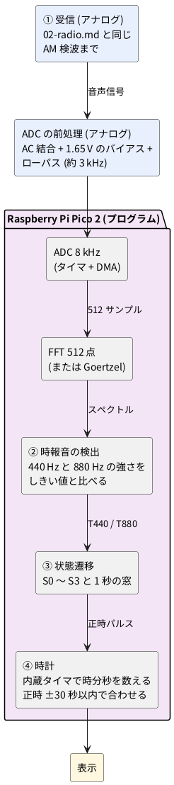

# 2-6 マイコン版 — ① 受信のあとを Raspberry Pi Pico 2 の FFT とプログラムで作る

> [!WARNING]
> **この題は、まだ実際の回路で検証していない。** 回路図・実体配線図・数値 (利得、波形、スペクトル) は、計算と見積りで作ったもので、正しく動くかどうかは確実ではない。Pico 2 のプログラムも、動かして確かめるまでは動作確認済みとは書かない。

[01-block.md](01-block.md) の ② 時報音の検出、③ 状態遷移、④ 時計を、ロジックの代わりに
**Raspberry Pi Pico 2 のプログラム**で作る。① 受信 ([02-radio.md](02-radio.md)) の AM 検波までは
同じ回路を使い、音声信号を Pico 2 の ADC に入れる。同じ時報を、回路とプログラムの両方で
作って比べるための題だ。

## ブロック図




## ADC と FFT の設計値 (案)

| 項目 | 値 | 理由 |
| --- | --- | --- |
| 標本化 | 8 kHz | 880 Hz の 9 倍で、ナイキスト 4 kHz。ローパスは約 3 kHz |
| 窓 | 512 点 (64 ms) | 約 0.1 秒の予報音が窓に収まり、440 Hz と 880 Hz を分けられる |
| 周波数の刻み | 8000 / 512 = 15.6 Hz | 440 Hz は第 28 ビン (437.5 Hz)、880 Hz は第 56 ビン (875 Hz) |
| 窓の進め方 | 256 点ずつ (32 ms) | 0.1 秒の音を 3 回ほどの窓で見られる |

2 つの周波数しか要らないので、FFT の代わりに **Goertzel 法** (見たい周波数だけを計算する)
でも足りる。計算は軽くなる。FFT で全体のスペクトルを見られるほうが、音を目で確かめやすい。

## ロジック版との比べ方

| 項目 | ロジック版 (02〜05) | マイコン版 (この題) |
| --- | --- | --- |
| 音の検出 (②) | 帯域通過フィルタ 2 系統 + 整流 + 比較器 | FFT (または Goertzel) の結果をしきい値と比べる |
| 時間の判定 (③) | 窓タイマと状態遷移回路 | `enum` と `switch` の状態遷移、時間はタイマ割り込み |
| 時計 (④) | 水晶 + 分周 + カウンタ | 内蔵タイマ + 変数 |
| 窓の変更 (±30 秒 → ±10 秒) | 判定ゲートを組み直す | 定数を 1 つ書き換える |
| 部品 | IC と受動部品が多い | ADC の前処理と Pico 2 |

電源は Pico 2 が 3.3 V なので、ADC の入力は 0〜3.3 V に収める。この本の既定 5 V から
外れる理由は、部品表に書く。

プログラムは C / C++ (Pico SDK) で書く。MicroPython 版は後回しにする。
pure Python の FFT 512 点は窓の進み (32 ms) に間に合わない見込みで、書くときは Goertzel 法にするなど
工夫が要るため (見積りで、実機では測っていない)。
(これから書く。実機で窓ごとの計算時間を測り、動かして確かめるまでは、動作確認済みとは書かない)

## 回路図

AM 検波の出力 ([02-radio.md](02-radio.md) の OUT) を、AC 結合で直流を切り、3.3 V の分圧で 1.65 V のバイアスを乗せ、
コンデンサ 1 つのローパス (約 3 kHz) を通して Pico 2 の ADC0 (GP26) に入れる。電源は Pico 2 の 3V3 ピンから取る。

```circuit
title: 図1 ADC の前処理 (AC 結合、1.65 V のバイアス、約 3 kHz のローパス)
parts:
  IN: port c2
  C1: capacitor c3 c7 0.1u
  Ra: resistor a8 c8 220k
  VCC1: vcc a8 3.3V
  Rb: resistor c8 e8 220k
  GB: ground e8
  Cf: capacitor c11 e11 1n
  GF: ground e11
  U1:
    type: device
    at: c15
    label: Pico 2
    pins: [3V3, GP26, AGND]
  GA: ground f13
wires:
  - c2 -- c3
  - c7 -- c8
  - c8 -- c11
  - c11 |- U1.GP26
  - a8 -- a13 |- U1.3V3
  - f13 |- U1.AGND
notes:
  - text b2 small left: 検波出力
  - text e5 small blue center: 高域の肩 約 7.6 Hz
  - text f8 small blue left: 1.65 V のバイアス
  - text g11 small blue center: 低域の肩 約 3.0 kHz
  - text a15 small blue left: GP26 は ADC0
style:
  grid: off
  pitch: 1.2
```


左から、AC 結合の C1、3.3 V を Ra と Rb で半分にするバイアス、低域をなだらかに落とす Cf、ADC の入力の順に並べた。
Ra と Rb は同じ 220 kΩ なので、節点の直流は 3.3 V の半分の 1.65 V になる。

## 部品表

| 部品 | 値 | 備考 |
| --- | --- | --- |
| U1 | Raspberry Pi Pico 2 | 3.3 V で動く。ADC は 12 ビット、入力は 0〜3.3 V |
| C1 | 0.1 µF | AC 結合 (セラミック)。直流を切る |
| Ra, Rb | 220 kΩ | バイアスの分圧。並列で 110 kΩ |
| Cf | 1 nF | ローパス (セラミック)。Ra‖Rb と検波の 100 kΩ の並列 約 52 kΩ と組んで約 3 kHz |

この本の既定は 5 V だが、Pico 2 の ADC は 3.3 V までなので、ここだけ 3.3 V にする。
5 V の検波回路と Pico 2 は、GND をそろえるだけでつなぐ (電源は別々に入れる)。

- 折れ点の計算: 高域は 1 / (2π × (100 kΩ + 110 kΩ) × 0.1 µF) = 約 7.6 Hz。低域は 1 / (2π × 52.4 kΩ × 1 nF) = 約 3.04 kHz。
- 通過する割合は 110 / (100 + 110) = 0.524 (−5.6 dB)。検波の出力 (02-radio.md の R5 100 kΩ) を電圧源と見て Ra‖Rb に分けた計算で、
  検波の C4 (0.01 µF) の影響は含めていない。
- 源の抵抗が約 52 kΩ と高いので、ADC の入力の精度は落ちる見込み (Pico 2 の ADC の推奨は未確認)。
  精度が出なければ、オペアンプのボルテージフォロワを間に足す。

## 実体配線図

```bread
title: 図2 Pico 2 と ADC の前処理のブレッドボード
board: full
parts:
  DET:
    type: device
    at: top
    label: 検波出力 (02-radio.md)
    pins: [OUT, GND]
  MCU: pico2 @ h5
  C1: capacitor/ceramic d29 d34 0.1u
  Ra: resistor a34 +t34 220k
  Rb: resistor a39 -t39 220k
  Cf: capacitor/ceramic a44 -t44 1n
wires:
  - DET.OUT -- a29 white
  - DET.GND -- -t31 black
  - b9 -- +t9 red
  - a12 -- -t12 black
  - c34 -- c39 blue
  - d39 -- d44 blue
  - b34 -- b14 white
notes:
  - circle b14 orange
  - text tiny ink: "橙の丸はオシロ (AD3) の CH1 を当てる ADC 入力 (ADC0)。黒い線は GND"
```


```perf
title: 図2b Pico 2 と ADC の前処理のユニバーサル基板
board: 7x5cm
style:
  check: off
parts:
  DET:
    type: device
    at: -c1
    label: 検波出力
    pins: GND OUT
  MCU: pico2 j5
  C1: capacitor/ceramic b2 b6 0.1u
  Ra: resistor b8 f8 220k
  Rb: resistor b10 h10 220k
  Cf: capacitor/ceramic b12 h12 1n
wires:
  - DET.GND -- h1 black
  - DET.OUT -- b2
  - h1 -- h6 black
  - h6 -- h10 black
  - h10 -- h12 black
  - j12 -- h12 black
  - b6 -- b8 white
  - b8 -- b10 white
  - b10 -- b12 white
  - b12 -- b14 white
  - j14 -- b14 white
  - f8 -- f9 red
  - j9 -- f9 red
notes:
  - mark b14 orange
  - text d16 orange: ADC0 (CH1)
  - mark h6 black
```


図2 はブレッドボード、図2b は同じ回路をユニバーサル基板に組む図。次の説明は図2 のもので、図2b は「ユニバーサル基板に組むとき」に書く。

全体 (63 列) のブレッドボードに、Pico 2 を 5〜24 列にまたがせて挿す。USB が左を向く。

| 場所 | 挿すもの |
| --- | --- |
| 9 列 | Pico 2 の 3V3 (36 番) から赤い線で上の + レールへ |
| 12 列 | AGND (33 番) から黒い線で上の − レールへ |
| 14 列 | GP26 (31 番)。`b14` から白い線で 34 列へ |
| 29〜31 列 | 検波出力の OUT (白) を `a29`、GND (黒) を − レールの 31 列へ |
| 29〜34 列 | C1 (`d29` と `d34`)。34 列が節点 |
| 34 列 | Ra (`a34` から + レール)。`b34` から GP26 への白い線 |
| 34〜39 列 | 青い線 (`c34`〜`c39`)。39 列に Rb (`a39` から − レール) |
| 39〜44 列 | 青い線 (`d39`〜`d44`)。44 列に Cf (`a44` から − レール) |

- 線の色は、赤が + の電源 (3.3 V)、黒が GND だけ。白は信号、青は節点どうしのつなぎ
- 上の + レールは 3.3 V、− レールは GND。5 V の検波回路とレールを共有しない
- Pico 2 には USB で電源を入れる (パソコンとつなぐ)

### ユニバーサル基板に組むとき

図2b は図2 と同じ回路で、ネットリストも同じ (check で突き合わせて、検波出力・GND・ADC の節点・3.3 V が一致した)。

- 板は 5×7 cm (24 列 × 18 行を横に置く)。Pico 2 は 20 列 × 8 行を占め、5〜24 列、`j`〜`q` 行に載る (USB が左)。前処理の部品は、Pico 2 の上の空いた `b`〜`h` 行に置く。厚みと基材は書いていないので 1.6 mm の FR-4
- 図は部品面から見たもの。Pico 2 は上の列のピン (40 番〜21 番) が前処理の側に向く。3V3 (36 番) は `j9`、AGND (33 番) は `j12`、GP26 (31 番) は `j14`
- Pico 2 の使わない 37 本の足は、どこにもつなげない。ERC がその全部を「つながっていません」と言い続けるので、この図は `style: check: off` で検査を外した。つなぐ足 (3V3・AGND・GP26) は、check のネットリストで確かめた
- 3.3 V は `j9` から真上へ上げて `f9` (Ra の下の足) につなぐ。この赤い線は GND の線 (`h` 行) を渡るので、被覆線にする
- GND は検波出力の板の外の機器から `h1` へ下ろし、`h` 行を右へ引いて Rb と Cf の下の足 (`h10`・`h12`) に集める。AGND (`j12`) は `h12` へ上げてつなぐ
- ADC への入力 (GP26) は `j14` から `b14` へ上げ、`b` 行の線 (白) で C1・Ra・Rb・Cf の上の足を集める。橙の丸 (`b14`) がオシロの CH1、黒い丸 (`h6`) が GND のクリップ
- ブレッドボードではなく半田付けにする理由は、ADC に入る小さな信号 (交流分 52 mVpp) が、接触の揺れで読みがぶれるのを避けるため

| 場所 | 挿すもの |
| --- | --- |
| 1〜6 列 (`b` 行) | C1 (`b2`〜`b6`)。`b2` に検波出力の OUT の線が来る |
| 8 列 | Ra (`b8`〜`f8`)。`f8` と `f9` を線でつなぐ |
| 10 列 | Rb (`b10`〜`h10`) |
| 12 列 | Cf (`b12`〜`h12`) |
| `b` 行 | ADC の節点。`b6`・`b8`・`b10`・`b12`・`b14` を線でつなぐ |
| `h` 行 | GND の筋。`h1`・`h6`・`h10`・`h12` を線でつなぐ |

この図は、組んで確かめていない (題の頭の WARNING のとおり)。周波数は 4 kHz 以下、電圧は 3.3 V 以下なので、ユニバーサル基板の範囲に収まる。

## 測定値のグラフとスペクトル

計器は Analog Discovery 3 (AD3)。入力は ADC0 のピン (橙の丸) に CH1 を当て、GND のクリップを − レールにつなぐ。

### 前処理の周波数特性

```graph
title: 図3 ADC の前処理の周波数特性 (計算)
x: 周波数 Hz log 10..10k
y: 利得 dB -40..0
lines:
  前処理の利得 dB: 20*log10(0.5238 * (x/7.58)/sqrt(1+(x/7.58)^2) / sqrt(1+(x/3038)^2))
notes:
  - mark 440
  - mark 880
  - mark 4k
```


### ADC 入力の波形

```scope
title: 図4 ADC 入力の最大の振れ (0〜3.3 V に収まる限度)
time: 1ms/div
trigger: ch1 rising 1.65V
ch1: {wave: sine 440Hz 1.5V offset 1.65V, range: 500mV/div, position: -3.3div}
measure: [vpp, avg, freq]
cursors: [0, 568us]
```


```scope
title: 図5 予報音 440 Hz の 0.1 秒のバースト (ADC 入力の交流分)
time: 20ms/div
trigger: ch1 rising 0V
ch1: {wave: "= 26mV * sin(2 * pi * 440Hz * t) * (step(t + 50ms) - step(t - 50ms))", range: 20mV/div}
measure: [vpp, freq]
```


### FFT 512 点の結果

spectrum フェンスの AD3 は、掃引の終わりの 2.56 倍が標本化周波数で、標本数は 1024 点以上に決まっている。
Pico 2 の 8 kHz・512 点とは合わない (8 kHz にするには掃引の終わりが 3.125 kHz で、512 点にはできない)。
そこで、Pico 2 のプログラムが出す FFT の結果を、graph フェンスで描いた。窓は Hann、縦軸は 440 Hz の山を 0 dB にした相対値。
**実測ではなく、理想の正弦波から計算した値**で、−60 dB より低い所は −60 dB に切った。

```graph
title: 図6 FFT 512 点の結果 (8 kHz、Hann 窓、計算)
x: 周波数 Hz 300..1000
y: 強さ dB -60..0
lines:
  440 Hz の音 dB:
    - 312.5 -60.0
    - 328.125 -60.0
    - 343.75 -60.0
    - 359.375 -59.0
    - 375 -53.1
    - 390.625 -45.5
    - 406.25 -34.3
    - 421.875 -8.2
    - 437.5 0.0
    - 453.125 -4.0
    - 468.75 -28.8
    - 484.375 -41.9
    - 500 -50.2
    - 515.625 -56.3
    - 531.25 -60.0
    - 546.875 -60.0
    - 562.5 -60.0
    - 578.125 -60.0
    - 593.75 -60.0
    - 609.375 -60.0
    - 625 -60.0
    - 640.625 -60.0
    - 656.25 -60.0
    - 671.875 -60.0
    - 687.5 -60.0
    - 703.125 -60.0
    - 718.75 -60.0
    - 734.375 -60.0
    - 750 -60.0
    - 765.625 -60.0
    - 781.25 -60.0
    - 796.875 -60.0
    - 812.5 -60.0
    - 828.125 -60.0
    - 843.75 -60.0
    - 859.375 -60.0
    - 875 -60.0
    - 890.625 -60.0
    - 906.25 -60.0
    - 921.875 -60.0
    - 937.5 -60.0
    - 953.125 -60.0
    - 968.75 -60.0
    - 984.375 -60.0
    - 1000 -60.0
  880 Hz の音 dB:
    - 312.5 -60.0
    - 328.125 -60.0
    - 343.75 -60.0
    - 359.375 -60.0
    - 375 -60.0
    - 390.625 -60.0
    - 406.25 -60.0
    - 421.875 -60.0
    - 437.5 -60.0
    - 453.125 -60.0
    - 468.75 -60.0
    - 484.375 -60.0
    - 500 -60.0
    - 515.625 -60.0
    - 531.25 -60.0
    - 546.875 -60.0
    - 562.5 -60.0
    - 578.125 -60.0
    - 593.75 -60.0
    - 609.375 -60.0
    - 625 -60.0
    - 640.625 -60.0
    - 656.25 -60.0
    - 671.875 -60.0
    - 687.5 -60.0
    - 703.125 -60.0
    - 718.75 -60.0
    - 734.375 -60.0
    - 750 -60.0
    - 765.625 -60.0
    - 781.25 -59.3
    - 796.875 -54.6
    - 812.5 -49.0
    - 828.125 -41.8
    - 843.75 -31.4
    - 859.375 -11.0
    - 875 -0.4
    - 890.625 -2.5
    - 906.25 -20.9
    - 921.875 -35.5
    - 937.5 -44.4
    - 953.125 -50.9
    - 968.75 -56.0
    - 984.375 -60.0
    - 1000 -60.0
notes:
  - mark 437.5
  - mark 875
```


## 見るべき値

check の読み値と突き合わせた値。

| 項目 | 見るべき値 | 根拠 |
| --- | --- | --- |
| 利得 440 Hz | −5.71 dB | 図3 |
| 利得 880 Hz | −5.97 dB | 図3 |
| 利得 4 kHz (ナイキスト) | −9.98 dB | 図3。ローパス 1 つなので、4 kHz 以上は十分に落ちない |
| ADC 入力の直流 | 1.65 V | 図4 の Avg |
| ADC 入力の上限と下限 | 0.15 V〜3.15 V (3.00 Vpp) | 図4。0〜3.3 V に収まる限度 |
| 予報音の交流分 | 52.0 mVpp (検波出力 50 mV 想定) | 図5。ADC の 1 ステップ (3.3 V / 4096 = 0.81 mV) の約 64 倍 |
| バースト | 約 0.1 秒、440 Hz | 図5。FFT の窓 (64 ms) の約 1.6 倍 |
| FFT の山 (440 Hz の音) | 第 28 ビン (437.5 Hz) が 0 dB、第 27・29 ビンは −8.2・−4.0 dB | 図6 |
| FFT の山 (880 Hz の音) | 第 56 ビン (875 Hz) が −0.4 dB、第 55・57 ビンは −11.0・−2.5 dB | 図6 |

- 検波出力 50 mV は 02-radio.md の仮の値で、実際の大きさは受信した電波で変わる。小さすぎるときはオペアンプで増幅する
- 予報音の 0.1 秒に対して窓は 64 ms なので、窓を 32 ms ずつ進めれば山が数回の窓に入る
- 本番の ADC の読みは、1.65 V (2048 付近) を中心に 440 Hz が乗る。プログラムは平均を引いてから FFT する
