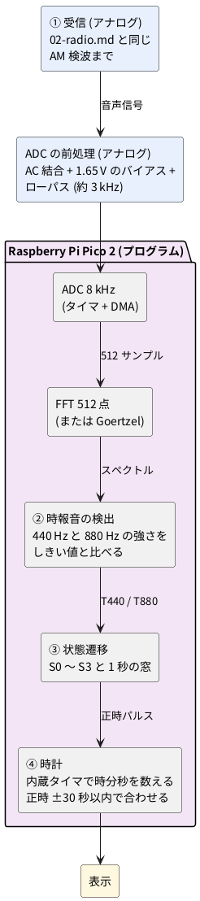

# 2-6 マイコン版 — ① 受信のあとを Raspberry Pi Pico 2 の FFT とプログラムで作る

[01-block.md](01-block.md) の ② 時報音の検出、③ 状態遷移、④ 時計を、ロジックの代わりに
**Raspberry Pi Pico 2 のプログラム**で作る。① 受信 ([02-radio.md](02-radio.md)) の AM 検波までは
同じ回路を使い、音声信号を Pico 2 の ADC に入れる。同じ時報を、回路とプログラムの両方で
作って比べるための題だ。

## ブロック図

## ADC と FFT の設計値 (案)

| 項目 | 値 | 理由 |
| --- | --- | --- |
| 標本化 | 8 kHz | 880 Hz の 9 倍で、ナイキスト 4 kHz。ローパスは約 3 kHz |
| 窓 | 512 点 (64 ms) | 約 0.1 秒の予報音が窓に収まり、440 Hz と 880 Hz を分けられる |
| 周波数の刻み | 8000 / 512 = 15.6 Hz | 440 Hz は第 28 ビン (437.5 Hz)、880 Hz は第 56 ビン (875 Hz) |
| 窓の進め方 | 256 点ずつ (32 ms) | 0.1 秒の音を 3 回ほどの窓で見られる |

2 つの周波数しか要らないので、FFT の代わりに **Goertzel 法** (見たい周波数だけを計算する)
でも足りる。計算は軽くなる。FFT で全体のスペクトルを見られるほうが、音を目で確かめやすい。

## ロジック版との比べ方

| 項目 | ロジック版 (02〜05) | マイコン版 (この題) |
| --- | --- | --- |
| 音の検出 (②) | 帯域通過フィルタ 2 系統 + 整流 + 比較器 | FFT (または Goertzel) の結果をしきい値と比べる |
| 時間の判定 (③) | 窓タイマと状態遷移回路 | `enum` と `switch` の状態遷移、時間はタイマ割り込み |
| 時計 (④) | 水晶 + 分周 + カウンタ | 内蔵タイマ + 変数 |
| 窓の変更 (±30 秒 → ±10 秒) | 判定ゲートを組み直す | 定数を 1 つ書き換える |
| 部品 | IC と受動部品が多い | ADC の前処理と Pico 2 |

電源は Pico 2 が 3.3 V なので、ADC の入力は 0〜3.3 V に収める。この本の既定 5 V から
外れる理由は、部品表に書く。

プログラムは C / C++ (Pico SDK) で書く。MicroPython 版は後回しにする。
pure Python の FFT 512 点は窓の進み (32 ms) に間に合わない見込みで、書くときは Goertzel 法にするなど
工夫が要るため (見積りで、実機では測っていない)。
(これから書く。実機で窓ごとの計算時間を測り、動かして確かめるまでは、動作確認済みとは書かない)

(回路図と部品表はこれから書く)
