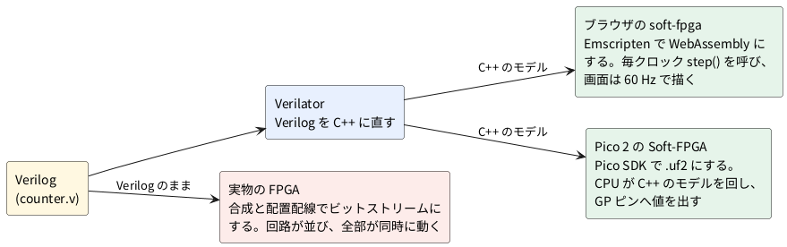

# 0-1 FPGA と Soft-FPGA の違い — 回路を並べる物と、回路を計算で真似る物

この題は実体配線図と Analog Discovery 3 の図を付けない。組む物が無く、考え方を図にするだけの題だから。

この本では 1 本の Verilog を 3 つの所で動かす。ブラウザ、Raspberry Pi Pico 2、実物の FPGA である。
3 つは同じ Verilog から始まるが、動く仕組みが 2 通りに分かれる。
先に違いをつかんでおくと、後の章で「なぜここだけ遅いのか」「なぜここだけ波形が見えるのか」を迷わずに読める。

## 回路を並べる物 (FPGA)

FPGA の中には、小さな真理値表 (LUT) とフリップフロップ (FF) と、それらをつなぐ配線の束が並んでいる。
Verilog を「合成」にかけると、どの LUT にどの真理値表を入れ、どの配線をつなぐかの設定 (ビットストリーム) ができる。
設定を書き込むと、書いた回路そのものが基板の上にできあがる。

- 回路の全部が**同時に**動く。カウンタも比較器も、クロックの 1 回ごとに並んで進む
- 1 クロックの長さは、回路の遅れ (信号が LUT と配線を通る時間) で下から決まる。速くしすぎると壊れる (第 9 章)
- 外から見えるのは、ピンに引き出した信号だけ

## 回路を計算で真似る物 (Soft-FPGA)

Soft-FPGA は、Verilog を [Verilator](https://veripool.org/guide/latest/) で C++ のモデルに直し、
普通のプログラムとして動かす方式。回路は作らない。回路の動きを計算で真似る。

- 1 クロックを進めるたびに、モデルの計算を 1 回呼ぶ。計算は C++ の中で順に行われるが、Verilog の約束どおり「同時に動いたのと同じ結果」になるよう Verilator が並べ替える
- 回路の遅れは計算に入らない。見えるのは「クロックごとの値」で、「信号が何 ns 遅れたか」は見えない
- モデルの中の値を全部読めるので、FPGA では引き出せない内部の信号も見られる
- 動かす所は 2 つ。ブラウザの [soft-fpga](https://github.com/tommie-jp/soft-fpga) (WebAssembly) と、Pico 2 の Soft-FPGA (Pico SDK の C++)

soft-fpga の例では、1 クロックは次の 2 行で進む (`examples/01-counter/cxx/harness.cpp` の `step()` から)。

```cpp
top->clk = 0; top->eval();   // クロックを下げて計算
top->clk = 1; top->eval();   // クロックを上げて計算 (ここで FF の値が変わる)
```

## 図




## 同じ Verilog が 2 通りに動く

次の 3 行を考える。

```verilog
assign y = a & b;
always @(posedge clk) q <= y;
```

- FPGA では、AND の LUT と FF がそれぞれ別の場所にでき、クロックの立ち上がりごとに FF が y を取り込む
- Soft-FPGA では、`eval()` が呼ばれるたびに、まず y を計算し、立ち上がりのときだけ q を y に更新する

どちらも「クロックの立ち上がりで q が y になる」という結果は同じ。
違うのは、FPGA では y が決まるまでの遅れが実際にあり、Soft-FPGA ではその遅れが無いこと。
遅れが原因の不具合 (タイミング違反) は、実物の FPGA でしか起きない。

## 3 つの所の比べ

| 観点 | ブラウザの soft-fpga | Pico 2 の Soft-FPGA | 実物の FPGA |
| --- | --- | --- | --- |
| 回路ができるか | できない。計算で真似る | できない。計算で真似る | できる |
| 全部が同時か | 結果は同時と同じ。計算は順 | 結果は同時と同じ。計算は順 | 実際に同時 |
| 回路の遅れ | 見えない | 見えない | 実際にある (第 9 章) |
| 内部の信号 | 全部見える | 出したピンだけ | 出したピンだけ |
| 1 クロックの長さ | 画面の速度スライダで決まる | **測って表に書く (5-5)** | **測って表に書く (第 8 章)** |
| 用意する物 | ブラウザ | Pico 2 と AD3 | FPGA ボードと AD3 |

1 クロックの長さと速さの数は、この題では決めない。実機で測ってから、5-5 と第 8 章の表に書く。

## 見るべき値

この題は手を動かさない。読み終えて、次の 3 つに答えられれば十分。

- FPGA で全部が同時に動くのは、なぜか (回路が実際に並ぶから)
- Soft-FPGA で内部の信号が見えるのは、なぜか (モデルの値を直接読めるから)
- Soft-FPGA で見えないものは何か (回路の遅れ)

## 出典

自作。soft-fpga の構成は [tommie-jp/soft-fpga](https://github.com/tommie-jp/soft-fpga) の README と `examples/01-counter`。
Verilator の使い方は [Verilator のガイド](https://veripool.org/guide/latest/)。
