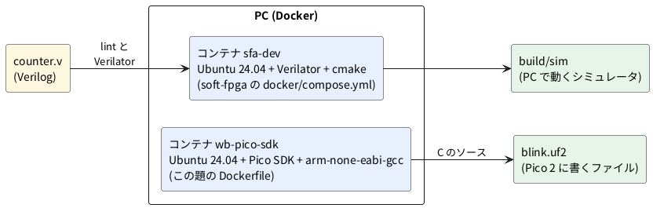

# 0-2 道具を入れる — Verilator と Pico SDK を Docker で

この題は実体配線図と Analog Discovery 3 の図を付けない。組む物が無く、PC に道具を入れるだけの題だから。

この本の道具は 2 組ある。

- **Verilator**: Verilog を検査し (lint)、C++ に直してシミュレーションする。第 1〜4 章で使う
- **Pico SDK**: C / C++ を Pico 2 用の `.uf2` にする。第 5 章から使う

PC に直接入れると、版の違いで手順が崩れやすい。そこで Docker のコンテナに入れ、PC の中を汚さずに、誰でも同じ版にそろえる。

## 道具の全体




## 1. Verilator (soft-fpga の Docker)

soft-fpga のリポジトリが、Verilator 入りのコンテナを用意している。

```bash
git clone https://github.com/tommie-jp/soft-fpga.git
cd soft-fpga
docker compose -f docker/compose.yml run --rm dev
```

初回はコンテナの作成 (`docker/Dockerfile`) が走る。Ubuntu 24.04 に、ソースから Verilator (版は Dockerfile の `VERILATOR_TAG`、本稿の確認時は v5.048) を入れるので、時間がかかる。
2 回目からは作り置きのコンテナがすぐ立ち上がる。

プロンプトが出たら、コンテナの中で次を打つ。リポジトリは `/work` にある。

```bash
verilator --version
cmake -S examples/01-counter -B /tmp/b1
cmake --build /tmp/b1
/tmp/b1/sim
```

`examples/01-counter` は 8 ビットのカウンタで、0-5 で使う。ここでは「Verilog が C++ になって動く」ことだけを確かめる。

Verilog の書き間違いを見る lint は、次の 1 行。0-7 で詳しく使う。

```bash
verilator --lint-only -Wall examples/01-counter/verilog/counter.v
```

警告が無ければ、Verilator の報告 (Verilation Report) の 3 行だけが出て、終了コードは 0 になる。

## 2. Pico SDK (自前の Dockerfile)

soft-fpga の `docker/Dockerfile` に Pico SDK は入っていない。Pico 2 用は、次の `Dockerfile` を別に作る。

```dockerfile
FROM ubuntu:24.04
RUN apt-get update \
    && DEBIAN_FRONTEND=noninteractive apt-get install -y --no-install-recommends \
        ca-certificates git cmake ninja-build build-essential python3 \
        gcc-arm-none-eabi libnewlib-arm-none-eabi libstdc++-arm-none-eabi-newlib \
    && rm -rf /var/lib/apt/lists/*
ARG PICO_SDK_TAG=2.2.0
RUN git clone --depth 1 --branch ${PICO_SDK_TAG} https://github.com/raspberrypi/pico-sdk.git /opt/pico-sdk
ENV PICO_SDK_PATH=/opt/pico-sdk
WORKDIR /work
CMD ["bash"]
```

```bash
docker build -t wb-pico-sdk .
```

試しに、GP15 を 0.5 秒ごとに反転する小さな C のプログラムをビルドする。作業用のフォルダに 3 つのファイルを置く。

`main.c`:

```c
#include "pico/stdlib.h"

int main(void) {
    gpio_init(15);
    gpio_set_dir(15, GPIO_OUT);
    while (true) {
        gpio_put(15, 1);
        sleep_ms(500);
        gpio_put(15, 0);
        sleep_ms(500);
    }
}
```

`CMakeLists.txt`:

```cmake
cmake_minimum_required(VERSION 3.13)
set(PICO_BOARD pico2 CACHE STRING "Board type")
include(pico_sdk_import.cmake)
project(blink C CXX ASM)
pico_sdk_init()
add_executable(blink main.c)
target_link_libraries(blink pico_stdlib)
pico_add_extra_outputs(blink)
```

`pico_sdk_import.cmake` は Pico SDK の `external/` にあるものをコピーする (コンテナの中なら `/opt/pico-sdk/external/pico_sdk_import.cmake`)。

```bash
docker run --rm --user "$(id -u):$(id -g)" -v "$PWD":/work wb-pico-sdk \
  bash -c 'cmake -S . -B build -DPICO_BOARD=pico2 && cmake --build build -j8'
```

`build/blink.uf2` ができれば道具は入っている。

- `PICO_BOARD=pico2` を付け忘れると Pico (RP2040) 用になり、Pico 2 では動かない
- 設定の途中で「TinyUSB submodule has not been initialized」と出る。USB 経由の `printf` を使わない間は無関係で、そのまま進めてよい
- 設定のとき、picotool をネットワークから取ってビルドする。ネットワークが無い所では失敗する
- `.uf2` を Pico 2 に書くのは PC 側。BOOTSEL ボタンを押しながら USB をつなぐと出る USB ドライブに、`blink.uf2` をコピーする。コンテナの中からは USB に届かない

## 見るべき値

2 つのコンテナについて、実際に動かして次の出力を得た (WSL2 の Ubuntu、Docker 29.6)。

| 確かめること | 打つ物 | 出た物 |
| --- | --- | --- |
| Verilator の版 | `verilator --version` (sfa-dev の中) | `Verilator 5.048 2026-04-26 rev v5.048` |
| カウンタのビルドと実行 | `/tmp/b1/sim` | `OK: 100 cycles, last count=100` |
| lint | `verilator --lint-only -Wall …/counter.v` | 警告なし (終了コード 0) |
| Pico SDK の版 | `git -C /opt/pico-sdk describe --tags` (wb-pico-sdk の中) | `2.2.0` |
| コンパイラ | `arm-none-eabi-gcc --version` | `13.2.1 20231009` |
| `.uf2` | `ls -l build/blink.uf2` | 12800 バイトのファイルができる |

`count=100` は、100 クロック数えたカウンタの値。0 から数えて 100 回目の立ち上がりで 100 になる。
`blink.uf2` を Pico 2 に書いて動かすことは、この題ではしていない。実機での確認は 0-3 と 0-4 に置く。

## 出典

自作。Verilator のコンテナは [tommie-jp/soft-fpga](https://github.com/tommie-jp/soft-fpga) の `docker/` と `examples/01-counter`。
Pico SDK は [raspberrypi/pico-sdk](https://github.com/raspberrypi/pico-sdk) の 2.2.0。
Pico SDK の使い方は Raspberry Pi の「Getting started with Raspberry Pi Pico-series」。
