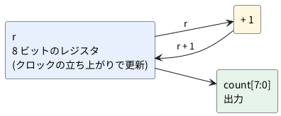

# 0-5 最初の 1 本 — ブラウザの soft-fpga でカウンタの波形を見る

この題は実体配線図と Analog Discovery 3 の図を付けない。ブラウザの中で動く題で、組む物が無いから。

この本で最初に動かす Verilog は、8 ビットのカウンタ 1 本。
ブラウザで公開されている soft-fpga の例 `01-counter` を開き、8 本のビットが 1 クロックごとにどう変わるかを見る。
インストールするものは無い。

## 開く

[https://tommie-jp.github.io/soft-fpga/01-counter/](https://tommie-jp.github.io/soft-fpga/01-counter/) を開く。

画面には次が並ぶ。

- **Run**: 押すと走り (ボタンの字は `Pause` に変わる)、もう一度押すと止まる
- **Reset**: カウンタを 0 に戻して止める
- **速度**: 1 回の描画 (1 秒に 60 回ほど) で進めるクロックの数。既定は 200
- 上に `b7`、下に `b0` と名前の付いた 8 本の波形。左が過去、右が最新

## 論理図

カウンタの中身は、8 ビットのレジスタ `r` と、1 を加える回路だけ。クロックの立ち上がりごとに `r` が `r + 1` に変わる。




`rst` が 1 になると、`r` は 0 に戻る (非同期リセット。違いは 2-3)。

## Verilog

soft-fpga の `examples/01-counter/verilog/counter.v` そのまま。

```verilog
module counter #(parameter W = 8) (
    input             clk,
    input             rst,
    output [W-1:0]    count
);
    reg [W-1:0] r;
    assign count = r;

    always @(posedge clk or posedge rst)
        if (rst) r <= {W{1'b0}};
        else     r <= r + 1'b1;
endmodule
```

- `parameter W = 8` はビットの数。ここでは 8
- `always @(posedge clk or posedge rst)` は「クロックの立ち上がり、またはリセットの立ち上がりで動く」の意味。ブラウザの画面では、リセットは Reset ボタンが担当する
- `r <= r + 1'b1` が 1 クロックの仕事。`<=` は 2-2 で詳しく読む

Verilator の lint (`verilator --lint-only -Wall counter.v`) は、警告なしで通る (確かめた)。

## 見る

Run を押して、少し走らせてから Run をもう一度押して止める。波形は左から右へ流れる。

- `b0` (一番下) が一番細かく、1 クロックごとに反転する
- `b1` は 2 クロックごと、`b2` は 4 クロックごと。上に行くほど倍ずつ遅くなる
- 一番上の `b7` は 128 クロックごとに反転する

カウンタは 2 進数を数えているので、ビット k は 2<sup>k</sup> クロックごとに反転する。
`count` の値は、`b7` を一番上の桁にした 2 進数になっている。

画面の波形の見え方を、`logic` のフェンスで先に描くと次のようになる。ブラウザの画面には時間の単位が無く、横の 1 ピクセルが 1 クロックに当たる。
ここでは 1 クロックを 1 ms と置いて描いた (数え方を見るための仮の目盛)。

```logic
title: 図1 リセットの後、count が 1 → 2 → 3 … と数える
device: generic
time: 1ms/div
signals:
  CLK: dio0 clock 1kHz
  Q: dio1..dio8 counter on CLK rising start 1 wrap 256
buses:
  Count: Q7..Q0 dec
cursors: [2.25ms, 6.25ms]
trigger: CLK rising at 0s
```


## 見るべき値

上の 2 行は、soft-fpga の 01-counter をブラウザで動かして得た値 (Reset の後に `step` を 10 回呼んで、画面が使うリングバッファを読んだ)。残りは計算値。

| 見る所 | 値 | 分かること |
| --- | --- | --- |
| リセットの直後に 1 クロック進めた `count` | 1 | 0 から数え始め、最初の立ち上がりで 1 になる |
| 10 クロック進めたときの `count` の並び | 1, 2, 3, 4, 5, 6, 7, 8, 9, 10 | 1 クロックごとに 1 増える |
| `b0` の周期 (計算値) | 2 クロック | 1 クロックごとに反転する |
| `b7` の周期 (計算値) | 256 クロック | 128 クロックごとに反転する |
| 255 の次の `count` (計算値) | 0 | 8 ビットなので 256 で 0 に戻る |

Run で走らせると、画面の `cycles` の数が増える。速度が既定の 200 で、表示が 1 秒に 60 回のとき、
1 秒あたりに進むクロックは約 12,000 になる (計算値)。実際に半秒走らせたら 6,000 cycles だった。

## 出典

自作。波形の画面は [soft-fpga の 01-counter](https://tommie-jp.github.io/soft-fpga/01-counter/)、
Verilog は [tommie-jp/soft-fpga](https://github.com/tommie-jp/soft-fpga) の `examples/01-counter/verilog/counter.v`。
ブラウザの中でカウンタの値を取り出す仕組みは 4-1。
