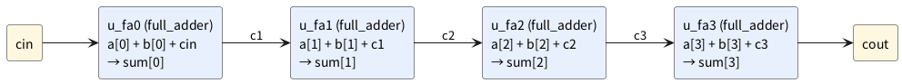

# 1-7 4 ビットの加算器 — 全加算器を 4 つ並べるのと + 演算子を比べる

4 ビットの数どうしを足す加算器を、2 通りに書く。1 つは 1-6 の全加算器を 4 つ並べて桁上げをつなぐ書き方 (リップル加算器)、
もう 1 つは `+` 演算子に任せる書き方だ。同じ入力を両方に入れ、出力が同じかを見る。

この題は組まない題で、実体配線図と Analog Discovery 3 は付けない。PC の中だけで動かす (`device: SIM`)。
全部の入力で比べる全数検査は 3-4 で行う。

## 説明

- **リップル加算器** は、下の桁の全加算器の桁上げ (cout) を、すぐ上の桁の全加算器の桁上げ入力 (cin) につなぐ。
  桁上げが波のように下から上へ順に伝わるので、この名前で呼ぶ
- `+` 演算子は、足し算を 1 行で書ける。Verilog を FPGA の部品に直す道具 (合成ツール) が、適した加算回路を選んでくれる
- 4 ビットどうしの足し算は答えが 5 ビットになる (15 + 15 + 1 = 31)。5 ビット目が cout だ

## 論理図

図 1 は、全加算器 (1-6) を 4 つ並べた構成のブロック図だ。各ブロックの中身は 1-6 の図 2 と同じ。




- 桁上げの線 (c1・c2・c3) が、左 (下の桁) から右 (上の桁) へ 1 本ずつ渡る
- 下の桁の桁上げが決まるまで、上の桁の答えは確定しない。桁数が増えると、その分だけ待つ段が増える (この比べ方は 1-15 で扱う)

## Verilog

全加算器 `full_adder` と半加算器 `half_adder` は 1-6 のものをそのまま使う。まずリップル加算器。

```verilog
// adder4_ripple.v  (full_adder と half_adder は 1-6 のもの)
module adder4_ripple (
    input  wire [3:0] a,
    input  wire [3:0] b,
    input  wire       cin,
    output wire [3:0] sum,
    output wire       cout
);
    wire c1, c2, c3;
    full_adder u_fa0 (.a(a[0]), .b(b[0]), .cin(cin), .sum(sum[0]), .cout(c1));
    full_adder u_fa1 (.a(a[1]), .b(b[1]), .cin(c1),  .sum(sum[1]), .cout(c2));
    full_adder u_fa2 (.a(a[2]), .b(b[2]), .cin(c2),  .sum(sum[2]), .cout(c3));
    full_adder u_fa3 (.a(a[3]), .b(b[3]), .cin(c3),  .sum(sum[3]), .cout(cout));
endmodule
```

次に `+` で書いた加算器。

```verilog
// adder4_plus.v
module adder4_plus (
    input  wire [3:0] a,
    input  wire [3:0] b,
    input  wire       cin,
    output wire [3:0] sum,
    output wire       cout
);
    wire [4:0] total = {1'b0, a} + {1'b0, b} + {4'b0, cin};   // 5 ビットに揃えて足す
    assign {cout, sum} = total;
endmodule
```

最後に、同じ入力を両方に入れて、答えが同じなら `same` が 1 になる比較用の箱。

```verilog
// adder4_cmp.v  2 つの加算器に同じ入力を入れ、出力が同じかを same に出す
module adder4_cmp (
    input  wire [3:0] a,
    input  wire [3:0] b,
    input  wire       cin,
    output wire [3:0] sum,
    output wire       cout,
    output wire       same
);
    wire [3:0] sum_p;
    wire       cout_p;
    adder4_ripple u_ripple (.a(a), .b(b), .cin(cin), .sum(sum),   .cout(cout));
    adder4_plus   u_plus   (.a(a), .b(b), .cin(cin), .sum(sum_p), .cout(cout_p));
    assign same = ({cout, sum} == {cout_p, sum_p});
endmodule
```

- `adder4_plus.v` で、`a` と `b` の前に `1'b0` を、`cin` の前に `4'b0` を連結しているのは、3 つとも 5 ビットに揃えるためだ。
  次のように揃えずに `assign {cout, sum} = a + b + cin;` と書くと、Verilator の lint は幅の食い違いを警告した (実際に出た警告)

```text
%Warning-WIDTHEXPAND: adder4_plus.v:9:32: Operator ADD expects 5 bits on the RHS, but RHS's VARREF 'cin' generates 1 bits.
                                        : ... note: In instance 'adder4_cmp.u_plus'
    9 |     assign {cout, sum} = a + b + cin;    
      |                                ^
                      ... For warning description see https://verilator.org/warn/WIDTHEXPAND?v=5.042
                      ... Use "/* verilator lint_off WIDTHEXPAND */" and lint_on around source to disable this message.
```

- `same` の `==` は、左右が等しいときに 1 を出す比較演算子
- `{cout, sum}` は 5 ビットの連結で、1-3 で見た書き方だ

## 動かす

```cpp
// tb_adder4_cmp.cpp
#include <cstdio>
#include "Vadder4_cmp.h"

int main() {
    Vadder4_cmp top;
    // {a, b, cin} を 5 通り (全部の入力を試すのは 3-4)
    const int a_list[]   = {5, 9, 9, 7, 15};
    const int b_list[]   = {3, 1, 9, 1, 15};
    const int cin_list[] = {0, 0, 0, 1, 1};
    std::printf("# a b cin sum cout same\n");
    for (int i = 0; i < 5; i++) {
        top.a = a_list[i];
        top.b = b_list[i];
        top.cin = cin_list[i];
        top.eval();
        std::printf("%x %x %x %x %x %x\n", top.a, top.b, top.cin, top.sum, top.cout, top.same);
    }
    return 0;
}
```

```bash
verilator --lint-only -Wall adder4_cmp.v adder4_ripple.v adder4_plus.v full_adder.v half_adder.v
verilator -Wall --cc --exe --build adder4_cmp.v adder4_ripple.v adder4_plus.v full_adder.v half_adder.v tb_adder4_cmp.cpp
./obj_dir/Vadder4_cmp
```

5 通りの足し算の結果 (16 進) は次のとおりだった。`sum` はリップル加算器の出力。

```text
a b cin sum cout same
5 3 0 8 0 1
9 1 0 a 0 1
9 9 0 2 1 1
7 1 1 9 0 1
f f 1 f 1 1
```

## 計器の設定

組まない題なので、計器は使わない。実行結果をロジックアナライザの画面と同じ形の図 2 に描く。
実機で測った波形ではなく、実行結果から作った計算の図で、入力を変えた 1 回を 1 ms と見なして並べた。

```logic
title: 図2 5 通りの足し算 (same は + 演算子の加算器と同じなら 1) (Verilator の実行結果から作った計算の図)
device: generic
window: 5ms
signals:
  a0: pattern 11111 bit 1ms
  a1: pattern 00011 bit 1ms
  a2: pattern 10011 bit 1ms
  a3: pattern 01101 bit 1ms
  b0: pattern 11111 bit 1ms
  b1: pattern 10001 bit 1ms
  b2: pattern 00001 bit 1ms
  b3: pattern 00101 bit 1ms
  cin: pattern 00011 bit 1ms
  sum0: pattern 00011 bit 1ms
  sum1: pattern 01101 bit 1ms
  sum2: pattern 00001 bit 1ms
  sum3: pattern 11011 bit 1ms
  cout: pattern 00101 bit 1ms
  same: pattern 11111 bit 1ms
buses:
  a: a3 a2 a1 a0 hex
  b: b3 b2 b1 b0 hex
  sum: sum3 sum2 sum1 sum0 hex
```


## 見るべき値

| a | b | cin | 答え (10 進) | sum | cout | same |
| --- | --- | --- | --- | --- | --- | --- |
| 0x5 | 0x3 | 0 | 8 | 0x8 | 0 | 1 |
| 0x9 | 0x1 | 0 | 10 | 0xA | 0 | 1 |
| 0x9 | 0x9 | 0 | 18 | 0x2 | 1 | 1 |
| 0x7 | 0x1 | 1 | 9 | 0x9 | 0 | 1 |
| 0xF | 0xF | 1 | 31 | 0xF | 1 | 1 |

- 3 行目の 9 + 9 = 18 は、4 ビット (0〜15) に入らない。sum には 18 − 16 = 2 が残り、あふれた 16 の分が cout に出る
- 最後の行は、4 ビットの最大どうしに cin を足した 31 で、sum は 0xF、cout は 1 (16 + 15 = 31)
- 5 行とも `same` が 1 で、リップル加算器と `+` の答えが一致している。5 通りしか試していないので、「いつも同じ」とはまだ言えない。3-4 で 512 通りすべてを試す

## 出典

自作。
