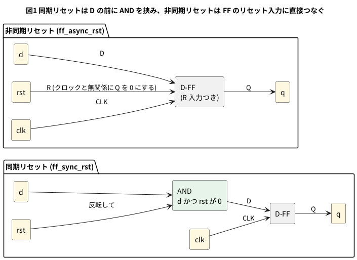

# 2-3 リセット — 同期と非同期

フリップフロップは、電源を入れた直後の値が決まっていない。最初の値を決めるのが**リセット**で、
`rst` が 1 のあいだ Q を 0 にする。リセットには 2 種類ある。

- **同期リセット**: クロックの立ち上がりで `rst` を見て、そのときに Q を 0 にする
- **非同期リセット**: `rst` が 1 になった瞬間に、クロックと関係なく Q を 0 にする

この冊の `rst` は、1 でリセットする (正論理)。組まない題なので、実体配線図と Analog Discovery 3 は入れない。

## 論理図




## Verilog

同期リセット。

```verilog
module ff_sync_rst (
    input  clk,
    input  rst,
    input  d,
    output reg q
);
    always @(posedge clk)
        if (rst) q <= 1'b0;
        else     q <= d;
endmodule
```

非同期リセット。

```verilog
module ff_async_rst (
    input  clk,
    input  rst,
    input  d,
    output reg q
);
    always @(posedge clk or posedge rst)
        if (rst) q <= 1'b0;
        else     q <= d;
endmodule
```

違いは always の感度リストだけである。非同期では `or posedge rst` を足して、`rst` の立ち上がりでも always が動くようにした。

## 動かす

```verilog
module tb_rst;
    reg clk;
    reg rst;
    reg d;
    wire q_sync, q_async;

    ff_sync_rst  u_s (.clk(clk), .rst(rst), .d(d), .q(q_sync));
    ff_async_rst u_a (.clk(clk), .rst(rst), .d(d), .q(q_async));

    initial clk = 0;
    always #5 clk = ~clk;    // 立ち上がりは 5, 15, 25, ... us

    initial begin
        $dumpfile("rst.vcd");
        $dumpvars(0, tb_rst);
        d = 1;
        rst = 1;
        #8  rst = 0;         //  8 us: リセットを放す
        #14 rst = 1;         // 22 us: 立ち上がり (15) の後、(25) の前にリセット
        #6  rst = 0;         // 28 us: 放す
        #10 rst = 1;         // 38 us: 立ち上がりの無い間 (35 と 45 の間) に短いリセット
        #4  rst = 0;         // 42 us
        #40 $finish;
    end
endmodule
```

```bash
verilator --lint-only -Wall ff_sync_rst.v
verilator --timescale 1us/1ns --binary --timing --trace --top-module tb_rst ff_sync_rst.v ff_async_rst.v tb_rst.v
./obj_dir/Vtb_rst
```

lint は 2 つのモジュールそれぞれで警告 0 件だった (`verilator --lint-only -Wall ff_async_rst.v` も同様に実行する)。
D は 1 のままにして、`rst` だけを 3 回動かす。

- 22 us に `rst` を立てる (立ち上がりは 15 us と 25 us の間)
- 28 us に放す
- 38 us に立て、42 us に放す (35 us と 45 us の間で、立ち上がりに掛からない短いリセット)

## シミュレーションの波形

```logic
title: 図2 RST が 22 us に立つと、非同期は即、同期は次のクロックで 0
device: generic
time: 10us/div
signals:
  CLK:     edges 0s=0 5us=1 10us=0 15us=1 20us=0 25us=1 30us=0 35us=1 40us=0 45us=1 50us=0 55us=1 60us=0 65us=1 70us=0 75us=1 80us=0
  RST:     edges 0s=1 8us=0 22us=1 28us=0 38us=1 42us=0
  D:       edges 0s=1
  Q_SYNC:  edges 0s=0 15us=1 25us=0 35us=1
  Q_ASYNC: edges 0s=0 15us=1 22us=0 35us=1 38us=0 45us=1
cursors: [23us, 26us]
```


## 見るべき値 (シミュレーションを実行して得た値)

| 時刻 | 同期 Q | 非同期 Q |
| --- | --- | --- |
| 22 us (`rst` が立つ) | 1 のまま | **22 us で** 0 になる |
| 25 us (次の立ち上がり) | **25 us で** 0 になる | 0 のまま |
| 35 us (`rst` を放した後の立ち上がり) | 1 に戻る | 1 に戻る |
| 38〜42 us (短い `rst`) | **変わらない** (立ち上がりに掛からない) | 38 us で 0 になり、45 us の立ち上がりまで 0 |

- カーソル X1 = 23 us で `rst` = 1・同期 Q = 1・非同期 Q = 0。X2 = 26 us で `rst` = 1・同期 Q = 0・非同期 Q = 0
- 同期は、クロックが止まっているとリセットが効かない。短い `rst` も見逃す。その代わり、リセットが必ずクロックに揃う
- 非同期は、クロックが無くても効く。その代わり、`rst` の細い雑音でも Q が 0 になる。
  また `rst` を放す時刻が立ち上がりの近くだと、結果が不安定になる (メタステーブル)。この対策は 9-11 で扱う
- 最初に `rst` を 1 にしておけば、どちらの書き方でも Q の最初の値は 0 に決まる

## 出典

自作。同期リセットと非同期リセットの書き方は Verilator のマニュアル
([https://verilator.org/guide/latest/](https://verilator.org/guide/latest/)) と IEEE 1364-2005 (Verilog) の always 文による。
