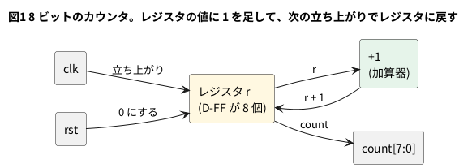

# 2-4 2 進カウンタ

クロックの立ち上がりごとに 1 を足していく回路が 2 進カウンタである。8 ビットなら 0 から 255 まで数え、255 の次は 0 に戻る。
2-1 の D-FF を 8 個並べ、その入力に「いまの値 + 1」をつなぐだけでできる。

数えた値の各ビットを見ると、規則が見える。最下位ビットは 1 クロックごとに反転し、1 つ上のビットは 2 クロックごと、
その上は 4 クロックごとに反転する。各ビットは、1 つ下のビットの 1/2 の速さで変わる。これが 2-7 の分周の元になる。

この題の動かす所は WEB (ブラウザの soft-fpga) で、ここでは Verilog と動作を Verilator で確かめた。
組まない題なので、実体配線図と Analog Discovery 3 は入れない。

## 論理図




## Verilog

```verilog
module counter #(
    parameter W = 8
) (
    input          clk,
    input          rst,
    output [W-1:0] count
);
    reg [W-1:0] r;

    assign count = r;

    always @(posedge clk)
        if (rst) r <= {W{1'b0}};
        else     r <= r + 1'b1;
endmodule
```

- `parameter W = 8` でビット数を変えられる (1-12)
- `r + 1'b1` が加算器、`r <= ...` が D-FF 8 個への取り込み。`rst` が 1 のときは同期リセット (2-3) で 0 にする
- 上流の soft-fpga の `examples/01-counter` ([GitHub](https://github.com/tommie-jp/soft-fpga/tree/main/examples/01-counter)) の `counter.v` と
  同じポート (`clk` `rst` `count[W-1:0]`) にしてあるので、4-3 の手順でそのまま差し替えられる
  (上流のものはリセットが非同期。どちらの書き方でも動く)

## 動かす

```verilog
module tb_counter;
    reg clk;
    reg rst;
    wire [7:0] count;
    integer i, k;
    integer toggles [0:7];
    reg [7:0] prev;

    counter #(.W(8)) u (.clk(clk), .rst(rst), .count(count));

    initial clk = 0;
    always #5 clk = ~clk;    // 立ち上がりは 5, 15, 25, ... us

    initial begin
        $dumpfile("counter.vcd");
        $dumpvars(0, tb_counter);
        for (k = 0; k < 8; k = k + 1) toggles[k] = 0;
        rst = 1;
        #12 rst = 0;                       // 12 us: 立ち上がり (15) の前に放す
        #1;                                // 13 us: 最初の立ち上がり (15) の前
        prev = count;
        for (i = 0; i < 256; i = i + 1) begin
            @(posedge clk); #1;            // 立ち上がりの 1 us 後に読む
            for (k = 0; k < 8; k = k + 1)
                if (count[k] !== prev[k]) toggles[k] = toggles[k] + 1;
            prev = count;
        end
        for (k = 0; k < 8; k = k + 1)
            $display("bit %0d: toggles in 256 clocks = %0d", k, toggles[k]);
        #20 $finish;
    end
endmodule
```

```bash
verilator --lint-only -Wall counter.v
verilator --timescale 1us/1ns --binary --timing --trace --top-module tb_counter counter.v tb_counter.v
./obj_dir/Vtb_counter
```

テストベンチは 256 クロックのあいだ、各ビットが何回反転したかを数えて表示する。

ブラウザで見るには、0-5 の手順でカウンタの波形を出し、4-3 で自分の `counter.v` に差し替える。
ブラウザでの表示は、この題では確かめていない (確かめたのは Verilator まで)。

## シミュレーションの波形

```logic
title: 図2 上のビットほど半分の速さで反転する
device: generic
time: 20us/div
signals:
  CLK: edges 0s=0 5us=1 10us=0 15us=1 20us=0 25us=1 30us=0 35us=1 40us=0 45us=1 50us=0 55us=1 60us=0 65us=1 70us=0 75us=1 80us=0 85us=1 90us=0 95us=1 100us=0 105us=1 110us=0 115us=1 120us=0 125us=1 130us=0 135us=1 140us=0 145us=1 150us=0 155us=1 160us=0 165us=1 170us=0 175us=1 180us=0 185us=1 190us=0 195us=1 200us=0
  Q0:  edges 0s=0 15us=1 25us=0 35us=1 45us=0 55us=1 65us=0 75us=1 85us=0 95us=1 105us=0 115us=1 125us=0 135us=1 145us=0 155us=1 165us=0 175us=1 185us=0 195us=1
  Q1:  edges 0s=0 25us=1 45us=0 65us=1 85us=0 105us=1 125us=0 145us=1 165us=0 185us=1
  Q2:  edges 0s=0 45us=1 85us=0 125us=1 165us=0
  Q3:  edges 0s=0 85us=1 165us=0
  Q4:  edges 0s=0 165us=1
  Q5:  edges 0s=0
  Q6:  edges 0s=0
  Q7:  edges 0s=0
buses:
  Count: Q7..Q0 dec
cursors: [100us, 180us]
```


## 見るべき値 (シミュレーションを実行して得た値)

256 クロックのあいだに各ビットが反転した回数 (テストベンチの表示)。

| ビット | 反転した回数 | 反転する間隔 |
| --- | --- | --- |
| Q0 | 256 | 1 クロックごと |
| Q1 | 128 | 2 クロックごと |
| Q2 | 64 | 4 クロックごと |
| Q3 | 32 | 8 クロックごと |
| Q4 | 16 | 16 クロックごと |
| Q5 | 8 | 32 クロックごと |
| Q6 | 4 | 64 クロックごと |
| Q7 | 2 | 128 クロックごと |

- 上のビットほど反転の回数が 1/2 ずつ減る。Q7 は 256 クロックで 2 回 (128 クロック目に 1 になり、256 クロック目に 0 に戻る)
- 図2では、カウント値が立ち上がりごとに 1 増える (15 us に 1、25 us に 2、…)。カーソル X1 = 100 us で Count = 9、X2 = 180 us で Count = 17
- 図2の窓 (200 us = 20 クロック) では Q4 が 165 us に 1 になる (カウント 16)。Q5 以上は窓の中で変わらない
- ブラウザの波形でも、Q0 から Q7 まで同じ規則 (1/2 ずつ遅くなる) が見えるはずである

## 出典

自作。モジュールの形 (ポート名) は soft-fpga の `examples/01-counter`
([https://github.com/tommie-jp/soft-fpga](https://github.com/tommie-jp/soft-fpga)) に合わせた。
