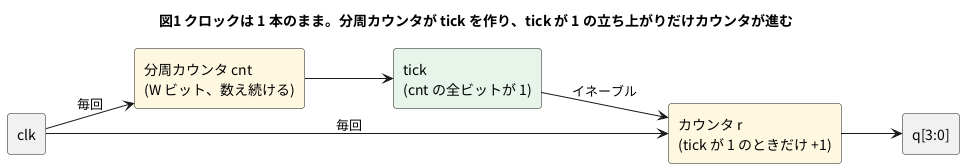

# 2-5 クロックイネーブル — クロックを分けずに遅く動かす

2-4 のカウンタは、クロックと同じ速さで数える。もっとゆっくり数えたいとき、クロックそのものを割って遅くしたくなる。
だが、分けた信号を別のクロックとして使うと、FPGA ではタイミングの問題が出る (2-17 で扱う)。

そこで、**クロックは 1 本のまま**にして、「いま進めてよいか」を表す 1 クロック幅の信号 (イネーブル。ここでは `tick`) を作る。
全部のフリップフロップは毎回の立ち上がりを受け取るが、`tick` が 1 のときだけ値を更新する。
この冊では、遅くしたいときはこの形を基本にする。

組まない題なので、実体配線図と Analog Discovery 3 は入れない。

## 論理図




## Verilog

```verilog
module clk_enable #(
    parameter W = 2
) (
    input          clk,
    input          rst,
    output         tick,
    output [3:0]   q
);
    reg [W-1:0] cnt;
    reg [3:0]   r;

    assign tick = (cnt == {W{1'b1}});
    assign q    = r;

    always @(posedge clk)
        if (rst) begin
            cnt <= {W{1'b0}};
            r   <= 4'd0;
        end else begin
            cnt <= cnt + 1'b1;
            if (tick) r <= r + 1'b1;
        end
endmodule
```

- 分周カウンタ `cnt` は W ビットで、クロックごとに数え続ける。全ビットが 1 のときに `tick` が 1 になる。
  W = 2 なら 4 クロックに 1 回 (`cnt` が 3 のとき)
- `if (tick) r <= r + 1'b1;` が「イネーブルつきのレジスタ」。`tick` が 0 のときは `r` に何も代入しないので、値が保たれる
- FPGA には、フリップフロップごとにイネーブルの入力 (CE) が用意されている。この書き方はそこへ素直に載る

## 動かす

```verilog
module tb_clk_enable;
    reg clk;
    reg rst;
    wire tick;
    wire [3:0] q;
    integer n_tick;

    clk_enable #(.W(2)) u (.clk(clk), .rst(rst), .tick(tick), .q(q));

    initial clk = 0;
    always #5 clk = ~clk;    // 立ち上がりは 5, 15, 25, ... us

    always @(posedge clk) if (!rst && tick) n_tick <= n_tick + 1;

    initial begin
        $dumpfile("clk_enable.vcd");
        $dumpvars(0, tb_clk_enable);
        n_tick = 0;
        rst = 1;
        #12 rst = 0;         // 12 us: 立ち上がり (15) の前に放す
        #400;
        $display("clocks=40 tick_count=%0d q=%0d", n_tick, q);
        $finish;
    end
endmodule
```

```bash
verilator --lint-only -Wall clk_enable.v
verilator --timescale 1us/1ns --binary --timing --trace --top-module tb_clk_enable clk_enable.v tb_clk_enable.v
./obj_dir/Vtb_clk_enable
```

実行すると、400 us (40 クロック) のあいだに `tick` が立った回数と、そのときの `q` が表示される。

```text
clocks=40 tick_count=10 q=10
```

## シミュレーションの波形

```logic
title: 図2 TICK が 1 の次の立ち上がりでだけ Q が増える
device: generic
time: 40us/div
signals:
  CLK:  edges 0s=0 5us=1 10us=0 15us=1 20us=0 25us=1 30us=0 35us=1 40us=0 45us=1 50us=0 55us=1 60us=0 65us=1 70us=0 75us=1 80us=0 85us=1 90us=0 95us=1 100us=0 105us=1 110us=0 115us=1 120us=0 125us=1 130us=0 135us=1 140us=0 145us=1 150us=0 155us=1 160us=0 165us=1 170us=0 175us=1 180us=0 185us=1 190us=0 195us=1 200us=0 205us=1 210us=0 215us=1 220us=0 225us=1 230us=0 235us=1 240us=0 245us=1 250us=0 255us=1 260us=0 265us=1 270us=0 275us=1 280us=0 285us=1 290us=0 295us=1 300us=0 305us=1 310us=0 315us=1 320us=0 325us=1 330us=0 335us=1 340us=0 345us=1 350us=0 355us=1 360us=0 365us=1 370us=0 375us=1 380us=0 385us=1 390us=0 395us=1 400us=0
  TICK: edges 0s=0 35us=1 45us=0 75us=1 85us=0 115us=1 125us=0 155us=1 165us=0 195us=1 205us=0 235us=1 245us=0 275us=1 285us=0 315us=1 325us=0 355us=1 365us=0 395us=1
  Q0:   edges 0s=0 45us=1 85us=0 125us=1 165us=0 205us=1 245us=0 285us=1 325us=0 365us=1
  Q1:   edges 0s=0 85us=1 165us=0 245us=1 325us=0
  Q2:   edges 0s=0 165us=1 325us=0
  Q3:   edges 0s=0 325us=1
buses:
  Q: Q3..Q0 dec
cursors: [100us, 300us]
```


## 見るべき値 (シミュレーションを実行して得た値)

| 時刻 | 起きたこと |
| --- | --- |
| 35 us | `cnt` が 3 になり、`tick` が 1 になる |
| 45 us | `tick` が 1 の立ち上がりなので、`q` が 1 になる。同時に `tick` は 0 に戻る (`cnt` が 0 に戻るため) |
| 85 us | 4 クロック後。`q` が 2 になる |

- `tick` は 4 クロックごとに 1 クロック幅だけ 1 になる (35・75・115 us …)。`q` は 40 us ごとに 1 増える。クロックの 1/4 の速さで数えている
- カーソル X1 = 100 us で `q` = 2、X2 = 300 us で `q` = 7。5 周期 (200 us) で 5 増えた
- 400 us (40 クロック) で `tick` は 10 回、`q` は 10。40 ÷ 4 = 10 と合う
- クロックの線は 1 本のまま、`q` のクロックには CLK がそのまま来ている。クロックを割った新しい信号は作っていない
- W を変えれば間隔が 2 のべき乗で変わる。割り切れない間隔 (たとえば 27 MHz を 1 Hz にする) は、`cnt` の全ビットが 1 かで見る代わりに値を比べる。これは 2-7 で書く

## 出典

自作。「クロックを分けずにイネーブルで遅くする」考え方は、FPGA の設計の一般的な作法である。
フリップフロップのイネーブル入力 (CE) の存在は Yosys のマニュアルのセル一覧
([https://yosyshq.readthedocs.io/projects/yosys/en/latest/](https://yosyshq.readthedocs.io/projects/yosys/en/latest/)) の
`$dffe` による。
