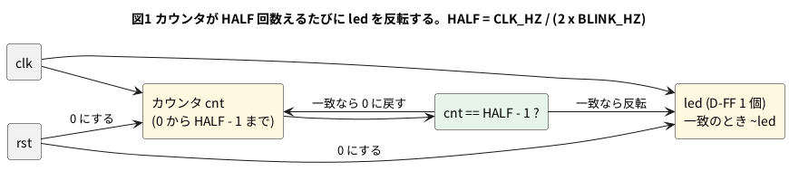

# 2-7 分周して LED を 1 Hz で点滅させる

FPGA のクロックは数十 MHz と速く、そのまま LED につないでも人の目には点いたままに見える。
1 秒に 1 回点滅させるには、クロックを数えて、**クロックの周期の何倍かを 1 秒にそろえる**。

クロックが `CLK_HZ` [Hz]、点滅を `BLINK_HZ` [Hz] にしたいとき、LED は 1 周期のうち半分が点灯、半分が消灯なので、
LED を反転するまでのクロック数は次になる (計算値)。

```text
HALF = CLK_HZ / (2 x BLINK_HZ)
```

カウンタが HALF 回数えるたびに LED を反転すれば、周期は 2 x HALF クロック、つまり `BLINK_HZ` で点滅する。

この題の Verilog は、5-2 (Pico 2) と 8-4 (FPGA) でそのまま使う。**クロック周波数を `parameter` にして**あるので、
動かす所ごとに書き換えるのは `CLK_HZ` の値だけになる。動かす所は WEB (ブラウザの soft-fpga) で、
ここでは Verilator で確かめた。組まない題なので、実体配線図と Analog Discovery 3 は入れない。

## 分周の計算

2-4 の考えで、カウンタの 1 ビットを取り出して分周する手もある。ビット k は 2^(k+1) クロックの周期で反転するので、周波数は `CLK_HZ / 2^(k+1)` になる。
27 MHz のクロックで計算すると、次のとおりで、1 Hz にならない (計算値)。

| 取り出すビット | 周波数 |
| --- | --- |
| ビット 23 | 27 000 000 / 2^24 ≒ 1.61 Hz |
| ビット 24 | 27 000 000 / 2^25 ≒ 0.80 Hz |

2 のべき乗でしか割れないためである。そこで、`cnt` の値が `HALF - 1` に一致したら 0 に戻して LED を反転する。

| 項目 | 値 (計算値) |
| --- | --- |
| クロック `CLK_HZ` | 27 000 000 Hz (Tang Nano 9K の水晶。出典を参照) |
| 点滅 `BLINK_HZ` | 1 Hz |
| `HALF` | 27 000 000 / (2 x 1) = 13 500 000 |
| カウンタのビット数 `W` | 24 (2^23 = 8 388 608 は HALF より小さく、2^24 = 16 777 216 は大きいので 24 ビット必要) |

## 論理図




## Verilog

```verilog
module blink #(
    parameter CLK_HZ   = 27_000_000,
    parameter BLINK_HZ = 1
) (
    input      clk,
    input      rst,
    output reg led
);
    localparam HALF = CLK_HZ / (2 * BLINK_HZ);
    localparam W    = (HALF > 1) ? $clog2(HALF) : 1;

    localparam [W-1:0] LAST = HALF[W-1:0] - 1'b1;

    reg [W-1:0] cnt;

    always @(posedge clk)
        if (rst) begin
            cnt <= {W{1'b0}};
            led <= 1'b0;
        end else if (cnt == LAST) begin
            cnt <= {W{1'b0}};
            led <= ~led;
        end else begin
            cnt <= cnt + 1'b1;
        end
endmodule
```

- `parameter CLK_HZ` と `BLINK_HZ` が入口。`HALF` と、カウンタのビット数 `W` (`$clog2` で HALF が入る最小のビット数) は `localparam` で計算する。
  HALF が変われば `W` も自動で変わる
- `HALF` が割り切れないとき (`CLK_HZ` が `2 x BLINK_HZ` の倍数でないとき) は、整数に切り捨てた `HALF` で動くので、周波数が少しずれる
- ポートは `clk` `rst` `led` の 3 つ。`rst` は 1 でリセット (2-3)。soft-fpga の `01-counter` と同じく `clk` と `rst` を持つので、4-3 の手順で差し替えられる

## 動かす

lint は、`CLK_HZ` を何通りか変えても警告 0 件で通った。

```bash
verilator --lint-only -Wall blink.v
verilator --lint-only -Wall -GCLK_HZ=16 blink.v
verilator --lint-only -Wall -GCLK_HZ=2 blink.v
verilator --lint-only -Wall -GCLK_HZ=100000000 -GBLINK_HZ=4 blink.v
```

### 速さを小さくして波形を見る

27 MHz のままでは 1 秒が 2700 万クロックで、波形には描けない。まず `CLK_HZ` を 16 にして、クロックを 16 Hz にする。
HALF = 16 / 2 = 8 になるので、8 クロックごとに LED が反転し、周期は 16 クロック = 1 秒である。

```verilog
module tb_blink16;
    reg clk;
    reg rst;
    wire led;

    blink #(.CLK_HZ(16), .BLINK_HZ(1)) u (.clk(clk), .rst(rst), .led(led));

    initial clk = 0;
    always #31250 clk = ~clk;    // 16 Hz: 周期 62500 us。立ち上がりは 31250, 93750, ... us

    initial begin
        $dumpfile("blink16.vcd");
        $dumpvars(0, tb_blink16);
        rst = 1;
        #50000 rst = 0;          // 50 ms: 2 つ目の立ち上がり (93.75 ms) の前に放す
        #3000000 $finish;        // 3 s
    end
endmodule
```

```bash
verilator --lint-only -Wall blink.v
verilator --timescale 1us/1ns --binary --timing --trace --top-module tb_blink16 blink.v tb_blink16.v
./obj_dir/Vtb_blink16
```

### 27 MHz の数を確かめる

既定の `CLK_HZ` (27 000 000) で、LED が変わるクロック数を数えるテストベンチを Verilator で回した。

```verilog
module tb_blink27m;
    reg clk;
    reg rst;
    wire led;
    integer cycles;
    integer last;
    reg     prev;

    blink u (.clk(clk), .rst(rst), .led(led));    // 既定: CLK_HZ = 27_000_000, BLINK_HZ = 1

    initial clk = 0;
    always #1 clk = ~clk;        // 時間の単位は使わない。数えるのはクロックの回数

    always @(posedge clk) begin
        if (rst) begin
            cycles <= 0; last <= 0; prev <= 1'b0;
        end else begin
            cycles <= cycles + 1;
            prev   <= led;
            if (led !== prev) begin
                $display("led=%b at clock %0d (previous change %0d clocks ago)", led, cycles, cycles - last);
                last <= cycles;
            end
        end
    end

    initial begin
        rst = 1;
        #6 rst = 0;
        #(2 * 55_000_000) $finish;   // 55 M クロック
    end
endmodule
```

```bash
verilator --timescale 1us/1ns --binary --timing --top-module tb_blink27m blink.v tb_blink27m.v
./obj_dir/Vtb_blink27m
```

```text
led=1 at clock 13500000 (previous change 13500000 clocks ago)
led=0 at clock 27000000 (previous change 13500000 clocks ago)
led=1 at clock 40500000 (previous change 13500000 clocks ago)
led=0 at clock 54000000 (previous change 13500000 clocks ago)
```

LED は 13 500 000 クロックごとに反転した。27 MHz なら 0.5 秒ごとで、周期 1 秒 (1 Hz) になる。

## シミュレーションの波形

```logic
title: 図2 8 回数えるたびに LED が反転する (CLK_HZ = 16)
device: generic
time: 300ms/div
signals:
  CLK: edges 0s=0 31.25ms=1 62.5ms=0 93.75ms=1 125ms=0 156.25ms=1 187.5ms=0 218.75ms=1 250ms=0 281.25ms=1 312.5ms=0 343.75ms=1 375ms=0 406.25ms=1 437.5ms=0 468.75ms=1 500ms=0 531.25ms=1 562.5ms=0 593.75ms=1 625ms=0 656.25ms=1 687.5ms=0 718.75ms=1 750ms=0 781.25ms=1 812.5ms=0 843.75ms=1 875ms=0 906.25ms=1 937.5ms=0 968.75ms=1 1000ms=0 1031.25ms=1 1062.5ms=0 1093.75ms=1 1125ms=0 1156.25ms=1 1187.5ms=0 1218.75ms=1 1250ms=0 1281.25ms=1 1312.5ms=0 1343.75ms=1 1375ms=0 1406.25ms=1 1437.5ms=0 1468.75ms=1 1500ms=0 1531.25ms=1 1562.5ms=0 1593.75ms=1 1625ms=0 1656.25ms=1 1687.5ms=0 1718.75ms=1 1750ms=0 1781.25ms=1 1812.5ms=0 1843.75ms=1 1875ms=0 1906.25ms=1 1937.5ms=0 1968.75ms=1 2000ms=0 2031.25ms=1 2062.5ms=0 2093.75ms=1 2125ms=0 2156.25ms=1 2187.5ms=0 2218.75ms=1 2250ms=0 2281.25ms=1 2312.5ms=0 2343.75ms=1 2375ms=0 2406.25ms=1 2437.5ms=0 2468.75ms=1 2500ms=0 2531.25ms=1 2562.5ms=0 2593.75ms=1 2625ms=0 2656.25ms=1 2687.5ms=0 2718.75ms=1 2750ms=0 2781.25ms=1 2812.5ms=0 2843.75ms=1 2875ms=0 2906.25ms=1 2937.5ms=0 2968.75ms=1 3000ms=0
  RST: edges 0s=1 50ms=0
  LED: edges 0s=0 531.25ms=1 1031.25ms=0 1531.25ms=1 2031.25ms=0 2531.25ms=1
  C0:  edges 0s=0 93.75ms=1 156.25ms=0 218.75ms=1 281.25ms=0 343.75ms=1 406.25ms=0 468.75ms=1 531.25ms=0 593.75ms=1 656.25ms=0 718.75ms=1 781.25ms=0 843.75ms=1 906.25ms=0 968.75ms=1 1031.25ms=0 1093.75ms=1 1156.25ms=0 1218.75ms=1 1281.25ms=0 1343.75ms=1 1406.25ms=0 1468.75ms=1 1531.25ms=0 1593.75ms=1 1656.25ms=0 1718.75ms=1 1781.25ms=0 1843.75ms=1 1906.25ms=0 1968.75ms=1 2031.25ms=0 2093.75ms=1 2156.25ms=0 2218.75ms=1 2281.25ms=0 2343.75ms=1 2406.25ms=0 2468.75ms=1 2531.25ms=0 2593.75ms=1 2656.25ms=0 2718.75ms=1 2781.25ms=0 2843.75ms=1 2906.25ms=0 2968.75ms=1
  C1:  edges 0s=0 156.25ms=1 281.25ms=0 406.25ms=1 531.25ms=0 656.25ms=1 781.25ms=0 906.25ms=1 1031.25ms=0 1156.25ms=1 1281.25ms=0 1406.25ms=1 1531.25ms=0 1656.25ms=1 1781.25ms=0 1906.25ms=1 2031.25ms=0 2156.25ms=1 2281.25ms=0 2406.25ms=1 2531.25ms=0 2656.25ms=1 2781.25ms=0 2906.25ms=1
  C2:  edges 0s=0 281.25ms=1 531.25ms=0 781.25ms=1 1031.25ms=0 1281.25ms=1 1531.25ms=0 1781.25ms=1 2031.25ms=0 2281.25ms=1 2531.25ms=0 2781.25ms=1
cursors: [531.25ms, 1531.25ms]
```


## 見るべき値

シミュレーションを実行して得た値 (`CLK_HZ` = 16)。

| 項目 | 値 |
| --- | --- |
| LED が反転する間隔 | 8 クロック = 0.5 s |
| LED が 1 になる時刻 | 0.53125 s、1.53125 s、2.53125 s (1 s ごと) |
| 図2のカーソルの ΔX と 1/ΔX | 1 s と 1 Hz |

- 最初の立ち上がり (93.75 ms) でリセットが解けているので、8 回数えて LED が最初に 1 になるのは 93.75 ms + 7 x 62.5 ms = 531.25 ms。以後は 1 s ごとに同じ向きに反転する
- `cnt` は 0 から 7 までを数えては 0 に戻り、戻るたびに LED が反転する (図2の C2 C1 C0 が `cnt` の 3 ビット)
- 同じ `blink.v` に `CLK_HZ` = 27 000 000 を渡すと 13 500 000 クロックごとに反転した (上のとおり実行して確かめた)。yosys の汎用の合成 (`synth`) も通り、フリップフロップは 25 個 (`cnt` の 24 + `led` の 1) になった

### 動かす所ごとの `CLK_HZ`

| 動かす所 | `CLK_HZ` に入れる値 |
| --- | --- |
| ブラウザの soft-fpga (4-3) | 波形を見やすい小さい値 (たとえば 16)。1 秒ごとの実際の点滅を見るには、ブラウザが 1 秒に回せるクロック数が要る。この数は測っていないので、4-1 以降で測って書く |
| Pico 2 の Soft-FPGA (5-2) | 5-5 で測ったクロック (1 秒のクロック数) を入れる。測る前は決めない |
| Tang Nano 9K (8-4) | 27 000 000 (ボードの水晶) |

ブレッドボードに出すのは、LED を点滅させる 1 Hz の信号だけで、3 MHz 以下に収まる。

## 出典

自作。Tang Nano 9K の 27 MHz の水晶は Sipeed の Tang Nano 9K のページ
([https://wiki.sipeed.com/hardware/en/tang/Tang-Nano-9K/Nano-9K.html](https://wiki.sipeed.com/hardware/en/tang/Tang-Nano-9K/Nano-9K.html)) に
"onboard 27MHz clock" とある。`$clog2` は IEEE 1364-2005 (Verilog) の組み込み関数。
