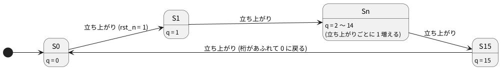

# 3-1 テストベンチ — クロックとリセットを C++ から与える

回路を作ったら、入力を与えて出力を確かめる。その役目をするプログラムを **テストベンチ** と呼ぶ。
Verilator では、テストベンチを C++ で書く。この題では、クロックとリセットを C++ から与えて、
4 ビットのカウンタ `counter4` を 8 クロック動かす。

この題は組まない題で、実体配線図と Analog Discovery 3 は付けない。PC の中だけで動かす (`device: SIM`)。
ここで書く形 (信号を入れて `eval()` を呼び、出力を読む繰り返し) は、5-3 で Pico 2 の主ループに載せる形と同じだ。

## 説明

- Verilator が作る C++ のクラス (ここでは `Vcounter4`) には、回路のポートがそのまま変数として並ぶ。
  `top.clk = 1;` で入力を変え、`top.q` で出力を読む
- 入力を変えても、回路はまだ計算されていない。**`top.eval()` を呼ぶと、そのときの入力に合わせて回路の出力を計算し直す。**
  クロックの立ち上がりで動くレジスタも、`clk` が 0 から 1 になった状態で `eval()` を呼ぶと更新される
- Verilator には時間の流れが無い。クロックの立ち上がりと立ち下がりは、C++ が `clk` を反転して `eval()` を呼ぶことで作る
- リセットは、始めに `rst_n` を 0 にして数クロック待ち、そのあと 1 にして外す。`rst_n` の `_n` は「0 のときに働く (アクティブロー)」という印だ

## 状態遷移図

図 1 は、`counter4` の状態遷移図だ。リセットが掛かっていると 0 に戻り、掛かっていなければクロックの立ち上がりごとに 1 ずつ進む。




どの状態からでも、立ち上がりのときに `rst_n` が 0 なら S0 に戻る (図には描かなかった)。

## Verilog

テスト対象 (DUT: Device Under Test) の `counter4` は次のとおり。カウンタの書き方は 2-4 で詳しく見るので、ここでは
「立ち上がりごとに `q` が 1 増え、`rst_n` が 0 のときは `q` が 0 になる」とだけ読めばよい。

```verilog
// counter4.v
module counter4 (
    input  wire       clk,
    input  wire       rst_n,
    output reg  [3:0] q
);
    always @(posedge clk) begin
        if (!rst_n) q <= 4'd0;
        else        q <= q + 4'd1;
    end
endmodule
```

## テストベンチ

```cpp
// tb_counter4.cpp
#include <cstdio>
#include "Vcounter4.h"

int main() {
    Vcounter4 top;
    top.clk = 0;
    top.rst_n = 0;              // リセットを掛けた状態で始める
    top.eval();
    std::printf("# clk rst_n q\n");
    std::printf("%x %x %x\n", top.clk, top.rst_n, top.q);

    for (int half = 0; half < 16; half++) {   // 半周期を 16 回 = 8 クロック
        if (half == 3) top.rst_n = 1;         // 3 回目の立ち上がりの手前でリセットを外す
        top.clk = !top.clk;                   // clk を反転する
        top.eval();                           // 反転のたびに eval で回路を計算させる
        std::printf("%x %x %x\n", top.clk, top.rst_n, top.q);
    }
    return 0;
}
```

- `Vcounter4 top;` で回路を 1 つ作る。クラスの名前は `V` + 最上位 module の名前
- `top.clk = !top.clk;` で、クロックを 0 から 1、1 から 0 へ交互に反転する。反転 2 回で 1 クロック
- 反転のたびに `top.eval();` を呼ぶ。呼ばないと、出力は前の値のままだ
- 最初の `eval()` は、`clk = 0`・`rst_n = 0` の初期状態を回路に伝えるためのもの

## 動かす

```bash
verilator --lint-only -Wall counter4.v
verilator -Wall --cc --exe --build counter4.v tb_counter4.cpp
./obj_dir/Vcounter4
```

実行した結果は次のとおりだった。各行は、反転ごとの `clk`・`rst_n`・`q` (16 進) の並びで、最初の行は初期状態。

```text
clk rst_n q
0 0 0
1 0 0
0 0 0
1 0 0
0 1 0
1 1 1
0 1 1
1 1 2
0 1 2
1 1 3
0 1 3
1 1 4
0 1 4
1 1 5
0 1 5
1 1 6
0 1 6
```

- 最初の 2 回の立ち上がり (2 行目と 4 行目) は `rst_n` が 0 なので、`q` は 0 のまま
- 5 行目で `rst_n` が 1 になり、続く 6 行目 (3 回目の立ち上がり) で `q` が初めて 1 になる
- そのあと立ち上がりのたびに、2、3、4、5、6 と増える

## 計器の設定

組まない題なので、計器は使わない。実行結果をロジックアナライザの画面と同じ形の図 2 に描く。
実機で測った波形ではなく、上の実行結果から作った計算の図だ。反転 1 回を 0.5 ms と見なしたので、クロックは 1 ms 周期 (1 kHz) に見える。
カーソル X1 は 3 回目の立ち上がりの直後、X2 は 8 回目の立ち上がりの直後で、ビットの真ん中に置いた。

```logic
title: 図2 リセットを外してから 8 クロック (1 刻みを 0.5 ms と見なした計算の図)
device: generic
window: 8.5ms
signals:
  clk: pattern 01010101010101010 bit 0.5ms
  rst_n: pattern 00001111111111111 bit 0.5ms
  q0: pattern 00000110011001100 bit 0.5ms
  q1: pattern 00000001111000011 bit 0.5ms
  q2: pattern 00000000000111111 bit 0.5ms
  q3: pattern 00000000000000000 bit 0.5ms
buses:
  q: q3 q2 q1 q0 dec
cursors: [2.75ms,7.75ms]
```


## 見るべき値

| 見る所 | 時刻 (図の上) | q |
| --- | --- | --- |
| リセット中 (立ち上がり 2 回のあいだ) | 0〜2 ms | 0 |
| X1 (3 回目の立ち上がりの直後) | 2.75 ms | 1 |
| X2 (8 回目の立ち上がりの直後) | 7.75 ms | 6 |

- X1 と X2 の間隔 ΔX は 5.000 ms。クロック 5 周期ぶんで、`q` は 1 から 6 へ 5 増えた
- 立ち上がりの 8 回のうち、リセット中の 2 回を除く 6 回で `q` が 0 から 6 まで進む

## 出典

自作。Verilator の C++ の使い方は [Verilator のマニュアル](https://veripool.org/guide/latest/) の例による。
