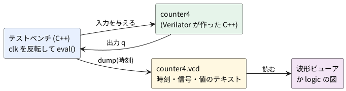

# 3-2 波形を書き出して読む

3-1 では、反転のたびに値を字で出した。回路が大きくなると、字の表では追いきれない。
Verilator は、信号の変化をそのまま **VCD** (Value Change Dump) というテキストのファイルに書き出せる。
この題では、3-1 の `counter4` の波形を VCD に書き出し、その中身を読んで、`logic` の図と同じ並びで確かめる。

この題は組まない題で、実体配線図と Analog Discovery 3 は付けない。PC の中だけで動かす (`device: SIM`)。
波形ビューア (GTKWave など) で開く手順は 0-6 で扱う。

## 説明

- VCD は、「いつ・どの信号が・何になったか」だけを並べたテキストだ。値が変わらない間は何も書かれない
- Verilator に `--trace` を付けて組み立てると、C++ から VCD を書き出せるようになる
- 書き出しの手順は次のとおり
  1. `traceEverOn(true)` で、波形を書き出す準備をする
  2. `top->trace(&tfp, 99)` で回路を波形の対象にし、`tfp.open("…vcd")` でファイルを開く
  3. `eval()` のたびに `tfp.dump(時刻)` を呼ぶ
  4. 最後に `tfp.close()` で閉じる
- 時刻は C++ が決めた整数だ。ここでは `ctx->timeInc(1)` で、クロックの反転 1 回を 1 刻みとした。
  Verilator の既定では 1 刻みは 1 ps と書かれる (VCD の `$timescale` の行)。実際の時間とは関係なく、順序を表す番号として読めばよい

## 流れの図

図 1 は、テストベンチが VCD を作り、そこから図を作るまでの流れだ。




## Verilog

3-1 と同じ `counter4` を使う。

```verilog
// counter4.v
module counter4 (
    input  wire       clk,
    input  wire       rst_n,
    output reg  [3:0] q
);
    always @(posedge clk) begin
        if (!rst_n) q <= 4'd0;
        else        q <= q + 4'd1;
    end
endmodule
```

## テストベンチ

```cpp
// tb_trace.cpp
#include <memory>
#include "verilated.h"
#include "verilated_vcd_c.h"
#include "Vcounter4.h"

int main(int argc, char** argv) {
    const std::unique_ptr<VerilatedContext> ctx{new VerilatedContext};
    ctx->commandArgs(argc, argv);
    ctx->traceEverOn(true);                         // 波形を書き出す準備
    const std::unique_ptr<Vcounter4> top{new Vcounter4{ctx.get()}};
    VerilatedVcdC tfp;
    top->trace(&tfp, 99);                           // 99 = 階層の深さ (全部)
    tfp.open("counter4.vcd");

    top->clk = 0;
    top->rst_n = 0;
    for (int half = 0; half <= 16; half++) {        // 最初の 1 回 (half = 0) は初期状態を書く
        if (half == 4) top->rst_n = 1;
        if (half > 0) top->clk = !top->clk;
        top->eval();
        tfp.dump(ctx->time());                      // いまの時刻に値を書く
        ctx->timeInc(1);                            // 時刻を 1 刻み進める
    }
    tfp.close();
    return 0;
}
```

- `half <= 16` と等号を付け、`half = 0` の回は `clk` を反転せずに初期状態を書く。そのため時刻 0 から 16 までの 17 点が書き出される
- `rst_n` は `half == 4` の回で 1 にした。3-1 では `half == 3` の回に当たる (3-1 は先に反転してから出力を数えるので、数え方が 1 つずれている)

```bash
verilator --lint-only -Wall counter4.v
verilator -Wall --cc --exe --build --trace counter4.v tb_trace.cpp
./obj_dir/Vcounter4
```

実行すると `counter4.vcd` ができる。画面には何も出ない。

## VCD を読む

できた VCD の頭の部分は次のとおりだった。

```text
$version Generated by VerilatedVcd $end
$timescale 1ps $end
 $scope module TOP $end
  $var wire 1 # clk $end
  $var wire 1 $ rst_n $end
  $var wire 4 % q [3:0] $end
  $scope module counter4 $end
   $var wire 1 # clk $end
   $var wire 1 $ rst_n $end
   $var wire 4 % q [3:0] $end
  $upscope $end
 $upscope $end
$enddefinitions $end


#0
0#
0$
b0000 %
#1
1#
#2
0#
#3
1#
#4
0#
1$
#5
1#
b0001 %
#6
0#
#7
1#
b0010 %
```

- `$var wire 4 % q [3:0]` は「4 ビットの信号 q に `%` という短い記号を付けた」という意味。1 ビットの `clk` は `#`、`rst_n` は `$` だ。記号は Verilator が勝手に決める
- 時刻 `#0` の `0#` は「clk が 0」、`b0000 %` は「q が 0000」
- 時刻 `#4` に `1$` (rst_n が 1 になる)、時刻 `#5` に `1#` (clk が 1 になる) と `b0001 %` (q が 0001 になる)。
  q が 1 になるのは、リセットを外したあとの最初の立ち上がりだ
- 値が変わらない時刻には、その信号の行が出ない。たとえば `#6` には `0#` しか無く、`q` は `#5` の値のままだ

## 計器の設定

組まない題なので、計器は使わない。VCD を 1 刻みごとの値の表に直し、ロジックアナライザの画面と同じ形の図 2 に描く。
表に直すのは、次の短い Python で行った。

```python
# vcd2out.py  VCD を読んで、1 刻みごとの値の表にする
import sys
path, order = sys.argv[1], sys.argv[2].split()   # 例: counter4.vcd "clk rst_n q"
ids, scope, hist, t, last = {}, 0, {}, None, 0
for line in open(path):
    w = line.split()
    if not w:
        continue
    if w[0] == '$scope':
        scope += 1
    elif w[0] == '$upscope':
        scope -= 1
    elif w[0] == '$var' and scope == 1:          # 最上位 (TOP) の信号だけ
        ids[w[3]] = w[4]                          # 記号 → 信号の名前
    elif w[0][0] == '#':
        t = int(w[0][1:])
        last = max(last, t)
        hist.setdefault(t, {})
    elif t is not None and w[0][0] == 'b':        # 束の値: b0101 記号
        hist[t][ids[w[1]]] = int(w[0][1:], 2)
    elif t is not None and w[0][0] in '01' and w[0][1:] in ids:   # 1 ビット: 0記号 / 1記号
        hist[t][ids[w[0][1:]]] = int(w[0][0])
print('# ' + ' '.join(order))
now = {}
for tick in range(last + 1):
    now.update(hist.get(tick, {}))
    print(' '.join('%x' % now[name] for name in order))
```

```bash
python3 vcd2out.py counter4.vcd "clk rst_n q" > out.txt
```

できた表は、3-1 の実行結果と全部の行が一致した (`diff` で確かめた)。
図は実機で測った波形ではなく、この表から作った計算の図で、1 刻みを 0.5 ms と見なした。

```logic
title: 図2 VCD から読み出した counter4 (1 刻みを 0.5 ms と見なした計算の図)
device: generic
window: 8.5ms
signals:
  clk: pattern 01010101010101010 bit 0.5ms
  rst_n: pattern 00001111111111111 bit 0.5ms
  q0: pattern 00000110011001100 bit 0.5ms
  q1: pattern 00000001111000011 bit 0.5ms
  q2: pattern 00000000000111111 bit 0.5ms
  q3: pattern 00000000000000000 bit 0.5ms
buses:
  q: q3 q2 q1 q0 dec
```


## 見るべき値

| 見る所 | 時刻 (VCD の刻み) | q |
| --- | --- | --- |
| 初期状態 | 0 | 0 |
| rst_n が 1 になる | 4 | 0 |
| 最初の立ち上がり (リセット解除後) | 5 | 1 |
| 最後の立ち上がり | 15 | 6 |

- VCD の時刻 5 が図の 2.5 ms、15 が 7.5 ms に当たる。3-1 の図と同じ位置だ
- 値が変わらない時刻を省くので、17 点を記録した VCD は、変化のある時刻の行だけが並ぶ

## 出典

自作。VCD の形式と Verilator の波形の書き出しは [Verilator のマニュアル](https://veripool.org/guide/latest/) による。
