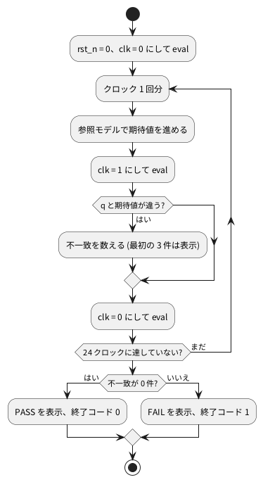

# 3-3 期待値と比べる — 自分で合否を言うテストベンチ

3-1 のテストベンチは、値を表に出すだけで、合っているかどうかは人が表を見て決めていた。
回路を直すたびに表を目で追うのは続かない。この題では、期待値を C++ で別に計算しておき、
回路の出力と比べて、合えば PASS、違えば FAIL を言い、終了コードで結果を伝えるテストベンチに作り替える。

この題は組まない題で、実体配線図と Analog Discovery 3 は付けない。PC の中だけで動かす (`device: SIM`)。

## 説明

- 回路とは別の方法で「正しい答え」を作っておく。これを **参照モデル** と呼ぶ。ここでは C++ の変数を 1 つ増やすだけの参照モデルだ
- クロックの立ち上がりごとに、回路の出力 `q` と参照モデルの `expected` を比べる
- 違った回数を数え、最後に 0 なら `return 0;`、違ったなら `return 1;` で終わる。
  終了コードが 0 なら成功、0 以外なら失敗というのは、シェルや CI がそのまま理解できる約束だ
- 全部の違いを画面いっぱいに出すと読めなくなるので、最初の 3 件だけ表示する
- 目で波形を見る確かめ方は、回路を直すたびにやり直す手間と見落としが残る。自分で合否を言うテストベンチなら、直したあとに実行するだけで済む

## 流れの図

図 1 は、このテストベンチの流れだ。




## Verilog

テスト対象は 3-1 と同じ `counter4`。

```verilog
// counter4.v
module counter4 (
    input  wire       clk,
    input  wire       rst_n,
    output reg  [3:0] q
);
    always @(posedge clk) begin
        if (!rst_n) q <= 4'd0;
        else        q <= q + 4'd1;
    end
endmodule
```

## テストベンチ

```cpp
// tb_check.cpp
#include <cstdio>
#include "Vcounter4.h"

int main() {
    Vcounter4 top;
    FILE* wave = std::fopen("wave.txt", "w");      // 波形の代わりの表 (図に使う)
    std::fprintf(wave, "# clk rst_n q exp\n");
    int expected = 0;      // 期待値は C++ で別に数える (参照モデル)
    int errors = 0;
    top.clk = 0;
    top.rst_n = 0;
    top.eval();

    for (int cycle = 0; cycle < 24; cycle++) {
        if (cycle == 2) top.rst_n = 1;             // 2 クロックのあいだリセット
        // 立ち上がり。この edge で DUT が見る rst_n を使って期待値を進める
        expected = top.rst_n ? (expected + 1) & 0xF : 0;
        top.clk = 1;
        top.eval();
        std::fprintf(wave, "%x %x %x %x\n", top.clk, top.rst_n, top.q, expected);
        if (top.q != expected) {
            errors++;
            if (errors <= 3) {
                std::printf("NG: クロック %d で q=%d、期待は %d\n", cycle, top.q, expected);
            }
        }
        top.clk = 0;                               // 立ち下がり
        top.eval();
        std::fprintf(wave, "%x %x %x %x\n", top.clk, top.rst_n, top.q, expected);
    }
    std::fclose(wave);
    if (errors == 0) {
        std::printf("PASS: 24 クロックで不一致 0 件\n");
        return 0;
    }
    std::printf("FAIL: 24 クロックで不一致 %d 件\n", errors);
    return 1;
}
```

- 期待値は、立ち上がりの直前に `top.rst_n` を見て進める。リセット中なら 0、そうでなければ 1 足して `& 0xF` で 4 ビットに丸める。
  回路が見る値と同じものを使うので、リセットを外す回 (`cycle == 2`) にも食い違いが出ない
- 比べるのは立ち上がりの `eval()` のあと。`q` が変わるのはその時だけだ
- 24 クロックは 16 より長く、`q` が 15 から 0 に戻る所も試す。1 周以上回さないと、桁あふれの書き間違いは見つからない
- `wave.txt` には、反転ごとの `clk`・`rst_n`・`q`・`expected` を書く。次の図に使った

## 動かす

```bash
verilator --lint-only -Wall counter4.v
verilator -Wall --cc --exe --build counter4.v tb_check.cpp
./obj_dir/Vcounter4 ; echo "終了コード $?"
```

正しい `counter4` で実行した結果は次のとおりだった。

```text
PASS: 24 クロックで不一致 0 件
```

終了コードは 0 だった。

次に、わざと間違えた `counter4` を用意する。10 になるはずのところで 0 に戻る、数え間違いだ。

```text
-        else        q <= q + 4'd1;
+        else        q <= (q == 4'd9) ? 4'd0 : q + 4'd1;
```

同じテストベンチで実行した結果は次のとおりだった。

```text
NG: クロック 11 で q=0、期待は 10
NG: クロック 12 で q=1、期待は 11
NG: クロック 13 で q=2、期待は 12
FAIL: 24 クロックで不一致 13 件
```

終了コードは 1 だった。10 を数えるはずのクロック 11 (リセットを外してから 10 回目の立ち上がり) で、`q` が 0 だった (期待は 10) と言っている。
食い違いはそのあとも最後まで続き、クロック 11〜23 の 13 件になった。
波形を目で追わなくても、どのクロックで食い違ったかが分かる。

## 計器の設定

組まない題なので、計器は使わない。間違えた `counter4` の `wave.txt` から、クロック 8〜14 の部分をロジックアナライザの画面と同じ形の図 2 に描く。
実機で測った波形ではなく、実行結果から作った計算の図で、反転 1 回を 0.5 ms と見なした。
カーソルは、クロック 11 の立ち上がり (図の 3.0 ms) の high の真ん中に置いた。

```logic
title: 図2 数え方を間違えた counter4 の q と期待値 exp (計算の図。クロック 8〜14)
device: generic
window: 7ms
signals:
  clk: pattern 10101010101010 bit 0.5ms
  rst_n: pattern 11111111111111 bit 0.5ms
  q0: pattern 11001100110011 bit 0.5ms
  q1: pattern 11000000001111 bit 0.5ms
  q2: pattern 11000000000000 bit 0.5ms
  q3: pattern 00111100000000 bit 0.5ms
  exp0: pattern 11001100110011 bit 0.5ms
  exp1: pattern 11000011110000 bit 0.5ms
  exp2: pattern 11000000001111 bit 0.5ms
  exp3: pattern 00111111111111 bit 0.5ms
buses:
  q: q3 q2 q1 q0 dec
  exp: exp3 exp2 exp1 exp0 dec
cursors: [3.25ms]
```


## 見るべき値

| 見る所 | q | expected |
| --- | --- | --- |
| クロック 10 の立ち上がりのあと | 9 | 9 |
| クロック 11 の立ち上がりのあと (カーソル) | 0 | 10 |
| クロック 12 の立ち上がりのあと | 1 | 11 |

- 正しい回路では `q` と `expected` が全部のクロックで一致し、PASS で終了コード 0
- 間違えた回路では、クロック 11 から食い違い、FAIL で終了コード 1
- 食い違いの件数 (13) は、この数え間違いと 24 クロックの組み合わせで決まる数で、回路を変えれば変わる

## 出典

自作。
