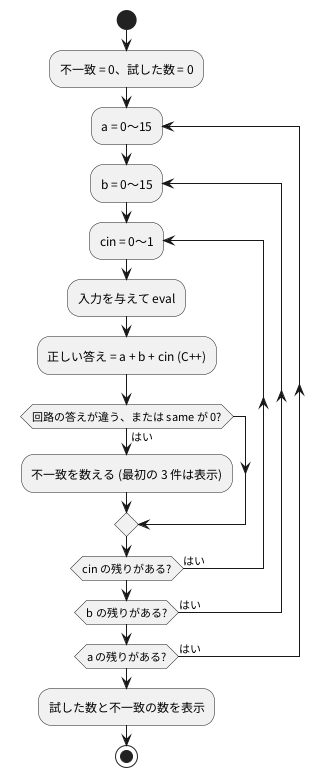

# 3-4 全部の入力を試す — 加算器の全数検査

1-7 では、リップル加算器と `+` 演算子の加算器を 5 通りの入力で比べた。5 通りが合っていても、残りが合っているとは限らない。
入力の組み合わせが少ない回路は、**全部の入力を試せる**。この題では、4 ビット加算器の 512 通りを全部試し、
C++ の足し算と突き合わせる。そのあと、全数で試せる大きさの目安を計算で見る。

この題は組まない題で、実体配線図と Analog Discovery 3 は付けない。PC の中だけで動かす (`device: SIM`)。

## 説明

- 組み合わせ回路 (記憶を持たない回路) の出力は、いまの入力だけで決まる。入力の組み合わせを全部流せば、動作を全部確かめたことになる
- 4 ビットの a と b、1 ビットの cin で入力は 9 ビット。組み合わせは 2 の 9 乗で 512 通り
- 正しい答えは C++ の `a + b + cin` で作る。3-3 の参照モデルの考え方と同じ
- 全数検査は、確かめた範囲に穴が無いことが強みで、乱数や代表値で試すやり方とは違う。入力が増えると試せなくなる点は、後の「全数で試せる大きさ」で見る

## 流れの図

図 1 は、検査の流れだ。1-7 の `adder4_cmp` に、全部の入力を順に入れる。




## Verilog

1-6 の `half_adder`・`full_adder`、1-7 の `adder4_ripple`・`adder4_plus`・`adder4_cmp` をそのまま使う。
`adder4_cmp` の出力 `same` は、2 つの加算器の出力が一致すれば 1 になる。

## テストベンチ

```cpp
// tb_exhaustive.cpp
#include <cstdio>
#include "Vadder4_cmp.h"

int main() {
    Vadder4_cmp top;
    int tried = 0;
    int errors = 0;
    for (int a = 0; a < 16; a++) {
        for (int b = 0; b < 16; b++) {
            for (int cin = 0; cin < 2; cin++) {
                top.a = a;
                top.b = b;
                top.cin = cin;
                top.eval();
                const int expected = a + b + cin;                 // C++ の足し算が正解
                const int got = (top.cout << 4) | top.sum;
                tried++;
                if (got != expected || !top.same) {
                    errors++;
                    if (errors <= 3) {
                        std::printf("NG: %d + %d + %d = %d のはずが %d (same=%d)\n",
                                    a, b, cin, expected, got, top.same);
                    }
                }
            }
        }
    }
    std::printf("%d 通りを試して、不一致 %d 件\n", tried, errors);
    return errors == 0 ? 0 : 1;
}
```

- 3 重の `for` で、a・b・cin の全部の組み合わせを流す
- 違いの見つけ方は 2 つ。C++ の正しい答え (`expected`) と比べる方法と、2 つの加算器の一致を表す `same` を見る方法で、どちらかが引っかかれば不一致にする
- `return errors == 0 ? 0 : 1;` で、3-3 と同じく終了コードで合否を伝える

## 動かす

```bash
verilator --lint-only -Wall adder4_cmp.v adder4_ripple.v adder4_plus.v full_adder.v half_adder.v
verilator -Wall --cc --exe --build adder4_cmp.v adder4_ripple.v adder4_plus.v full_adder.v half_adder.v tb_exhaustive.cpp
./obj_dir/Vadder4_cmp ; echo "終了コード $?"
```

実行した結果は次のとおりだった。

```text
512 通りを試して、不一致 0 件
```

終了コードは 0。512 通りの全部で、リップル加算器も `+` の加算器も C++ の答えと一致した。
実行にかかった時間は、この環境 (WSL2 上の PC) で測って 0.007 秒だった。

### わざと間違えて見つかるか確かめる

全部通っただけでは、検査そのものが正しいか分からない。リップル加算器の桁上げのつなぎを 1 か所間違えて、見つかるかを試す。
桁 2 の全加算器 `u_fa2` の桁上げ入力を、1 つ下の桁 (`c2`) ではなく、2 つ下の桁 (`c1`) につなぎ間違えた。

```text
-    full_adder u_fa2 (.a(a[2]), .b(b[2]), .cin(c2),  .sum(sum[2]), .cout(c3));
+    full_adder u_fa2 (.a(a[2]), .b(b[2]), .cin(c1),  .sum(sum[2]), .cout(c3));
```

この間違いは、検査を動かす前の lint でも見つかった。使われなくなった `c2` を警告したためだ。

```text
%Warning-UNUSEDSIGNAL: adder4_ripple.v:9:14: Signal is not used: 'c2'
```

警告を無視して (`-Wno-fatal` を付けて) 同じ全数検査を動かすと、次のとおりだった。終了コードは 1。

```text
NG: 0 + 1 + 1 = 2 のはずが 6 (same=0)
NG: 0 + 5 + 1 = 6 のはずが 10 (same=0)
NG: 0 + 9 + 1 = 10 のはずが 14 (same=0)
512 通りを試して、不一致 128 件
```

512 通りのうち 128 件が食い違った。桁 0 の桁上げ `c1` と桁 1 の桁上げ `c2` が違う値になる入力で、桁 2 以上の答えが狂う。
lint は信号の使い忘れのような形の間違いしか見つけられない。答えが合っているかどうかは、この検査でしか分からない。

## 全数で試せる大きさ

入力が n ビットなら、組み合わせは 2 の n 乗通りだ。加算器のビット幅を変えると、次のように増える。
「1 通り 1 µs」は仮に置いた数で、測った値ではない。512 通りは 0.007 秒で終わったので (上の測定)、1 µs より実際は速い。

| 加算器の幅 | 入力の幅 (a + b + cin) | 組み合わせ (2 の n 乗) | 1 通り 1 µs とした時間 (計算値) |
| --- | --- | --- | --- |
| 4 ビット | 9 | 512 | 0.5 ms |
| 8 ビット | 17 | 131,072 | 0.13 秒 |
| 16 ビット | 33 | 約 8.6 × 10<sup>9</sup> | 約 2.4 時間 |
| 32 ビット | 65 | 約 3.7 × 10<sup>19</sup> | 約 117 万年 |

- 8 ビットまでは一瞬で全数を試せる。16 ビットは試せなくはないが、回路を直すたびに数時間かかる
- 32 ビットは全数を試すのは不可能だ。ここから先は、桁上げが長く伝わる入力・境界の値・乱数など、狙って選んだ入力で試す (3-9)
- 順序回路 (カウンタなど) は、入力に加えて内部の状態も組み合わせに入るので、全数で試せる範囲はもっと狭い

## 計器の設定

組まない題なので、計器は使わない。桁上げが長く伝わる例を含む 6 通りを、別の小さなテストベンチ (`tb_pick.cpp`) で流し、
その結果をロジックアナライザの画面と同じ形の図 2 に描く。実機で測った波形ではなく、実行結果から作った計算の図で、入力を変えた 1 回を 1 ms と見なして並べた。

```cpp
// tb_pick.cpp  (図に載せる 6 通り)
#include <cstdio>
#include "Vadder4_cmp.h"

int main() {
    Vadder4_cmp top;
    const int a_list[]   = {0, 15, 15, 8, 7, 15};
    const int b_list[]   = {0, 0, 1, 8, 9, 15};
    const int cin_list[] = {0, 1, 0, 0, 0, 1};
    std::printf("# a b cin sum cout\n");
    for (int i = 0; i < 6; i++) {
        top.a = a_list[i];
        top.b = b_list[i];
        top.cin = cin_list[i];
        top.eval();
        std::printf("%x %x %x %x %x\n", top.a, top.b, top.cin, top.sum, top.cout);
    }
    return 0;
}
```

```bash
verilator -Wall --cc --exe --build --top-module adder4_cmp -Mdir obj_pick adder4_cmp.v adder4_ripple.v adder4_plus.v full_adder.v half_adder.v tb_pick.cpp
./obj_pick/Vadder4_cmp
```

```logic
title: 図2 桁上げが 4 桁を貫く例を含む 6 通り (Verilator の実行結果から作った計算の図)
device: generic
window: 6ms
signals:
  a0: pattern 011011 bit 1ms
  a1: pattern 011011 bit 1ms
  a2: pattern 011011 bit 1ms
  a3: pattern 011101 bit 1ms
  b0: pattern 001011 bit 1ms
  b1: pattern 000001 bit 1ms
  b2: pattern 000001 bit 1ms
  b3: pattern 000111 bit 1ms
  cin: pattern 010001 bit 1ms
  sum0: pattern 000001 bit 1ms
  sum1: pattern 000001 bit 1ms
  sum2: pattern 000001 bit 1ms
  sum3: pattern 000001 bit 1ms
  cout: pattern 011111 bit 1ms
buses:
  a: a3 a2 a1 a0 hex
  b: b3 b2 b1 b0 hex
  sum: sum3 sum2 sum1 sum0 hex
```


## 見るべき値

| a | b | cin | 答え (10 進) | sum | cout | 見所 |
| --- | --- | --- | --- | --- | --- | --- |
| 0x0 | 0x0 | 0 | 0 | 0x0 | 0 | 全部 0 |
| 0xF | 0x0 | 1 | 16 | 0x0 | 1 | cin が 4 桁を貫いて cout に出る |
| 0xF | 0x1 | 0 | 16 | 0x0 | 1 | 桁上げが 4 桁を貫く |
| 0x8 | 0x8 | 0 | 16 | 0x0 | 1 | 最上位だけで桁上げが出る |
| 0x7 | 0x9 | 0 | 16 | 0x0 | 1 | 全部の桁で桁上げが出て伝わる |
| 0xF | 0xF | 1 | 31 | 0xF | 1 | 最大の組み合わせ |

- 実行結果の sum と cout の列が、この表と一致する
- 桁上げが 4 桁を貫く入力 (2 行目、3 行目) は、リップル加算器で桁上げが最も長く伝わる入力だ。全数検査にはこのような入力も当然入っている
- 全数検査の結果は、正しい回路で 512 通り中 0 件の不一致、桁上げのつなぎを 1 か所間違えた回路で 128 件の不一致だった

## 出典

自作。
