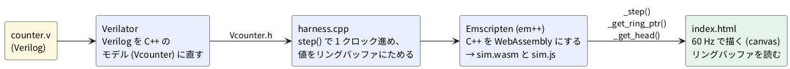

# 4-1 soft-fpga の仕組み — Verilog → Verilator → Emscripten → ブラウザ

この題は実体配線図と Analog Discovery 3 の図を付けない。ブラウザの中で動く題で、組む物が無いから。

0-5 では、ブラウザでカウンタの波形が流れるのを見た。
この題は、その波形が出るまでの道を読む。道の途中を知っておくと、4-3 で自分の Verilog に差し替えるとき、どこを直せばよいか分かる。

## 道のり




## 各段の仕事

| 段 | ファイル | 仕事 |
| --- | --- | --- |
| Verilog | `verilog/counter.v` | 回路の本体。ポートは `clk` `rst` `count` |
| Verilator | (自動で `obj_dir/` に出る) | Verilog を C++ のクラス `Vcounter` に直す。`top->clk` に値を入れて `eval()` を呼ぶと、回路の 1 回分の計算が走る |
| ハーネス | `cxx/harness.cpp` | 4 つの関数を持つ。`sim_init()` でリセットし、`step()` で 1 クロック進めて `count` を 1 サンプル残す。サンプルは 1024 個のリングバッファに順に書く |
| Emscripten | `scripts/build-wasm.sh` | 上の C++ と Verilator の部品を WebAssembly にして、`sim.wasm` と `sim.js` を出す |
| 画面 | `web/index.html` | `sim.js` を読み、60 Hz 前後で `step()` を何回か呼んでは、リングバッファを読んで canvas に描く |

### リングバッファ

`step()` は 1 回呼ぶたびに `count` の値を 1 個、リングバッファに書き、書いた数 (`head`) を 1 増やす。
バッファは 1024 個で、いっぱいになると古い値の上に書く。画面は最新の分だけを読んで描く。

```cpp
ring[head & (RING_SIZE - 1)].count = top->count;
head++;
```

`head & (RING_SIZE - 1)` は、1024 が 2 のべき乗だから使える書き方で、`head` を 1024 で割った余りと同じ。

### なぜ 1 クロックごとに JavaScript を呼ばないのか

WebAssembly と JavaScript の境目をまたぐ呼び出しは、1 回ごとに手間がかかる。
1 クロックごとに画面へ値を渡すと、クロックの数が増えたときに追いつかない。
そこで soft-fpga は、WebAssembly の側で値をバッファにため、JavaScript は 1 回の描画につき 1 度だけ、そのバッファを直に読む (soft-fpga の README の設計メモ)。

もう 1 つ。ブラウザのメモリが伸びる設定 (`ALLOW_MEMORY_GROWTH=1`) だと、伸びたときに古い読み口が無効になる。
画面側はそれに気を付けて読み口を作り直す、と README にある。4-3 以降で大きな回路を載せるときに出会う話題なので、頭の隅に置いておく。

## ビルドの要点

0-2 で作った Docker の `build-wasm` コンテナが、Emscripten を持っている。

```bash
docker compose -f docker/compose.yml run --rm build-wasm scripts/build-wasm.sh
```

`scripts/build-wasm.sh` は 01-counter を作ったあと、続けて別の例 (06-8080) のビルドも呼ぶ。
06-8080 が使うサブモジュールを取っていないと、その後半で失敗する。01-counter の出力 (`sim.js` と `sim.wasm`) は、失敗の前にできている。
サブモジュールを取るなら、先に `git submodule update --init` を打つ。

詳しい手順は 4-3 で自分の Verilog に差し替えながら行う。手順そのものは soft-fpga のリポジトリが持っているので、この本には写さない。

## 見るべき値

次を実際に動かして確かめた (Verilator 5.048、Emscripten 5.0.7、soft-fpga の `build-wasm` コンテナ。確認は Playwright の Chromium)。

| 見る所 | 値 |
| --- | --- |
| リングバッファの大きさ (`_get_ring_size()`) | 1024 |
| 速度スライダの既定 | 200 (1 回の描画で進める `step()` の数) |
| 半秒走らせたあとの `cycles` | 6000 (200 × 約 30 回の描画) |
| 01-counter の `sim.wasm` の大きさ | 145,961 バイト |

`sim.wasm` の大きさは、使った版や最適化の設定で変わる。

## 出典

自作。構成は [tommie-jp/soft-fpga](https://github.com/tommie-jp/soft-fpga) の README (Design notes) と
`examples/01-counter` (`cxx/harness.cpp`、`web/index.html`)、`scripts/build-wasm.sh`。
Verilator は [Verilator のガイド](https://veripool.org/guide/latest/)、Emscripten は [Emscripten の資料](https://emscripten.org/docs/)。
