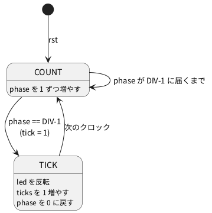

# 4-3 自分の Verilog に差し替えてビルドする

この題は実体配線図と Analog Discovery 3 の図を付けない。ブラウザの中で動く題で、組む物が無いから。

01-counter の `counter.v` を、クロックを分ける回路 (分周器) に差し替えて、ブラウザで動かす。
分周は、クロックを何回か数えて 1 回の合図を作る回路で、2-7 で LED を 1 Hz で点滅させるのに使う。ここでは考え方だけを先に使い、波形を soft-fpga で見る。

差し替えの目標は、**ハーネス (`harness.cpp`) と画面 (`index.html`) に手を入れず、`counter.v` だけを直す**こと。
そのために、モジュールの名前 (`counter`) と、ポート (`clk` `rst` `count[7:0]`) は変えない。ハーネスが `top->count` を読み、ビルドの手順が `counter.v` を指しているため。

## 状態

分周器の中身は、`phase` という 0 から `DIV - 1` まで数える数と、合図 `tick`、それに `led` と `ticks`。




`DIV = 4` のとき、`tick` は 4 クロックに 1 回だけ 1 になり、`led` は 4 クロックごとに反転する。

## Verilog

`examples/01-counter/verilog/counter.v` の中身を、次に置き換える。

```verilog
// 分周器: DIV クロックごとに led が反転する。ポートは元のカウンタと同じにして、
// harness.cpp とビルドの手順を変えずに済ませる。
module counter #(parameter DIV = 4) (
    input         clk,
    input         rst,
    output [7:0]  count
);
    localparam [3:0] LAST = DIV - 1;

    reg [3:0] phase;    // 0 .. DIV-1 を数える
    reg       led;      // DIV クロックごとに反転 (周期は 2 * DIV クロック)
    reg [5:0] ticks;    // tick の回数

    wire tick = (phase == LAST);

    always @(posedge clk or posedge rst)
        if (rst) begin
            phase <= 4'd0;
            led   <= 1'b0;
            ticks <= 6'd0;
        end else begin
            phase <= tick ? 4'd0 : phase + 4'd1;
            if (tick) begin
                led   <= ~led;
                ticks <= ticks + 6'd1;
            end
        end

    assign count = {ticks, tick, led};
endmodule
```

- 出力 `count` の 8 ビットは、下から `led`、`tick`、`ticks` の 6 ビット。soft-fpga の画面では、`b0` が `led`、`b1` が `tick`、`b7`〜`b2` が `ticks`
- `LAST` を 4 ビットの定数にしたのは、幅の違う比較で lint の警告が出ないようにするため
- `DIV` は 1 から 15 まで。`phase` が 4 ビットなので、16 以上にするときは `phase` の幅も広げる

## 手順

1. soft-fpga を取ってくる (0-2)。`examples/01-counter/verilog/counter.v` を上の中身に置き換える
2. lint を掛ける

   ```bash
   verilator --lint-only -Wall examples/01-counter/verilog/counter.v
   ```

3. PC で動かして、値を確かめる (任意)

   ```bash
   cmake -S examples/01-counter -B /tmp/b1
   cmake --build /tmp/b1
   /tmp/b1/sim
   ```

4. ブラウザ用にビルドする (4-1 のコマンド)

   ```bash
   docker compose -f docker/compose.yml run --rm build-wasm scripts/build-wasm.sh
   ```

5. `examples/01-counter/web/` で Web サーバを立てて開く

   ```bash
   cd examples/01-counter/web
   python3 -m http.server 8081
   ```

   ブラウザで `http://localhost:8081/` を開き、Run を押す。

ビルドの手順の細部は soft-fpga のリポジトリ (`scripts/build-wasm.sh`、`examples/01-counter/web/doStartWebServer.sh`) が持っている。元のカウンタに戻すには `git checkout examples/01-counter/verilog/counter.v` を打ち、もう一度ビルドする。

## 画面に見えるはずのもの

1 クロックを 1 ms と置いて、最初の 20 クロックを `logic` のフェンスで描く。

```logic
title: 図1 4 クロックごとに led が反転し、tick は led が変わる 1 クロック前に立つ
device: generic
window: 20ms
signals:
  CLK: dio0 clock 1kHz
  LED: dio1 edges 0s=0 3ms=1 7ms=0 11ms=1 15ms=0 19ms=1
  TICK: dio2 edges 0s=0 2ms=1 3ms=0 6ms=1 7ms=0 10ms=1 11ms=0 14ms=1 15ms=0 18ms=1 19ms=0
  T0: dio3 edges 0s=0 3ms=1 7ms=0 11ms=1 15ms=0 19ms=1
  T1: dio4 edges 0s=0 7ms=1 15ms=0
buses:
  Ticks: T1 T0 dec
cursors: [4.5ms, 12.5ms]
trigger: CLK rising at 0s
```


- `LED` (`b0`) は、3 ms で 1 になり、7 ms で 0 に戻る。周期は 8 クロック
- `TICK` (`b1`) は、LED が変わる 1 クロック前から 1 クロックだけ 1 になる。3 ms の立ち上がり直前の 2〜3 ms が最初の合図
- `T0` は `ticks` の最下位ビット。`led` と同じ時刻に同じ向きで変わる
- `T1` は `ticks` の次のビット。`T0` の倍の周期で、`Ticks` は 0 → 1 → 2 → 3 と数える (`ticks` の下位 2 ビットだけを表示している)
- 2 つのカーソルの間隔は 8 ms で、`LED` の 1 周期に当たる

## 見るべき値

soft-fpga の 01-counter に差し替えて、Verilator 5.048 のコンテナと、Playwright の Chromium で実際に動かした。

| 見る所 | 値 | 種類 |
| --- | --- | --- |
| lint (`-Wall`) | 警告なし | 動かして確かめた |
| PC のシミュレーション (`/tmp/b1/sim`、100 クロック後) | `last count=101` (`ticks` = 25、`tick` = 0、`led` = 1) | 動かして確かめた |
| 最初の 20 クロックの `led` の反転 | クロック 4、8、12、16、20 回目 | 動かして確かめた |
| `tick` が 1 になるクロック | 3、7、11、15、19 回目 | 動かして確かめた |
| ブラウザで 6000 クロックを走らせた後の `count` の並び | 88, 88, 90, 93, 93, 93, 95, 96 … | 動かして確かめた |

ブラウザの並びを 2 進に直すと、88 は `ticks`=22・`tick`=0・`led`=0、90 は `tick`=1、93 は `ticks`=23・`led`=1。画面のレーンと同じ向きに変わっている。

## 出典

自作。差し替え先は [tommie-jp/soft-fpga](https://github.com/tommie-jp/soft-fpga) の `examples/01-counter`。
ビルドは同リポジトリの `scripts/build-wasm.sh` と `docker/Dockerfile.wasm`。
