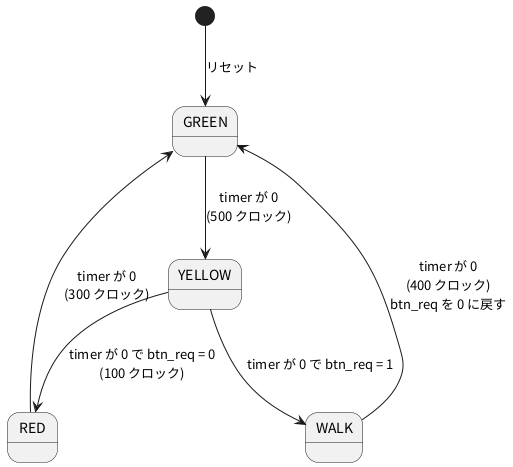

# 4-4 信号機の状態機械 — 今の状態が図で光る

この題は実体配線図と Analog Discovery 3 の図を付けない。ブラウザの中で動く題で、組む物が無いから。

soft-fpga の例 `02-traffic-fsm` は、歩行者ボタンの付いた信号機。
状態機械 (FSM) は、「今どの状態か」を覚えておき、時間やボタンで次の状態へ移る回路。
この例では、**今の状態が状態遷移図の中で光る**。信号機の灯と、状態の名前と、波形を並べて見られる。

## 開く

[https://tommie-jp.github.io/soft-fpga/02-traffic-fsm/](https://tommie-jp.github.io/soft-fpga/02-traffic-fsm/) を開く。

- 上に **Run**、**Reset**、**歩行者ボタン**、速度スライダ (既定 30。1 回の描画で進めるクロックの数)
- 状態遷移図: GREEN・YELLOW・RED・WALK の 4 つの丸。今の状態が緑や色で光る
- 左下の欄: `State`、`Timer`、`btn_req` の値
- 右下: ロジックアナライザの画面。`clk` `rst` `btn` `red` `yellow` `green` `walk` `state` `timer` `btn_req` の 10 レーン

## 状態遷移図




- 青 (GREEN) の間にボタンを押すと、`btn_req` が 1 になって残る。黄 (YELLOW) の終わりでそれを見て、赤 (RED) でなく歩行者 (WALK) へ進む
- WALK では車の信号は赤 (`red` も 1)、歩行者の灯 `walk` が 1。終わると `btn_req` が 0 に戻り、GREEN へ戻る
- 括弧のクロック数は、既定の parameter の値 (`GREEN_TIME = 500` など)

## Verilog

soft-fpga の `examples/02-traffic-fsm/verilog/traffic_fsm.v` そのまま。

```verilog
module traffic_fsm #(
    parameter GREEN_TIME  = 500,
    parameter YELLOW_TIME = 100,
    parameter RED_TIME    = 300,
    parameter WALK_TIME   = 400
) (
    input        clk,
    input        rst,
    input        btn,
    output reg   red,
    output reg   yellow,
    output reg   green,
    output reg   walk,
    // 観測用出力（harness から読む）
    output [1:0] o_state,
    output [9:0] o_timer,
    output       o_btn_req
);
    localparam S_GREEN  = 2'd0;
    localparam S_YELLOW = 2'd1;
    localparam S_RED    = 2'd2;
    localparam S_WALK   = 2'd3;

    reg [1:0] state;
    reg [9:0] timer;
    reg       btn_req;

    assign o_state   = state;
    assign o_timer   = timer;
    assign o_btn_req = btn_req;

    always @(posedge clk) begin
        if (rst) begin
            state   <= S_GREEN;
            timer   <= GREEN_TIME[9:0] - 10'd1;
            btn_req <= 1'b0;
            red     <= 1'b0;
            yellow  <= 1'b0;
            green   <= 1'b1;
            walk    <= 1'b0;
        end else begin
            if (btn) btn_req <= 1'b1;

            if (timer == 10'd0) begin
                case (state)
                    S_GREEN: begin
                        state  <= S_YELLOW;
                        timer  <= YELLOW_TIME[9:0] - 10'd1;
                        red    <= 1'b0; yellow <= 1'b1;
                        green  <= 1'b0; walk   <= 1'b0;
                    end
                    S_YELLOW: begin
                        if (btn_req) begin
                            state  <= S_WALK;
                            timer  <= WALK_TIME[9:0] - 10'd1;
                            red    <= 1'b1; yellow <= 1'b0;
                            green  <= 1'b0; walk   <= 1'b1;
                        end else begin
                            state  <= S_RED;
                            timer  <= RED_TIME[9:0] - 10'd1;
                            red    <= 1'b1; yellow <= 1'b0;
                            green  <= 1'b0; walk   <= 1'b0;
                        end
                    end
                    S_RED: begin
                        state  <= S_GREEN;
                        timer  <= GREEN_TIME[9:0] - 10'd1;
                        red    <= 1'b0; yellow <= 1'b0;
                        green  <= 1'b1; walk   <= 1'b0;
                    end
                    S_WALK: begin
                        btn_req <= 1'b0;
                        state   <= S_GREEN;
                        timer   <= GREEN_TIME[9:0] - 10'd1;
                        red     <= 1'b0; yellow <= 1'b0;
                        green   <= 1'b1; walk   <= 1'b0;
                    end
                    default: begin
                        state <= S_GREEN;
                        timer <= GREEN_TIME[9:0] - 10'd1;
                    end
                endcase
            end else begin
                timer <= timer - 10'd1;
            end
        end
    end
endmodule
```

- 状態は `state` の 2 ビット、残り時間は `timer`。`timer` が 0 になった次のクロックで、`case` が次の状態を選ぶ
- 灯 (`red` `yellow` `green` `walk`) は、状態を変えるのと同じクロックで一緒に書く。灯と状態がずれない
- 同期リセット (`always @(posedge clk)` の中の `if (rst)`) を使っている。0-5 のカウンタは非同期リセットだった。違いは 2-3
- `default` は、`state` が 0〜3 以外のときの逃げ道 (2 ビットなので起きないが、書いておく)

Verilator の lint (`-Wall`) は、警告なしで通る (確かめた)。

## 見る

1. Run を押す。GREEN が光り、`Timer` が 1 クロックごとに減る
2. 歩行者ボタンを押す。`btn_req` が 1 になる
3. GREEN が終わると YELLOW に移り、そのあと RED でなく WALK に移る。`red` と `walk` が同時に 1 になる
4. WALK が終わると `btn_req` が 0 に戻り、GREEN に戻る
5. ボタンを押さずに 1 周すると、GREEN → YELLOW → RED → GREEN になる

状態遷移図の光る丸と、右下の `state` レーンの名前、`red` `yellow` `green` `walk` の4 本のレーンが、同じ時刻に同じ向きで変わる。

## 画面に見えるはずのもの

クロック 200 回目にボタンを押したとして、2000 クロックぶんを `logic` のフェンスで描く。
ブラウザの画面には時間の単位が無いので、1 クロックを 1 ms と置いた仮の目盛。`clk` は細かすぎるので描かない。`btn` は 1 クロックだけの合図で、この目盛では見えないので、押した結果の `btn_req` から描く。

```logic
title: 図1 ボタンを押すと YELLOW の次が RED でなく WALK になる
device: generic
window: 2s
signals:
  btn_req: dio1 edges 0s=0 199ms=1 999ms=0
  S1: dio2 edges 0s=0 599ms=1 999ms=0 1599ms=1 1899ms=0
  S0: dio3 edges 0s=0 499ms=1 999ms=0 1499ms=1 1599ms=0
  green: dio4 edges 0s=1 499ms=0 999ms=1 1499ms=0 1899ms=1
  yellow: dio5 edges 0s=0 499ms=1 599ms=0 1499ms=1 1599ms=0
  red: dio6 edges 0s=0 599ms=1 999ms=0 1599ms=1 1899ms=0
  walk: dio7 edges 0s=0 599ms=1 999ms=0
buses:
  state: S1 S0 dec
cursors: [350ms, 800ms]
trigger: btn_req rising at 199ms
```


- `state` の数は、0 = GREEN、1 = YELLOW、2 = RED、3 = WALK
- X1 (350 ms) は GREEN で `btn_req` が 1、X2 (800 ms) は WALK で `red` と `walk` が 1
- 2 回目の周回 (1000 ms より後) は、ボタンを押していないので YELLOW のあとが RED (state = 2)

## 見るべき値

次を実際に動かして得た。ブラウザ (Playwright の Chromium) と、PC の Verilator のシミュレーションで、状態の変わるクロックが一致した。
`step` の数え方は、リセット直後を 0 とし、`step` を 1 回呼んだ後を 1 とする。

| 状況 | 状態が変わる `step` の番号 |
| --- | --- |
| ボタンを押さない | 500 で YELLOW、600 で RED、900 で GREEN、1400 で YELLOW、1500 で RED |
| 200 回目にボタンを押す | 500 で YELLOW、600 で WALK、1000 で GREEN |
| 700 回目 (RED の途中) に押す | 900 で GREEN、1400 で YELLOW、1500 で WALK、1900 で GREEN |

| 見る所 | 値 |
| --- | --- |
| YELLOW が続くクロック数 | 100 (500 〜 599) |
| RED が続くクロック数 | 300 (600 〜 899) |
| WALK が続くクロック数 | 400 (600 〜 999) |
| `btn_req` が 0 に戻る時刻 | WALK が終わる `step` (1000) |
| ブラウザの画面の `Timer` | WALK に入った直後に 399 (リングバッファを読んで確認) |

GREEN は最初の周回だけ 499 サンプルで、リセットで始まった 1 クロックぶんを含めると 500 クロックになる (2 周目以降は 500 サンプル)。

## 出典

自作。例と Verilog は [tommie-jp/soft-fpga](https://github.com/tommie-jp/soft-fpga) の `examples/02-traffic-fsm`。
画面は [02-traffic-fsm](https://tommie-jp.github.io/soft-fpga/02-traffic-fsm/)。
