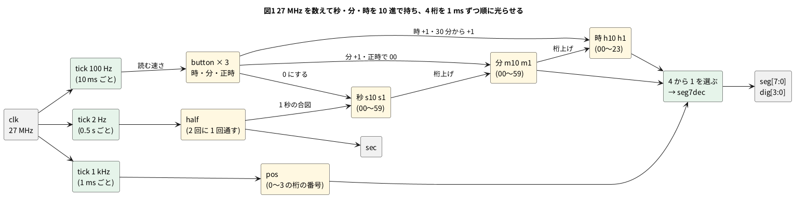

# 12-4 時計 — 32.768 kHz を数えて時分秒を 4 桁の 7 セグに出し、時報で合わせる

> [!WARNING]
> **この題は実機で組んでいない。** Verilog は Verilator で 1 日分を回して自分で合否を言う試験を通し、
> yosys の `synth_gowin` で Tang Nano 9K の FPGA (GW1NR-9) 向けの合成まで通した。配置配線・書き込み・実物の点灯は確かめていない。
> 「見るべき値」はシミュレーションの値と計算値で、測った値ではない。

第 2 章と第 6 章で作った部品を 1 台にまとめて、**時と分を 4 桁の 7 セグに出す時計**を作る。
使う部品の題は次のとおり。

| 部品 | 題 | この題での役 |
| --- | --- | --- |
| 分周 | 2-7 | 27 MHz を数えて 0.5 s ごとの合図を作る |
| クロックイネーブル | 2-5 | 秒・桁の切り替え・ボタンを見る速さを、クロックを分けずに作る |
| 10 進カウンタと桁上げ | 2-9 | 秒・分・時を 10 進の 6 桁で数える |
| 7 セグのデコーダ | 1-8 | 0〜9 を a〜g に直す |
| ダイナミック点灯 | 2-15 | 4 桁を 1 ms ずつ順に光らせる |
| チャタリング取り | 6-3 | 時・分のボタンと正時の合図を 10 ms ごとに読む |
| 正時の合図 | 6-13 | 時報の 880 Hz の正時パルスで秒を 0 に合わせる |

題名の 32.768 kHz は時計用の水晶の周波数 (2^15 Hz。15 回半分にすると 1 Hz)。この題では、Tang Nano 9K に載っている
**27 MHz の発振器**を数えて 1 秒を作る。`CLK_HZ` を `parameter` にしてあるので、外に 32.768 kHz の発振器を付けたときは
`CLK_HZ` を 32 768 にするだけで同じ回路が動く (§「1 日のずれ」)。

## 決めたこと

| 項目 | 決め | 理由 |
| --- | --- | --- |
| 表示 | 時と分の 4 桁 (`HH.MM`)。時の 1 の位の点 (dp) を秒に合わせて 0.5 s 点け、0.5 s 消す | 4 桁の 7 セグにはコロンが無いので、点で秒を見せる |
| 7 セグ | OSL40562-LR (0.56 インチ 4 桁、カソード共通) | 桁どうしのセグメントが部品の中でつながっていて、外の配線はセグメント 8 本と桁 4 本で済む |
| 桁の共通 (カソード) | NPN トランジスタ 2SC1815 で GND へ落とす | 1 桁に最大 8 セグメントぶんの電流が集まる。FPGA のピン 1 本で受けない |
| 時刻合わせ | Tang Nano 9K の押しボタン 2 つ。片方で時を 1 進め、もう片方で分を 1 進めて秒を 0 にする | ボードに付いているので配線が要らない |
| 正時に合わせる | `sync_n` が 0 になったら、29 分までなら今の時の 00 分 00 秒、30 分からは次の時の 00 分 00 秒にする | 時報の正時パルスは毎正時に来る。時計が ±30 分以内で合っていれば正しい時に揃う |
| 正時の合図の入口 | この題では AD3 の Patterns で DIO5 から 50 ms の L のパルスを出して試す | 時報を受ける回路 (05-etc 第 2 章) は 5 V で動く。FPGA のピンは 3.3 V なので、つなぐときは 8-20 のレベル変換を挟む |
| 電源 | USB-C から Tang Nano 9K へ。ブレッドボードに電源は配らない | 7 セグとトランジスタは FPGA のピンの 3.3 V で光らせる。電源レールは GND だけ使う |

FPGA のピンは 3.3 V (0-3)。この題で使うピンは全部 3.3 V の列で、1.8 V の `IO79`〜`IO86` は使わない。

## ブロック図




- `tick` は `CLK_HZ` を数えて、`TICK_HZ` の速さで 1 クロックだけ `en` を 1 にする。2 Hz・1 kHz・100 Hz の 3 つを使う
- 秒は 2 Hz の合図を 2 回に 1 回だけ通して作る。通さなかった側の 0.5 s が「秒の後半」で、点を消す
- 秒の 10 の位の桁上げが分を、分の 10 の位の桁上げが時を 1 進める。時は 23 の次に 00 へ戻る
- 押したボタンは `press` を 1 クロックだけ 1 にする。分のボタンと正時の合図は秒を 0 にする

## 回路図

```circuit
title: 図2 FPGA の 12 本のピンから抵抗とトランジスタを通して 4 桁の 7 セグを光らせる
parts:
  U1: tang-nano-9k 5,6
  SEC: port 3.5,6.36
  SYNC: port 3.5,6.6
  DRV1: port 3.5,6.84
  DRV2: port 3.5,7.08
  DRV4: port 3.5,7.32
  DRV3: port 3.5,7.56
  SA: port 3.5,7.8
  SF: port 3.5,8.04
  SB: port 3.5,8.28
  SE: port 6.5,7.08
  SD: port 6.5,7.56
  SDP: port 6.5,7.8
  SC: port 6.5,8.04
  SG: port 6.5,8.28
  G0: ground 6.5,9
  DS1: seg7x4 16,6 OSL40562-LR
  SA: port 11,1.6
  R1: resistor 11,1.6 12.5,1.6 220
  SB: port 11,2.3
  R2: resistor 11,2.3 12.5,2.3 220
  SC: port 11,3
  R3: resistor 11,3 12.5,3 220
  SD: port 11,3.7
  R4: resistor 11,3.7 12.5,3.7 220
  SE: port 11,4.4
  R5: resistor 11,4.4 12.5,4.4 220
  SF: port 11,5.1
  R6: resistor 11,5.1 12.5,5.1 220
  SG: port 11,5.8
  R7: resistor 11,5.8 12.5,5.8 220
  SDP: port 11,6.5
  R8: resistor 11,6.5 12.5,6.5 220
  DIG1: port 14.5,6.63
  DIG2: port 14.5,6.88
  DIG3: port 14.5,7.13
  DIG4: port 14.5,7.38
  DRV1: port 7.1,10
  R9: resistor 7.1,10 8.6,10 1k
  Q1: npn 9.5,10 2SC1815
  DIG1: port 9.5,9
  G1: ground 9.5,11
  DRV2: port 10.6,10
  R10: resistor 10.6,10 12.1,10 1k
  Q2: npn 13,10 2SC1815
  DIG2: port 13,9
  G2: ground 13,11
  DRV3: port 14.1,10
  R11: resistor 14.1,10 15.6,10 1k
  Q3: npn 16.5,10 2SC1815
  DIG3: port 16.5,9
  G3: ground 16.5,11
  DRV4: port 17.6,10
  R12: resistor 17.6,10 19.1,10 1k
  Q4: npn 20,10 2SC1815
  DIG4: port 20,9
  G4: ground 20,11
  AD:
    type: device
    at: 1,2.5
    label: AD3
    pins: [DIO0, DIO1, DIO2, DIO3, DIO4, DIO5, GND]
    turn: mirror
  DRV1: port 2.5,1.75
  DRV2: port 2.5,2
  DRV3: port 2.5,2.25
  DRV4: port 2.5,2.5
  SEC: port 2.5,2.75
  SYNC: port 2.5,3
  G5: ground 2.5,3.6
wires:
  - U1.IO35 |- 3.5,6.36
  - U1.IO41 |- 3.5,6.6
  - U1.IO42 |- 3.5,6.84
  - U1.IO51 |- 3.5,7.08
  - U1.IO53 |- 3.5,7.32
  - U1.IO54 |- 3.5,7.56
  - U1.IO55 |- 3.5,7.8
  - U1.IO56 |- 3.5,8.04
  - U1.IO57 |- 3.5,8.28
  - U1.IO70 |- 6.5,7.08
  - U1.IO48 |- 6.5,7.56
  - U1.IO49 |- 6.5,7.8
  - U1.IO31 |- 6.5,8.04
  - U1.IO32 |- 6.5,8.28
  - U1.GND |- 6.5,8.52 -- 6.5,9
  - 12.5,1.6 -- 14.8,1.6 -- 14.8,4.63 -| DS1.a
  - 12.5,2.3 -- 14.6,2.3 -- 14.6,4.88 -| DS1.b
  - 12.5,3 -- 14.4,3 -- 14.4,5.13 -| DS1.c
  - 12.5,3.7 -- 14.2,3.7 -- 14.2,5.38 -| DS1.d
  - 12.5,4.4 -- 14,4.4 -- 14,5.63 -| DS1.e
  - 12.5,5.1 -- 13.8,5.1 -- 13.8,5.88 -| DS1.f
  - 12.5,5.8 -- 13.6,5.8 -- 13.6,6.13 -| DS1.g
  - 12.5,6.5 -- 13.4,6.5 -- 13.4,6.38 -| DS1.dp
  - 14.5,6.63 -| DS1.DIG1
  - 14.5,6.88 -| DS1.DIG2
  - 14.5,7.13 -| DS1.DIG3
  - 14.5,7.38 -| DS1.DIG4
  - 8.6,10 -- Q1.B
  - 9.5,9 -- Q1.C
  - Q1.E -- 9.5,11
  - 12.1,10 -- Q2.B
  - 13,9 -- Q2.C
  - Q2.E -- 13,11
  - 15.6,10 -- Q3.B
  - 16.5,9 -- Q3.C
  - Q3.E -- 16.5,11
  - 19.1,10 -- Q4.B
  - 20,9 -- Q4.C
  - Q4.E -- 20,11
  - AD.DIO0 |- 2.5,1.75
  - AD.DIO1 |- 2.5,2
  - AD.DIO2 |- 2.5,2.25
  - AD.DIO3 |- 2.5,2.5
  - AD.DIO4 |- 2.5,2.75
  - AD.DIO5 |- 2.5,3
  - AD.GND |- 2.5,3.25 -- 2.5,3.6
```


- 線で結ぶ代わりに、**同じ名前の端子 (白丸と名前) どうしがつながっている**。U1 のピンから出た `SA` は、R1 の左の `SA` とつながる
- U1 のピンの名前は Sipeed のピン配置図の FPGA のピン番号に `IO` を付けたもの (`IO42` は FPGA の 42 番ピン)。制約ファイル (`clock.cst`) の番号と同じ
- セグメント (a〜g・dp) は 4 桁で共通のアノード。光らせたい桁の DIGk だけ、トランジスタで GND へ落とす
- `DRV1`〜`DRV4` は FPGA の `dig[3]`〜`dig[0]`。1 にした桁のトランジスタがオンになり、その桁のカソードが GND になる
- AD3 は DIO0〜DIO3 で `DRV1`〜`DRV4`、DIO4 で `SEC` を読み、DIO5 から `SYNC` (正時の合図) を出す
- 図に無いピン: 27 MHz のクロック (52 番) とボードの押しボタン (3 番・4 番) はボードの上で FPGA につながっている

## 部品表

| 部品 | 値・型番 | 数 | 役 |
| --- | --- | --- | --- |
| U1 | Sipeed Tang Nano 9K (GW1NR-9) | 1 | FPGA ボード。USB-C から給電 |
| DS1 | OSL40562-LR (0.56 インチ 4 桁 7 セグ、カソード共通、赤) | 1 | 表示 |
| R1〜R8 | 220 Ω (E24)、1/4 W | 8 | セグメント a〜g・dp の電流を決める |
| Q1〜Q4 | 2SC1815 (NPN) | 4 | DIG1〜DIG4 のカソードを GND へ落とす |
| R9〜R12 | 1 kΩ (E24)、1/4 W | 4 | トランジスタのベースの電流を決める |
| — | ブレッドボード (full、63 列) | 1 | |
| — | ジャンパ線 | 約 40 本 | |
| AD | Analog Discovery 3 | 1 | Logic で測り、Patterns で正時の合図を出す |

電源は教科書の既定の 5 V ではなく **3.3 V** (FPGA のピン)。FPGA のピンに 5 V を入れると壊れるため (0-3)。
ブレッドボードには電源を配らず、7 セグは FPGA のピンの 3.3 V で光らせる。

## 実体配線図

```bread
title: 図3 1 枚のブレッドボードに組む。電源は USB-C から Tang Nano 9K へ
board: full
parts:
  U1: tang-nano-9k @ b1
  Q1: transistor c27(B) c28(C) c29(E) 2SC1815 cap=above
  Q2: transistor d29(E) d30(C) d31(B) 2SC1815 cap=below
  Q3: transistor c32(E) c33(C) c34(B) 2SC1815 cap=above:1,0
  Q4: transistor h28(E) h29(C) h30(B) 2SC1815 cap=right
  R9: resistor e27 f27 1k
  R10: resistor e31 f31 1k cap=right
  R11: resistor e34 f34 1k
  R12: resistor g30 g32 1k cap=above
  R1: resistor e35 f35 220 cap=above:0,-2
  R6: resistor e36 f36 220 cap=above:0,-1
  R2: resistor e37 f37 220 cap=above
  R5: resistor e38 f38 220 cap=above:0,-2
  R4: resistor e39 f39 220 cap=above:0,-1
  R8: resistor e40 f40 220 cap=above
  R3: resistor e41 f41 220 cap=above:0,-2
  R7: resistor e42 f42 220 cap=above:0,-1
  DS1: seg7x4 @ b50
  AD:
    type: device
    at: bottom
    label: AD3
    pins: [GND, DIO0, DIO1, DIO3, DIO2, DIO4, DIO5]
wires:
  - a23 -- -t23 black
  - a29 -- -t29 black
  - a32 -- -t32 black
  - j28 -- -b28 black
  - -t63 -- -b63 black
  - j16 -- j27 blue
  - j17 -- j31 blue
  - j18 -- j32 blue
  - j19 -- j34 blue
  - j20 -- j35 yellow
  - j21 -- j36 gray
  - j22 -- j37 yellow
  - a35 -- a51 yellow
  - a36 -- a52 gray
  - a37 -- a55 yellow
  - a28 -- a50 white
  - a30 -- a53 white
  - a33 -- a54 white
  - a17 -- a38 orange
  - a19 -- a39 brown
  - a20 -- a40 orange
  - a21 -- a41 brown
  - a22 -- a42 orange
  - g38 -- g50 orange
  - h39 -- h51 brown
  - i40 -- i52 orange
  - j41 -- j53 brown
  - j42 -- j54 orange
  - j29 -- j55 white
  - AD.GND -- -b45 black
  - AD.DIO0 -- i27 green
  - AD.DIO1 -- i31 green
  - AD.DIO3 -- i32 green
  - AD.DIO2 -- i34 green
  - AD.DIO4 -- j14 purple
  - AD.DIO5 -- j15 purple
notes:
  - text: 給電は Tang Nano 9K の USB-C (5 V)。電源レールは GND (−) だけ使う
```


- Tang Nano 9K は溝をまたいで b 行と i 行に挿す (`@ b1`)。1〜24 番が下の列 (i 行)、25〜48 番が上の列 (b 行)。基板の外側の 1 穴 (a 行・j 行) から線を取る。内側の穴はボードの基板の下になるので使わない
- 7 セグ (DS1) も溝をまたぐ。胴は 50 mm あり、ピンの列の左右に約 7 列ずつはみ出す。胴の下 (b〜f 行) の穴は使えないので、上のピンは a 行、下のピンは g〜j 行から線を取る
- R1〜R8 は溝をまたいで縦に挿す。上の列と下の列が別のネットになるので、片方に FPGA、もう片方に 7 セグをつなぐ
- Q1 と Q2 はエミッタの列 (29 列) を共有する (どちらも GND)。Q4 だけ下の列にある (DIG4 は 7 セグの下のピン)
- 線の色: 黒は GND だけ。青と白はトランジスタの道 (青が FPGA → ベース抵抗、白がコレクタ → 7 セグの DIG)。黄と灰は a・f・b、橙と茶は e・d・dp・c・g。緑と紫は AD3。赤は使わない (+ の電源が無い)
- 上と下の GND のレールは右端 (63 列) で 1 本の線でつなぐ
- 流れる電流は 1 本の線で最大 50 mA 前後 (トランジスタのコレクタ)、ブレッドボード全体でも 0.1 A 以下 (見積り)。信号は 1 kHz 以下で、ブレッドボードの範囲 (3 MHz 以下) に収まる

## Verilog

モジュールは 6 つ。1 ファイル 1 モジュールにした (Verilator は、ファイル名とモジュール名が違うと lint で言う)。

### tick.v — 決まった速さの合図

```verilog
// CLK_HZ を数えて、TICK_HZ の速さで 1 クロックだけ en を 1 にする (2-5 のクロックイネーブル)
module tick #(
    parameter CLK_HZ  = 27_000_000,
    parameter TICK_HZ = 1
) (
    input      clk,
    input      rst,
    output reg en
);
    localparam N = CLK_HZ / TICK_HZ;
    localparam W = (N > 1) ? $clog2(N) : 1;

    localparam [W-1:0] LAST = N[W-1:0] - 1'b1;

    reg [W-1:0] cnt;

    always @(posedge clk)
        if (rst) begin
            cnt <= {W{1'b0}};
            en  <= 1'b0;
        end else if (cnt == LAST) begin
            cnt <= {W{1'b0}};
            en  <= 1'b1;
        end else begin
            cnt <= cnt + 1'b1;
            en  <= 1'b0;
        end
endmodule
```

### button.v — 押しボタンを読む

```verilog
// 押しボタン (押すと 0) を 2 段で受け、sample ごとに 2 回続けて 0 なら押したとみなす。
// 押した瞬間に 1 クロックだけ press を 1 にする
module button (
    input      clk,
    input      rst,
    input      sample,
    input      btn_n,
    output reg press
);
    reg [1:0] sync;
    reg [1:0] hist;
    reg       held;

    always @(posedge clk)
        if (rst) begin
            sync  <= 2'b11;
            hist  <= 2'b11;
            held  <= 1'b0;
            press <= 1'b0;
        end else begin
            sync  <= {sync[0], btn_n};
            press <= 1'b0;
            if (sample) begin
                hist <= {hist[0], sync[1]};
                if (hist == 2'b00 && !held) begin
                    held  <= 1'b1;
                    press <= 1'b1;
                end else if (hist == 2'b11) begin
                    held <= 1'b0;
                end
            end
        end
endmodule
```

- `sync` の 2 段は、クロックと関係なく変わるボタンの信号を受ける所 (9-2)
- 10 ms ごとに読み、2 回続けて 0 なら押したとみなす。チャタリング (押し始めの数 ms の暴れ) は 10 ms より短いので、2 回続けて同じ値にならない
- `held` で、押し続けても 1 回しか数えない。長押しで速く進めるのは 6-6 の題

### digit.v — 10 進の 1 桁

```verilog
// 0 から last まで数える 10 進の 1 桁。inc で 1 進み、last の次は 0 に戻って carry を出す
module digit (
    input            clk,
    input            rst,
    input            clr,
    input            inc,
    input      [3:0] last,
    output reg [3:0] q,
    output           carry
);
    assign carry = inc && (q == last);

    always @(posedge clk)
        if (rst || clr)  q <= 4'd0;
        else if (carry)  q <= 4'd0;
        else if (inc)    q <= q + 4'd1;
endmodule
```

`last` を入力にしたので、秒と分の 10 の位 (0〜5)・1 の位 (0〜9)・時の 10 の位 (0〜2) を同じモジュールで作れる。
時の 1 の位だけは、10 の位が 2 のとき 3 で折り返す (`h1_last`)。

### seg7dec.v — 0〜9 を a〜g に

```verilog
// 0 から 9 を 7 セグの a〜g に直す (1-8)。1 が点灯
module seg7dec (
    input      [3:0] n,
    output reg [6:0] seg    // {g, f, e, d, c, b, a}
);
    always @(*)
        case (n)
            4'd0:    seg = 7'b0111111;
            4'd1:    seg = 7'b0000110;
            4'd2:    seg = 7'b1011011;
            4'd3:    seg = 7'b1001111;
            4'd4:    seg = 7'b1100110;
            4'd5:    seg = 7'b1101101;
            4'd6:    seg = 7'b1111101;
            4'd7:    seg = 7'b0000111;
            4'd8:    seg = 7'b1111111;
            4'd9:    seg = 7'b1101111;
            default: seg = 7'b0000000;
        endcase
endmodule
```

### clock.v — 時計の本体

```verilog
module clock #(
    parameter CLK_HZ  = 27_000_000,
    parameter SCAN_HZ = 1_000,       // 桁を切り替える速さ。4 桁なので 1 桁は 250 Hz で光る
    parameter BTN_HZ  = 100          // ボタンを見る速さ (10 ms ごと)
) (
    input        clk,
    input        rst,
    input        btn_hour_n,         // 押すと 0。時を 1 進める
    input        btn_min_n,          // 押すと 0。分を 1 進め、秒を 0 にする
    input        sync_n,             // 押すと 0。正時に合わせる (時報の正時パルス)
    output [7:0] seg,                // {dp, g, f, e, d, c, b, a}。1 で点灯
    output [3:0] dig,                // 1 の桁だけ光る。dig[3] が左端 (時の 10 の位)
    output       sec,                // 秒の前半 0.5 s だけ 1
    output [23:0] now                // 時分秒の 6 桁 {h10, h1, m10, m1, s10, s1}。試験で見る
);
    wire en_half, en_scan, en_btn;

    tick #(.CLK_HZ(CLK_HZ), .TICK_HZ(2))       t_half (.clk(clk), .rst(rst), .en(en_half));
    tick #(.CLK_HZ(CLK_HZ), .TICK_HZ(SCAN_HZ)) t_scan (.clk(clk), .rst(rst), .en(en_scan));
    tick #(.CLK_HZ(CLK_HZ), .TICK_HZ(BTN_HZ))  t_btn  (.clk(clk), .rst(rst), .en(en_btn));

    wire p_hour, p_min, p_sync;

    button b_hour (.clk(clk), .rst(rst), .sample(en_btn), .btn_n(btn_hour_n), .press(p_hour));
    button b_min  (.clk(clk), .rst(rst), .sample(en_btn), .btn_n(btn_min_n),  .press(p_min));
    button b_sync (.clk(clk), .rst(rst), .sample(en_btn), .btn_n(sync_n),     .press(p_sync));

    // 時分秒を 10 進の 6 桁で持つ
    wire [3:0] s1, s10, m1, m10, h1, h10;
    wire c_s1, c_s10, c_m1, c_m10, c_h1;

    // 正時に合わせる: 30 分より前なら今の時の 00 分、30 分からは次の時の 00 分
    wire round_up = p_sync && (m10 >= 4'd3);
    wire clr_ms   = p_min || p_sync;
    wire inc_min  = !p_sync && ((c_s10 && !p_min) || p_min);
    wire inc_hour = (c_m10 && !p_sync) || p_hour || round_up;

    // 0.5 s ごとの tick を 2 回に 1 回だけ通して 1 秒にする。half が 1 の間が秒の前半
    reg half;
    always @(posedge clk)
        if (rst)          half <= 1'b0;
        else if (en_half) half <= ~half;
    wire en_sec = en_half && !half;
    assign sec  = half;

    // 時は 00〜23。時の 1 の位は、10 の位が 2 のときだけ 3 で折り返す
    wire [3:0] h1_last = (h10 == 4'd2) ? 4'd3 : 4'd9;

    digit d_s1  (.clk(clk), .rst(rst), .clr(clr_ms), .inc(en_sec),   .last(4'd9),    .q(s1),  .carry(c_s1));
    digit d_s10 (.clk(clk), .rst(rst), .clr(clr_ms), .inc(c_s1),     .last(4'd5),    .q(s10), .carry(c_s10));
    digit d_m1  (.clk(clk), .rst(rst), .clr(p_sync), .inc(inc_min),  .last(4'd9),    .q(m1),  .carry(c_m1));
    digit d_m10 (.clk(clk), .rst(rst), .clr(p_sync), .inc(c_m1),     .last(4'd5),    .q(m10), .carry(c_m10));
    digit d_h1  (.clk(clk), .rst(rst), .clr(1'b0),   .inc(inc_hour), .last(h1_last), .q(h1),  .carry(c_h1));
    /* verilator lint_off PINCONNECTEMPTY */    // 23 時の次は 0 時。時の 10 の位の carry は使わない
    digit d_h10 (.clk(clk), .rst(rst), .clr(1'b0),   .inc(c_h1),     .last(4'd2),    .q(h10), .carry());
    /* verilator lint_on PINCONNECTEMPTY */

    // ダイナミック点灯 (2-15): 1 ms ごとに光らせる桁を 1 つずらす
    reg [1:0] pos;
    always @(posedge clk)
        if (rst)          pos <= 2'd0;
        else if (en_scan) pos <= pos + 2'd1;

    reg [3:0] shown;
    always @(*)
        case (pos)
            2'd0:    shown = h10;
            2'd1:    shown = h1;
            2'd2:    shown = m10;
            default: shown = m1;
        endcase

    wire [6:0] abc;
    seg7dec dec (.n(shown), .seg(abc));

    assign seg = {sec && (pos == 2'd1), abc};    // 時の 1 の位の点を秒に合わせて点滅
    assign dig = 4'b1000 >> pos;
    assign now = {h10, h1, m10, m1, s10, s1};
endmodule
```

- `dig` は 1 の桁だけを光らせる。`dig[3]` が左端の桁 (OSL40562-LR の DIG1)、`dig[0]` が右端 (DIG4)
- `now` は時分秒の 6 桁を試験で見るための出口。FPGA のピンには出さない (下の `top.v`)

### top.v — Tang Nano 9K に載せる最上位

```verilog
// Tang Nano 9K に載せる最上位。リセットのボタンは時刻合わせに使うので、電源を入れた直後の 15 クロックをリセットにする
module top (
    input        clk,          // 52 番ピン。ボードの 27 MHz
    input        btn_hour_n,   // ボードのボタン (4 番ピン)
    input        btn_min_n,    // ボードのボタン (3 番ピン)
    input        sync_n,       // 正時の合図 (押すと 0)。この題では AD3 の DIO5 から
    output [7:0] seg,
    output [3:0] dig,
    output       sec
);
    reg [3:0] por;
    initial por = 4'd0;        // FPGA は書き込んだ直後にこの初期値から始まる (2-18)
    always @(posedge clk)
        if (por != 4'hf) por <= por + 4'd1;
    wire rst = (por != 4'hf);

    /* verilator lint_off PINCONNECTEMPTY */    // now は試験で見るだけ。ピンには出さない
    clock u (.clk(clk), .rst(rst), .btn_hour_n(btn_hour_n), .btn_min_n(btn_min_n), .sync_n(sync_n),
             .seg(seg), .dig(dig), .sec(sec), .now());
    /* verilator lint_on PINCONNECTEMPTY */
endmodule
```

ボードのボタンを時刻合わせに使うので、リセットのボタンが無い。電源を入れた直後の 15 クロックをリセットにした。
`initial` で与えた初期値は、Gowin の FPGA では書き込んだ直後の値になる (シミュレーションでも同じ)。

### ピンの割り当て (`clock.cst`)

```text
IO_LOC "clk" 52;
IO_PORT "clk" IO_TYPE=LVCMOS33 PULL_MODE=UP;
IO_LOC "btn_hour_n" 4;
IO_PORT "btn_hour_n" PULL_MODE=UP;
IO_LOC "btn_min_n" 3;
IO_PORT "btn_min_n" PULL_MODE=UP;
IO_LOC "sync_n" 41;
IO_PORT "sync_n" IO_TYPE=LVCMOS33 PULL_MODE=UP;
IO_LOC "seg[0]" 55;
IO_PORT "seg[0]" IO_TYPE=LVCMOS33 DRIVE=8;
IO_LOC "seg[1]" 57;
IO_PORT "seg[1]" IO_TYPE=LVCMOS33 DRIVE=8;
IO_LOC "seg[2]" 31;
IO_PORT "seg[2]" IO_TYPE=LVCMOS33 DRIVE=8;
IO_LOC "seg[3]" 48;
IO_PORT "seg[3]" IO_TYPE=LVCMOS33 DRIVE=8;
IO_LOC "seg[4]" 70;
IO_PORT "seg[4]" IO_TYPE=LVCMOS33 DRIVE=8;
IO_LOC "seg[5]" 56;
IO_PORT "seg[5]" IO_TYPE=LVCMOS33 DRIVE=8;
IO_LOC "seg[6]" 32;
IO_PORT "seg[6]" IO_TYPE=LVCMOS33 DRIVE=8;
IO_LOC "seg[7]" 49;
IO_PORT "seg[7]" IO_TYPE=LVCMOS33 DRIVE=8;
IO_LOC "dig[3]" 42;
IO_PORT "dig[3]" IO_TYPE=LVCMOS33 DRIVE=8;
IO_LOC "dig[2]" 51;
IO_PORT "dig[2]" IO_TYPE=LVCMOS33 DRIVE=8;
IO_LOC "dig[1]" 54;
IO_PORT "dig[1]" IO_TYPE=LVCMOS33 DRIVE=8;
IO_LOC "dig[0]" 53;
IO_PORT "dig[0]" IO_TYPE=LVCMOS33 DRIVE=8;
IO_LOC "sec" 35;
IO_PORT "sec" IO_TYPE=LVCMOS33 DRIVE=8;
```

- 52 番ピンはボードの 27 MHz の発振器、3 番と 4 番はボードの押しボタン (押すと 0)。どちらも Sipeed の例 (TangNano-9K-example) の制約ファイルと同じ番号
- ボタンと `sync_n` は FPGA の中でプルアップする (`PULL_MODE=UP`)。押していない間は 1 になる
- セグメントと桁のピンは `DRIVE=8` (8 mA)。セグメント 1 本の電流 (約 5 mA) より大きくした

## 動かす

### 1 日を回す試験

`CLK_HZ` を 1000 にして、1 クロックを 1 ms とみなして 1 日分を回す。`expect_now` は時分秒が期待どおりかを言う (3-3)。

```verilog
// CLK_HZ = 1000 にして、1 クロック = 1 ms で 1 日を回す
module tb_clock;
    reg clk = 0;
    reg rst = 1;
    reg btn_hour_n = 1;
    reg btn_min_n  = 1;
    reg sync_n     = 1;
    wire [7:0]  seg;
    wire [3:0]  dig;
    wire        sec;
    wire [23:0] now;
    integer errors = 0;

    clock #(.CLK_HZ(1000), .SCAN_HZ(1000), .BTN_HZ(100)) u (
        .clk(clk), .rst(rst), .btn_hour_n(btn_hour_n), .btn_min_n(btn_min_n), .sync_n(sync_n),
        .seg(seg), .dig(dig), .sec(sec), .now(now));

    always #1 clk = ~clk;                    // 1 周期 = 2 時間単位 = 1 ms とみなす

    task ms(input integer n);
        repeat (n) @(posedge clk);
    endtask

    task expect_now(input [23:0] want, input [8*24-1:0] what);
        if (now !== want) begin
            $display("NG %0s: %h (want %h)", what, now, want);
            errors = errors + 1;
        end else
            $display("ok %0s: %h", what, now);
    endtask

    // 時と分だけ比べる (ボタンを押している間も秒は進む)
    task expect_hm(input [15:0] want, input [8*24-1:0] what);
        if (now[23:8] !== want) begin
            $display("NG %0s: %h (want %h__)", what, now, want);
            errors = errors + 1;
        end else
            $display("ok %0s: %h", what, now);
    endtask

    // 押して 50 ms 待ち、離して 50 ms 待つ。押し始めの 6 ms はチャタリングで 1 ms ごとに暴れる
    localparam HOUR = 0, MIN = 1, SYNC = 2;

    task drive(input integer which, input reg v);
        case (which)
            HOUR:    btn_hour_n = v;
            MIN:     btn_min_n  = v;
            default: sync_n     = v;
        endcase
    endtask

    task press(input integer which);
        integer i;
        begin
            for (i = 0; i < 6; i = i + 1) begin drive(which, i[0]); ms(1); end
            drive(which, 1'b0); ms(50);
            drive(which, 1'b1); ms(50);
        end
    endtask

    initial begin
        ms(3); rst = 0;
        ms(10); expect_now(24'h000000, "after reset");    // 確かめるのは秒の変わり目から 10 ms ずらした所

        // 1 秒めは 0.5 s で来る (half の初期値)。あとは 1000 ms ごと
        ms(500);  expect_now(24'h000001, "0.5 s");
        ms(1000 * 3599); expect_now(24'h010000, "1 hour");
        ms(1000 * (23 * 3600 - 1)); expect_now(24'h235959, "23:59:59");
        ms(1000); expect_now(24'h000000, "midnight");

        // 分のボタン: 分 +1、秒は 0
        ms(1000 * 17);                       // 00:00:17
        press(MIN);  expect_now(24'h000100, "min button");
        // 時のボタンを 23 回: 23 時。もう 1 回で 0 時
        repeat (23) press(HOUR);
        expect_hm(16'h2301, "hour x23");
        press(HOUR); expect_hm(16'h0001, "hour x24");

        // 正時合わせ: 12:29 → 12:00、12:31 → 13:00、23:45 → 00:00
        repeat (12) press(HOUR);
        repeat (28) press(MIN);        // 12:29
        press(SYNC);     expect_hm(16'h1200, "sync 12:29");
        repeat (31) press(MIN);        // 12:31
        press(SYNC);     expect_hm(16'h1300, "sync 12:31");
        repeat (10) press(HOUR);
        repeat (45) press(MIN);        // 23:45
        press(SYNC);     expect_hm(16'h0000, "sync 23:45");

        if (errors == 0) $display("PASS");
        else             $display("FAIL: %0d", errors);
        $finish;
    end
endmodule
```

```bash
verilator --lint-only -Wall clock.v tick.v button.v digit.v seg7dec.v
verilator --lint-only -Wall --top-module top top.v clock.v tick.v button.v digit.v seg7dec.v
verilator --binary --timing --top-module tb_clock tb_clock.v clock.v tick.v button.v digit.v seg7dec.v
./obj_dir/Vtb_clock
```

```text
ok after reset: 000000
ok 0.5 s: 000001
ok 1 hour: 010000
ok 23:59:59: 235959
ok midnight: 000000
ok min button: 000100
ok hour x23: 230102
ok hour x24: 000102
ok sync 12:29: 120001
ok sync 12:31: 130000
ok sync 23:45: 000000
PASS
```

lint は警告 0 件。試験は全部 ok で `PASS` (1 日 = 8640 万クロックで、手元の PC で 14 秒ほど)。

- `hour x23` の秒が `02` なのは、ボタンを 1 回押すのに 106 ms かけたため。23 回押す間に 2.4 s 進んだ。ボタンの後の確かめは時と分だけで比べる
- `0.5 s` の行: 最初の秒は電源を入れて 0.5 s で来る (秒の前半と後半の境目から数え始めるため)。以後は 1 s ごと

### 27 MHz の数を確かめる

既定の `CLK_HZ` (27 000 000) のまま、秒の合図と桁の切り替えが何クロックごとかを数える。

```verilog
// 既定の CLK_HZ (27 000 000) で、秒の tick と桁の切り替えが何クロックごとかを数える
module tb_clock27m;
    reg clk = 0;
    reg rst = 1;
    wire [7:0]  seg;
    wire [3:0]  dig;
    wire        sec;
    wire [23:0] now;
    integer cycles = 0, last_sec = 0, last_dig = 0, n_dig = 0;
    reg [3:0] prev_dig = 4'b1000;

    clock u (.clk(clk), .rst(rst), .btn_hour_n(1'b1), .btn_min_n(1'b1), .sync_n(1'b1),
             .seg(seg), .dig(dig), .sec(sec), .now(now));

    always #1 clk = ~clk;

    always @(posedge clk) if (!rst) begin
        cycles <= cycles + 1;
        if (u.en_sec) begin
            $display("sec tick at clock %0d (%0d clocks after the previous one) now=%h", cycles, cycles - last_sec, now);
            last_sec <= cycles;
        end
        if (dig !== prev_dig) begin
            if (n_dig < 5) $display("dig %b -> %b at clock %0d (%0d clocks)", prev_dig, dig, cycles, cycles - last_dig);
            n_dig <= n_dig + 1;
            last_dig <= cycles;
            prev_dig <= dig;
        end
    end

    initial begin
        #6 rst = 0;
        #(2 * 82_000_000) $finish;
    end
endmodule
```

```bash
verilator --binary --timing --top-module tb_clock27m tb_clock27m.v clock.v tick.v button.v digit.v seg7dec.v
./obj_dir/Vtb_clock27m
```

```text
dig 1000 -> 0100 at clock 27001 (27001 clocks)
dig 0100 -> 0010 at clock 54001 (27000 clocks)
dig 0010 -> 0001 at clock 81001 (27000 clocks)
dig 0001 -> 1000 at clock 108001 (27000 clocks)
dig 1000 -> 0100 at clock 135001 (27000 clocks)
sec tick at clock 13500000 (13500000 clocks after the previous one) now=000000
sec tick at clock 40500000 (27000000 clocks after the previous one) now=000001
sec tick at clock 67500000 (27000000 clocks after the previous one) now=000002
```

秒は 27 000 000 クロック (= 1 s) ごと、桁は 27 000 クロック (= 1 ms) ごとに切り替わった。

### 合成

```bash
yosys -p "read_verilog top.v clock.v tick.v button.v digit.v seg7dec.v; synth_gowin -top top; stat"
```

| 種類 | 数 |
| --- | --- |
| LUT (LUT1〜LUT4) | 90 (19 + 13 + 9 + 49) |
| フリップフロップ (DFFE・DFFR・DFFRE・DFFS・DFFSE) | 110 (4 + 64 + 30 + 6 + 6) |
| 桁上げの回路 (ALU) | 86 |
| 入出力のバッファ (IBUF・OBUF) | 4 + 13 |

GW1NR-9 の LUT は 8640 個、フリップフロップは 6480 個 (Sipeed の Tang Nano 9K のページ) なので、どちらも 1〜2 % に収まる。
書き込むには、配置配線 (nextpnr か Gowin の IDE) を通して `.fs` を作り、`openFPGALoader` で書く (8-4)。この題ではそこまで確かめていない。

## 計器の設定

| 計器 | 設定 |
| --- | --- |
| Logic | DIO0〜DIO3 を桁の信号 (DIG1〜DIG4 のトランジスタのベースの手前)、DIO4 を `sec` につなぐ。DIO は 3.3 V。GND を共通にする (0-4) |
| Patterns | DIO5 を出力に。ふだんは H、押したときだけ L を 50 ms 出す (正時の合図の代わり)。FPGA の中でプルアップしているので、AD3 を外しても `sync_n` は H のまま |
| 桁の切り替えを見る | 時間軸 1 ms/div、標本化 100 kS/s。トリガは DIO0 の立ち上がり |
| 秒を見る | 時間軸 500 ms/div、標本化 1 kS/s。トリガは DIO4 の立ち上がり |

標本化は、見る一番速い変化 (桁の切り替えの 1 ms、秒の 0.5 s) の 4 倍よりずっと速くした。

## Logic に見えるはずの画面

### 桁の切り替え

```logic
title: 図4 4 つの桁を 1 ms ずつ順に光らせる。1 つの桁は 4 ms に 1 回
device: ad3
time: 1ms/div
start: -1ms
sample: 100kHz
signals:
  DIG1: dio0 pattern 01000100010 bit 1ms from -1ms
  DIG2: dio1 pattern 00100010001 bit 1ms from -1ms
  DIG3: dio2 pattern 00010001000 bit 1ms from -1ms
  DIG4: dio3 pattern 00001000100 bit 1ms from -1ms
cursors: [0.5ms, 4.5ms]
trigger: DIG1 rising at 0s
```


1 つの桁は 4 ms に 1 回、1 ms だけ光る (デューティ 1/4)。カーソルの間隔 4 ms は 1 つの桁が光る周期で、1/ΔX = 250 Hz。
目にちらつきが見えるのは数十 Hz より遅いときなので、250 Hz なら 4 桁が同時に点いて見える。

### 秒

```logic
title: 図5 sec は 1 s のうち前半の 0.5 s だけ 1
device: ad3
time: 500ms/div
start: -500ms
sample: 1kHz
signals:
  SEC: dio4 clock 1Hz
cursors: [250ms, 1250ms]
trigger: SEC rising at 0s
```


`sec` は 1 s のうち前半の 0.5 s が 1。時の 1 の位の点 (dp) が同じ時間だけ光る。

## 見るべき値

シミュレーションの値と計算値。実機では測っていない。

| 項目 | 値 | どこで得たか |
| --- | --- | --- |
| 秒の合図の間隔 | 27 000 000 クロック = 1.000 s | 27 MHz の試験 |
| 桁の切り替えの間隔 | 27 000 クロック = 1 ms | 27 MHz の試験 |
| 1 つの桁が光る周期 | 4 ms (250 Hz)、デューティ 1/4 | 図4のカーソル |
| `sec` の周期 | 1 s、1 の間は 0.5 s | 図5のカーソル |
| 23:59:59 の次 | 00:00:00 | 1 日の試験 |
| 12:29 で正時に合わせる | 12:00 | 1 日の試験 |
| 12:31 で正時に合わせる | 13:00 | 1 日の試験 |
| 23:45 で正時に合わせる | 00:00 | 1 日の試験 |
| セグメント 1 本の電流 (光っている 1 ms の間) | 4〜6 mA (見積り) | 下の計算 |
| 1 桁に集まる電流 (8 本とも光る「8.」) | 30〜50 mA (見積り) | 同上 |
| 2SC1815 のベース電流 | 約 2.6 mA (見積り) | (3.3 − 0.75) / 1 kΩ |

セグメントの電流は (FPGA の H の電圧 − LED の順電圧 − トランジスタの飽和電圧) / 220 Ω で見積もった。
H の電圧は 8 mA の駆動で 2.9〜3.3 V (見積り。Gowin の資料で確かめていない)、LED の順電圧は OSL40562-LR の表で 1.8〜2.3 V (20 mA のとき。5 mA ではこれより低い)、飽和電圧は 0.1 V ほど。
(2.9 − 1.9 − 0.1) / 220 = 4.1 mA、(3.3 − 1.9 − 0.1) / 220 = 5.9 mA。実機では 220 Ω の両端の電圧を測って書き加える。

- 光っている間の電流が 5 mA でも、1 つの桁は 1/4 の時間しか光らないので、平均は 1.5 mA ほどになる。暗ければ 220 Ω を 150 Ω にする (6〜9 mA。表の最大 20 mA の内側)
- 1 桁に集まる 30〜50 mA は、2SC1815 のコレクタ電流の最大 150 mA の内側。ベース電流 2.6 mA の約 18 倍までなら飽和する (2SC1815 の hFE の最小 70 より十分小さい倍率)

### 1 日のずれ

時計の正確さは、数えるクロックの正確さで決まる。発振器のずれが ±k ppm なら、1 日 (86 400 s) で ±0.0864 × k 秒ずれる (計算値)。

| クロック | 1 日のずれ (計算値) |
| --- | --- |
| ±50 ppm | ±4.3 s |
| ±20 ppm (時計用の 32.768 kHz の水晶でよくある値) | ±1.7 s |

Tang Nano 9K の 27 MHz の発振器の ppm は、Sipeed のページでは確かめられなかった。5-12 と同じく、`sec` を AD3 で長い時間測って ppm を出す。
正時の合図で毎正時に秒を 0 に戻すので、1 時間のずれ (±50 ppm で ±0.18 s) より大きくはならない。

## 出典

自作。

- OSL40562-LR のピン配置と寸法: OptoSupply のデータシート (秋月電子通商 [https://akizukidenshi.com/goodsaffix/OSL40562-LR.pdf](https://akizukidenshi.com/goodsaffix/OSL40562-LR.pdf)) の 2 ページ目
- Tang Nano 9K のクロック (52 番ピン) とボタン (3 番・4 番ピン)、制約ファイルの書き方: Sipeed の [TangNano-9K-example](https://github.com/sipeed/TangNano-9K-example) の `led/src/9K_LED_project.cst` と `uart/src/top.cst`
- GW1NR-9 の LUT とフリップフロップの数: Sipeed の [Tang Nano 9K のページ](https://wiki.sipeed.com/hardware/en/tang/Tang-Nano-9K/Nano-9K.html)
- 2SC1815 の最大定格と hFE: 東芝のデータシート
